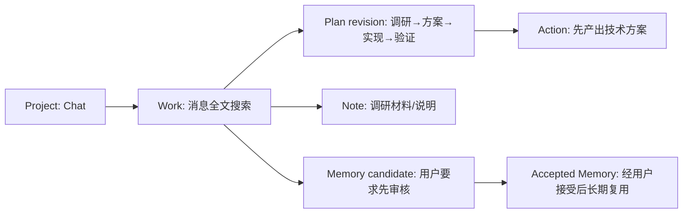

# Project、Work、Plan、Action、Note与Memory为什么分开

**归档日期**：2026-07-30  
**分类**：Product Harness与协作对象  
**关联源码**：`backend/app/harness/models.py`、`backend/app/harness/service.py`、`backend/app/harness/commands.py`、`backend/app/harness/plans.py`、`frontend/src/harness-workbench.tsx`

## 问题

一句“给Chat增加全文搜索”为什么不能只保存成一条聊天消息？为什么还要Project、Work、Plan、Action、Note和Memory
这些看起来相似的产品对象？

## 1. 一个具体场景

用户说：`给Chat增加消息全文搜索；先做技术方案，没批准不要改代码。`

正确的长期形态不是把这句话无限塞回Prompt，而是逐步形成：



## 2. 要解决的问题

如果全部只叫“消息”或“任务”，系统无法回答：目标是否长期存在、当前具体工作是什么、执行顺序是什么、哪一步
完成、哪段只是说明、哪条偏好可以跨回合复用。更危险的是模型一句“完成了”可能直接污染长期事实。

## 3. 一句人话定义

- **Product Project**：长期目标和资源范围；不是文件夹，也不是一次聊天。
- **Work Item**：Project内一个可推进、可结束的工作单元；不是MAF Workflow。
- **Task Plan revision**：完成Work的候选步骤版本；不是已经执行的事实。
- **Action Item**：可分配、可验证的具体动作；不是Tool Call。
- **Knowledge Note**：带版本的说明材料；不是模型上下文的同义词。
- **Memory Candidate / Accepted Memory**：候选长期记忆与用户接受后的记忆；模型输出不会自动成为Accepted Memory。

## 4. 一个具体对象样本

```json
{
  "project": {"id": "project-chat", "title": "Chat", "status": "active", "row_version": 7},
  "work": {"id": "work-search", "project_id": "project-chat", "status": "planned"},
  "plan_revision": {"revision": 2, "status": "candidate", "previous_revision_id": "plan-r1"},
  "action": {"id": "action-design", "status": "pending", "completion_claim_id": null},
  "memory_candidate": {"status": "candidate", "text": "先审核方案再改代码"},
  "accepted_memory": null
}
```

这组值展示的是结构样本；真实ID由Chat服务端生成。`row_version`用于并发比较交换（CAS），不是业务版本标题。

## 5. 生命周期与所有权

| 对象 | 创建者 | 权威存储 | 修改规则 | 主要消费者 |
|---|---|---|---|---|
| Project | Harness命令服务 | Product Store | 命令＋row version | Context、Home、Work |
| Work | Harness服务 | Product Store | 显式状态机 | Plan、Action、Home |
| Plan revision | Plan协调逻辑 | Product Store | 新revision，不覆盖旧版 | ExecutionDraft编译 |
| Action | Harness服务 | Product Store | 完成需Result Commit门 | 工作台、Evidence |
| Note revision | Harness服务 | Product Store | 版本化 | Context候选、用户 |
| Memory Candidate | Workflow提交候选 | Product Store | 接受/拒绝 | Memory决策 |
| Accepted Memory | 用户/策略接受后 | Product Store | 修订并留来源 | 后续Context选择 |

`HarnessWorkbench`只读写API DTO，不拥有上述事实。MAF Checkpoint可保存对象ID投影，但不是第二数据库。

## 6. 为什么这样设计

看似简单的替代方案是一个`tasks`表加一个大JSON。它起步快，但Project目标、计划版本、Action完成证据和Memory
接受状态会互相覆盖，任何字段变化都争同一事务。当前拆分按“用户意义＋状态所有权＋生命周期”进行；代价是对象
和关联表更多，但每种完成/恢复语义可以独立验证。也不能反过来Repository-per-table：一个用例的事务仍由
Harness/Application Coordinator统一拥有。

## 7. 代码链

| 顺序 | 源码入口 | 输入 | 输出/不变量 |
|---:|---|---|---|
| 1 | [`HarnessService`](../../backend/app/harness/service.py) | 已认证命令DTO | 一个用例的事务边界 |
| 2 | [`HarnessCommandRecorder`](../../backend/app/harness/commands.py) | `command_id`、payload hash | 幂等命令记录 |
| 3 | [`ProductProjectRecord`等模型](../../backend/app/harness/models.py) | 领域字段 | SQLite权威行 |
| 4 | [`require_current_plan_revision`](../../backend/app/harness/plans.py) | Plan/revision | 拒绝过期Plan |
| 5 | `HarnessCandidateCommitExecutor`（`continuous_chat.py`） | 已决定候选 | 幂等提交Work/Memory等 |
| 6 | [`HarnessWorkbench`](../../frontend/src/harness-workbench.tsx) | REST DTO | 用户可见投影 |

读`models.py`时按对象块看，不要顺着600多行从头背到底；先找上表类名，再回到Service看谁改变它。

## 8. 亲手验证

1. 创建一个Project，再创建Work；记录两个ID和各自`row_version`。
2. 给Work建立Plan revision，修改后确认旧revision仍存在。
3. 让一次普通问答产生Memory Candidate，确认它没有自动出现在`accepted_memories`。
4. 在`HarnessService`入口和事务提交前打断点，观察一次命令只提交一次。
5. 运行：

```bash
.venv/bin/python -m pytest -q backend/tests/test_product_harness.py \
  backend/tests/e2e/test_long_product_harness.py
```

只读SQL应从关系出发，不把整段私密Note打印出来：

```sql
SELECT id, title, status, row_version FROM product_projects ORDER BY created_at DESC LIMIT 5;
SELECT id, project_id, status, row_version FROM work_items ORDER BY created_at DESC LIMIT 5;
SELECT id, status, source_run_id FROM memory_candidates ORDER BY created_at DESC LIMIT 5;
```

## 9. 掌握验收

1. Project、Work、MAF Workflow为什么是3种不同对象？
2. Plan revision为何不能原地覆盖？
3. Action显示completed前为什么必须经过Evidence/Result Commit？
4. 模型提出一条偏好后，怎样才会成为Accepted Memory？
5. 增加“里程碑”对象前，你会用哪4个问题判断它是否真需要独立？

## 关键文件

| 文件 | 职责 |
|---|---|
| `backend/app/harness/models.py` | Harness领域记录与关联 |
| `backend/app/harness/service.py` | Product Harness用例和事务所有权 |
| `backend/app/harness/commands.py` | 命令幂等 |
| `backend/app/harness/plans.py` | Plan当前revision不变量 |
| `frontend/src/harness-workbench.tsx` | 产品事实的浏览器投影与操作入口 |

## 补充记录

- 2026-07-30：补齐M06从对象推导到代码、Store和验证的L1专题。

