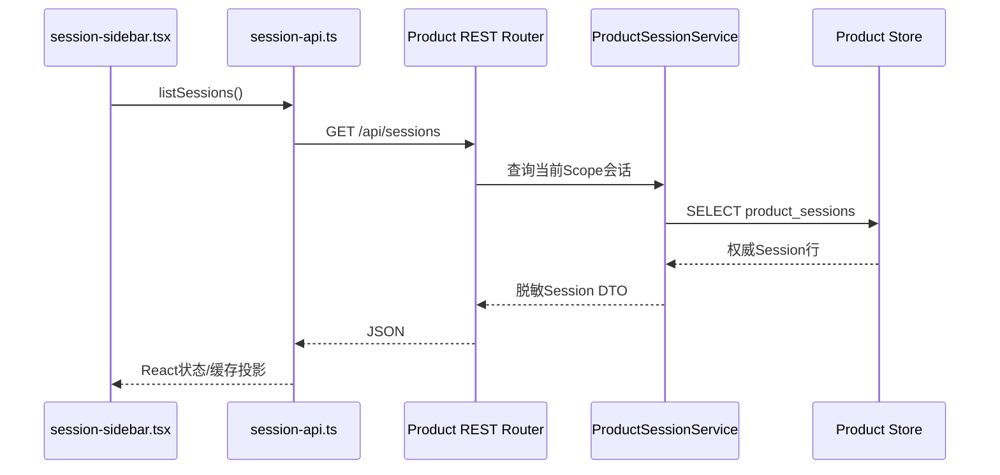
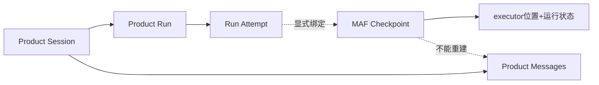
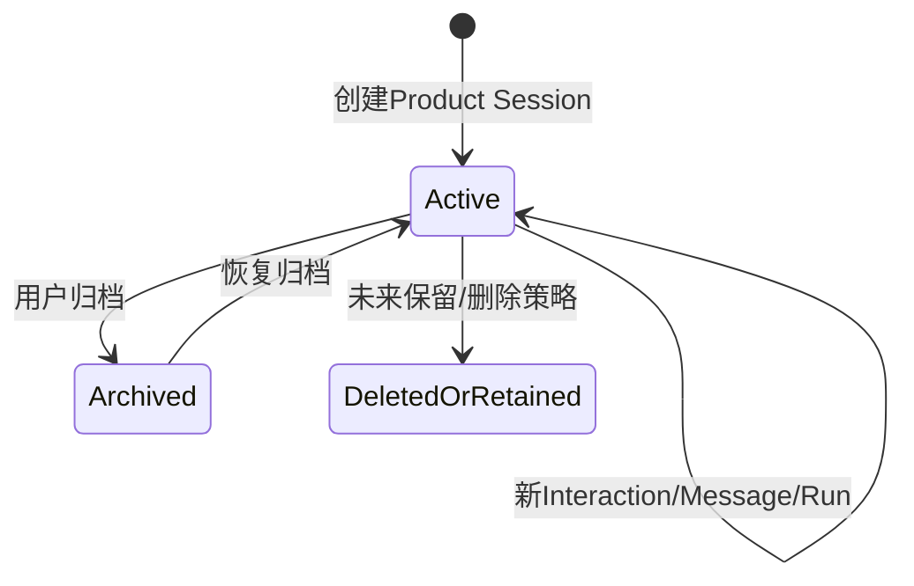

# 前端会话面板的数据来源与保存形式

**归档日期**：2026-07-29
**分类**：Session与状态持久化

## 1. 一个具体场景

你昨天在Chat里完成一轮讨论，今天刷新网页，左侧仍能看见标题，打开后能读历史消息，并知道上一轮是成功、
失败还是等待审批。这个能力不是MAF自动提供的，而是Chat自己的Product Session体系。

## 2. 直接答案

前端会话面板展示的是Chat自己保存的**Product Session和Product Message**，通过REST从Product Store读取。
MAF另外保存AgentSession/Workflow Checkpoint，只用于Agent上下文或图暂停恢复，不是会话列表和消息历史。

## 3. 四个容易混淆的对象

| 对象 | 人话定义 | 存储/所有者 | 用途 |
|---|---|---|---|
| Product Session | 用户可命名、归档、重新打开的一段产品会话 | Conversation/Product Store | 左侧列表和访问范围 |
| Product Run | 一次发送的长期业务运行 | Run管理/Product Store | 成功、失败、等待、恢复 |
| MAF AgentSession | MAF Agent连续调用的运行上下文 | MAF Session Store | Agent历史/Context Provider语义 |
| MAF Workflow Checkpoint | 39节点图暂停时的控制流快照 | Checkpoint Store | interrupt/resume |

AG-UI `threadId/runId`只是协议关联键。即使当前映射字符串相同，也不能用它们授权或代替产品对象。

## 4. 前端列表的真实读取链



浏览器里的数组只是投影。刷新后丢掉前端状态，仍可从数据库重建；前端不能自己把一个会话改成归档事实。

## 5. 一次发送会写哪些产品对象

```text
Product Session
└── Interaction（一次用户输入的接纳关系）
    ├── User Product Message
    └── Product Run
        ├── Run Attempt
        ├── Trace Events / Trace Reports
        └── Assistant Product Message（通过最终化门后）
```

简化对象样本：

```json
{
  "session": {"id": "session-1", "title": "掌握Chat架构", "revision": 4},
  "interaction": {"id": "interaction-9", "input_message_id": "msg-user-9"},
  "run": {"id": "run-9", "status": "waiting_approval"},
  "assistant_message": null
}
```

等待审批时没有最终Assistant Message是正常状态，不能用一条占位“成功”消息填空。批准并最终化后才会新增
Assistant Message并把Run改成终态。

## 6. 核心表分别保存什么

| 表 | 主要事实 |
|---|---|
| `product_sessions` | 标题及来源、状态、revision、channel/model投影、归档时间 |
| `interactions` | 一次输入的幂等接纳和关联 |
| `product_messages` | 权威User/Assistant消息 |
| `product_runs` | Run状态、请求Hash、Workflow/ExecutionDraft/RunSpec/Decision关联 |
| `run_attempts` | Worker执行尝试、所有权和终态原因 |
| `trace_events` | Product过程事件，按Run/sequence唯一 |
| `run_trace_reports` | 从事实生成的machine/human终态投影 |
| `maf_workflow_checkpoints` | 独立的MAF图快照及Product绑定 |

默认物理实现是SQLite。私有`backend/config.json`可配置实际Product Store位置，但不得把配置内容或密钥
抄入文档。

## 7. Checkpoint怎样绑定产品运行

`ProductWorkflowCheckpointStorage`实现MAF `CheckpointStorage`，在保存/读取时附加：

- Product Run ID；
- Run Attempt；
- Workflow Definition ID/version；
- 图签名Hash；
- Pending Request/中断关联。

恢复时任何关键绑定不一致都失败关闭，防止把A会话/旧图的Checkpoint拿来推进B运行。



删掉Checkpoint，会话和消息仍在，但等待中的图无法从原节点继续；只剩Checkpoint，则无法生成会话列表、
权限、标题和完整消息证据。

## 8. 为什么不用MAF Session直接当产品会话

一个对象兼任两者看起来省表，但会造成5个问题：

1. MAF升级会绑架产品消息和权限Schema。
2. 一个Product Session可能包含多个Run、Workflow甚至非Agent操作。
3. 标题、归档、分支、访问权限和Channel绑定不是MAF运行职责。
4. Checkpoint可清理/失效，但产品历史仍需保留。
5. MAF完成不等于Product Message、Evidence和Run终态已成功提交。

所以MAF负责运行语义，Chat负责产品事实，两者用ID映射协作。

## 9. 生命周期与失败恢复



需要分别理解7种“恢复”：重新打开已完成会话、失败回合再试、重连活动SSE、Worker接管、Tool副作用对账、
Workflow Checkpoint恢复、HITL恢复。保存消息只保证第一种，不自动保证后六种。

## 10. 代码链

```text
frontend/src/features/session/session-sidebar.tsx
-> frontend/src/features/session/session-api.ts
-> backend/app/api/product_router.py
-> backend/app/product_sessions/service.py::ProductSessionService
-> backend/app/product_sessions/database.py

Workflow暂停：
backend/app/workflows/runtime.py::ProductAwareWorkflow
-> backend/app/workflows/checkpoints.py::ProductWorkflowCheckpointStorage
-> maf_workflow_checkpoints
```

## 11. 亲手验证

1. 创建两个会话，刷新浏览器，确认列表由REST恢复而不是localStorage独占。
2. 在一个会话发消息，沿Session→Interaction→User Message→Run找ID关系。
3. 暂停在审批点，确认Product Run为`waiting_approval`且有Checkpoint，但还没有假Assistant成功消息。
4. 只在测试副本删除Checkpoint，确认会话/历史仍能打开；不要在真实数据上操作。
5. 恢复审批后确认使用同一Product Run和合法Attempt/Checkpoint绑定。

## 12. 掌握验收

1. 前端会话列表的权威来源是什么？
2. Product Session、Product Run、MAF AgentSession和Checkpoint各自存在多久？
3. 为什么AG-UI threadId不能当授权？
4. 只有消息历史，哪6类运行恢复仍不保证？
5. 为什么MAF `RUN_FINISHED`不能直接写Product Run成功？

## 关键文件

| 文件 | 职责 |
|---|---|
| `frontend/src/features/session/session-sidebar.tsx` | 会话列表UI |
| `frontend/src/features/session/session-api.ts` | Session REST客户端 |
| `backend/app/product_sessions/database.py` | 产品会话/消息/Run/Trace表 |
| `backend/app/product_sessions/service.py` | Product Session用例与终态事务 |
| `backend/app/workflows/checkpoints.py` | MAF Checkpoint产品绑定适配器 |
| `docs/session-capability-catalog.md` | Session完整能力全集 |
| `docs/session-delivery-roadmap.md` | Phase 0–8交付路线和恢复等级 |
