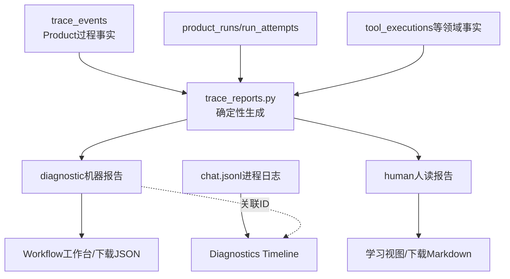

# 每轮双Trace如何保存、分析与可视化

**归档日期**：2026-07-29
**分类**：Trace与可观测性

## 1. 一个具体场景

某轮最终答错了。你想知道：系统用了哪份Context、为什么走`pi_readonly`、在哪个节点失败、用户批准了
什么、Worker是否接管过、pi调用了几个Tool。只看最终聊天文本或一份进程日志回答不了这些问题。

系统因此保留Product过程Trace，并在Run终态确定性生成2份报告：机器版`diagnostic`和人读版`human`。

## 2. 基础概念

| 概念 | 人话定义 | 不是什么 |
|---|---|---|
| Product Trace Event | 某个Run中已经持久化的公开过程事实 | 不是随手打印日志 |
| Machine Trace Report | 保留Sequence、Attempt、Tool和关联ID的机器定位投影 | 不是新事实源 |
| Human Trace Report | 按S1–S7解释实际节点路径、原因和空值的人读投影 | 不是LLM事后编故事 |
| Diagnostics Timeline | 跨Job/Worker/Checkpoint/Provider/Transport的运维时间线 | 不拥有产品终态 |
| `chat.jsonl` | 进程级结构化日志，用来补异常上下文 | 不是长期Product审计账本 |
| Hidden reasoning | 模型内部不可见推理 | 不记录、不展示 |

## 3. 一个报告样本

```json
{
  "kind": "human",
  "product_run_id": "run-42",
  "workflow": "continuous-collaboration@1.8.0",
  "actual_path": [
    {"node_id": "input_acceptance", "learning_stage": "S1"},
    {"node_id": "execution_route", "learning_stage": "S4", "selected": "pi_readonly"},
    {"node_id": "pi_readonly_dispatch", "learning_stage": "S5"},
    {"node_id": "result_finalization", "learning_stage": "S7"}
  ],
  "empty_fields": [
    {"field": "workspace_id", "code": "not_selected", "reason": "本轮选择pi_readonly"}
  ],
  "source_sequence": {"first": 1, "last": 87},
  "content_hash": "sha256:…"
}
```

Human报告用代码拥有的S1–S7标签，不再手写“阶段A/B/6阶段”。报告生成器不调用模型。

## 4. 事实、投影和日志的关系



报告是可重建投影：删掉报告后，可以从保留的结构化事实重建；反过来不能把报告当成唯一事实并删除源事件。

## 5. 保存在哪里、何时生成

| 表/位置 | 保存内容 | 权威性 |
|---|---|---|
| `trace_events` | `(run_id, sequence)`唯一的Product过程事件 | 过程事实 |
| `product_runs` / `run_attempts` | 终态、失败码、时间、Attempt关系 | 运行事实 |
| `tool_executions`及关联表 | pi/Tool结果、Hash、计数和终态 | Tool事实 |
| `run_trace_reports(kind=diagnostic)` | 机器JSON、来源Sequence范围、Hash | 可重建投影 |
| `run_trace_reports(kind=human)` | 人读JSON/Markdown、来源范围、Hash | 可重建投影 |
| `backend/.data/logs/chat.jsonl` | 进程日志，路径可配置和轮转 | 运维辅助 |

成功、失败、取消、放弃、恢复要求和结果未知等终态都会生成报告。活动Run只展示实时Trace，不提前伪造终态
报告。迁移前旧Run读取时可从已有事实补建；缺失历史字段标`historical_not_recorded`。

## 6. 双报告为什么不能只做一份

机器定位需要稳定ID、Sequence和嵌套结构；初学者需要按时间和S1–S7解释“为什么到这里”。强行用一份：

- 全是ID，用户看不懂；
- 全是自然语言，程序无法可靠关联Attempt/Tool；
- 为了可读而丢字段，会破坏诊断；
- 为了完整而展示原始Payload，会泄露隐私。

两份报告由同一事实确定性投影，既避免第二事实源，也允许不同读者得到合适视图。

## 7. “为什么”只能记录可观察原因

路由时保存：`selected_branch`、`selected_target`、公开条件实际值、`selection_reason`和未选项原因。
审批时保存Subject、Policy结果、用户动作、Hash和Grant。报告只能重排这些记录，不能写“模型认为……所以……”
来冒充隐藏推理。

空值使用稳定代码：

| 代码 | 含义 |
|---|---|
| `not_applicable` | 本轮该字段/节点不适用 |
| `not_selected` | 所在分支未选中 |
| `not_produced` | 节点执行但按明确原因未产生 |
| `redacted` | 安全/隐私脱敏 |
| `failed_before_production` | 产出前Run已失败/中止 |
| `historical_not_recorded` | 旧Run当时没有该结构化事实，禁止用当前代码倒推 |

## 8. 一次排错的推荐顺序

```text
1. human报告：实际走了什么、在哪个学习阶段偏离
2. diagnostic报告：trace sequence / attempt / tool /关联ID
3. Diagnostics Timeline：Job、Lease、Checkpoint、Provider、Transport
4. 领域对象：Context/Decision/RunSpec/Tool/Evidence的真实行
5. chat.jsonl：只补进程异常，不覆盖Product终态
```

REST入口：

```text
GET /api/sessions/{session_id}/runs/{run_id}/trace
GET /api/sessions/{session_id}/runs/{run_id}/trace-reports
GET /api/diagnostics/runs/{run_id}/timeline
```

## 9. 前端怎样可视化

Workflow工作台把静态Definition与本轮Trace叠加：

- 39个节点/43条边来自v1.8.0 Definition。
- 已经过、当前等待、失败和未选择状态来自本轮Trace。
- 两个Switch展示条件、声明顺序、实际值、选中目标和未走原因。
- 节点详情区分公开输入、公开输出、运行事实和治理事实。
- 终态卡下载human Markdown和diagnostic JSON，并显示来源Sequence与Hash。

前端不使用当前代码猜旧Run路径；刷新后仍从REST读取相同报告。

## 10. 双Trace与Checkpoint/pi Session的区别

| 对象 | 回答什么 | 能否恢复运行 |
|---|---|---|
| Product Trace/双报告 | 本轮公开发生了什么、为什么 | 否；是证据/投影 |
| MAF Checkpoint | Workflow暂停在哪、怎样继续 | 可恢复已支持安全点 |
| Runtime Journal | 前端错过哪些公开事件、Worker发生什么 | 支持重连/诊断，不等于图恢复 |
| pi Session JSONL | pi本次内部消息/Tool转录 | 当前只读复核，不自动续跑 |

## 11. 失败与边界

1. 进程在Trace持久化前崩溃的瞬时局部变量无法凭空恢复。
2. `redacted`字段不能通过下载机器报告绕过脱敏。
3. 主Workflow根模型调用与pi内部模型调用分别计数，不能相加后说“Workflow只有N次”。
4. 报告生成失败不能阻止保留源Trace；终态协调要记录明确失败并支持补建。
5. `chat.jsonl`轮转或缺失不能改变数据库里的Product Run终态。

## 12. 代码链

```text
各Executor::TraceMixin记录workflow.node.*
-> product_sessions/service.py::record_trace
-> trace_events(run_id, sequence)
-> Product Finalization事务
-> product_sessions/trace_reports.py确定性生成diagnostic/human
-> run_trace_reports
-> api/product_router.py
-> workflow-trace-reports.tsx
```

Human报告节点阶段标签直接读取`continuous_workflow_learning.py`，由测试/检查器与39节点Definition核对。

## 13. 亲手验证

1. 选择一个完成Run，比较human实际路径和UI高亮节点。
2. 用`execution_route`的Sequence在diagnostic报告中找`selected_target`和未选原因。
3. 从`tool_execution_id`跳到Diagnostics Timeline，再反查Product Run。
4. 找一个澄清路径，确认Workspace字段是`not_selected`而不是空字符串。
5. 找旧Run缺字段，确认显示`historical_not_recorded`，没有用当前v1.8代码倒推旧事实。

## 14. 掌握验收

1. 为什么双报告不是第二事实源？
2. Human报告中的“为什么”允许使用哪些证据？
3. Trace、Checkpoint、Journal和pi Session分别回答什么？
4. 排错为什么先human后machine，最后才看`chat.jsonl`？
5. 静态39节点图和某轮实际路径怎样组合而不互相冒充？

## 关键文件

| 文件 | 职责 |
|---|---|
| `backend/app/product_sessions/trace_reports.py` | 双报告确定性生成和S1–S7标签 |
| `backend/app/product_sessions/service.py` | Trace写入、终态事务和报告读取 |
| `backend/app/product_sessions/database.py` | Trace/Report表模型 |
| `backend/app/api/product_router.py` | REST投影 |
| `frontend/src/features/workflow/workflow-trace-reports.tsx` | 报告可视化与下载 |
| `backend/app/observability/diagnostics.py` | 运维时间线 |
| `backend/app/continuous_workflow_learning.py` | Human Trace学习阶段唯一来源 |
