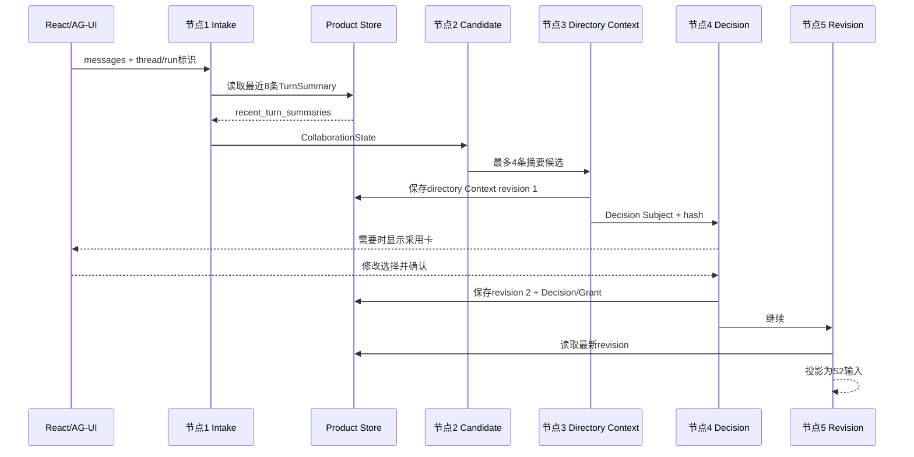

# 学习阶段S1：输入接纳与目录级上下文

<!-- workflow-learning-stage: S1; nodes: input_acceptance,context_candidates,harness_directory_context,context_adoption,directory_context_revision -->

**归档日期**：2026-07-29
**节点范围**：1–5
**前一阶段**：无；这是主Workflow入口
**后一阶段**：S2意图、Project绑定与详情上下文

## 1. 一个具体场景

你输入：

> 继续Chat项目，把文档里旧的Workflow节点数改成39。修改前先让我确认，完成后跑文档检查。

“继续”意味着本轮需要旧信息，但不能把几百条历史消息全部塞给模型。S1的任务就是：保存你这次说了什么，
召回少量可能相关的旧回合摘要，再从正式Project目录补充轻量事实，并让你决定采用哪些内容。

## 2. 要解决的问题

如果直接使用完整历史，会出现4个问题：

1. 旧消息越来越多，Token和延迟无界增长。
2. 过去的误解也会被反复带回。
3. 对话里提过的“项目”可能只是候选，不能冒充正式Project。
4. 断线重跑时，无法证明当时到底给模型看了哪一版上下文。

## 3. 基础概念

| 概念 | 人话解释 |
|---|---|
| AG-UI Message | 浏览器按AG-UI协议发来的消息投影；入口会过滤审批协议消息，只取真正用户输入 |
| TurnSummary | 某个已完成回合的短摘要，是从完整Message派生的索引，不是历史原文 |
| `recent_turn_summaries` | 节点1从Product Store读到的最近摘要列表；`recent`是有界窗口，不是“全部” |
| Context candidate | 检索后“建议本轮采用”的条目；仍只是候选 |
| ContextPackage | 一组带来源、采用原因、预算、revision和Hash的本轮上下文包 |
| directory Context | 只含Project轻目录和候选摘要的轻量包；不展开Work、Plan、仓库文件 |

## 4. 一个对象怎样变化

节点1刚接纳时，运行内存中的状态可以抽象成：

```json
{
  "prompt": "继续Chat项目，把旧节点数改成39……",
  "recent_turn_summaries": [
    {"id": "ts-17", "topic": "Workflow文档仍写28节点"},
    {"id": "ts-18", "topic": "手机Relay排障"}
  ],
  "open_clarification": null
}
```

节点2检索后，不修改摘要原件，只记录候选：

```json
{
  "selected_summary_ids": ["ts-17"],
  "excluded": [{"id": "ts-18", "reason": "与本轮主题无关"}]
}
```

节点3形成可版本化的directory ContextPackage：

```json
{
  "context_package_id": "ctx-run-42-directory",
  "revision": 1,
  "stage": "directory",
  "items": [
    {"source_kind": "turn_summary", "source_id": "ts-17", "adopted": true},
    {"source_kind": "project_directory", "source_id": "project-chat", "adopted": true}
  ],
  "token_budget": 1800,
  "content_hash": "sha256:…"
}
```

节点4如果你取消选择`ts-17`，会生成新revision；节点5读取最新revision投影回本轮状态。旧revision不被覆盖，
因此Trace可以解释“原本建议了什么、用户删掉了什么、后续模型实际用了什么”。

## 5. 五个节点逐一讲透

| # | 节点与Executor | 输入 | 处理 | 输出/持久化 |
|---:|---|---|---|---|
| 1 | `input_acceptance` / `IntakeExecutor` | AG-UI消息、Product Session/Run | 规范化消息，取最后用户输入；读最近8条摘要和未回答澄清 | 初始`CollaborationState`；输入过程Trace |
| 2 | `context_candidates` / `CandidateContextExecutor` | prompt、摘要、开放澄清 | 确定性关键词计分；开放澄清优先；最多选4条 | 内存候选和采用理由；节点Trace |
| 3 | `harness_directory_context` / `HarnessDirectoryContextExecutor` | 候选摘要、正式Project轻目录 | 按1800 Token预算装配Context Items；不从聊天猜正式项目 | directory ContextPackage revision写入Product Store |
| 4 | `context_adoption` / `ProductDecisionExecutor` | Context subject及Hash | 策略决定自动推进或等待；人可选择摘要、跳过或取消 | Decision/Grant；修改时写新Context revision |
| 5 | `directory_context_revision` / `HarnessContextRevisionExecutor` | 当前Run最新directory revision | 重新读取并投影，防止旧候选被后续代码装回 | S2实际消费的已审核Context |

## 6. 时间顺序图



## 7. 为什么节点3要持久化ContextPackage

看似简单的替代方案是：临时拼一段Prompt，用完就丢。它无法回答4个审计问题：

1. 本轮采用的是哪条摘要、哪个Project目录revision？
2. 用户在节点4修改前后分别是什么内容？
3. 暂停后换Worker恢复，怎样得到同一份上下文？
4. 结果出错时，怎样区分“模型错了”和“输入Context已经错了”？

持久化的不是“为了永久保存更多文本”，而是保存一个**有边界、可版本化、可复算Hash、可恢复的输入合同**。
完整Message仍由Conversation拥有，ContextPackage只保存本轮采用投影和来源引用。

## 8. 失败与恢复

- Product Store读取失败：节点失败关闭，不能假装“没有历史”。
- 没有匹配摘要：合法，ContextPackage仍可只有正式目录项。
- 人工审批等待：Product Run进入`waiting_approval`，MAF Checkpoint保存节点位置。
- 修改后进程退出：恢复时节点5读取最新持久revision，不依赖旧进程内存。
- Context来源过期：后续Provider发送前的新鲜度门会失败关闭，不能悄悄发送旧仓库内容。

## 9. 代码链

```text
continuous_chat.py::IntakeExecutor.handler
-> product_sessions服务读取TurnSummary
-> continuous_chat.py::CandidateContextExecutor.handler
-> continuous_chat.py::HarnessDirectoryContextExecutor.handler
-> collaboration_contexts保存ContextPackage revision
-> continuous_chat.py::ProductDecisionExecutor.handler/resolve
-> continuous_chat.py::HarnessContextRevisionExecutor.handler(stage="directory")
```

重点断点变量：`prompt`、`recent_turn_summaries`、`selected_summary_ids`、`context_package`、
`subject_hash`、`decision.action`。不要把完整私密正文复制到日志。

## 10. 亲手验证

1. 在节点1发一条含“继续Chat项目”的消息，观察只读到最近8条摘要，而非完整历史。
2. 在节点2观察一个相关摘要被选中、一个无关摘要被排除，并核对reason。
3. 在节点3记录`context_package_id/revision/hash`，不要记录完整正文。
4. 在节点4取消一个摘要，确认产生新revision而不是覆盖旧行。
5. 在节点5确认投影的是新revision，再在节点6检查模型任务只含获准条目。

## 11. 掌握验收

1. `recent_turn_summaries`为什么不是聊天历史？
2. 候选摘要为什么不能直接进入模型？
3. directory Context为什么不装入全部Work和仓库文件？
4. 为什么节点4之后还需要节点5？
5. 持久化ContextPackage解决了哪些恢复和审计问题？

## 关键文件

| 文件 | 职责 |
|---|---|
| `backend/app/workflows/continuous_chat.py` | S1五个Executor及采用决策 |
| `backend/app/workflows/continuous_chat_contracts.py` | `CollaborationState`和Context相关纯合同 |
| `backend/app/collaboration_contexts/` | ContextPackage revision的产品持久化与查询 |
| `backend/app/product_sessions/` | Session、TurnSummary与当前Run事实 |
| `backend/tests/test_continuous_workflow_learning_comments.py` | 节点与学习阶段映射检查 |
