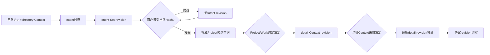

# 学习阶段S2：意图、Project绑定与详情上下文

<!-- workflow-learning-stage: S2; nodes: intent_agent,intent_set_projection,intent_binding,intent_set_acceptance,harness_project_resolver,project_work_binding,harness_detail_context,detail_context_adoption,detail_context_revision,collaboration_protocol_resolver -->

**归档日期**：2026-07-29
**节点范围**：6–15
**输入**：S1已审核directory Context
**输出**：Intent Set、Project/Work绑定、detail Context和协议revision

## 1. 一个具体场景

仍然使用这句话：

> 继续Chat项目，把文档里旧的Workflow节点数改成39。修改前先让我确认，完成后跑文档检查。

S1只证明“哪些旧信息可以进入本轮”。S2还要把自然语言拆成明确目标，确认“Chat项目”指向哪个正式
Project/Work，再装入完成任务所需的计划、仓库快照和规则。

## 2. 要解决的问题

自然语言同时混有目标、对象和约束：

- 目标：改正Workflow节点数。
- 对象：Chat项目中的相关文档。
- 顺序约束：先确认再修改。
- 验收：运行文档检查。

如果让每个下游节点各自重猜一次，就可能出现“规划认为是39节点，执行仍按28节点”“用户说先确认，
Tool却先改文件”等分裂。S2把理解结果变成可版本化、可审核的产品对象。

## 3. 基础概念

| 概念 | 人话解释 |
|---|---|
| Intent | 一项目标及约束的结构化候选 |
| Intent Set | 本轮1–4个Intent及顺序依赖的一个版本化集合 |
| Project Hint | 从用户原话/摘要提取的名称提示，不是正式Project ID |
| Project/Work Binding | 把Intent绑定到Harness中的权威Project/Work引用 |
| detail Context | 绑定后才装配的开放Work、Plan、Action、Note、Memory、Repository Snapshot和治理规则 |
| Collaboration Protocol | 本轮采用的协作方式revision，例如是否必须计划、审批和验证 |

## 4. 一个对象样本

节点6的模型只能先给候选：

```json
{
  "intents": [
    {
      "goal": "把当前文档中的旧Workflow节点数统一为39",
      "project_hint": "Chat",
      "constraints": ["修改前确认", "完成后运行文档检查"]
    }
  ],
  "scenario": "continue_project",
  "needs_clarification": false
}
```

节点7把它保存为Intent Set revision；节点8允许你修正；节点9只接受当前Hash对应的完整revision。随后节点10
可能得到：

```json
{
  "project_matches": [
    {"project_id": "project-chat", "name": "Chat", "match_reason": "唯一名称匹配"}
  ]
}
```

直到节点11确认后，`project-chat`才成为本轮绑定。节点12据此装配detail Context，而不是先把所有Project
资料读进来再筛。

## 5. 十个节点逐一讲透

| # | 节点 | 主要责任 | 为什么单独存在 |
|---:|---|---|---|
| 6 | `intent_agent` | 受治理模型调用，提出1–4个Intent、场景和澄清需要 | 模型只产候选；目录查询护栏可0次模型调用 |
| 7 | `intent_set_projection` | 把候选保存为Intent revision，处理跨Run澄清回答 | 运行文本必须先变成可追踪产品对象 |
| 8 | `intent_binding` | 审核Intent；可整体修改、确认、取消 | 用户必须看见系统怎样理解自己 |
| 9 | `intent_set_acceptance` | 接受当前Hash对应revision | 防止审批旧版本、执行新版本 |
| 10 | `harness_project_resolver` | 用Project Hint查询权威目录；仅唯一匹配时预绑定 | 对话名称不是权威ID，多匹配不能猜 |
| 11 | `project_work_binding` | 审核Project/Work关联；可选择不关联 | 决策选项只能来自权威候选 |
| 12 | `harness_detail_context` | 按绑定装配6000 Token预算的工作集 | 详情比目录贵，确认范围后再读取 |
| 13 | `detail_context_adoption` | 审核每个详情来源、revision、采用原因 | 不允许用模糊“已读取项目”掩盖具体来源 |
| 14 | `detail_context_revision` | 重新读取最新detail revision并投影 | 用户在Context面板改动后避免旧值回流 |
| 15 | `collaboration_protocol_resolver` | 按Work→Project→用户→系统优先级绑定协议 | 下游Plan/审批策略不再临时猜 |

## 6. 生命周期图



## 7. 为什么要“目录Context”和“详情Context”两步

看似简单的做法是先读取所有Project、Work和仓库内容，再让模型判断相关性。问题是：

1. 未绑定Project前读取详情会越权或误读。
2. 所有项目内容会突破Token预算。
3. 模型可能把同名候选当成正式对象。
4. 用户无法在模型调用前看清实际采用范围。

所以S1的directory步骤只帮助识别范围，S2绑定权威对象后才执行detail步骤。历史“阶段A/B”说的只是这
两个Context装配步骤，不是整个Workflow只有A/B两阶段。

## 8. 模型、产品事实与决定的边界

```text
模型输出Intent候选
!= 已接受Intent Set
!= 已绑定Project/Work
!= 已授权执行
```

每个“!=”都是一条重要安全边界。节点6可以错；节点8允许修正。节点10只能查询；节点11才决定绑定。
即使S2全完成，也只是理解和Context已确认，真正执行授权要等S4。

## 9. 失败与恢复

- Intent JSON无效：记录模型输出处置为无效，Run失败关闭或进入明确恢复路径，不能静默猜字段。
- Project零匹配：允许“不关联”或要求澄清，不能制造ID。
- Project多匹配：必须由用户选择。
- detail来源revision变化：Provider发送前新鲜度检查可阻止使用旧仓库事实。
- 人工决定时崩溃：Decision Subject、revision和Checkpoint都已持久化，可按同一Hash恢复。

## 10. 代码链

```text
continuous_chat.py::GovernedSemanticAgentExecutor(result_kind="intent")
-> continuous_chat_prompts.py::intent_task
-> IntentSetProjectionExecutor
-> ProductDecisionExecutor(intent_binding)
-> IntentSetAcceptanceExecutor
-> HarnessProjectResolverExecutor
-> ProductDecisionExecutor(project_work_binding)
-> HarnessDetailContextExecutor
-> ProductDecisionExecutor(detail_context_adoption)
-> HarnessContextRevisionExecutor(stage="detail")
-> CollaborationProtocolResolverExecutor
```

同时查看`collaboration_intents/`、`collaboration_contexts/`、`collaboration_protocols/`中的应用服务和
Product Store写入，不要只盯着一个Executor。

## 11. 亲手验证

1. 在节点6观察`project_hint`只是字符串提示，没有权威ID。
2. 在节点7记录Intent revision/hash；在节点8改一项约束，确认产生新hash。
3. 构造两个同名Project，观察节点10不自动猜，节点11显示权威候选。
4. 在节点12比较directory与detail Context items，确认后者才包含Work/Plan/Repository Snapshot。
5. 在节点15观察协议优先级和最终revision，解释为什么某项审批策略生效。

## 12. 掌握验收

1. 为什么Intent模型输出不能直接成为已接受目标？
2. Project Hint和Project Binding有什么本质区别？
3. 为什么详情Context必须晚于Project绑定？
4. 节点13和14分别解决什么问题？
5. S2完成后，为什么仍不能执行Tool？

## 关键文件

| 文件 | 职责 |
|---|---|
| `backend/app/workflows/continuous_chat.py` | S2十个Executor与决策规格 |
| `backend/app/workflows/continuous_chat_prompts.py` | Intent任务构造 |
| `backend/app/collaboration_intents/` | Intent Set revision与接受状态 |
| `backend/app/collaboration_contexts/` | detail ContextPackage revision |
| `backend/app/collaboration_protocols/` | 协作协议解析与绑定 |
