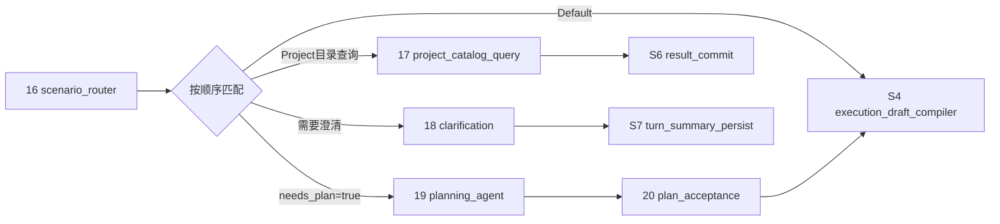

# 学习阶段S3：场景路由与可选规划

<!-- workflow-learning-stage: S3; nodes: scenario_router,project_catalog_query,clarification,planning_agent,plan_acceptance -->

**归档日期**：2026-07-29
**节点范围**：16–20
**输入**：已接受Intent Set、Project/Work绑定、detail Context和协作协议
**输出**：短路答复、澄清问题，或经过审核的Plan

## 1. 一个具体场景

同一句“把旧节点数改成39，先确认，完成后检查”，可能处于3种状态：

1. 信息足够且协议要求先规划：进入节点19–20。
2. 用户只问“我有哪些Project”：节点17确定性回答，不需要规划。
3. 用户说“把那个文档改了”但无法知道“那个”是谁：节点18先澄清，本轮不执行。

S3不做实际修改，它只决定本轮接下来走哪条合法路径。

## 2. 基础概念

| 概念 | 人话定义 |
|---|---|
| Scenario | 已接受意图对应的业务场景，例如目录查询、澄清、继续项目、直接回答 |
| Router | 根据结构化状态选择分支的确定性节点，不重新询问模型 |
| SwitchCase Edge | MAF声明式条件边；按顺序匹配一条目标边 |
| Plan | 达成目标的候选步骤和验证门，不是已经授权执行的命令 |
| Clarification | 信息不足时保存并向用户提出的开放问题，可跨Product Run继续 |

## 3. 五个节点

| # | 节点 | 输入→输出 | 设计原因 |
|---:|---|---|---|
| 16 | `scenario_router` | Intent/协议→带路由判定的原状态 | 判定与执行分支分开，Trace能解释为什么选边 |
| 17 | `project_catalog_query` | 权威Harness目录→确定性答复 | 正式Project不能让模型编造 |
| 18 | `clarification` | 缺失信息→开放问题+`awaiting_user_answer` | 信息不足时停止，而不是猜着执行 |
| 19 | `planning_agent` | 目标/Context/协议→Plan候选 | 复杂任务把步骤和完成门显式化 |
| 20 | `plan_acceptance` | Plan候选→接受/修改/跳过后的Plan | 模型计划只是候选，用户拥有控制权 |

## 4. Switch不是五个节点依次执行



节点17、18、19不是一条流水线上的连续三步，而是互斥分支目标。静态目录列出所有可能节点，某次Run的
Trace只显示实际走过的节点。

## 5. Plan对象样本

```json
{
  "steps": [
    "从代码目录读取当前Workflow版本、节点和边",
    "查找项目掌握文档中的旧口径",
    "修改文档与一致性检查器",
    "运行项目掌握和文档质量门"
  ],
  "completion_gates": [
    "39个节点全部且只属于一个学习阶段",
    "不存在把当前Workflow写成28节点的正文"
  ]
}
```

节点20允许修改或跳过Plan。跳过不等于跳过S4授权；系统仍必须先编译ExecutionDraft并确认执行合同。

## 6. 为什么路由用结构化状态而不是再问模型

看似灵活的替代方案是把“下一步做什么”也交给模型。它会产生3个问题：

1. 同一个已接受Intent可能在每次重试时走不同分支。
2. 模型可能绕过澄清或计划审批直接执行。
3. Trace无法用稳定条件解释选边原因。

当前方案让模型在S2提出语义候选，用户确认后，S3只用纯函数和声明式边选择路径。灵活性放在候选生成，
安全性放在确定性状态机。

## 7. 澄清为什么是“本轮结束、下轮继续”

节点18把问题作为本轮可见response，保存开放澄清，并直接走节点38–39。用户下一条消息会开启新的
Product Run；S1节点1把开放问题带回，S2节点7把回答关联到原Intent。这样每个Run都有清楚终态，
而不是让一个HTTP请求无限等待用户几小时。

## 8. 失败与恢复

- 多个条件同时为真：Switch按声明顺序，目录查询先于澄清，澄清先于规划；顺序是合同的一部分。
- Plan模型输出无效：记录处置并失败关闭，不能拿空Plan冒充成功。
- 等待Plan审批时崩溃：Decision Subject和Checkpoint支持恢复。
- 用户取消：Run以取消终态收敛，不进入S4。
- 澄清后关闭浏览器：开放问题存在Product Store，下次发送仍可关联。

## 9. 代码链

```text
continuous_chat.py::ScenarioRouterExecutor
-> continuous_chat_contracts.py::_evaluate_scenario_route / needs_plan
-> continuous_chat_factory.py::add_switch_case_edge_group
-> ProjectCatalogExecutor | ClarificationExecutor |
   GovernedSemanticAgentExecutor(result_kind="plan")
-> ProductDecisionExecutor(plan_acceptance)
```

## 10. 亲手验证

1. 依次发送目录查询、含糊请求、明确复杂任务，观察节点16选择3条不同边。
2. 在`continuous_chat_factory.py`的Switch处记录命中条件，不要只看最终文本猜路径。
3. 目录查询时确认Harness目录为空会明确回答为空，而不是生成虚构项目。
4. 澄清路径确认跳过S4–S6，只保存开放问题和摘要。
5. 修改Plan后确认新Hash进入后续ExecutionDraft。

## 11. 掌握验收

1. 为什么节点17–19不会在同一轮依次执行？
2. Switch条件顺序为何属于行为合同？
3. Plan接受是否等于执行授权？
4. 澄清为什么跨两个Product Run？
5. 为什么目录查询有确定性护栏？

## 关键文件

| 文件 | 职责 |
|---|---|
| `backend/app/workflows/continuous_chat.py` | 路由、目录、澄清、计划Executor |
| `backend/app/workflows/continuous_chat_contracts.py` | 场景与needs-plan纯函数 |
| `backend/app/workflows/continuous_chat_factory.py` | SwitchCase边顺序 |
| `backend/app/workflows/continuous_chat_prompts.py` | Plan任务构造 |
