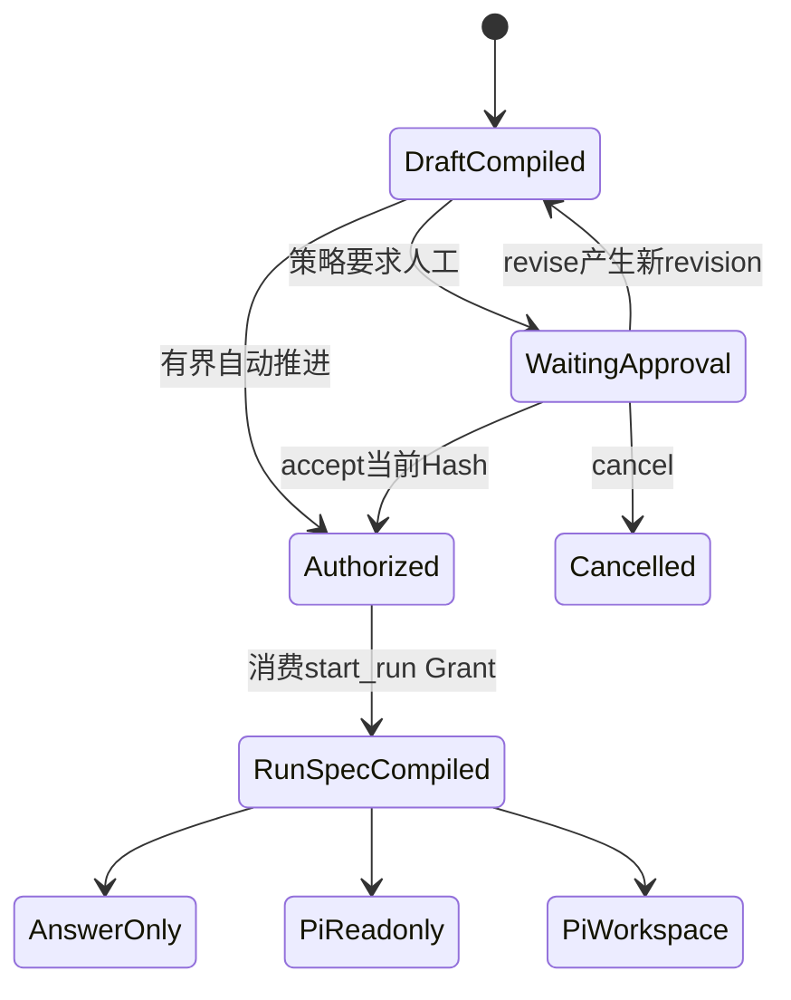

# 学习阶段S4：执行草稿、授权与运行路由

<!-- workflow-learning-stage: S4; nodes: execution_draft_compiler,execution_authorization,run_spec_compiler,execution_route -->

**归档日期**：2026-07-29
**节点范围**：21–24
**输入**：已接受目标、Context、可选Plan、能力和策略
**输出**：不可变RunSpec及唯一执行路由

## 1. 一个具体场景

S3已经得到计划：“找出旧口径→改文档→跑检查”。但这还不能直接让pi改文件，因为计划没有明确：

- 允许修改哪些仓库和路径？
- 是只读分析还是可写执行？
- 哪些验证是完成条件？
- 用户批准的是哪个版本？

S4把“想怎么做”编译成“本轮获准怎么做”的合同。

## 2. 基础概念

| 概念 | 人话定义 |
|---|---|
| ExecutionDraft | 可查看、可编辑的执行合同草稿，有revision和Hash |
| Validation Contract | 执行后必须怎样验证的冻结规则 |
| Decision Subject | 本次审批所绑定的不可变主体引用和Hash |
| Grant | 审批成功后产生的一次性权限凭证 |
| RunSpec | 只能从已授权Draft编译出的不可变执行规格 |
| Execution Route | `answer_only`、`pi_readonly`、`pi_workspace`三选一 |

## 3. 对象从草稿到执行规格

```json
{
  "execution_draft": {
    "revision": 3,
    "goal": "统一Workflow当前口径",
    "capabilities": ["repository_read", "repository_edit"],
    "repository_fence": ["/Users/xulater/Code/Chat"],
    "validation_contract": ["check-project-mastery", "check-project-docs"],
    "content_hash": "sha256:draft-v3"
  }
}
```

节点22批准的是`sha256:draft-v3`。批准后若把路径改成另一个仓库，会产生revision 4和新Hash，旧Grant不能
使用。节点23只接受已授权revision并生成RunSpec：

```json
{
  "run_spec_id": "rs-42",
  "source_draft_revision": 3,
  "authorized_hash": "sha256:draft-v3",
  "execution_kind": "pi_workspace",
  "immutable": true
}
```

## 4. 四个节点

| # | 节点 | 处理 | 关键不变量 |
|---:|---|---|---|
| 21 | `execution_draft_compiler` | 把目标、Context、Plan、能力、停止条件和验证编译成Draft v2 | Repository Fence和Validation Contract在授权前可见 |
| 22 | `execution_authorization` | 审核当前Draft；接受产生`start_run` Grant | Grant绑定revision Hash且一次性消费 |
| 23 | `run_spec_compiler` | 从已授权Draft生成RunSpec并绑定Product Run | 不重新读取或解释用户原话 |
| 24 | `execution_route` | 只按RunSpec选择三种执行方式 | 路由不能绕开授权或临时升级能力 |

## 5. 状态机



## 6. 为什么Plan、ExecutionDraft和RunSpec要分成3个对象

| 对象 | 主要读者 | 是否可编辑 | 解决的问题 |
|---|---|---|---|
| Plan | 用户和协作层 | 审批前可编辑/可跳过 | 用什么步骤达成目标 |
| ExecutionDraft | 用户、治理层、执行层 | 授权前以新revision编辑 | 允许做什么、边界和验收是什么 |
| RunSpec | Runtime/Worker | 不可变 | Worker到底执行哪一份已授权合同 |

把3个对象合成一段文本，编辑计划就可能偷偷改变权限，Worker重试也可能重新解释文本得到不同动作。分开后，
计划可以灵活，授权边界可以审计，运行输入可以确定。

## 7. 为什么路由只能读RunSpec

如果节点24再次分析用户原话，“帮我看看并顺便修好”可能在授权时是只读，路由时却变成可写。当前实现
把`execution_kind`固化在RunSpec；路由只投影，不升级能力。这是“批准什么就执行什么”的最后一道门。

## 8. 失败与恢复

- Draft编译校验失败：返回稳定错误码，敏感路径/配置不进入用户错误正文。
- 审批时Draft Hash变化：拒绝旧决定，要求针对新revision再审批。
- Grant已消费后重放：不能第二次启动副作用。
- RunSpec与Draft授权不一致：失败关闭。
- 等待审批时Worker退出：Product Decision与MAF Checkpoint共同恢复等待位置。

## 9. 代码链

```text
continuous_chat.py::ExecutionDraftCompilerExecutor
-> execution_governance::compile_execution_draft_v2
-> ProductDecisionExecutor(execution_authorization)
-> execution_governance Decision/Grant Store
-> continuous_chat.py::RunSpecCompilerExecutor
-> execution_governance::compile_run_spec_v2
-> execution_dispatch/workflow.py::ExecutionRouteExecutor
-> continuous_chat_factory.py第二个SwitchCase
```

## 10. 亲手验证

1. 在节点21比较目标、Plan与Draft，找出新增的能力、Fence、Validation字段。
2. 在节点22记录subject/hash，修改Draft后确认旧批准失效。
3. 在节点23确认RunSpec引用获准revision，而不是重新拼Prompt。
4. 分别构造只回答、只读、可写任务，观察节点24的3种路由。
5. 重放同一Grant，确认无法重复领取。

## 11. 掌握验收

1. Plan接受为什么不等于执行授权？
2. Draft可编辑而RunSpec不可变，分别为了谁？
3. Validation Contract为什么要在授权前冻结？
4. Grant为什么必须绑定Hash且一次性？
5. 节点24为何禁止重读用户文本决定权限？

## 关键文件

| 文件 | 职责 |
|---|---|
| `backend/app/workflows/continuous_chat.py` | Draft编译、授权和RunSpec编译节点 |
| `backend/app/execution_governance/` | Draft、RunSpec、Decision、Grant合同与持久化 |
| `backend/app/execution_dispatch/workflow.py` | Execution Route与后续执行分支 |
| `backend/app/workflows/continuous_chat_factory.py` | 三路Switch接线 |
