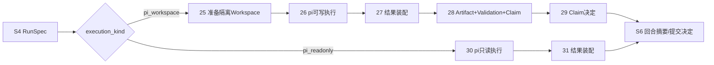
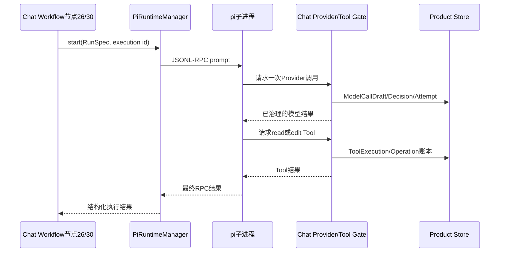

# 学习阶段S5：pi执行、Workspace与Evidence

<!-- workflow-learning-stage: S5; nodes: execution_workspace_prepare,pi_workspace_dispatch,pi_workspace_result_assembly,result_claim_prepare,result_claim_decision,pi_readonly_dispatch,pi_readonly_result_assembly -->

**归档日期**：2026-07-29
**节点范围**：25–31
**输入**：不可变RunSpec、Repository Snapshot、Tool授权和运行配置
**输出**：只读结果，或Workspace结果及Artifact/Claim/Validation证据

## 1. 一个具体场景

S4已经授权：只允许在Chat仓库修改相关Markdown/Python检查器，并执行指定文档检查。S5才真正把任务交给
pi。可写路径必须在隔离Git worktree里发生；只读路径则只能使用Chat提供的`read/grep/find/ls`。

## 2. 先区分3个经常混用的对象

| 对象 | 人话定义 | 谁拥有 |
|---|---|---|
| pi Runtime | 被Chat按需启动的编码Agent子进程，以JSONL-RPC通信 | pi执行循环；Chat控制边界 |
| Execution Workspace | 从已批准Repository Snapshot创建的隔离Git worktree | Chat Tool执行层 |
| Evidence | 能支持结果主张的Artifact、Validation结果和Provenance | Chat Evidence模块 |

pi说“改好了”只是输出候选，不等于代码真的变了，更不等于验证通过。

## 3. 两条互斥执行支路



`answer_only`不会进入S5，直接从S4走S6节点32。

## 4. 七个节点

| # | 节点 | 处理 | 不能做什么 |
|---:|---|---|---|
| 25 | `execution_workspace_prepare` | 校验base revision，从Snapshot建受管detached worktree | 不向前端暴露绝对路径，不在用户工作树直接改 |
| 26 | `pi_workspace_dispatch` | 启动pi；逐次治理Provider和Tool；只允许绑定Hash的精确edit | pi内置Tool、自动重试和任意路径写入被禁用 |
| 27 | `pi_workspace_result_assembly` | 校验ToolExecution/Result Hash，列出变化文件并保留Workspace | 不提交、不推送、不声明Work完成 |
| 28 | `result_claim_prepare` | 生成diff Artifact、执行Validation Contract、形成Completion Claim | 不用模型自述代替真实diff和验证 |
| 29 | `result_claim_decision` | 对Claim执行accept/waive/reject | 不自动把Claim变成完成事实 |
| 30 | `pi_readonly_dispatch` | 用受控read/grep/find/ls完成检查 | 不允许edit、shell副作用或越过Snapshot |
| 31 | `pi_readonly_result_assembly` | 校验并装配只读结果 | 不伪造可写Artifact或完成Claim |

## 5. 可写执行的对象样本

```json
{
  "workspace": {
    "workspace_id": "ws-run-42",
    "snapshot_id": "snap-chat-abc",
    "mode": "detached_worktree"
  },
  "tool_execution": {
    "id": "tool-77",
    "operation": "edit",
    "target": "项目掌握/…/持续协作主Workflow的39节点设计.md",
    "authorized_hash": "sha256:runspec"
  },
  "completion_claim": {
    "claim": "当前Workflow口径统一为v1.8.0/39节点",
    "artifact_revision": "artifact-diff-3",
    "validation_results": ["check-project-mastery: passed"]
  }
}
```

前端只需要安全投影，例如`workspace_id`、相对文件名、验证状态；本机绝对路径和Provider凭据不进入响应。

## 6. pi的真实控制边界



pi拥有内部Agent循环，但Chat拥有权限、Provider发送、Tool执行、产品状态和审计。ACP/JSONL-RPC只承载通信，
不能替代Chat的产品治理对象。

## 7. 为什么使用隔离Workspace

直接在用户当前工作树修改看似省事，但会带来4个无法恢复的问题：

1. 用户未提交改动与Agent改动混在一起，无法归因。
2. 执行半途崩溃时留下半成品，难以判断哪些副作用完成。
3. Evidence无法绑定一个明确base revision和diff。
4. 验证失败后无法安全保留结果供审核而不污染主工作树。

隔离worktree的代价是生命周期和清理更复杂；换来的是可审计diff、可恢复Workspace和清楚的责任边界。

## 8. 为什么Result Claim还需要人决定

验证通过只能说明某些命令在某一Snapshot/Workspace上通过，不自动证明产品目标已完成。例如文档检查通过，
但解释仍可能不适合小白。节点29把“证据存在”和“接受完成主张”分开，并允许`waive/reject`留下理由。

## 9. 失败与恢复

- pi进程启动失败：ToolExecution/Attempt记录失败，Run不能假成功。
- Provider调用超时：记录Attempt，不自动无界重试。
- Tool执行前Hash或路径不匹配：拒绝动作，零副作用。
- 进程在edit后崩溃：Operation账本与Workspace仍可对账，不能只重新运行整轮。
- Validation失败：Claim保留失败证据，用户可以拒绝或按治理规则处置。
- 固定Node Inspector端口调试时：只允许一个活动pi执行，避免子进程争抢端口。

## 10. 代码链

```text
execution_dispatch/workflow.py::ExecutionWorkspacePrepareExecutor
-> workspace_manager创建受管worktree
-> PiWorkspaceDispatchExecutor | PiReadonlyDispatchExecutor
-> pi_gateway.py::PiRuntimeManager.start
-> pi_runtime.py::PiExecution.start / JSONL-RPC循环
-> Provider Gate / Tool Gate / Operation账本
-> PiWorkspaceResultAssemblyExecutor | PiReadonlyResultAssemblyExecutor
-> result_gate.py::ResultClaimPrepareExecutor
-> evidence/result_pipeline.py::ResultPipelineCoordinator
-> result_gate.py::ResultClaimDecisionExecutor
```

## 11. 亲手验证

1. 只读任务确认只走节点30–31，Tool清单没有edit。
2. 可写任务在节点25记录workspace/snapshot ID，确认主工作树未被直接修改。
3. 在pi请求一次Tool时同时观察JSONL-RPC消息、ToolExecution行和Trace事件。
4. 在节点28比较真实diff字节Hash、Validation结果和Claim引用。
5. 拒绝Claim，确认Workspace/Evidence仍可审查，但Work状态没有被冒充完成。

## 12. 掌握验收

1. pi Runtime和Execution Workspace分别是什么？
2. 为什么pi不能直接拥有Provider凭据和任意Tool？
3. 节点27为什么不能直接说“完成”？
4. Artifact、Validation和Completion Claim各证明什么？
5. Tool执行后崩溃，为什么不能简单重跑整轮？

## 关键文件

| 文件 | 职责 |
|---|---|
| `backend/app/execution_dispatch/workflow.py` | S5的Workspace、pi dispatch和结果装配 |
| `backend/app/execution_dispatch/result_gate.py` | Claim准备与决定 |
| `backend/app/pi_gateway.py` | 单次pi执行入口和并发管理 |
| `backend/app/pi_runtime.py` | 子进程、JSONL-RPC和Provider/Tool边界 |
| `backend/app/tool_execution/` | ToolExecution、Operation和副作用账本 |
| `backend/app/evidence/` | Artifact、Validation、Claim和Provenance |
