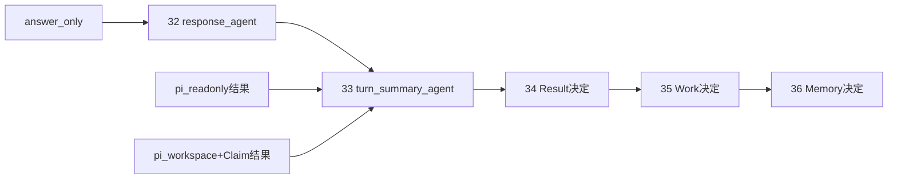

# 学习阶段S6：响应、摘要与提交决定

<!-- workflow-learning-stage: S6; nodes: response_agent,turn_summary_agent,result_commit,work_state_commit,memory_commit -->

**归档日期**：2026-07-29
**节点范围**：32–36
**输入**：直接回答所需Context，或S5执行结果
**输出**：经过分别决定的Result、Work状态和Memory候选

## 1. 一个具体场景

pi已经改好文档并跑过检查，但系统仍不能一口气做3件事：展示答复、把Work标为完成、写入长期Memory。
因为这3个后果的风险和所有者不同：答案可接受，不代表Work已完成；本轮有用，不代表值得长期记住。

## 2. 基础概念

| 概念 | 人话定义 |
|---|---|
| Response candidate | 准备展示给用户的答复候选 |
| TurnSummary candidate | 对本轮主题、开放问题和候选写回的结构化摘要 |
| Result Commit | 是否把答复候选提交为本轮产品结果的决定 |
| Work State candidate | 例如“进行中→已完成”的状态变化建议 |
| Memory candidate | 可能跨回合复用的长期事实/偏好建议 |
| Writeback Policy | 决定某类执行结果允许产生哪些写回候选的确定性规则 |

## 3. 五个节点

| # | 节点 | 输入→输出 | 关键边界 |
|---:|---|---|---|
| 32 | `response_agent` | answer_only的目标/Context→答复候选 | 只在直接回答分支运行；模型输出仍是候选 |
| 33 | `turn_summary_agent` | 直接回答或pi结果→摘要、Work/Memory候选 | 只读结果经过写回过滤，不可随便改长期状态 |
| 34 | `result_commit` | 答复候选→接受/修改/取消 | 决定会话结果，不决定Work和Memory |
| 35 | `work_state_commit` | Work状态候选→接受/跳过/取消 | 候选为空时不制造状态变化 |
| 36 | `memory_commit` | Memory候选→接受/修改/跳过/取消 | 只有明确接受才进入长期Memory |

## 4. 为什么节点32和33不是重复总结

- 节点32写**给用户看的回答**，仅`answer_only`分支需要。
- 节点33写**给系统后续回合使用的结构化摘要和候选**，三个执行分支都在此汇合。
- pi路径已有执行结果，所以跳过节点32，但仍需要节点33提取回合主题和候选。



## 5. 一个候选对象样本

```json
{
  "response_candidate": "已把当前Workflow口径统一为v1.8.0/39节点……",
  "turn_summary_candidate": {
    "topic": "统一Chat Workflow学习口径",
    "open_questions": [],
    "work_state_candidates": [
      {"work_id": "work-docs", "from": "in_progress", "to": "done"}
    ],
    "memory_candidates": [
      {"kind": "user_preference", "text": "面向小白解释时先给具体对象样本"}
    ]
  }
}
```

节点34可修改第一段文本，但不能顺带把Work标为完成；节点35和36有各自Decision Subject、Hash和Grant。

## 6. 为什么必须分3次提交决定

一个“全部确认”按钮看似简单，却把3个授权后果绑死：

1. 用户可能接受答案，但认为任务还没完成。
2. 用户可能接受Work状态，却不希望一句临时偏好成为长期Memory。
3. 不同对象由不同领域模块和事务拥有，合成一次写入会扩大失败半径。

分开决定会增加卡片数量，所以策略矩阵允许低风险项有界自动推进；但即使自动推进，也必须留下Subject、
Decision和Grant，而不是绕过治理。

## 7. 只读写回为什么要过滤

只读检查可以产生答案和摘要，但通常不应声称“代码已经修改”“Work已完成”。
`_apply_summary_writeback_policy()`会按执行类型过滤不合法候选，并记录
`accepted_with_writeback_filter`。这比只在Prompt里说“不要乱写状态”更可靠，因为最终边界是确定性代码。

## 8. 失败与恢复

- 摘要模型输出JSON无效：记录无效处置，不把任意文本硬塞进Memory。
- Result获准、Work未决定时崩溃：每个决定独立持久化，恢复后从未完成点继续。
- 用户跳过Memory：合法，S7仍可提交其他获准候选。
- 候选内容改变：旧Decision Hash失效。
- 某项不适用：节点可以透传，但Trace应说明不适用，不制造空审批。

## 9. 代码链

```text
continuous_chat.py::GovernedSemanticAgentExecutor(result_kind="response")
-> continuous_chat_prompts.py::response_task
-> GovernedSemanticAgentExecutor(result_kind="summary")
-> continuous_chat_prompts.py::summary_task
-> continuous_chat_contracts.py::_apply_summary_writeback_policy
-> ProductDecisionExecutor(result_commit)
-> ProductDecisionExecutor(work_state_commit)
-> ProductDecisionExecutor(memory_commit)
```

## 10. 亲手验证

1. 跑`answer_only`，确认走节点32；跑pi路径，确认跳过32但都汇入33。
2. 在节点33观察只读路径的候选被写回策略过滤。
3. 接受Result、跳过Memory，确认两个Decision结果独立。
4. 修改response candidate后确认生成新Hash并只影响Result决定。
5. 中断在节点35再恢复，确认节点34已完成决定不会重复消费Grant。

## 11. 掌握验收

1. Response和TurnSummary分别给谁用？
2. 为什么pi路径不走节点32却一定走节点33？
3. Result、Work、Memory为什么不能一个按钮全部提交？
4. `auto_continue`为什么仍算HITL治理？
5. 只读任务为何需要确定性写回过滤？

## 关键文件

| 文件 | 职责 |
|---|---|
| `backend/app/workflows/continuous_chat.py` | S6 Agent与3个决定节点 |
| `backend/app/workflows/continuous_chat_prompts.py` | Response和Summary任务 |
| `backend/app/workflows/continuous_chat_contracts.py` | Summary归一化与写回策略 |
| `backend/app/execution_governance/` | Decision Subject、Decision、Grant |
