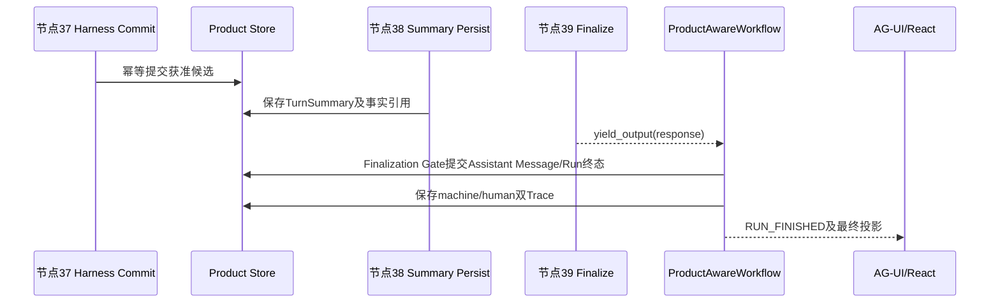

# 学习阶段S7：产品事实写入与本轮终态

<!-- workflow-learning-stage: S7; nodes: harness_candidate_commit,turn_summary_persist,result_finalization -->

**归档日期**：2026-07-29
**节点范围**：37–39
**输入**：S6已决定的Result、Work、Memory候选和回合摘要
**输出**：权威产品事实、TurnSummary、最终Assistant输出与终态双Trace

## 1. 一个具体场景

前面已经得到3个决定：答复接受、Work状态接受、Memory跳过。S7要保证：

- 只写获准对象；
- 崩溃重试不重复写；
- 保存下一轮可召回的摘要；
- Product Message、Product Run和Trace以一致终态收敛；
- 最终用户才看到“本轮完成”。

## 2. 基础概念

| 概念 | 人话定义 |
|---|---|
| Commit | 把已获准候选转成某领域模块拥有的权威产品事实 |
| Idempotency key | 同一逻辑命令重放时返回同一结果、不重复产生副作用的稳定键 |
| TurnSummary | 已完成回合的派生摘要，供下轮检索；不是完整Message替代品 |
| Finalization Gate | 图外提交Message/Run终态的最后门，防止节点提前宣布成功 |
| Machine Trace | 结构化、适合程序分析的终态报告 |
| Human Trace | 按学习阶段组织、适合人阅读的终态报告 |

## 3. 三个节点

| # | 节点 | 做什么 | 持久化位置 |
|---:|---|---|---|
| 37 | `harness_candidate_commit` | 按Decision只提交获准Result/Work/Memory候选，使用稳定command_id | Product Harness及相关产品表 |
| 38 | `turn_summary_persist` | 保存主题、开放问题、写回结果和已提交事实引用 | Product Session Store的TurnSummary |
| 39 | `result_finalization` | 记录最终候选Trace并`yield_output(response)` | MAF输出；外层门随后提交Message/Run终态 |

## 4. 一次提交的对象样本

```json
{
  "command_id": "turn-candidates:run-42",
  "decision_records": {
    "result": "decision-result-7",
    "work": "decision-work-2",
    "memory": "decision-memory-skip-4"
  },
  "committed": {
    "result_message_id": "msg-assistant-42",
    "work_revision": "work-docs-r9",
    "memory_revision": null
  }
}
```

同一个`command_id`因Worker崩溃而重放时，不应再创建`work-docs-r10`。Memory决定是skip，所以结果明确为
`null`，不能借提交阶段偷偷写入。

## 5. 图内终结与图外终态



节点39只是MAF图内部的输出点。真正的Product Run终态由`ProductAwareWorkflow`在图外统一提交，避免图先发
`RUN_FINISHED`，数据库Message却尚未成功保存的“假成功窗口”。

## 6. 为什么TurnSummary要在数据库中

如果摘要只存在当前进程内存：

1. 下轮由另一个Worker执行时读不到。
2. 浏览器刷新后“继续上次工作”失效。
3. 无法知道摘要来自哪个已完成Run、引用哪些提交事实。
4. 摘要生成后若提交失败，系统可能把未完成内容当成完成历史。

数据库中的TurnSummary是**派生索引**，生命周期跨Run；完整Message仍是证据源，Memory仍是明确接受的长期
事实，三者不能互相替代。

## 7. 为什么Commit和Finalization不能合成一个大事务函数

不同模块拥有不同产品对象，且MAF输出、AG-UI事件和Product DB不是同一种存储。当前设计用应用协调器、
幂等命令和最终化门协调，而不是让某个Router/Executor直接提交所有表。这样即使某一步失败，也能根据
已完成命令、Decision和Trace对账，而不是靠猜测大函数执行到了第几行。

## 8. 失败与恢复

- 节点37提交后进程崩溃：重放同一command_id，返回既有结果，不重复写。
- 节点38失败：Run不能宣布完成；恢复后补写摘要。
- 节点39已yield但图外Product提交失败：Finalization Gate将Run失败关闭，不能对UI伪装成功。
- 双Trace某字段无法生成：保存失败原因/未知状态，不用空字符串冒充事实。
- clarification路径：跳过37及S6提交链，直接在38保存开放问题摘要，再由39正常结束本轮。

## 9. 代码链

```text
continuous_chat.py::HarnessCandidateCommitExecutor
-> product_harness.commit_turn_candidates(command_id="turn-candidates:{run_id}")
-> continuous_chat.py::TurnSummaryPersistExecutor
-> product_sessions.save_turn_summary
-> continuous_chat.py::FinalizeExecutor
-> ctx.yield_output(response)
-> workflows/product.py::ProductAwareWorkflow.run / finalization gate
-> product_sessions提交Message、Run和双Trace
-> AG-UI RUN_FINISHED
```

## 10. 亲手验证

1. 在节点37记录command_id，模拟同一命令调用两次，确认只产生一个领域revision。
2. 跳过Memory后检查提交结果，确认Memory revision为空。
3. 在节点38检查TurnSummary引用本轮Run和已提交事实，而不是只存一段无来源文本。
4. 在节点39与图外Finalization Gate各下一个断点，观察先yield候选、后提交产品终态。
5. 用同一Run ID打开machine/human Trace，确认终态和节点路径一致。

## 11. 掌握验收

1. 为什么TurnSummary不是Message也不是Memory？
2. command_id怎样防止重试产生重复副作用？
3. 节点39和Product Finalization Gate分别负责什么？
4. clarification为什么能直接走节点38–39？
5. 为什么UI看到`RUN_FINISHED`必须晚于产品终态提交？

## 关键文件

| 文件 | 职责 |
|---|---|
| `backend/app/workflows/continuous_chat.py` | S7三个Executor |
| `backend/app/workflows/product.py` | ProductAwareWorkflow与图外终态门 |
| `backend/app/product_sessions/` | Message、Run、TurnSummary和双Trace |
| `backend/app/product_harness/` | Project/Work/Memory等获准候选提交 |
| `backend/app/product_finalization/` | 终态协调与一致性 |
