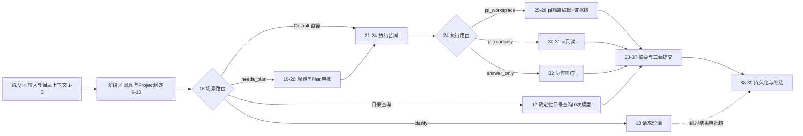
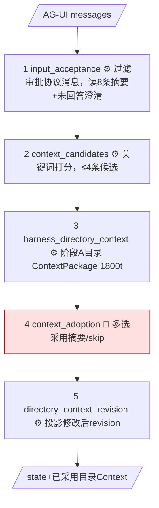
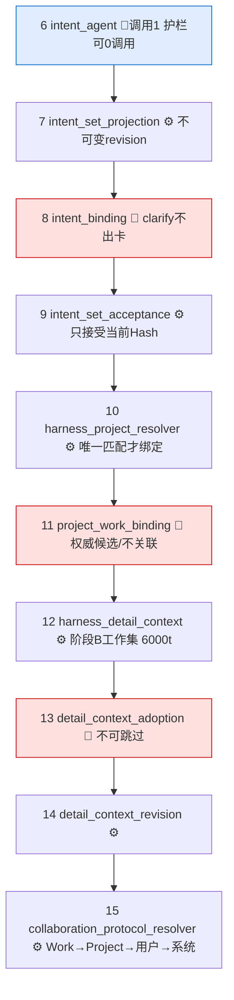
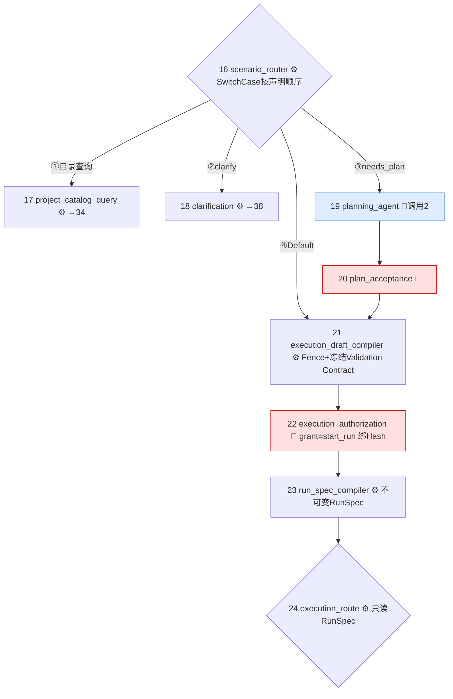
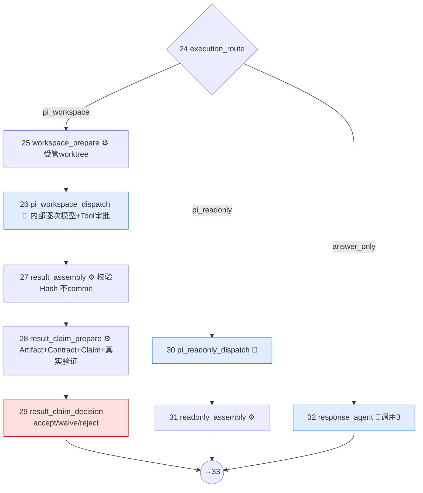
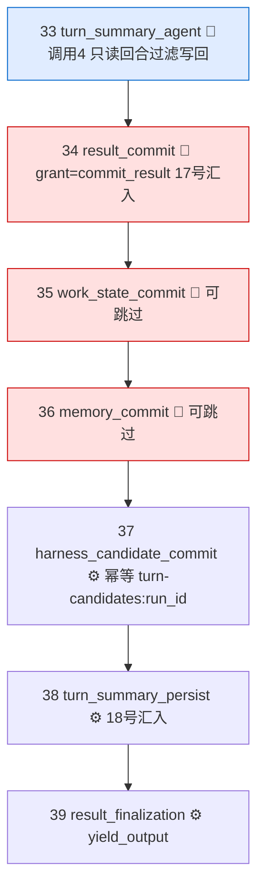

# 持续协作主Workflow的39节点设计

**归档日期**：2026-07-28
**分类**：Workflow架构与ProductAwareWorkflow
**关联源码**：
- `backend/app/workflows/catalog.py`（39 节点静态产品定义）
- `backend/app/workflows/continuous_chat.py`（Executor 行为与决策规格，2972 行）
- `backend/app/workflows/continuous_chat_factory.py`（MAF 图组装）
- `backend/app/workflows/continuous_chat_contracts.py`（CollaborationState 与纯函数）
- `backend/app/workflows/continuous_chat_prompts.py`（4 个模型任务构造器）
- `backend/app/execution_dispatch/workflow.py`（pi 执行相关 6 个 Executor）
- `backend/app/execution_dispatch/result_gate.py`（Result Claim 2 个 Executor）

## 问题

持续协作主 Workflow 是怎么设计的？39 个节点都是哪些、各自做了什么事？代码是怎么组织和实现的？

## 回答

### 1. 一句话概览

`continuous-collaboration` v1.8.0 是唯一发送前可选的根 Workflow（`selectable=True`，端点 `/api/workflows/continuous-collaboration/run`），把一次用户输入变成一条完整闭环：

```text
输入接纳 -> 选择性上下文（两阶段Harness Context） -> 意图识别与Intent Set治理
-> Project/Work绑定 -> 协作协议绑定 -> 场景路由（4分支）
-> [目录查询 | 澄清 | 规划->计划审批] -> ExecutionDraft编译 -> 执行授权 -> 不可变RunSpec
-> 执行路由（3分支：pi隔离编辑 | pi只读 | 直接回答）
-> 回合摘要 -> Result/Work/Memory三级候选审批 -> 幂等提交 -> 摘要持久化 -> 产品终态提交
```

39 个节点全部是真实 MAF Executor，由 `WorkflowBuilder` 组成一张图。最多 4 次模型调用（意图、规划、响应、摘要），每次都经 HITL 治理；9 个决策节点全部可暂停等人。运行时它被 `ProductAwareWorkflow` 包装以获得 Product Run 生命周期、Trace、Checkpoint 和 Interrupt/Resume——这层关系已归档在 [ProductAwareWorkflow设计与全部Workflow的关系](./ProductAwareWorkflow设计与全部Workflow的关系.md)，本文只讲图内部。

### 2. 代码分层：5 + 2 个模块

| 模块 | 职责 | 为什么分开 |
|------|------|-----------|
| `catalog.py` | 39 个 `WorkflowNodeDefinition` + 全部边的**静态产品元数据**（frozen dataclass） | 用户可检视的目录；运行进度从 MAF 事件推导，绝不从这张静态图推断 |
| `continuous_chat_factory.py` | `ContinuousWorkflowComponents`（Executor 构造器集合）+ `build_continuous_collaboration_workflow()` 用 MAF `WorkflowBuilder` 接线 | 节点 ID、边顺序和 Checkpoint 兼容性可以单独审查，不和行为代码混在一起 |
| `continuous_chat.py` | 全部自有 Executor 的行为实现、9 个 `ProductDecisionSpec`、6 个 revise 函数、兼容入口 `create_continuous_collaboration_workflow()` | 行为与接线分离；工厂通过依赖注入拿到 Executor 类 |
| `continuous_chat_contracts.py` | `CollaborationState`（不可变 dataclass）与全部纯函数（路由判定、意图归一化、写回策略、Hash） | 纯合同可独立测试，路由条件不藏在 lambda 里 |
| `continuous_chat_prompts.py` | `intent_task` / `plan_task` / `response_task` / `summary_task` 4 个任务构造器 | Prompt 内容和治理机制分离 |
| `execution_dispatch/workflow.py` | pi 执行相关 6 个 Executor（路由、Workspace、只读/隔离编辑 dispatch 与装配） | 执行层有自己的模块边界（SD2/SD3） |
| `execution_dispatch/result_gate.py` | Result Claim 2 个 Executor（SD4-C 证据链） | Evidence 域所有权 |

图的入口配置（factory 尾部）：

```python
WorkflowBuilder(
    name=components.workflow_id,
    start_executor=intake,
    output_from=[finalizer],                                    # 只有终结节点产出最终输出
    intermediate_output_from=[pi_readonly_dispatch, pi_workspace_dispatch],  # pi子活动流式外发
    checkpoint_storage=checkpoint_storage,                       # Product绑定的持久Checkpoint
)
```

### 3. 三个复用模式：39 个节点其实只有约 20 个 Executor 类

这是本 Workflow 最重要的设计判断——节点数量多，但类不膨胀：

1. **[`ProductDecisionExecutor`](../../backend/app/workflows/continuous_chat.py#L816) × 9 个节点**：`context_adoption`、`intent_binding`、`project_work_binding`、`detail_context_adoption`、`plan_acceptance`、`execution_authorization`、`result_commit`、`work_state_commit`、`memory_commit` 共用同一个类，行为差异全部由数据（[`ProductDecisionSpec`](../../backend/app/workflows/continuous_chat.py#L791)，9 份规格集中在 [`_decision_specs()`](../../backend/app/workflows/continuous_chat.py#L2637)）表达：主体投影、适用条件、治理事实、可编辑字段、revise 函数、是否可跳过、Grant 类型。
2. **[`GovernedSemanticAgentExecutor`](../../backend/app/workflows/continuous_chat.py#L1175) × 4 个节点**：`intent_agent`(ordinal=1)、`planning_agent`(2)、`response_agent`(3)、`turn_summary_agent`(4) 共用同一个类，差异只有 Agent Profile、任务构造器和 `result_kind`。
3. **[`HarnessContextRevisionExecutor`](../../backend/app/workflows/continuous_chat.py#L624) × 2 个节点**：`directory_context_revision` 与 `detail_context_revision` 用 `stage="directory"/"detail"` 参数区分。

另有 [`TraceMixin`](../../backend/app/workflows/continuous_chat.py#L193) 被所有自有 Executor 混入：每个节点都把公开输入/输出写成 `workflow.node.content` Trace，并按需生成 `StepInputProjection`（最小工作包、能力、预算、输出合同、停止条件、Hash）——设计者工作台点击节点看到的内容就来自这里。

### 4. 39 个节点逐一说明

贯穿全图的消息是 `CollaborationState`（frozen dataclass），每个节点用 `replace()` 产生新状态传给下一个节点，从不原地修改。

> 下表 Executor 列可点击跳转源码。行号锚点基于 2026-07-28 工作区（`9ba63e1` 之后新增模块 docstring/接线注释的版本）；后续代码变动行号会漂移，届时按类名搜索定位。

#### 4.1 入口与目录上下文（节点 1-5）

| # | 节点 | Executor | 做了什么 |
|---|------|----------|---------|
| 1 | `input_acceptance` | [`IntakeExecutor`](../../backend/app/workflows/continuous_chat.py#L286) | `normalize_agui_messages_for_provider()` 过滤审批协议消息，取最后一条用户消息为 prompt；读最近 8 条 TurnSummary、最新未回答澄清、从摘要提取 Project 提示；构造初始 `CollaborationState` |
| 2 | `context_candidates` | [`CandidateContextExecutor`](../../backend/app/workflows/continuous_chat.py#L344) | 确定性检索：对摘要按 prompt 关键词命中计分，未回答澄清强制优先带回，最多选 4 条。**不默认叠加完整历史** |
| 3 | `harness_directory_context` | [`HarnessDirectoryContextExecutor`](../../backend/app/workflows/continuous_chat.py#L399) | 阶段 A：读正式 Project 轻量目录，生成候选 `ContextPackage`（token 预算 1800）。Project 事实来自权威 Harness，不从聊天摘要猜 |
| 4 | `context_adoption` | [`ProductDecisionExecutor`](../../backend/app/workflows/continuous_chat.py#L816) | HITL：确认本轮采用的主题摘要。可编辑字段是 `selected_summary_ids` 多选；[`_revise_context()`](../../backend/app/workflows/continuous_chat.py#L2501) 按选中 ID 过滤摘要，skip 则清空；允许跳过 |
| 5 | `directory_context_revision` | [`HarnessContextRevisionExecutor(stage="directory")`](../../backend/app/workflows/continuous_chat.py#L624) | 读当前 Run 最新目录 Context revision 投影回状态——保证用户在决策卡上排除/修改的内容**真正进入**后续意图识别，旧来源不会被装回 |

#### 4.2 意图识别与 Project 绑定（节点 6-15）

| # | 节点 | Executor | 做了什么 |
|---|------|----------|---------|
| 6 | `intent_agent` | [`GovernedSemanticAgentExecutor`](../../backend/app/workflows/continuous_chat.py#L1175)(intent_router, 第1次调用) | 识别 1-4 个目标、顺序依赖、Project 提示和澄清需要。**确定性护栏**：`_is_project_catalog_query()` 命中"我有哪些项目"类输入时直接构造意图，0 次模型调用 |
| 7 | `intent_set_projection` | [`IntentSetProjectionExecutor`](../../backend/app/workflows/continuous_chat.py#L1874) | 把模型候选保存为不可变 Intent revision（Intent Set），并恢复/回答跨 Run 澄清 |
| 8 | `intent_binding` | [`ProductDecisionExecutor`](../../backend/app/workflows/continuous_chat.py#L816) | HITL：确认意图理解。`clarify` 场景不适用（不会造出无法回答的审批卡）；可整体编辑 Intent Set；[`_revise_intent()`](../../backend/app/workflows/continuous_chat.py#L2519) 校验 1-4 个 Intent、场景白名单，手工修改后 `confidence=1.0` |
| 9 | `intent_set_acceptance` | [`IntentSetAcceptanceExecutor`](../../backend/app/workflows/continuous_chat.py#L1945) | 把审核后意图同步为新 revision，只接受当前 Hash 绑定的完整 Intent Set；clarify 场景保持 candidate |
| 10 | `harness_project_resolver` | [`HarnessProjectResolverExecutor`](../../backend/app/workflows/continuous_chat.py#L454) | 把意图中的 Project 提示解析到权威目录已有 ID；**只有唯一匹配才绑定**，零匹配或多匹配交给下一个决策点 |
| 11 | `project_work_binding` | [`ProductDecisionExecutor`](../../backend/app/workflows/continuous_chat.py#L816) | HITL：确认关联的 Project/Work。选项只来自 `state.project_matches` 权威候选，[`_revise_project()`](../../backend/app/workflows/continuous_chat.py#L2571) 拒绝目录外 ID；可选择"本轮不关联"；简单问答不适用 |
| 12 | `harness_detail_context` | [`HarnessDetailContextExecutor`](../../backend/app/workflows/continuous_chat.py#L516) | 阶段 B：按已绑定 Project 装配开放 Work、当前 Plan、Action、Note、Accepted Memory、Repository Snapshot 和匹配治理规则（token 预算 6000），逐项记录采用与排除 |
| 13 | `detail_context_adoption` | [`ProductDecisionExecutor`](../../backend/app/workflows/continuous_chat.py#L816) | HITL：确认项目与仓库 Context。主体逐项公开 source_kind/revision/adopted/reason/token_estimate；本卡不提供行内编辑（调整走 Context 面板生成新 revision），不允许跳过 |
| 14 | `detail_context_revision` | [`HarnessContextRevisionExecutor(stage="detail")`](../../backend/app/workflows/continuous_chat.py#L624) | 同节点 5，投影用户审核后的最新详情 Context revision |
| 15 | `collaboration_protocol_resolver` | [`CollaborationProtocolResolverExecutor`](../../backend/app/workflows/continuous_chat.py#L700) | 按 Work → Project → 用户 → 系统优先级绑定不可变协作协议 revision；多 Intent 时用可审计 `composition_overlay` 公开本轮实际启用的组合 Plan 策略 |

#### 4.3 场景路由与两个短分支（节点 16-18）

| # | 节点 | Executor | 做了什么 |
|---|------|----------|---------|
| 16 | `scenario_router` | [`ScenarioRouterExecutor`](../../backend/app/workflows/continuous_chat.py#L2013) | 纯投影：调用合同层 `_evaluate_scenario_route()` 记录路由决定并原样转发状态；真正的分支由 MAF SwitchCase 边完成（见 §5） |
| 17 | `project_catalog_query` | [`ProjectCatalogExecutor`](../../backend/app/workflows/continuous_chat.py#L2043) | 确定性产品目录查询：从 Harness 权威事实回答项目列表；目录为空时明确说"没有正式项目"并展示对话候选，**绝不让模型编造**。之后直接接 `result_commit`（节点 34） |
| 18 | `clarification` | [`ClarificationExecutor`](../../backend/app/workflows/continuous_chat.py#L2274) | 把澄清问题作为本轮 response 提交（提示"请直接在下方输入框回答"），标记 `awaiting_user_answer: True`；之后**跳过整条结果审批链**，直接接 `turn_summary_persist`（节点 38），下一轮 Intake 会把开放问题带回 |

#### 4.4 计划与执行合同（节点 19-24）

| # | 节点 | Executor | 做了什么 |
|---|------|----------|---------|
| 19 | `planning_agent` | [`GovernedSemanticAgentExecutor`](../../backend/app/workflows/continuous_chat.py#L1175)(task_planner, 第2次调用) | 对新任务、继续 Project、明确规划请求和多 Intent 组合形成步骤与验证门 |
| 20 | `plan_acceptance` | [`ProductDecisionExecutor`](../../backend/app/workflows/continuous_chat.py#L816) | HITL：接受/修改/本轮跳过计划。[`_revise_plan()`](../../backend/app/workflows/continuous_chat.py#L2589)：skip 清空 plan，修改必须非空 |
| 21 | `execution_draft_compiler` | [`ExecutionDraftCompilerExecutor`](../../backend/app/workflows/continuous_chat.py#L2103) | 把目标、最小上下文、计划、能力和完成门编译成版本化 `ExecutionDraft`（`compile_execution_draft_v2`）；同时施加 Repository Fence 并**冻结 Validation Contract**（P0-1，防止授权后 Plan 推进偷换验证规则）；失败用稳定错误码脱敏（P1-5） |
| 22 | `execution_authorization` | [`ProductDecisionExecutor`](../../backend/app/workflows/continuous_chat.py#L816) | HITL：授权执行合同。`accept_action="execute"`、`grant_kind="start_run"`——批准产生一次性 Grant，**绑定当前 Draft revision Hash**；编辑走 ExecutionDraft 完整工作台，[`_revise_execution_draft()`](../../backend/app/workflows/continuous_chat.py#L2611) 只接受新 revision ID（新 Hash 必须重新审批） |
| 23 | `run_spec_compiler` | [`RunSpecCompilerExecutor`](../../backend/app/workflows/continuous_chat.py#L2214) | 只从已授权的 ExecutionDraft revision 编译**不可变 RunSpec**（`compile_run_spec_v2`）并绑定 Product Run；这是执行阶段的唯一合同来源 |
| 24 | `execution_route` | [`ExecutionRouteExecutor`](../../backend/app/execution_dispatch/workflow.py#L72) | 只读已批准 RunSpec 决定 `pi_workspace` / `pi_readonly` / `answer_only`，**不再重新解释用户文本**；分支同样由 SwitchCase 边完成 |

#### 4.5 pi 执行分支（节点 25-31，SD2/SD3/SD4-C）

| # | 节点 | Executor | 做了什么 |
|---|------|----------|---------|
| 25 | `execution_workspace_prepare` | [`ExecutionWorkspacePrepareExecutor`](../../backend/app/execution_dispatch/workflow.py#L188) | 从已批准的干净 Repository Snapshot 创建受管 detached Git worktree，校验 base revision，公开安全 Workspace 投影（不泄露绝对路径） |
| 26 | `pi_workspace_dispatch` | [`PiWorkspaceDispatchExecutor`](../../backend/app/execution_dispatch/workflow.py#L1068) | 在受管 worktree 启动受治理 pi 隔离编辑：每次模型请求逐次审批，Tool 只允许有界读取和绑定 Hash 的单文件精确 `edit`；每个副作用记入 ToolOperation/Attempt 账本。子活动经 `intermediate_output_from` 流式外发到工作台 |
| 27 | `pi_workspace_result_assembly` | [`PiWorkspaceResultAssemblyExecutor`](../../backend/app/execution_dispatch/workflow.py#L1079) | 保留工作区，校验 ToolExecution 与 Result Hash，公开变化文件；**不提交、不推送、不声明 Work 完成** |
| 28 | `result_claim_prepare` | [`ResultClaimPrepareExecutor`](../../backend/app/execution_dispatch/result_gate.py#L117) | 经 `ResultPipelineCoordinator` 建立证据链：diff_patch Artifact（真实 Diff 字节）、冻结的 ValidationContract、绑定 Action 版本/Snapshot/Artifact Revision 的 CompletionClaim 与非空 mandatory Requirements；确定性 Validation 在 Workspace 真实执行。全部写入用 `sd4:{run_id}:...` 幂等 command_id |
| 29 | `result_claim_decision` | [`ResultClaimDecisionExecutor`](../../backend/app/execution_dispatch/result_gate.py#L184) | HITL：决定结果 Claim（accept/waive/reject）。复用 `result_commit` 决策点，不可变 DecisionSubject 冻结 Claim id/hash/row_version，创建即绑定，篡改必失败 |
| 30 | `pi_readonly_dispatch` | [`PiReadonlyDispatchExecutor`](../../backend/app/execution_dispatch/workflow.py#L259) | 受治理 pi 只读检查：Chat-owned `read/grep/find/ls` 逐次重验路径与快照；pi 禁用内置 Tool、Context 文件发现、Session 和自动重试 |
| 31 | `pi_readonly_result_assembly` | [`PiReadonlyResultAssemblyExecutor`](../../backend/app/execution_dispatch/workflow.py#L1003) | 装配只读结果，校验后写回状态，交给回合摘要 |

#### 4.6 响应与回合收尾（节点 32-39）

| # | 节点 | Executor | 做了什么 |
|---|------|----------|---------|
| 32 | `response_agent` | [`GovernedSemanticAgentExecutor`](../../backend/app/workflows/continuous_chat.py#L1175)(response_agent, 第3次调用) | `answer_only` 分支的协作响应：用已采用 Context、意图和计划生成答复候选 |
| 33 | `turn_summary_agent` | [`GovernedSemanticAgentExecutor`](../../backend/app/workflows/continuous_chat.py#L1175)(turn_summarizer, 第4次调用) | 提取本轮主题、开放问题、Work 状态候选和 Memory 候选；只读回合经 `_apply_summary_writeback_policy()` 过滤写回候选（去向记为 `accepted_with_writeback_filter`），三条执行分支在此汇合 |
| 34 | `result_commit` | [`ProductDecisionExecutor`](../../backend/app/workflows/continuous_chat.py#L816) | HITL：确认提交给会话的答复（长文本可编辑，[`_revise_result()`](../../backend/app/workflows/continuous_chat.py#L2601)），`grant_kind="commit_result"`。`project_catalog_query` 分支也汇入这里 |
| 35 | `work_state_commit` | [`ProductDecisionExecutor`](../../backend/app/workflows/continuous_chat.py#L816) | HITL：Work 状态候选决定，`grant_kind="commit_work_state"`，可跳过；候选不会自动变成长期状态 |
| 36 | `memory_commit` | [`ProductDecisionExecutor`](../../backend/app/workflows/continuous_chat.py#L816) | HITL：长期 Memory 候选决定，`grant_kind="commit_memory"`，可跳过（[`_revise_summary_candidates()`](../../backend/app/workflows/continuous_chat.py#L2621)）；只有明确接受的候选进长期 Memory |
| 37 | `harness_candidate_commit` | [`HarnessCandidateCommitExecutor`](../../backend/app/workflows/continuous_chat.py#L2324) | 把已批准候选经 `commit_turn_candidates()` 幂等提交到 Product Harness：command_id 为 `turn-candidates:{run_id}`，绑定各 Decision Record ID，重放不重复 |
| 38 | `turn_summary_persist` | [`TurnSummaryPersistExecutor`](../../backend/app/workflows/continuous_chat.py#L2383) | `save_turn_summary()` 保存回合主题摘要（下一轮候选召回的来源），并附上已提交产品事实引用；`clarification` 分支直接汇入这里 |
| 39 | `result_finalization` | [`FinalizeExecutor`](../../backend/app/workflows/continuous_chat.py#L2471) | 以 `product_finalization_gate` 身份记录 result_candidate Trace，`ctx.yield_output(response)` 产出最终答复。外层 ProductAwareWorkflow 在此提交 Product Message 终态，防止过早 `RUN_FINISHED` |

### 5. 两个分支点的真实条件

分支不写在 Executor 里，而是 MAF `add_switch_case_edge_group` 的声明式条件（按声明顺序求值，工作台"未走原因"就来自这份顺序）：

```python
# scenario_router 之后：4 条候选边
.add_switch_case_edge_group(router, [
    Case(condition=components.is_project_catalog_state, target=project_catalog),  # 1 确定性目录查询
    Case(condition=lambda value: value.scenario == "clarify", target=clarification),  # 2 澄清
    Case(condition=components.needs_plan, target=planner),                        # 3 需要规划
    Default(target=compiler),                                                     # 4 直接进入执行合同
])

# execution_route 之后：3 条候选边
.add_switch_case_edge_group(execution_route, [
    Case(condition=...kind == "pi_workspace", target=execution_workspace_prepare),  # 隔离编辑
    Case(condition=...kind == "pi_readonly", target=pi_readonly_dispatch),          # 只读检查
    Default(target=responder),                                                      # answer_only 直接回答
])
```

`is_project_catalog_state` 和 `needs_plan` 是合同层纯函数（`continuous_chat_contracts.py`），可单测；多 Intent 时 `needs_plan` 强制成立（多目标必须组合 Plan）。

四条主要路径与模型调用次数：

| 场景 | 走过的节点 | 模型调用 |
|------|-----------|---------|
| 明确项目目录查询 | 1-16 → 17 → 34-39（护栏命中时 6 也不调模型） | 0-1 次 |
| 需要澄清 | 1-16 → 18 → 38-39 | 1 次（意图） |
| 简单问答 | 1-16 → 21-24 → 32 → 33 → 34-39 | 3 次 |
| 规划 + pi 隔离编辑 | 1-16 → 19-24 → 25-29 → 33 → 34-39 | 2 次 + pi 内部逐次审批 |

### 6. 两个核心复用类的内部流程

#### 6.1 `ProductDecisionExecutor`（9 个决策节点的共同引擎）

```text
handler(state):
  spec.applicable(state) 为假 -> 直接透传
  register_subject      # 不可变DecisionSubject，内容Hash提交时复算
  evaluate_subject      # HITL策略矩阵求值（系统下限+用户偏好两阶段）
  ├─ deny          -> 抛 PermissionError（Run失败关闭）
  ├─ auto_continue -> 记录自动Decision + 消费Grant，直接推进
  └─ waiting_human -> create_human_request + mark_waiting_approval
                      + ctx.request_info(决策卡, dict)   # MAF Interrupt，Checkpoint落盘

@response_handler resolve(response):
  accept -> 记录Decision、消费一次性Grant、推进
  revise -> spec.revise(state, changes) 产生新状态（目录Context修改会先落成
            新的不可变Context revision再推进，幂等command_id）
  skip   -> allow_skip 时按spec清空对应候选后推进
  cancel -> Run以用户取消收敛，零后续副作用
```

关键不变量：批准绑定当前主体 Hash；Grant 一次性消费；崩溃重进按不可变 Subject 重入复用，不产生重复审批。

#### 6.2 `GovernedSemanticAgentExecutor`（4 个模型调用节点的共同引擎）

```text
_begin:    task_builder(state) 生成任务 -> 建 ModelCallDraft revision（可编辑、有Hash）
           确定性护栏命中（仅intent节点的项目目录查询）-> 跳过全部Provider流程
_register: register_model_call -> 治理评估（人工审批或有界自动推进）
_dispatch: claim_grant（唯一领取）-> start_model_call_attempt
           -> Provider流式发送已批准bytes（逐段记录 provider.dispatch/receive/decode）
           -> finish_model_call_attempt（HTTP、用量、可见输出Hash持久化）
_deliver:  按 result_kind 解析文本：
           intent   -> _normalize_intent_candidates（多候选归一化）
           plan     -> 纯文本计划
           response -> 答复文本
           summary  -> JSON + 写回策略过滤
           record_model_output_disposition 记录去向：
           accepted_as_intent/plan/response/summary、rejected_invalid_output、
           overridden_by_deterministic_guard、accepted_with_writeback_filter
```

ModelCallDraft 准备、审批和 Provider Dispatch 前都会执行 `RepositorySourceFreshnessGuard`：仓库 Context 过期则以 `context_source_stale` 失败关闭且 Provider Attempt 保持 0（零发送）。

### 7. 版本与演进轨迹

图版本随节点增量演进，旧 Checkpoint 按图签名规则失败关闭，不静默兼容：

| 版本 | 节点数 | 增加了什么 |
|------|--------|-----------|
| v1.4.0 | 28 | Intent Set 与多 Intent 组合 Plan（阶段 B） |
| v1.5.0 | 31 | Repository Context 与两级 Context revision 投影（SD1-C） |
| v1.6.0 | 34 | pi 只读执行分支（SD2） |
| v1.7.0 | 37 | 受管 Workspace 与 pi 隔离编辑分支（SD3） |
| v1.8.0 | 39 | `result_claim_prepare` + `result_claim_decision` 结果证据链（SD4-C） |

## 关键文件

| 文件 | 职责 |
|------|------|
| `backend/app/workflows/catalog.py` | `CONTINUOUS_COLLABORATION_WORKFLOW` 静态定义：39 节点、全部边、分支条件文案，供前端目录与设计者视图 |
| `backend/app/workflows/continuous_chat.py` | 约 20 个 Executor 类、`TraceMixin`、9 个 `ProductDecisionSpec`（`_decision_specs()`）、6 个 revise 函数、`create_continuous_collaboration_workflow()` 兼容入口 |
| `backend/app/workflows/continuous_chat_factory.py` | `ContinuousWorkflowComponents` 依赖注入容器 + `WorkflowBuilder` 接线（边顺序、两个 SwitchCase 组、输出与 Checkpoint 配置） |
| `backend/app/workflows/continuous_chat_contracts.py` | `CollaborationState` 不可变状态、路由纯函数、意图归一化、摘要写回策略、canonical Hash |
| `backend/app/workflows/continuous_chat_prompts.py` | `intent_task` / `plan_task` / `response_task` / `summary_task` |
| `backend/app/execution_dispatch/workflow.py` | `ExecutionRouteExecutor`、`ExecutionWorkspacePrepareExecutor`、pi 只读/隔离编辑 dispatch 与 result assembly 共 6 个 Executor |
| `backend/app/execution_dispatch/result_gate.py` | `ResultClaimPrepareExecutor`、`ResultClaimDecisionExecutor` |
| `backend/app/evidence/result_pipeline.py` | `ResultPipelineCoordinator`：Claim/Contract/Artifact 编排与幂等 |

## 补充记录

### 2026-07-28：HITL 分布与分阶段流程图

用户追问：39 个节点加了 HITL 没有？流程、输入、输出怎么表达？

**HITL 分布总账**：39 节点分 3 类治理强度，不是每个节点都有决策卡。

| 类型 | 数量 | 节点 | HITL 形式 |
|---|---|---|---|
| 🛑 审批节点（kind=approval） | 10 | 4 context_adoption、8 intent_binding、11 project_work_binding、13 detail_context_adoption、20 plan_acceptance、22 execution_authorization、29 result_claim_decision、34 result_commit、35 work_state_commit、36 memory_commit | `ctx.request_info()` 暂停出决策卡；策略矩阵可 deny / 有界自动推进 / 等人；批准绑定当前 Hash + 一次性 Grant |
| 🤖 Agent 节点 | 6 | 6 / 19 / 32 / 33（4 次语义模型调用）+ 26 pi_workspace_dispatch、30 pi_readonly_dispatch | 节点不出决策卡，但每一次 Provider 请求生成可编辑 ModelCallDraft 逐次审批；pi 内部每次模型请求和每个 Tool 调用（含 `edit`）也逐次审批 |
| ⚙️ 确定性节点 | 23 | 其余全部 | 无 HITL、不暂停；靠不可变 revision、幂等 command_id 和 fail-closed 保安全 |

注意："有 HITL"≠"一定暂停"——auto_continue 也持久留痕并消费 Grant。§4 表中 10 个 approval 节点里有 9 个共用 `ProductDecisionExecutor`，第 10 个 `result_claim_decision` 是独立类但复用 `result_commit` 决策点。

**总览图**（6 阶段 + 2 分支点）：



**阶段①（1-5）** 输入：AG-UI 消息列表 → 输出：带已采用目录 Context 的 CollaborationState



**阶段②（6-15）** 输入：目录 Context → 输出：意图+Project 绑定+阶段 B 工作集+协议



**阶段③（16-24）** 输入：意图/Context/协议 → 输出：不可变 RunSpec+执行路由



**阶段④（25-32）** 输入：RunSpec → 输出：response/执行结果+证据链



**阶段⑤⑥（33-39）** 输入：response/执行结果 → 输出：yield_output(答复)+已提交产品事实+下轮候选摘要



数据流本质：全图只传一个不可变 `CollaborationState`，每个节点 `replace()` 出新状态；HITL 修改从不改旧对象，都是生成新 revision（新 Hash）再重审。

### 2026-07-28：澄清——HITL 就是单独的审批节点，默认全部暂停

用户对"两个层面""有 HITL 不一定停"的表述提出质疑，澄清如下（修正上一条补充记录中容易误读的措辞）：

1. **HITL 是单独算的节点**：39 节点中 10 个是专职 HITL 审批节点，唯一职责就是暂停出决策卡；其余 29 个干活节点不问人。不存在"每个节点都藏 HITL"。
2. **默认就是停**：每个决策点出厂默认 require_human。"不停"只有一种来源——用户在 HITL 配置中心亲手把该点设为 auto_continue，且系统下限点（发送 ModelCallDraft、提交 Memory、Runtime 恢复等）不允许设自动。auto 通过时同样留决策记录并消费 Grant。
3. **"两个层面"的准确说法**：全系统 12 个决策点分两类承载方式——8 个决策点每轮固定发生一次，画成图上 10 个固定审批节点；另 4 个决策点（发送模型请求、执行 Tool、Runtime 恢复、高风险结果）发生次数运行时才确定（pi 一次任务可能内部发数十次请求），无法预画成固定节点，只能按事件逐次审批。是同一套 HITL 策略系统管两类承载，不是两套 HITL。

### 2026-07-28：为 39 节点补充源码跳转链接

应用户要求，在 §3/§4 中为每个 Executor 类和 revise 函数增加可点击源码链接（相对路径 + 行号锚点）。行号基于提交 `9ba63e1`（2026-07-28）；后续代码变动导致行号漂移时，按类名/函数名搜索定位。本次修改只增加链接，未改动任何说明文字。

### 2026-07-28：同步代码更新后的行号锚点

`continuous_chat.py` 在 `9ba63e1` 之后新增了约 172 行模块级 docstring（逐节点职责清单），`continuous_chat_factory.py` 新增 15 行接线阶段注释；经 diff 逐行核对，**无任何行为代码、节点、边或决策规格变化**，39 节点结构与本文全部说明仍准确。已把 `continuous_chat.py` 的 29 个链接锚点按实测新行号更新（文件现 2972 行）；`catalog.py`、`execution_dispatch/workflow.py` 与 `result_gate.py` 未变动，对应 8 个链接无需调整。

### 2026-07-28：源码审计纠正与推荐阅读口径

本次把文档逐项对照当前目录、图工厂、治理目录、Executor实现和自动测试。结论分两部分：

1. **图结构主体正确**：版本仍是`v1.8.0`；目录有39个节点、43条边；本文§4的39个节点ID与源码顺序逐项一致；10个`kind=approval`、6个`kind=agent`、23个其他节点的分类也与目录一致；现有源码跳转锚点全部有效。
2. **此前HITL补充说明存在实质错误**：下面的纠正优先于本文第32、58、166-173、251-259、374、376-382行附近的旧表述。学习流程时应以本节为准。

#### 一、必须分开的4层

```text
ProductAwareWorkflow（39节点图外）
  -> 接纳/恢复Product Run，投影Trace与Checkpoint，最后提交Product Message/Run终态

MAF Workflow Definition（39个图节点）
  -> 定义本轮控制流、两个SwitchCase分支点和实际Executor

Execution Governance（全系统12类Decision Point）
  -> 决定某个具体对象是不适用、禁止、自动推进还是等待人工

动态模型/Tool边界
  -> 在Agent或pi Executor内部按实际调用次数生成ModelCallDraft/Tool请求并治理
```

因此，`Decision Point`不是`MAF Workflow Node`的同义词，HITL也不只存在于`kind=approval`节点。

#### 二、审批节点与Decision Point的准确数量

- 目录中有**10个审批类MAF节点**，不是9个。
- 其中9个复用`ProductDecisionExecutor`；`result_claim_decision`使用独立的`ResultClaimDecisionExecutor`。
- 这10个节点映射到**8种固定Decision Point key**：`context_adoption`和`result_commit`各被两个不同节点复用，其余6种各对应一个节点。
- 全系统治理目录共有**12种Decision Point**。另外4种是`model_call_authorization`、`tool_execution_authorization`、`runtime_recovery`和`unknown_or_high_risk`。模型与Tool授权可在某个Agent/pi节点内部多次发生；Runtime恢复和高风险处置主要属于图外运行控制与故障处置，不能硬画成每轮固定节点。
- 10个审批节点不表示每轮产生10张卡：分支未经过、`spec.applicable=False`、策略`auto_continue`都会让节点不暂停。

#### 三、默认HITL策略的准确事实

此前“每个决策点默认都是`require_human`”“只有用户手工开启才不停”“发送ModelCallDraft、Memory、Runtime恢复属于不可放宽系统下限”的说法不符合当前代码。

当前实现是：

- 产品默认`require_human`：模型调用、Memory提交、Runtime恢复、未知/高风险结果。
- 产品默认`conditional`：意图、Project/Work绑定、Context、Plan、ExecutionDraft、Tool、Work状态和Result。条件未命中时会自动推进，命中或事实缺失时等待人工。
- 系统不可放宽下限当前只把`unknown_or_high_risk`固定为`require_human`；其他Decision Point的系统floor为`auto_continue`，再与产品默认和用户偏好取更严格结果。
- 当前代码和测试明确允许用户把`model_call_authorization`设为`auto_continue`；Memory等非高风险点也不是系统floor禁止自动。自动推进仍会保存Policy Evaluation、Decision和必要Grant，不等于没有治理。
- `result_claim_decision`还有额外硬门：证据不足或结果未知时，即使策略允许自动，也只能交给人工拒绝，不能自动接受完成声明。

#### 四、Agent节点也可能产生Interrupt

旧表中“6个Agent节点不出决策卡”“其余29个干活节点不问人”不准确：

- 4个`GovernedSemanticAgentExecutor`节点会在自身内部为每次ModelCallDraft执行`ctx.request_info()`；是否暂停由模型调用策略决定。
- `pi_workspace_dispatch`和`pi_readonly_dispatch`会在同一个MAF节点内部经历零到多次模型调用和Tool调用审批。
- 这些动态审批不是额外的MAF节点，因此“39节点”不会随着pi调用次数变化；但它们仍是真实HITL Interrupt。

#### 五、Executor类数与模型调用次数

- `continuous_chat.py`定义19个Executor类；`execution_dispatch/workflow.py`定义6个；`execution_dispatch/result_gate.py`定义2个。整张39节点图当前使用**27个不同Executor类**，不是“约20个”。原文列出的3种复用方式本身正确，也是39个节点没有膨胀为39个类的主要原因。
- “最多4次模型调用”只指根图的4个语义节点，不包含pi内部调用。根图调用数按实际路径为：

| 路径 | 根图语义模型调用 | 说明 |
|---|---:|---|
| 明确Project目录查询 | 0-1 | 确定性护栏命中时意图模型也跳过 |
| 澄清 | 1 | 只有意图识别 |
| 直接简单回答 | 3 | 意图 + 响应 + 摘要 |
| 规划后直接回答 | 4 | 意图 + 规划 + 响应 + 摘要 |
| 规划后进入pi只读/隔离编辑 | 3 + pi内部调用 | 意图 + 规划 + 摘要；pi内部模型调用次数由已批准Profile上限约束 |

因此原文“规划 + pi隔离编辑 = 2次 + pi内部审批”少算了`turn_summary_agent`，正确是3次根图语义调用再加pi内部调用。

#### 六、`CollaborationState`的准确理解

`CollaborationState`是`frozen dataclass`，但其中包含可变`dict`，所以是**字段不可重新赋值的浅冻结状态**，不是深度不可变对象。节点会选择“原样转发同一个state”或用`replace()`生成新state；并非每个节点都调用`replace()`。ContextPackage、Intent Set和ExecutionDraft等正式对象在修改时会产生新revision/hash；普通Plan或回复文本的修改至少会产生新的DecisionSubject hash，但不能笼统说成“所有HITL修改都会先生成正式产品revision”。

#### 七、建议掌握主流程时记住的主干

```text
图外接纳Product Run
-> 1-5 召回并审核轻量目录Context
-> 6-15 识别Intent、绑定Project、装配详情Context、选择协作协议
-> 16 场景路由
   ├─ 17 权威Project查询
   ├─ 18 澄清并结束本轮
   └─ 19-24 可选规划、ExecutionDraft授权、编译RunSpec、选择执行分支
-> 25-29 pi隔离编辑与完成Claim / 30-31 pi只读 / 32 Chat直接回答
-> 33 摘要候选
-> 34-37 Result、Work、Memory治理与Harness幂等提交
-> 38 保存可追溯TurnSummary
-> 39 产出答复
-> 图外ProductAwareWorkflow提交Product Message与Run终态
```

学习时先记住这条主干，再展开39个节点；不要先背节点编号，也不要把审批节点、Decision Point、ModelCallDraft审批和Product Run终态混成同一层。

### 2026-07-28：源码审计第二轮补充

1. 原文“6个revise函数”少算1个。当前共有**7个**：`_revise_context`、`_revise_intent`、`_revise_project`、`_revise_plan`、`_revise_result`、`_revise_execution_draft`、`_revise_summary_candidates`。
2. “自动推进都会消费Grant”也需要限定：所有自动推进都会保存Policy Evaluation和Decision；只有该规格配置了`grant_kind`时才签发并消费Grant。Context、Intent、Project和Plan决定通常没有Grant；ExecutionDraft、Result、Work和Memory等有后果的决定才使用对应Grant。
3. 完整可达路径如下。`N`表示pi节点内部按已批准Profile上限发生的动态模型调用次数：

| 路径 | 实际经过的MAF节点 | 根图语义模型调用 |
|---|---|---:|
| Project目录 | 1-16 → 17 → 34-39 | 0-1 |
| 澄清 | 1-16 → 18 → 38-39 | 1 |
| 无规划直接回答 | 1-16 → 21-24 → 32-39 | 3 |
| 规划后直接回答 | 1-16 → 19-24 → 32-39 | 4 |
| 无规划pi只读 | 1-16 → 21-24 → 30-31 → 33-39 | 2 + N |
| 规划后pi只读 | 1-16 → 19-24 → 30-31 → 33-39 | 3 + N |
| 无规划pi隔离编辑 | 1-16 → 21-29 → 33-39 | 2 + N |
| 规划后pi隔离编辑 | 1-16 → 19-29 → 33-39 | 3 + N |

这里的“无规划pi”在图合同上可达；是否需要规划由已接受Intent、协作协议和`needs_plan`决定，执行路由随后只读取已批准RunSpec，不能反过来临时补做规划。

### 2026-07-28：代码学习注释与终态双Trace已经落地

为解决“文档能看懂、打开代码却不知道函数属于哪一阶段”的问题，当前实现增加了两道保证：

1. 39个节点对应的27个Executor类及全部MAF `handler/response_handler`都补了中文职责注释，说明节点号、输入、输出、分支/失败语义和下游。图工厂的边也按7个学习阶段标注。
2. [可学习性合同测试](../../backend/tests/test_continuous_workflow_learning_comments.py)校验目录仍为39节点、每个节点都有教学阶段、Executor和Handler保留中文注释；后续改图漏注释会失败。

阅读源码的推荐顺序：

```text
runtime_execution/endpoint.py        HTTP接纳与Runtime Job
-> workflows/runtime.py              ProductAwareWorkflow外层生命周期
-> workflows/continuous_chat_factory.py  39节点连接和两处Switch
-> workflows/continuous_chat.py      节点1-23、32-39行为
-> execution_dispatch/workflow.py    节点24-27、30-31及pi边界机
-> execution_dispatch/result_gate.py 节点28-29证据与Claim门
-> product_sessions/service.py       Message/Run终态及双Trace物化
```

每轮进入成功、失败、取消、放弃、中断或结果未知终态时，`ProductSessionService`在同一事务生成两份报告：机器版保留结构化事件、Attempt、ToolExecution与关联ID；人读版按实际Sequence重排节点路径，展示选中/未选分支、产品决定、显式空值原因和未经过节点。两份报告不调用Agent/LLM，也不补写隐藏推理。完整保存与分析方法见[每轮双Trace如何保存、分析与可视化](../Trace与可观测性/每轮双Trace如何保存、分析与可视化.md)。
