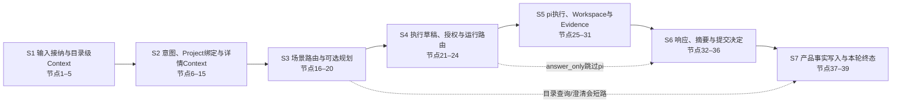
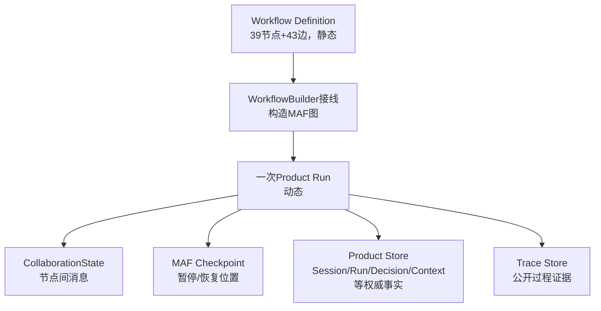

# 持续协作主Workflow的39节点设计

<!-- workflow-fact: id=continuous-collaboration; version=1.8.0; nodes=39; edges=43; learning_stages=7 -->

**归档日期**：2026-07-29
**分类**：Workflow架构与ProductAwareWorkflow
**代码事实**：`continuous-collaboration` v1.8.0，39个节点，43条静态边，7个学习阶段

## 1. 先用一个具体任务看全图

假设你输入：

> 继续Chat项目，把文档里旧的Workflow节点数改成39。修改前先让我确认，完成后跑文档检查。

系统不能把这句话直接丢给模型然后保存答案。它至少要回答7组问题：

1. **S1**：你说的“继续”要带回哪些旧信息？这些信息可不可以进入本轮？
2. **S2**：你的目标到底是什么？属于哪个Project/Work？还需要哪些详情Context？
3. **S3**：这是目录查询、需要澄清、需要计划，还是可以直接形成执行合同？
4. **S4**：准备做什么、能碰哪些文件、怎样验收？你是否授权这一个版本？
5. **S5**：只回答、只读检查，还是让pi在隔离Workspace里编辑？编辑结果有何证据？
6. **S6**：答复、Work状态和长期Memory中，哪些只是候选，哪些获准提交？
7. **S7**：怎样幂等写入产品事实、保存摘要、生成最终答复与Trace？

这7组问题就是本文的**学习阶段S1–S7**。它们只是帮助人理解39个真实MAF节点的稳定分组，
不会作为额外节点参与运行。

## 2. 先消除“到底有几个阶段”的混乱

项目里有5套完全不同的“顺序”，不能混用：

| 维度 | 当前数量 | 它回答的问题 | 事实来源 |
|---|---:|---|---|
| 项目交付阶段 | 9个：0–8 | 整个产品先建设什么、后建设什么 | `PROJECT_PLAN.md` |
| 主Workflow学习阶段 | 7个：S1–S7 | 怎样分组学习39个节点 | `continuous_workflow_learning.py` |
| Context装配步骤 | 2个：directory/detail | 先装轻目录还是再装项目详情 | `continuous_chat.py` |
| 单模型审批代码阶段 | 12个 | `chat-model-call-approval`内部怎样治理一次模型调用 | `model_call_workflow.py` |
| 主Workflow典型可达路径 | 8条 | 某一轮实际跳过了哪些分支 | `continuous_chat_factory.py` |

旧文档里的“阶段A/B”只允许表示Context的`directory/detail`历史别名，不能再表示整个主Workflow阶段。

## 3. 一句话定义8个基础概念

| 概念 | 人话定义 | 它不是什么 |
|---|---|---|
| Product Session | 用户可重新打开的一段产品会话 | 不是MAF AgentSession |
| Product Run | 一次发送产生的、可追踪的业务运行 | 不是一个HTTP请求 |
| Workflow Definition | 节点、边和版本组成的静态流程图 | 不是本轮运行数据 |
| Workflow Checkpoint | MAF在暂停/恢复时保存的运行位置 | 不是消息历史 |
| CollaborationState | 39节点之间传递的本轮工作状态 | 不是数据库里的一张总表 |
| ContextPackage | 本轮获准给Agent使用的有界上下文版本 | 不是完整聊天历史 |
| Approval/HITL | 人参与决定是否接受、修改、跳过或取消 | 不是每个节点都强制弹窗 |
| Trace | 对公开输入、输出、决定和状态转换的证据记录 | 不保存隐藏推理 |

## 4. 总图：7个学习阶段与39个节点



注意：箭头表示阅读主干，不表示每轮都走遍39个节点。真实分支见第7节。

## 5. 39个节点的唯一清单

| 学习阶段 | 节点 | 这一组最终交给下一组什么 |
|---|---|---|
| S1 | 1 `input_acceptance`；2 `context_candidates`；3 `harness_directory_context`；4 `context_adoption`；5 `directory_context_revision` | 用户原话、候选摘要、已审核directory Context revision |
| S2 | 6 `intent_agent`；7 `intent_set_projection`；8 `intent_binding`；9 `intent_set_acceptance`；10 `harness_project_resolver`；11 `project_work_binding`；12 `harness_detail_context`；13 `detail_context_adoption`；14 `detail_context_revision`；15 `collaboration_protocol_resolver` | 已接受Intent Set、Project/Work绑定、detail Context和协议revision |
| S3 | 16 `scenario_router`；17 `project_catalog_query`；18 `clarification`；19 `planning_agent`；20 `plan_acceptance` | 路由结果，或已审核Plan |
| S4 | 21 `execution_draft_compiler`；22 `execution_authorization`；23 `run_spec_compiler`；24 `execution_route` | 绑定授权Hash的不可变RunSpec和执行路由 |
| S5 | 25 `execution_workspace_prepare`；26 `pi_workspace_dispatch`；27 `pi_workspace_result_assembly`；28 `result_claim_prepare`；29 `result_claim_decision`；30 `pi_readonly_dispatch`；31 `pi_readonly_result_assembly` | pi只读结果，或Workspace结果+Artifact/Claim/Validation证据 |
| S6 | 32 `response_agent`；33 `turn_summary_agent`；34 `result_commit`；35 `work_state_commit`；36 `memory_commit` | 答复、Work、Memory候选及各自Decision |
| S7 | 37 `harness_candidate_commit`；38 `turn_summary_persist`；39 `result_finalization` | 权威产品事实、TurnSummary、最终输出和终态Trace |

逐节点学习入口：

1. [S1：输入接纳与目录级上下文](./学习阶段S1-输入接纳与目录级上下文.md)
2. [S2：意图、Project绑定与详情上下文](./学习阶段S2-意图Project绑定与详情上下文.md)
3. [S3：场景路由与可选规划](./学习阶段S3-场景路由与可选规划.md)
4. [S4：执行草稿、授权与运行路由](./学习阶段S4-执行草稿授权与运行路由.md)
5. [S5：pi执行、Workspace与Evidence](./学习阶段S5-pi执行Workspace与Evidence.md)
6. [S6：响应、摘要与提交决定](./学习阶段S6-响应摘要与提交决定.md)
7. [S7：产品事实写入与本轮终态](./学习阶段S7-产品事实写入与本轮终态.md)

## 6. 图、状态和数据库到底是什么关系



- `catalog.py`拥有用户可见的静态定义，不能用它猜某轮已经走到哪一步。
- `continuous_chat_factory.py`把Executor按43条边装进MAF。
- `CollaborationState`是节点间传递的运行消息；代码里的`frozen=True`是浅层防误改，不能把它说成
  “所有嵌套值绝对不可变”。
- Product Store保存产品事实；MAF Checkpoint保存运行位置。两者缺一不可，但职责不能合并。

## 7. 8条典型可达路径

两个Switch分别选择场景和执行方式，因此一轮不会总走39个节点：

| 路径 | 实际节点轮廓 | 根Workflow语义模型调用 |
|---|---|---:|
| Project目录查询 | 1–16 → 17 → 34–39 | 0–1次 |
| 澄清 | 1–16 → 18 → 38–39 | 1次 |
| 不规划+直接回答 | 1–16 → 21–24 → 32–39 | 3次 |
| 规划+直接回答 | 1–16 → 19–24 → 32–39 | 4次 |
| 不规划+pi只读 | 1–16 → 21–24 → 30–31 → 33–39 | 2次+pi内部N次 |
| 规划+pi只读 | 1–16 → 19–24 → 30–31 → 33–39 | 3次+pi内部N次 |
| 不规划+pi Workspace | 1–16 → 21–29 → 33–39 | 2次+pi内部N次 |
| 规划+pi Workspace | 1–16 → 19–29 → 33–39 | 3次+pi内部N次 |

“最多4次模型调用”只适用于根Workflow的4个语义Agent节点；pi分支内部还可能发起N次受治理模型调用。

## 8. HITL不是“10个节点永远暂停”

静态目录把39个节点分成3类：

| 类型 | 数量 | 含义 |
|---|---:|---|
| approval | 10 | 9个`ProductDecisionExecutor`节点，加1个`ResultClaimDecisionExecutor` |
| agent | 6 | 4个根语义Agent，加2个pi dispatch节点 |
| 其他确定性节点 | 23 | 编译、投影、路由、装配、提交等 |

审批节点进入策略矩阵后可能得到`deny`、`auto_continue`或`waiting_human`。所以：

- 有HITL治理，不等于每次都暂停。
- 人工批准绑定当前Decision Subject/ExecutionDraft的Hash；内容变化后旧批准失效。
- Grant只消费一次；崩溃重入不能借旧批准重复副作用。
- pi节点自身不一定显示产品决策卡，但每次Provider请求和Tool动作还有各自治理。

## 9. 代码为什么拆成这些模块

| 文件 | 唯一责任 |
|---|---|
| `backend/app/workflows/catalog.py` | v1.8.0静态Definition：39节点、43边、节点kind和可选性 |
| `backend/app/continuous_workflow_learning.py` | S1–S7教学分组；不参与执行 |
| `backend/app/workflows/continuous_chat_factory.py` | `WorkflowBuilder`真实接线和两个Switch |
| `backend/app/workflows/continuous_chat.py` | 入口、Context/Intent/决策/Agent/提交Executor和决策规格 |
| `backend/app/workflows/continuous_chat_contracts.py` | `CollaborationState`、归一化、路由、Hash等纯合同 |
| `backend/app/workflows/continuous_chat_prompts.py` | intent/plan/response/summary四类任务构造 |
| `backend/app/execution_dispatch/workflow.py` | S4执行路由和S5 pi只读/Workspace执行 |
| `backend/app/execution_dispatch/result_gate.py` | S5 Result Claim准备与决定 |
| `backend/app/workflows/product.py` | 图外Product Run生命周期、Checkpoint、Interrupt/Resume和终态门 |

当前实现共有27个不同Executor类。复用的重点不是“类越少越好”，而是相同行为由同一类和规格表达：

- 9个产品决定节点复用`ProductDecisionExecutor`。
- 4个根语义Agent节点复用`GovernedSemanticAgentExecutor`。
- directory/detail两个Context revision节点复用`HarnessContextRevisionExecutor`。
- 其余有不同状态所有权或失败语义的节点保留独立Executor。

## 10. 真实代码链

```text
GET /api/workflows
-> catalog.py::WORKFLOW_CATALOG
-> 前端显示唯一selectable根Workflow

POST /api/workflows/continuous-collaboration/run
-> api/workflows.py
-> runtime.py / runtime_worker.py
-> product.py::ProductAwareWorkflow.run
-> continuous_chat_factory.py::build_continuous_collaboration_workflow
-> 具体Executor.handler
-> Product Store + MAF Checkpoint + Trace
-> AG-UI事件流
-> React投影
```

不要从行号死记，按类名、函数名和节点ID搜索。代码邻近中文Docstring已经统一标出`学习阶段Sx`和节点编号；
测试会检查39个节点是否全部被且只被一个阶段覆盖。

## 11. 为什么不是“一个大Agent循环”

把全部逻辑写进一个Prompt看起来少代码，但会丢掉5种能力：

1. 看不见模型到底采用了哪些Context。
2. 无法让批准绑定某个确定版本和Hash。
3. 崩溃后只能重跑整轮，无法从Checkpoint和产品事实恢复。
4. pi Tool副作用、Evidence与Result Commit无法形成独立账本。
5. Trace只能看到一段最终文本，无法解释失败在理解、授权、执行还是提交。

39节点的代价是图更长；收益是每个高风险状态转换都有所有者、输入、输出、失败语义和证据。

## 12. 版本演进只用于理解历史

| 版本 | 节点数 | 当时新增能力 |
|---|---:|---|
| v1.4.0 | 28 | Intent Set与多Intent组合Plan |
| v1.5.0 | 31 | Repository Context与两级Context revision投影 |
| v1.6.0 | 34 | pi只读分支 |
| v1.7.0 | 37 | 受管Workspace与pi隔离编辑分支 |
| v1.8.0 | 39 | Result Claim准备与决定 |

这些是旧版本事实，不是当前可选版本。当前只以v1.8.0为准。

## 13. 亲手验证

你可以自己做4个不修改业务数据的实验：

1. 运行`.venv/bin/python scripts/check-project-mastery.py`，确认打印7个学习阶段、39个节点。
2. 在`continuous_chat_factory.py`给两个`add_switch_case_edge_group`下断点，观察同一状态只选择一条边。
3. 在任意Executor的`handler`下断点，比较输入/输出`CollaborationState`，同时在Trace中找相同节点ID。
4. 暂停在一个人工审批点，比较Product Run是`waiting_approval`，MAF Checkpoint保存运行位置，而消息历史
   仍由Product Session拥有。

## 14. 掌握验收

不看文档回答5题：

1. 为什么项目阶段0–8与学习阶段S1–S7都对，但不能互换？
2. `Workflow Definition`、`CollaborationState`和`Checkpoint`分别是谁、存在多久？
3. 为什么39节点不等于每轮走39步？列出两个Switch。
4. 为什么10个approval节点不等于10次人工暂停？
5. 修改一个节点ID时，至少要检查哪些代码、测试、Trace和教材？

能沿一次Product Run在UI、代码、Product Store、Checkpoint和Trace中定位同一节点，才达到L2。

## 关键文件

| 文件 | 职责 |
|---|---|
| `backend/app/workflows/catalog.py` | 当前版本、节点、边与静态产品目录 |
| `backend/app/continuous_workflow_learning.py` | 唯一教学阶段映射 |
| `backend/app/workflows/continuous_chat_factory.py` | 真实MAF接线 |
| `backend/app/workflows/continuous_chat.py` | 主流程行为与治理规格 |
| `backend/tests/test_continuous_workflow_learning_comments.py` | 阶段、节点与中文Docstring一致性 |
| `scripts/check-project-mastery.py` | 代码事实与项目掌握文档的一致性门 |
