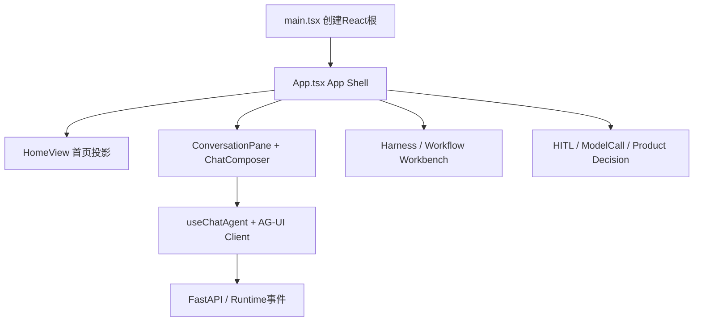

# Home、App Shell与Workbench怎样协作

**归档日期**：2026-07-30  
**分类**：前端交互  
**关联源码**：`frontend/src/main.tsx`、`frontend/src/App.tsx`、`frontend/src/features/home/home-view.tsx`、`frontend/src/features/chat/conversation-pane.tsx`、`frontend/src/harness-workbench.tsx`、`frontend/src/ui-store.ts`

## 问题

浏览器打开Chat后，首页、聊天、工作台、审批页和移动端导航是谁组织的？React组件里的State为什么不能直接
充当Project、Run或Message的权威数据库？

## 1. 一个具体场景

你打开首页，点“继续这个会话”，进入聊天；发送后右侧工作台显示Workflow节点，刷新页面后仍能从后端恢复。
这不是一个超大页面做完所有事，而是App Shell组织多个Feature：



## 2. 要解决的问题

若把Session列表、消息、运行状态、审批和Project全堆入`App.tsx`的State，会有3个后果：页面任一变化都牵动
整棵树；刷新丢权威事实；前端可能与Worker并发结果冲突。当前按Feature和状态责任拆分。

## 3. 一句人话定义

- **App Shell（应用外壳）**：决定当前显示哪个主视图、加载哪些Feature和公共导航；它不是业务数据库。
- **Feature（功能切片）**：围绕一个用户能力组织组件、Hook、DTO和样式，例如`features/home`。
- **Workbench（工作台）**：观察/审核复杂运行对象的界面；不是执行逻辑本身。
- **React State**：当前浏览器渲染所需的内存；刷新可丢，不能授权或提交产品事实。
- **Zustand UI Store**：只保存导航等页面状态；不拥有Product Session或Run。

## 4. 一个具体对象样本

```json
{
  "browser_projection": {
    "primaryView": "chat",
    "workbenchView": "workflow",
    "selectedSessionId": "product-session-id",
    "runtimeConnection": "connected",
    "messages": [{"id": "agui-message-id", "role": "assistant", "content": "..."}]
  },
  "authority": {
    "session/message/run": "backend Product Store",
    "workflow progress": "backend Trace/Runtime events projection"
  }
}
```

`primaryView`是UI选择；`selectedSessionId`只是指向服务端对象的引用；消息列表是投影，不因在React里存在就变成权威。

## 5. 生命周期

| 对象 | 创建/读取 | 更新者 | 持久位置 | 结束 |
|---|---|---|---|---|
| React Root | `main.tsx` | React | 浏览器内存 | 页面关闭 |
| App Shell状态 | `App.tsx`/Hook | 用户导航、API结果 | 浏览器内存 | 刷新后重建 |
| UI Store | `ui-store.ts` | 页面操作 | 浏览器内存 | 页面关闭 |
| Product Session/Message | REST/AG-UI从后端读 | 后端应用服务 | SQLite | 按产品生命周期 |
| Runtime事件投影 | SSE事件＋重放 | Hook/Reducer | 浏览器内存 | 可由Cursor重建 |

## 6. 为什么这样设计

替代方案是“所有数据都放Zustand并写localStorage”。它做Demo很快，但浏览器断线、多个标签页、Worker继续执行
或服务端拒绝提交时会形成双重事实源。当前仅把未发送草稿等交互便利信息留在浏览器；权威对象经REST/AG-UI
回到后端。代价是页面需要加载与错误状态，但换来恢复和审计。

## 7. 代码链

| 顺序 | 源码符号 | 作用 | 下一跳 |
|---:|---|---|---|
| 1 | [`main.tsx`](../../frontend/src/main.tsx) | 找`#root`并渲染React | `App` |
| 2 | [`App`](../../frontend/src/App.tsx) | App Shell、懒加载、视图组合 | Home/Chat/Workbench |
| 3 | [`HomeView`](../../frontend/src/features/home/home-view.tsx) | 消费Home聚合DTO | 用户选择Session/Project |
| 4 | [`ConversationPane`](../../frontend/src/features/chat/conversation-pane.tsx) | 展示后端消息与Run状态 | `ChatComposer` |
| 5 | [`ChatComposer`](../../frontend/src/features/chat/chat-composer.tsx) | 收集本轮输入、取消/重试动作 | `useChatAgent.runAgent` |
| 6 | [`useChatAgent`](../../frontend/src/use-chat-agent.ts) | 建AG-UI请求、消费流事件 | 后端AG-UI入口 |
| 7 | [`replayRuntimeEvents`](../../frontend/src/runtime-event-replay.ts) | 按sequence恢复消息/状态 | React重绘 |
| 8 | [`HarnessWorkbench`](../../frontend/src/harness-workbench.tsx) | 查询Project/Work/Memory投影 | 各Feature API |

`App.tsx`很大不等于一定要机械拆：先看它是否同时拥有业务状态。目前重型页面已用`lazy()`形成真实加载边界；
继续优化应按Feature和变化原因，而不是按行数切碎。

## 8. 亲手验证

1. 在浏览器Sources给`ChatComposer`提交回调、`useChatAgent`和`replayRuntimeEvents`打断点。
2. 输入一句话后观察：Composer只有字符串；Hook生成Thread/Run相关协议字段；后端响应事件后消息才变化。
3. 打开Network，分别识别REST JSON请求和AG-UI流请求。
4. 运行中断网再恢复，观察`useRuntimeReconnect`使用Cursor接回；不要把页面当前消息数组当恢复源。
5. 刷新页面，确认Session/消息通过后端查询恢复，而不是依赖旧React State。

修改一个首页卡片时，先改`home-api.ts`类型/查询消费，再改`home-view.tsx`；若需要新权威事实，必须先回到后端
模块设计，不能只给前端对象加字段。

## 9. 掌握验收

1. App Shell、Feature和Workbench有何区别？
2. 为什么`selectedSessionId`可以在前端，Session内容却不能只在前端？
3. 一个Runtime事件从网络到界面至少经过哪3步？
4. 给Home增加“失败Run数”时，前后端分别应改什么，谁负责定义统计口径？

## 关键文件

| 文件 | 职责 |
|---|---|
| `frontend/src/App.tsx` | 应用外壳、Feature装配、懒加载 |
| `frontend/src/features/home/home-view.tsx` | Home聚合投影的可见界面 |
| `frontend/src/features/chat/*` | 对话显示、输入和断线接回 |
| `frontend/src/use-chat-agent.ts` | AG-UI客户端边界 |
| `frontend/src/ui-store.ts` | 仅页面导航状态 |

## 补充记录

- 2026-07-30：补齐M02/M25的Home、App Shell和复杂Workbench状态边界。
