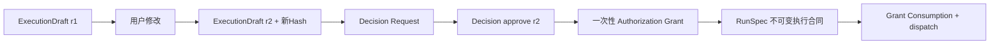

# ExecutionDraft、RunSpec、HITL、Decision与Grant怎样连接

**归档日期**：2026-07-30  
**分类**：协作理解与执行治理  
**关联源码**：`backend/app/governance/models.py`、`backend/app/governance/service.py`、`backend/app/governance/policy.py`、`backend/app/execution_dispatch/`

## 问题

“系统准备做什么”“用户批准了什么”“运行时最终允许做什么”为什么要拆成多个对象？点一次批准后，怎样保证
实际执行的仍是用户看到的那一版？

## 1. 一个具体场景

用户要求：`在隔离Workspace创建hello.txt，内容为hello chat。`

系统先展示ExecutionDraft。用户把验证要求改成“文件内容必须逐字等于hello chat”后再批准。旧草稿和旧批准必须
失效，新RunSpec才能派发：



## 2. 要解决的问题

若“批准”只是前端布尔值，审批后后端仍可换Prompt、工具、路径或模型，用户看见和实际执行就无法证明相同。
若Grant可重复使用，重试可能重复外部副作用。拆对象就是为了绑定版本、Hash、作用域和一次性消费。

## 3. 一句人话定义

- **ExecutionDraft revision**：给人看的完整执行候选；不是已经获准执行的命令。
- **HITL Policy**：Human in the loop（人在回路中）规则，决定自动继续、要求人工或禁止；不是用户的具体决定。
- **Decision Request/Decision**：系统问什么与用户/策略回答什么；二者不可合并成一个状态位。
- **Authorization Grant**：Decision成功后签发、绑定版本和用途的一次性授权票据；不是登录权限。
- **RunSpec**：执行层只能据此运行的不可变合同；不是Plan文本，也不是MAF Workflow Definition。
- **Approval**：泛称时必须说明批准的是ModelCall、ExecutionDraft还是Result Claim，不能跨对象复用。

## 4. 一个具体对象样本

```json
{
  "execution_draft": {"revision": 2, "draft_hash": "sha256:...", "status": "approved"},
  "decision_request": {"subject_kind": "execution_draft_revision", "expected_hash": "sha256:..."},
  "decision": {"decision": "approve", "subject_revision": 2},
  "grant": {"scope": "compile_run_spec", "status": "issued", "single_use": true},
  "run_spec": {"route": "pi_workspace", "repository_fence": {"semantic_hash": "..."}},
  "consumption": {"status": "consumed", "attempt_number": 1}
}
```

Hash由规范化内容计算，不能把`sha256:...`当可人工填写字段。

## 5. 生命周期

| 对象 | 创建者 | Store | 终态/失效 | 消费者 |
|---|---|---|---|---|
| ExecutionDraft revision | Compiler/修订API | Product Store | superseded/approved/rejected | 决策、RunSpec编译 |
| Policy snapshot/evaluation | Governance | Product Store | 本轮固定 | Decision Point |
| Decision Request | Governance | Product Store | pending/resolved/expired | UI、Outbox |
| Decision | 用户/策略 | Product Store | 不可变 | Grant签发 |
| Grant | Governance | Product Store | consumed/revoked/expired | 指定下一步 |
| RunSpec | Compiler | Product Store | 不可变；新需求建新Spec | Execution Route/Worker |

MAF interrupt只承载“这里暂停了”和Resume载荷；Chat的Decision、Grant和RunSpec仍是权威产品事实。

## 6. 为什么这样设计

看似更简单的是一个`approved=true`字段。它无法说明谁批准、批准哪版、允许哪一步、是否已消费。当前链较长，
但能精确回答安全审计和恢复问题。另一方面也不应每个字段都单独审批：Decision Subject把一组具有共同风险和
版本边界的内容作为整体，避免审批疲劳。

## 7. 代码链

| 顺序 | 源码符号 | 关键输入 | 输出/门 |
|---:|---|---|---|
| 1 | `ExecutionDraftCompilerExecutor`（[`continuous_chat.py`](../../backend/app/workflows/continuous_chat.py)） | Intent/Plan/Protocol/Context | Draft revision/hash |
| 2 | `ExecutionGovernanceService`（[`service.py`](../../backend/app/governance/service.py)） | Decision Point＋Subject | Policy evaluation/Request |
| 3 | `ProductDecisionExecutor` | Policy/人工动作 | Decision与可能的新revision |
| 4 | `RunSpecCompilerExecutor` | 当前Draft＋有效Grant | RunSpec |
| 5 | `route_from_run_spec`（[`contracts.py`](../../backend/app/execution_dispatch/contracts.py)） | RunSpec JSON | answer/pi_readonly/pi_workspace |
| 6 | `ExecutionDispatchService`（[`service.py`](../../backend/app/execution_dispatch/service.py)） | RunSpec、Repository fence | 派发或失败关闭 |
| 7 | `AuthorizationConsumptionRecord` | Grant＋用途 | 防重复消费证据 |

## 8. 亲手验证

1. 运行SC07的ExecutionDraft修订测试；记录revision 1/2和两个Hash。
2. 用旧`expected_revision_id`再提交一次，预期CAS冲突且不产生新RunSpec。
3. 第二次批准后查Grant Consumption，确认只消费一次。
4. 把Repository Snapshot改掉再批准旧请求，SC06应在真实外发前失败且Attempt为0。

```bash
.venv/bin/python -m pytest -q \
  backend/tests/test_continuous_chat.py::test_execution_draft_full_edit_creates_new_revision_and_requires_reapproval \
  backend/tests/test_continuous_chat.py::test_repository_source_change_invalidates_old_model_approval_before_attempt
```

## 9. 掌握验收

1. Plan、ExecutionDraft和RunSpec分别面向谁？
2. Policy、Decision和Grant为何不能合并？
3. 修改Draft哪怕只有一个执行字段，旧Approval为何必须失效？
4. Grant一次性消费解决了什么重试风险？
5. MAF interrupt与Chat Decision Request分别拥有哪部分事实？

## 关键文件

| 文件 | 职责 |
|---|---|
| `backend/app/governance/models.py` | Draft、Policy、Decision、Grant、RunSpec和恢复记录 |
| `backend/app/governance/service.py` | 治理用例、Hash与状态转换 |
| `backend/app/governance/policy.py` | 策略匹配，不替用户做业务决定 |
| `backend/app/execution_dispatch/contracts.py` | 从RunSpec解析执行路由与Fence |
| `backend/app/execution_dispatch/service.py` | 派发前安全门和运行协调 |

## 补充记录

- 2026-07-30：补齐M09的执行治理对象链；模型请求自己的revision见Agent专题与SC07。

