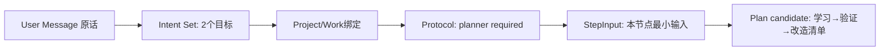

# Intent、澄清、协议、StepInput与Plan怎样连接

**归档日期**：2026-07-30  
**分类**：协作理解与执行治理  
**关联源码**：`backend/app/collaboration_intents/`、`backend/app/collaboration_protocols/`、`backend/app/step_inputs/`、`backend/app/workflows/continuous_chat.py`

## 问题

用户输入一句话后，系统为什么不直接把原文交给最终回答模型？Intent、Clarification、Collaboration Protocol、
StepInput和Plan分别解决什么，数据如何一层层增加？

## 1. 一个具体场景

输入：`先学习Outbox恢复，再把它应用到Chat，但先不要改代码。`

这句话至少包含2个目标、先后依赖和禁止写操作。正确链路是：



若输入是“继续那个”，Intent会请求Clarification，第一轮在提出问题后结束，第二轮新Message再关联旧问题。

## 2. 要解决的问题

直接把原话交给最终模型，模型既要猜目标、猜Project、猜可执行范围，又要回答，任何一次猜错都难定位。
拆层后，系统能让用户分别修正“理解错了”“绑定错了”“计划不合适”，也能在外发前冻结准确输入。

## 3. 一句人话定义

- **Intent revision（意图版本）**：对一个用户目标的候选结构化理解；不是用户原话本身，也不是执行命令。
- **Intent Set**：同一轮一个或多个Intent及其组合策略；不是把多个目标拼成一段Prompt。
- **Clarification Request**：系统缺信息时提出的可跨回合问题；不是审批卡。
- **Collaboration Protocol binding**：本轮允许哪些角色/流程、是否必须Plan等协作规则快照；不是网络协议。
- **StepInput Projection**：某个Workflow节点实际采用输入的可审核投影；不是完整Product Store副本。
- **Task Plan revision**：完成目标的候选步骤；不等于步骤已经执行。

## 4. 一个具体对象样本

来自当前自动合同中的脱敏具体值：

```json
{
  "intent_set": {
    "combination_policy": "sequential",
    "execution_order": ["learn_outbox", "apply_chat"]
  },
  "intents": [
    {"branch_key": "learn_outbox", "needs_plan": true, "constraints": ["先学习，不改代码"]},
    {"branch_key": "apply_chat", "dependency_branch_keys": ["learn_outbox"]}
  ],
  "protocol": {
    "base_execution_policy": {"planner": "enabled"},
    "execution_policy": {"planner": "required_for_intent_set"}
  },
  "plan_text": "1. 学习Outbox领取与重试；2. 验证理解；3. 形成Chat改造清单。"
}
```

这是受控测试数据，不冒充真实Provider输出；它证明结构和不变量，模型措辞可以变化。

## 5. 对象生命周期

| 对象 | 创建 | Store | 修改/结束 | 消费 |
|---|---|---|---|---|
| User Message | 接纳门 | Product Store | 不原地改；新Message | Context选择器 |
| Intent/Set revision | Intent Agent候选→投影服务 | Product Store | 接受、修订、supersede | Router、Planner |
| Clarification | Intent投影 | Product Store | `open→answered` | 下一Interaction |
| Protocol binding | Resolver | Product Store | 绑定本轮有效Hash | Planner/ExecutionDraft |
| StepInput | 每个关键节点前 | Product Store | 不可变revision | 审计、恢复、UI |
| Plan revision | Planner候选→Plan决定 | Product Store | 接受/修订/拒绝 | ExecutionDraft编译 |

MAF负责让消息走过Executor、暂停与恢复；这些领域对象、版本和接受状态由Chat拥有。

## 6. 为什么这样设计

替代方案是“一个大Prompt＋最终一段文字”。它调用少，但用户无法知道是Intent错、Context错还是Plan错，也无法让
低风险确定性查询绕过模型。当前方案增加节点和治理开销，换来可修改、可审计和不同场景的确定性路由。

StepInput也不能只存Checkpoint里的Python对象：Checkpoint版本变化或被清理后，用户仍需解释当时每个节点采用了什么。

## 7. 代码链

| 顺序 | 源码符号 | 输入 | 处理后 |
|---:|---|---|---|
| 1 | `IntakeExecutor.accept`（[`continuous_chat.py`](../../backend/app/workflows/continuous_chat.py)） | User Message | 原话＋待回答Clarification引用 |
| 2 | `GovernedSemanticAgentExecutor` | Context投影 | Intent模型候选 |
| 3 | `IntentSetProjectionExecutor` | 候选JSON | Intent Set/revisions入库 |
| 4 | `IntentSetAcceptanceExecutor` | 当前revision | 接受或要求修订 |
| 5 | `CollaborationIntentService`（[`service.py`](../../backend/app/collaboration_intents/service.py)） | Intent命令 | 生命周期和跨回合关联 |
| 6 | `CollaborationProtocolResolverExecutor` | Intent Set＋绑定 | 有效执行规则 |
| 7 | `StepInputProjectionService`（[`service.py`](../../backend/app/step_inputs/service.py)） | 节点输入摘要 | revision/hash |
| 8 | `ScenarioRouterExecutor` | 公开结构事实 | 4路分支 |
| 9 | Planner Agent＋Plan接受 | Intent/事实/协议 | Plan revision |

## 8. 亲手验证

按SC04受控用例运行：

```bash
.venv/bin/python -m pytest -q \
  backend/tests/test_continuous_chat.py::test_continuous_workflow_preserves_multi_intent_set_through_plan_and_execution_draft
```

断点依次放在`IntakeExecutor.accept`、`IntentSetProjectionExecutor`、`CollaborationProtocolResolverExecutor`、
`ScenarioRouterExecutor`。观察`branch_key`、`execution_order`、`selection_hash`和`StepInput.projection_hash`，
不要只看模型自然语言。随后把输入改成单一简单问题，预期Planner不再因多Intent规则强制启用。

## 9. 掌握验收

1. Intent revision和User Message为何都要保留？
2. Clarification为什么用新Interaction回答，而不是Resume同一审批？
3. 多Intent的依赖放在哪里，Plan又增加了什么？
4. Protocol binding与HTTP/AG-UI协议有何不同？
5. StepInput为什么适合调试但不应成为第二领域数据库？

## 关键文件

| 文件 | 职责 |
|---|---|
| `backend/app/collaboration_intents/models.py` | Intent Set、revision、Clarification记录 |
| `backend/app/collaboration_intents/service.py` | 意图生命周期与跨回合关联 |
| `backend/app/collaboration_protocols/*` | 协作规则定义、绑定与Hash |
| `backend/app/step_inputs/*` | 节点实际输入投影 |
| `backend/app/workflows/continuous_chat.py` | 将上述对象接进主Workflow |

## 补充记录

- 2026-07-30：补齐M08的小白专题；具体分叉实验见SC03、SC04。

