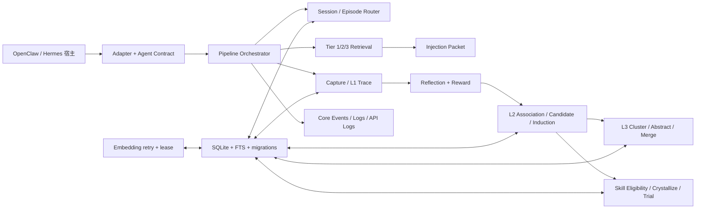
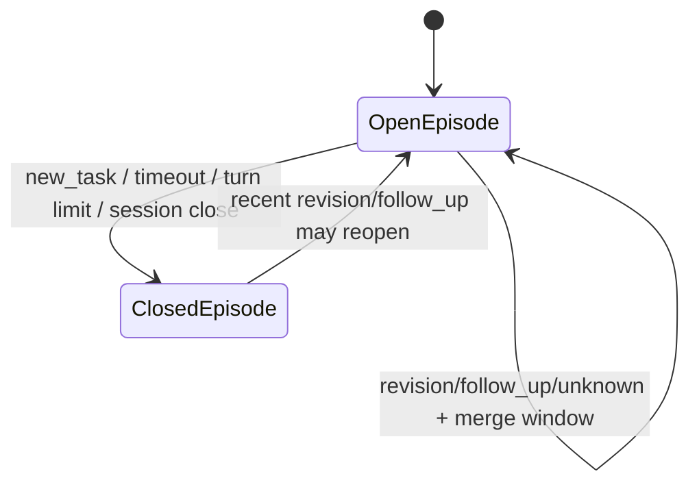
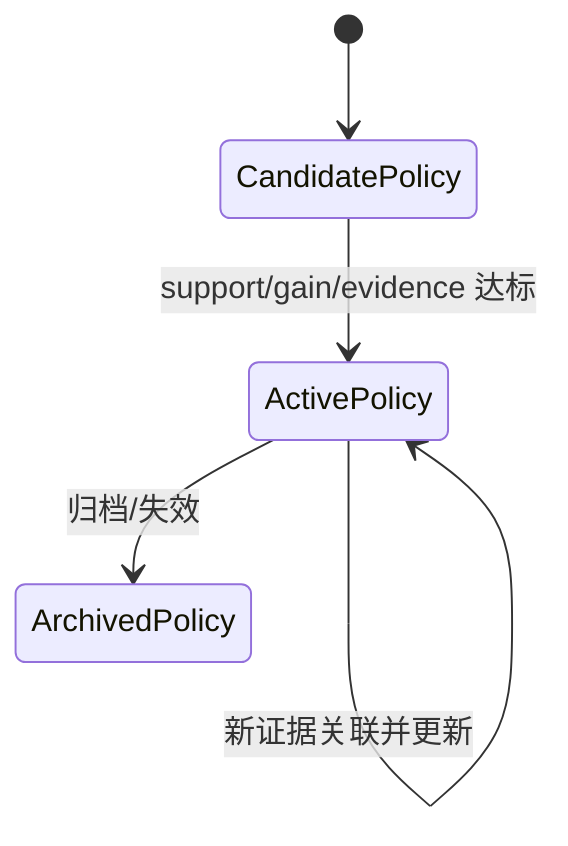
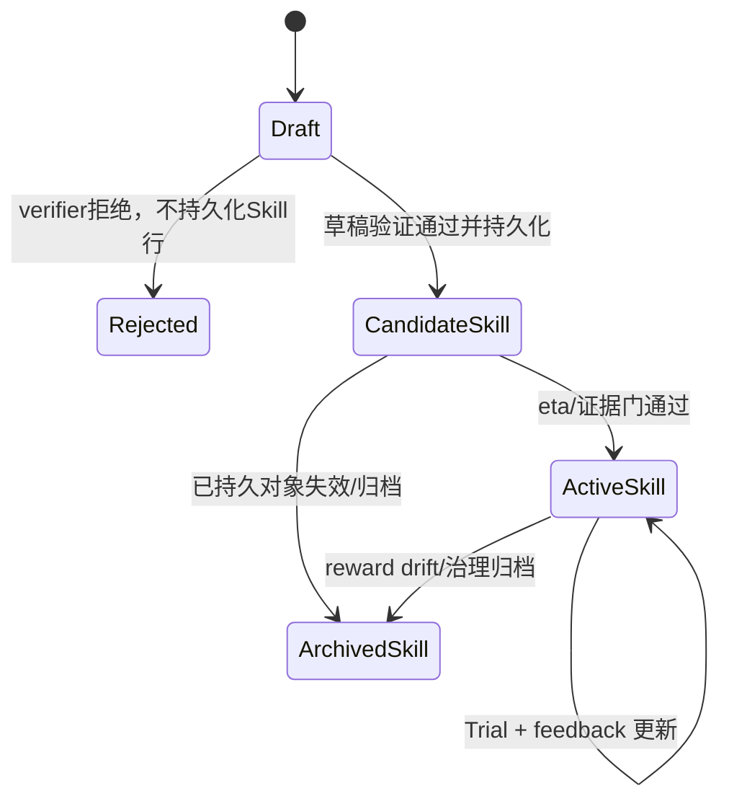

# MemOS 架构与流程

**归档日期**：2026-07-31
**分类**：参考项目研究
**定位**：从C++视角理解MemOS怎样分层记忆、异步处理和召回
**研究状态**：固定提交027dc89，研究于2026-08-01收口，默认只读复用

---

## 0. 这篇文档回答什么

你写过 C++，应该熟悉"把数据存进结构体、用函数处理、再读出来"这种心智模型。MemOS 做的事情本质上一样，只不过它处理的不是一段内存或一个文件，而是一次 Agent 回合的"经验"。

MemOS 的核心问题是：Agent 每次回答用户之后，怎样把"这次发生了什么"变成"下次可以复用的经验"，并在下一轮回答时自动召回？

用一个具体场景贯穿：**用户问 Agent "帮我写一个能处理 n<0 的 Fibonacci 函数"，Agent 写了代码并调用工具测试**。这轮对话结束后，MemOS 要把这轮经验存下来、归纳成规则、在下次类似问题时自动注入。每出现一个概念就解释，用 C++ 类比。

阅读前先记住一个核心切分：

| 切分 | Local v2（TypeScript，已验证） | Python 主线（另一套合同） |
|---|---|---|
| 运行在哪里 | OpenClaw/Hermes 宿主进程内 | 独立 Python 进程（FastAPI/SDK/MCP） |
| 语言 | TypeScript | Python |
| 入口 | `onTurnStart` / `onTurnEnd` 回调 | `MOS.add()` / `MOS.search()` / `POST /add` |
| 输出 | Episode、Trace、L2/L3/Skill、InjectionPacket | Memory Item、SearchResult、Chat 字符串 |
| 恢复 | SQLite migration + lease/retry | Scheduler 队列（但幂等不足） |
| 定位 | Agent 生命周期插件 | Memory 服务/API |

**判断"哪条线"的方法**：看入口。调 `onTurnStart` 的是 Local v2；调 `MOS.search()` 或 `POST /product/search` 的是 Python 主线。不能把 Local v2 的能力外推给 Python，也不能反过来。

---

## 1. 一句话讲透 MemOS

MemOS 不是"把聊天记录存进向量库"。它做的是一条完整的经验学习链：

```text
宿主回合开始
-> 检索历史经验（分层召回）
-> 把命中结果注入当前 Prompt
-> Agent 执行（MemOS 不关心这一步）
-> 回合结束，先把原始事实落库
-> 异步处理：反思、打分、归纳规则、抽象环境模型、结晶技能
-> 下一轮再分层召回，并用反馈持续纠错
```

用 C++ 类比：你写过一个游戏 AI，每局结束后把操作录像存成 Replay（L1 Trace），然后从多局 Replay 中总结出"遇到这种情况应该怎么做"的战术手册（L2 Policy），再从战术手册中抽象出"这个地图的敌人通常怎么走"的环境认知（L3 World Model），最后把验证过的战术变成可一键执行的宏操作（Skill）。下一局开始时，AI 先翻手册、再看地图认知、再决定是否用宏操作。

核心效果来自"具体经历 -> 经验规则 -> 环境模型 -> 可执行技能 -> 再次使用 -> 反馈"的闭环，**不来自保存聊天文件本身**。

---

## 1.5 先看一个真实例子：同一条链在代码里实际走过一遍

下面所有数字都来自固定提交 `027dc89` 的隔离副本定向 E2E（`tests/e2e/v7-full-chain.e2e.test.ts`，最终自包含 provenance 复跑 1/1 通过，约 1.10 秒）。测试在同一个 `s-py-e2e` Session 里依次模拟 4 个主题：

1. 写 Fibonacci，追问测试、修正 n<0 边界，最后“换个话题”；
2. 写快速排序，追问二分查找，最后“换个话题”；
3. 写 LRU cache，追问计数器，最后“换个话题”；
4. 运行 pytest（包含失败 Tool 过程）。

终态是：**1 个 Session、4 个 closed Episode、12 条 L1 Trace、1 条 active L2 Policy、1 个 L3 World Model、1 个 active Skill、97 个事件**。

### 贯穿表：每个概念在例子里的具体样子

| 概念/层 | 例子里的真实值 | 处理它的模块 | 源码文件 |
|---|---|---|---|
| Session | 逻辑会话 `s-py-e2e`；close 后移出 live map，但持久 SessionRow 没有 closed status | Session Manager | `core/session/manager.ts` |
| Episode | 第 1 个 Episode 装 Fibonacci 的追问/修正；“换个话题”判 `new_task` 关闭它 | Episode Manager/Relation | `core/session/episode-manager.ts`、`core/session/relation-classifier.ts` |
| L1 Trace | `summary="斐波那契函数实现（Python 递归/迭代）"`、`reflection="识别 n<0 边界…"`、`alpha=0.5`、`tags=[python]`；同一回合多 step 共用 turnId | Capture | `core/capture/capture.ts`、`core/capture/alpha-scorer.ts`、`core/capture/reflection-extractor.ts` |
| Reward | 4 个 Episode 的 `rTask = 0.47 / 0.74 / 0.74 / -0.365`，回传更新 Trace.value；负 Episode 的 4 条 value 为负 | Reward | `core/reward/reward.ts`、`core/reward/backprop.ts` |
| L2 Policy | `title="程序函数脚手架生成"`、`status=active`、`support=10`、`gain≈0.230`、来源为 3 个正 Episode | L2 | `core/memory/l2/associate.ts`、`core/memory/l2/induce.ts`、`core/memory/l2/gain.ts` |
| L3 World Model | `Python 开发辅助环境认知`，引用该 Policy | L3 | `core/memory/l3/cluster.ts`、`core/memory/l3/abstract.ts`、`core/memory/l3/merge.ts` |
| Skill | `python_function_scaffold`，`eta≈0.537`；曾有一次因 `resonance-low=0.2` 被拒，后来才 crystallized + auto_promoted | Skill | `core/skill/crystallize.ts`、`core/skill/eligibility.ts`、`core/skill/lifecycle.ts` |
| 下一轮召回 | 下一轮 `onTurnStart` 的 `hits[]/injectedContext` 才可能包含上述资产 | Retrieval/Injection | `core/retrieval/retrieve.ts`、`core/retrieval/tier1-skill.ts`、`core/injection/scheduler.ts` |

关键反例：**负奖励的 Fibonacci Episode 没有进入 Policy 的 `sourceEpisodeIds`**。这说明测试链真的执行了正负证据门，不是把所有历史无条件聚合。

### 用第 1 个主题跟一遍 5 步

```text
输入：onTurnStart(agent=openclaw, sessionId=s-py-e2e, turnKey=turn-1,
      userText="帮我写一个能处理n<0的Fibonacci函数", ts=1750000001000)
第①步：Orchestrator 开 Episode(ep-1)；初次无历史 → 日志 retrieval.empty、
      hits=[], injectedContext=空，但返回真实 resolved episodeId
第②步：Agent 执行（MemOS 不参与）
第③步：onTurnEnd 追加 Tool Turn + Assistant Turn，lite capture 写 1 条 L1 Trace
第④步：同主题追问继续 ep-1；"换个话题" → new_task 关闭 ep-1，
      完整 reflection + reward(0.47) 回传 Trace.value
第⑤步：3 个正 Episode 足够后，L2 归纳出 active Policy，
      L3 抽象出 World Model，Skill 验证后 auto-promote
```

注意第④步的 Reward 在定向 E2E 中由测试显式 `rewardRunner.run(trigger="manual")` 触发（为确定性把 `feedbackWindowSec=0`）；它证明“主题关闭+反思+Reward+L2/L3/Skill 链”本身，不证明生产 feedback-window 调度在例子中自动触发。

---

## 2. 分层记忆模型：5 层对象

MemOS 把"经验"分成 5 个不同生命周期的层。C++ 程序员可以这样理解：这不是 5 个同类对象，而是 5 个不同的 `struct`，各有各的字段、创建时机和消费者。

### 2.1 Episode（主题回合组）

**是什么**：把连续的多轮对话按"主题"聚合成一个单元。同一个 Episode 里的回合属于同一个任务。

C++ 类比：

```cpp
struct Episode {
    std::string id;
    std::string sessionId;
    EpisodeStatus status;           // open | closed
    int64_t startedAt;
    int64_t endedAt;
    std::vector<std::string> traceIds;  // 指向属于这个 Episode 的 L1 Trace
    float rTask;                     // 这个主题的任务评分
    std::string intent;              // 意图分类
    json meta;
};
```

**关键规则**：默认 `followUpMode=merge_follow_ups`。如果分类器判断当前输入是 `revision`（修正上一轮）、`follow_up`（追问）或 `unknown`，且在时间窗内，就继续写同一个 Episode；如果是 `new_task`（新主题）、超时或达到回合上限，就关闭旧 Episode 并开新的。

**它不是什么**：Episode 不是用户确认的工作任务。它是模型/规则派生的主题理解，可能误判。

### 2.2 L1 Trace（过程轨迹）

**是什么**：一轮对话中"实际发生了什么"的原始记录。包含用户输入、Agent 回复、工具调用、摘要、反思和价值评分。

C++ 类比：

```cpp
struct TraceRow {
    // 来源定位
    std::string episodeId;
    std::string sessionId;
    std::string turnId;
    int64_t ts;

    // 已观察的输入输出
    std::string userText;
    std::string agentText;
    std::vector<ToolCall> toolCalls;
    std::string agentThinking;       // LLM 原生思考（MemOS 自己的 reflection 分开存）

    // 派生属性
    std::string summary;             // 记忆摘要
    std::string reflection;          // MemOS 的事后反思（与 summary 不同）
    float value;                     // 任务价值
    float alpha;                     // 反思权重
    float rHuman;                    // 人类反馈奖励
    int priority;                    // 召回优先度

    // 检索投影
    std::vector<float> vecSummary;   // 摘要的 embedding
    std::vector<float> vecAction;    // 动作的 embedding

    // 标签与错误签名
    std::vector<std::string> tags;
    std::vector<std::string> errorSignatures;
};
```

**创建时机**：`onTurnEnd` 时先做"lite capture"（轻量捕获），立即形成本轮 L1 Trace。主题关闭后再补完整 reflection 和 reward。

**失败语义**：capture 失败只记 warning，本轮 Turn 材料仍在。但注意一个坑：如果本轮 capture 失败且该 Episode 已有旧 Trace，`onTurnEnd` 返回的 `traceId` 可能是上一轮的旧 ID，不是本轮的。

### 2.3 L2 Policy（经验规则）

**是什么**：从多条 L1 Trace 中归纳出的"以后遇到什么条件，应该怎样做"。

C++ 类比：

```cpp
struct L2Policy {
    std::string title;
    std::string trigger;             // 触发条件
    std::string procedure;           // 应该怎么做
    std::string verification;        // 怎么验证做对了
    std::string boundary;            // 适用边界

    // 质量度量
    float support;                   // 支持数（多少条 Trace 支持）
    float gain;                      // 收益
    PolicyStatus status;             // candidate | active | archived
    float confidence;

    // 来源血缘
    std::vector<std::string> sourceEpisodeIds;
    std::vector<std::string> sourceTraceIds;
    std::vector<std::string> sourceFeedbackIds;

    // 决策指导
    struct {
        std::string preference;
        std::string antiPattern;
    } decisionGuidance;

    bool skillEligible;              // 是否可以结晶成 Skill
    std::vector<float> vec;          // 检索投影
};
```

**核心不是生成一段总结**，而是保留支持数、收益、正负证据、来源 Episode/Trace 和生命周期状态。失败型经验可以召回，但 `skillEligible=false` 时不能结晶成成功 Skill。

**状态机**：

```text
Candidate -> Active（support/gain/evidence 达标）-> Archived（归档/失效）
```

### 2.4 L3 World Model（环境认知）

**是什么**：从多条相关 Policy 中抽象出的"环境是什么、怎样响应、有哪些约束"。

C++ 类比：

```cpp
struct L3WorldModel {
    struct {
        std::vector<std::string> environment;   // 环境结构
        std::vector<std::string> inference;     // 推断规则
        std::vector<std::string> constraints;   // 约束条件
    } structure;

    std::string body;
    std::vector<std::string> domainTags;
    float confidence;

    std::vector<std::string> policyIds;        // 来源 Policy
    std::vector<std::string> sourceEpisodeIds;
    std::string inducedBy;                      // 归纳方式

    int version;
    WorldModelStatus status;
    int64_t archivedAt;
};
```

**为什么和 L2 分开**：避免"怎么做"（Policy）与"世界事实"（World Model）互相污染。代价是冷启动时可能长期稀疏——至少需要足够多的 Policy 才有抽象价值。

### 2.5 Skill（可执行技能）

**是什么**：从验证过的 Policy/World Model 中结晶出的可调用流程，带试用质量记录。

C++ 类比：

```cpp
struct Skill {
    std::string name;
    SkillStatus status;              // draft | candidate | active | archived
    std::string invocationGuide;
    json procedureJson;              // 可执行步骤
    float eta;                       // 期望质量
    float support;
    float gain;
    int trialsAttempted;
    int trialsPassed;
    std::vector<std::string> sourcePolicyIds;
    std::vector<std::string> sourceWorldModelIds;
    std::vector<std::string> evidenceAnchors;
    int version;
};

struct Trial {
    std::string sessionId;
    std::string episodeId;
    std::string traceId;
    std::string turnId;
    std::string toolCallId;
    TrialStatus status;
    json evidence;
};
```

**关键点**：`eta`、Trial 和证据锚点使 Skill 不是只生成一次的 Markdown；使用后可以根据结果更新可靠度。但"可召回 Skill"仍不等于已授权 Tool，也不等于 Workflow 已恢复。

**状态机**：

```text
Draft -> Rejected（verifier 拒绝，不持久化 Skill 行）
Draft -> CandidateSkill（验证通过并持久化）
CandidateSkill -> ActiveSkill（eta/证据门通过）
ActiveSkill -> ArchivedSkill（reward drift 或治理归档）
```

### 5 层关系图

```text
┌─────────────────────────────────────────────────────┐
│                    Episode                           │
│  "写 Fibonacci 函数"这个主题的回合组                 │
│  ┌───────────┐ ┌───────────┐ ┌───────────┐          │
│  │ L1 Trace  │ │ L1 Trace  │ │ L1 Trace  │          │
│  │ 第1轮     │ │ 第2轮     │ │ 第3轮     │          │
│  │ 用户问了  │ │ Agent 写  │ │ 测试失败  │          │
│  │ 什么      │ │ 了什么    │ │ 了        │          │
│  └─────┬─────┘ └─────┬─────┘ └─────┬─────┘          │
│        └─────────────┼─────────────┘                 │
│                      ▼                               │
│              ┌──────────────┐                        │
│              │ L2 Policy    │                        │
│              │ "处理边界条件 │                        │
│              │  时先写测试" │                        │
│              └───────┬──────┘                        │
│                      ▼                               │
│              ┌──────────────┐                        │
│              │ L3 WorldModel│                        │
│              │ "Python函数 │                        │
│              │  的边界检查  │                        │
│              │  约束"      │                        │
│              └───────┬──────┘                        │
│                      ▼                               │
│              ┌──────────────┐                        │
│              │ Skill        │                        │
│              │ "写函数+测试 │                        │
│              │  的标准流程" │                        │
│              └──────────────┘                        │
└─────────────────────────────────────────────────────┘
```

---

## 3. 5 步处理链路

这是 MemOS Local v2 的核心运行链路。用一个完整回合来贯穿。

### 第 ① 步：回合开始 `onTurnStart`

**输入**：宿主 Adapter 把当前用户文本、时间戳和范围信息交给 MemOS。

**做了什么**：

1. 规范 namespace（补充 owner 信息）
2. 确保或恢复 Session
3. 用上一轮主题、时间窗和当前 `userText` 分类 relation（`revision`/`follow_up`/`new_task`）
4. 继续/重开/关闭旧 Episode 并建立本轮 Episode
5. 判断检索场景，决定 Tier 1/2/3 是否启用
6. 执行向量/FTS/pattern/error signature 候选检索
7. 排序：RRF 融合、MMR 去重、阈值过滤、LLM filter 可进一步丢弃候选
8. 生成 InjectionPacket
9. 写 retrieval 事件和 API Log

**输出**：`RetrievalResultDTO`（下一节详细讲）。

**关键失败语义**：Orchestrator 的 local retrieval `try/catch` 失败时会记录 `turn.retrieval_failed` 并返回带 resolved `sessionId/episodeId` 的空 Packet，让 Agent 仍可工作。**不是伪造命中**。但 Hub search、final filter、`ensureSession` 或关系路由失败时公开调用仍会抛错。

用 C++ 类比这一步：

```cpp
// 伪代码：onTurnStart 的骨架
RetrievalResultDTO onTurnStart(TurnInputDTO input) {
    normalizeNamespace(input);
    ensureSession(input.sessionId);
    RelationType relation = classifyRelation(
        lastEpisode, input.userText, timeWindow
    );
    Episode ep = openEpisodeIfNeeded(relation);

    // 三层检索
    auto candidates = retrieve(
        Tier::Vector,   // Tier 1
        Tier::FTS,      // Tier 2
        Tier::Pattern,  // Tier 3
        input.userText, ep
    );

    // 排序过滤
    auto ranked = fuseAndFilter(candidates);  // RRF + MMR + 阈值 + LLM filter

    InjectionPacket packet = buildInjectionPacket(ranked);
    writeRetrievalEvent(packet);

    return toRetrievalResultDTO(packet);
}
```

### 第 ② 步：Agent 执行（外部）

**MemOS 在这一步什么也不做**。Agent（不管是 OpenClaw、Hermes 还是其他宿主）拿 MemOS 返回的 `injectedContext` 塞进 Prompt，自己调模型、调工具，产生回复。

这是 MemOS 设计的关键边界：**MemOS 是宿主的插件，不是宿主本身**。它只在回合开始时提供上下文，在回合结束时收集结果。

### 第 ③ 步：回合结束 `onTurnEnd`

**输入**：宿主把 Agent 的回复、工具调用、思考过程交给 MemOS。

**做了什么**：

1. 校验/恢复 Session 与 Episode；延迟到达的 `agent_end` 可重开刚关闭的 Episode
2. 按时间顺序追加 Tool Turn，再追加 Assistant Turn
3. 保存 Tool input/output/error 和 LLM 原生 thinking；MemOS 自己的 reflection 与会话 thinking 分开
4. 对当前 Episode 执行 lite capture，立即形成本轮 L1 Trace
5. Episode 通常保持 open，等下一轮 `new_task`、idle、session_end 或 shutdown 再完成完整 reflection/reward

**输出**：公开 `MemoryCore` 只返回 `traceId` 和 `episodeId`。

**重要的坑**：`traceId` 优先取本轮 `outcome.traceIds` 最后一项；若本轮为空则回退 Episode 快照最后一项。所以**调用成功不等于已经产生 Policy/World/Skill**，也不保证 `traceId` 属于本轮。

用 C++ 类比：

```cpp
// 伪代码：onTurnEnd 的骨架
TurnEndResult onTurnEnd(TurnResultDTO input) {
    validateSession(input.sessionId);
    Episode ep = recoverEpisode(input.episodeId);

    // 按顺序追加 Turn
    for (auto& tc : input.toolCalls) {
        ep.appendToolTurn(tc);
    }
    ep.appendAssistantTurn(input.agentText);

    // 轻量捕获 L1
    TraceRow trace;
    try {
        trace = liteCapture(ep, input);
        persist(trace);
    } catch (...) {
        logWarning("capture failed");
        // 不改伪成功，Turn 材料仍在
    }

    // Episode 保持 open
    // 完整 reflection/reward 留到主题关闭后异步做
    return { .traceId = trace.id, .episodeId = ep.id };
}
```

### 第 ④ 步：异步处理（主题关闭后）

**触发**：`new_task`、idle timeout、session close、shutdown 或显式 close。Reward 还可带 Feedback。

**输入**：已关闭 Episode 及其 `turns/traceIds/meta`。

**处理链**：

```text
Episode finalized
-> full reflection / alpha scoring
-> Reward 计算 rTask 并回传 Trace.value
-> L2 association / candidate / induction
-> L3 cluster / abstract / merge
-> Skill eligibility / crystallize / verify / promote
-> Embedding / 索引更新与事件发布
```

**关键规则**：

- Skill verifier 拒绝发生在持久化前，不产生一条 archived Skill
- 负向 Episode 可形成 avoidance/repair 经验，但不能成为正向 Skill 证据
- 失败只关闭当前 Job/Attempt；更早的 RawTurn、L1 和旧 Policy 不会被回滚

**输出**：更新后的 Episode `rTask/rewardDetail/status`、Trace `reflection/alpha/value/rHuman/priority`、0..n 条 Policy/World Model/Skill/Trial、各种事件和 Embedding retry 状态。

用 C++ 类比：这像你有一个后台线程，在游戏一局结束后把 Replay 送去分析引擎，分析引擎输出战术手册更新、地图认知更新和宏操作候选。前台游戏不等待这个后台线程。

### 第 ⑤ 步：下一轮召回

**做了什么**：

1. `turn_start` 先做 intent 与 relation 路由，决定是否启用 Tier 1/2/3
2. Tier 1 主要找高价值 Skill/近似经验
3. Tier 2 找 Trace、Episode rollup 和 L2 Experience
4. Tier 3 找 World Model
5. 候选来自 vector、FTS、pattern、structural error signature 等通道
6. Ranker 做融合、去重、多样性与阈值
7. LLM filter 可进一步丢弃候选
8. Injector 生成带 `refKind/refId` 的 snippet 清单和面向模型的 rendered 文本
9. 新回合完成后，命中对象与结果反馈又可用于更新 Policy/Skill

**效果来自**："主题聚合 + 细粒度信用分配 + 多层经验 + 多通道检索 + 反馈闭环"，**不是只来自 embedding 相似度**。

---

## 4. 完整链路图

```text
[宿主 Agent]
    │
    │ ① onTurnStart
    │    输入: agent, sessionId, userText, ts, namespace?, turnKey?
    │    │
    │    ├─ 规范 namespace + ensureSession
    │    ├─ relation 分类 (revision/follow_up/new_task)
    │    ├─ Episode 路由 (继续/重开/关闭旧+开新)
    │    ├─ Tier 1/2/3 检索 (vector/FTS/pattern)
    │    ├─ 排序过滤 (RRF/MMR/阈值/LLM filter)
    │    └─ 生成 InjectionPacket
    │    │
    │    ▼
    │    输出: RetrievalResultDTO
    │      .hits[]          ← 命中的经验/Skill/WorldModel
    │      .injectedContext  ← 已排序去重后供 Prompt 注入的文本
    │      .episodeId        ← 本轮 Episode ID
    │
    │ ② Agent 执行（MemOS 不参与）
    │    Agent 把 injectedContext 塞进 Prompt
    │    调模型、调工具、产生回复
    │
    │ ③ onTurnEnd
    │    输入: agent, sessionId, episodeId, agentText, toolCalls[], ts
    │    │
    │    ├─ 校验 Session/Episode
    │    ├─ 按顺序追加 Tool Turn + Assistant Turn
    │    ├─ lite capture -> L1 Trace (同步)
    │    └─ Episode 保持 open
    │    │
    │    ▼
    │    输出: traceId + episodeId
    │
    │ ④ 异步处理（主题关闭后触发）
    │    │
    │    ├─ full reflection + alpha scoring
    │    ├─ Reward 计算 rTask -> 回传 Trace.value
    │    ├─ L2 association/candidate/induction
    │    ├─ L3 cluster/abstract/merge
    │    ├─ Skill eligibility/crystallize/verify/promote
    │    └─ Embedding/索引更新
    │    │
    │    ▼
    │    输出: 更新后的 Trace/Policy/WorldModel/Skill
    │
    │ ⑤ 下一轮 onTurnStart
    │    新 userText 进来
    │    分层检索从已更新的 L1/L2/L3/Skill 中召回
    │    反馈继续校准经验可靠度
    │
    ▼
[循环]
```

---

## 5. 核心数据结构（用 C++ struct 类比）

MemOS 的数据结构分两层：**宿主可见的 DTO**（通过 Agent Contract 暴露）和**内部对象**（SQLite 行）。

### 5.1 TurnInputDTO（回合开始输入）

宿主调 `onTurnStart` 时传给 MemOS 的数据。

C++ 类比：

```cpp
struct TurnInputDTO {
    std::string agent;         // 必填：宿主类型，如 "openclaw"/"hermes"
    std::string sessionId;     // 必填：逻辑会话 ID
    std::string userText;      // 必填：本轮用户原文
    int64_t ts;                // 必填：回合开始毫秒时间

    // 可选
    Namespace namespace;       // profile/workspace/sessionKey 范围
    std::string turnKey;       // 幂等键：每 Session 只缓存最近一项
    std::string episodeId;     // 续接提示（但固定提交未消费此字段！）
    json contextHints;         // 工作目录、角色等宿主提示
};
```

**重要的坑**：`episodeId` 在 DTO 里声明了，但固定提交的 `onTurnStart` 没有读取它。调用方不能靠这个字段指定 Episode。`turnKey` 也不是完整幂等——每个 Session 只保存最近一个 entry，进程重启后失效。

### 5.2 RetrievalResultDTO（回合开始输出）

`onTurnStart` 返回给宿主的结果。

C++ 类比：

```cpp
struct RetrievalResultDTO {
    RetrievalQuery query;           // agent/namespace/sessionId/episodeId/query

    std::vector<RetrievalHit> hits;  // 命中列表
    std::string injectedContext;     // 已排序去重过滤后供 Prompt 注入的文本

    TierLatency tierLatencyMs;       // tier1/tier2/tier3 各层耗时
};

struct RetrievalHit {
    int tier;                       // 来自哪层检索
    std::string refId;              // 命中对象 ID
    std::string refKind;            // 命中对象类型 (trace/policy/worldmodel/skill)
    float score;                    // 相关性分数
    std::string snippet;            // 命中内容片段
    OwnerInfo owner;                // 归属信息
    ShareInfo share;                // 分享范围
};

struct TierLatency {
    int64_t tier1;                  // 向量检索耗时
    int64_t tier2;                  // FTS 检索耗时
    int64_t tier3;                  // 模式/结构检索耗时
};
```

### 5.3 InjectionPacket（内部注入包）

Orchestrator 内部生成、不直接暴露给宿主。宿主真正消费的是 `RetrievalResultDTO.injectedContext`。

C++ 类比：

```cpp
struct InjectionPacket {
    std::string packetId;
    std::vector<InjectionSnippet> snippets;  // 注入片段列表
    std::vector<std::string> droppedByLlm;    // 被 LLM filter 丢弃的候选
    std::string reason;                       // 注入策略说明
    std::string rendered;                     // 面向模型的渲染文本
    int64_t ts;
};

struct InjectionSnippet {
    std::string refKind;    // trace/policy/worldmodel/skill
    std::string refId;      // 来源对象 ID
    float score;            // 排序分数
    std::string content;    // 实际注入文本
};
```

**设计细节**：正文刻意不暴露嘈杂的 `refId` footer——用户看到的 `injectedContext` 是干净的文本，但 `InjectionPacket` 内部和 API Log 里保留了完整来源引用。

### 5.4 TurnResultDTO（回合结束输入）

宿主调 `onTurnEnd` 时传给 MemOS 的数据。

C++ 类比：

```cpp
struct TurnResultDTO {
    std::string agent;
    std::string sessionId;
    std::string episodeId;        // 必须来自本轮 onTurnStart 的 resolved 结果
    std::string agentText;        // Agent 回复
    std::vector<ToolCallRecord> toolCalls;
    int64_t ts;

    // 可选
    Namespace namespace;
    std::string agentThinking;    // LLM 原生思考
    json contextHints;
    std::string reflection;       // 宿主自己的反思（与 MemOS 的 reflection 分开）
};

struct ToolCallRecord {
    std::string name;
    json input;
    std::optional<json> output;
    std::optional<std::string> errorCode;
    std::optional<std::string> toolCallId;
    std::optional<int64_t> startedAt;
    std::optional<int64_t> endedAt;
    std::optional<std::string> thinkingBefore;
    std::optional<std::string> assistantTextBefore;
};
```

### 5.5 所有对象共同的隔离字段

C++ 类比：

```cpp
struct OwnedRow {
    std::string ownerAgentKind;      // 宿主类型
    std::string ownerProfileId;      // Profile
    std::string ownerWorkspaceId;    // Workspace
};

struct ShareInfo {
    std::string scope;
    std::string target;
    int64_t sharedAt;
};
```

这些字段说明数据属于哪个宿主/Profile/Workspace。**它们不是 Chat Identity Principal，也不能替代服务端授权**。

---

## 6. 检索的三层 Tier

MemOS 的检索不是只做向量相似度。它有 3 层 Tier，各自从不同角度找候选。

| Tier | 检索方式 | 主要找什么 | C++ 类比 |
|---|---|---|---|
| Tier 1 | 向量检索（embedding 相似度） | 高价值 Skill、近似经验（L2 Policy） | 用 cosine similarity 比较两个 `std::vector<float>` |
| Tier 2 | 全文检索（FTS） | Trace、Episode rollup、L2 Experience | 用倒排索引做 `LIKE` 或 `MATCH` 查询 |
| Tier 3 | 模式/结构检索 | World Model、error signature 匹配 | 用正则或结构化 pattern 匹配字段 |

### 6.1 Tier 1：向量检索

把 `userText` 转成 embedding 向量，在已有 Trace/Policy/Skill 的 `vecSummary`/`vecAction`/`vec` 字段中找最相似的。

C++ 类比：

```cpp
// 伪代码
std::vector<float> queryVec = embedder.embed(userText);
auto candidates = vectorIndex.search(queryVec, topK=10);
// 返回 score 最高的 N 个候选
```

**主要找**：高价值 Skill、近似经验。

### 6.2 Tier 2：全文检索（FTS）

用 SQLite FTS（全文搜索索引）在 Trace 的 `summary`/`userText`/`agentText` 和 Episode rollup 中做关键词匹配。

C++ 类比：

```cpp
// 伪代码：类似用倒排索引做全文搜索
auto candidates = ftsIndex.search(userText, topK=10);
// 返回包含关键词的候选
```

**主要找**：Trace、Episode rollup、L2 Experience。

### 6.3 Tier 3：模式/结构检索

用 `errorSignatures`、`tags`、`intent` 等结构化字段做 pattern 匹配。

C++ 类比：

```cpp
// 伪代码：用结构化条件过滤
auto candidates = patternIndex.match(
    errorSignature=currentError,
    tags=extractTags(userText),
    intent=classifiedIntent
);
```

**主要找**：World Model、特定错误模式的已知解法。

### 6.4 融合与过滤

三层各自返回候选后，不是简单拼接。经过一系列处理：

```text
Tier 1 候选 ─┐
Tier 2 候选 ─┼─> RRF 融合排序 ─> MMR 去重 ─> 阈值过滤 ─> LLM filter ─> 最终注入
Tier 3 候选 ─┘
```

- **RRF（Reciprocal Rank Fusion）**：把多路检索结果按排名倒数融合，让被多路同时命中的候选排前面。
- **MMR（Maximal Marginal Relevance）**：在相关性和多样性之间平衡，避免返回 N 个几乎一样的结果。
- **LLM filter**：可选地用 LLM 做最后一次过滤，丢弃不相关的候选。

---

## 7. 两种实现：Local v2 vs Python 主线

MemOS 仓库里不是一套代码，而是至少 4 条产品线。最需要区分的是 Local v2（TypeScript，已验证）和 Python 主线（另一套合同）。

### 7.1 Local v2（TypeScript，已验证）

**位置**：`apps/memos-local-plugin/`

**架构**：

```text
Agent Host (OpenClaw 或 Hermes)
-> adapters/openclaw 或 adapters/hermes
-> agent-contract（DTO/Error/JSON-RPC）
-> core/pipeline/MemoryCore façade
-> session/capture/reward/L1/L2/L3/skill/retrieval
-> storage/model/logger/config
-> server + viewer（可观察面）
```

**入口**：`onTurnStart` / `onTurnEnd` / `openSession` / `closeSession` / `feedback` / `recordToolOutcome` / `search`

**输出**：Episode、Trace、L2 Policy、L3 World Model、Skill/Trial、InjectionPacket

**恢复**：SQLite migration + Repository + Embedding retry/lease

**测试证据**：153 个测试文件，`1225 passed / 2 skipped`；完整管理链定向 E2E 为 `1/1`。最终样本为 4 个 closed Episode、12 条 L1 Trace、1 条 active L2 Policy、1 个 L3 World Model、1 个 active Skill 和 97 个事件。

### 7.2 Python 主线（另一套合同）

**位置**：`src/memos/`

**入口**：`MOS.add()` / `MOS.search()` / `MOS.chat()` / `POST /add` / `POST /search` / `POST /chat/complete`

**核心对象**：`TextualMemoryItem`、`MemCube`、`NaiveMemCube`、`SimpleTreeTextMemory`

**架构**：

```text
FastAPI / CLI / MCP
-> server_router -> handlers.init_server()
-> Factory 创建 Graph/LLM/Embedder/Reader/Reranker
-> 组装 SimpleTreeTextMemory + NaiveMemCube + Feedback + Scheduler
-> HandlerDependencies
-> Search/Add/Chat/Feedback/Cube handlers
```

**主要区别**：Python 主线更像"Memory 服务/API"——输入通常是显式消息、查询和 Cube 作用域，处理侧负责提取、索引、召回和 LLM 拼装，输出是 Memory 结果或聊天文本。Local v2 更像"Agent 生命周期插件"——输入是回合开始/结束事件，输出还包括 Episode、Trace、深化资产和下一轮注入。

### 7.3 对照表

| 维度 | Local v2（TypeScript） | Python 主线 |
|---|---|---|
| 入口 | `onTurnStart`/`onTurnEnd` | `MOS.add()`/`MOS.search()`/`POST /add` |
| 输入 | 回合开始/结束事件 | 显式消息、查询、Cube 作用域 |
| 输出 | Episode/Trace/L2/L3/Skill/InjectionPacket | Memory Item/SearchResult/Chat 字符串 |
| 定位 | Agent 生命周期插件 | Memory 服务/API |
| 存储 | 单机 SQLite + FTS + migration | Neo4j/Qdrant/SQLite/Redis/RabbitMQ |
| 恢复 | SQLite migration + lease/retry（有测试） | Scheduler 队列（但幂等不足） |
| 幂等 | `turnKey`（每 Session 最近一项） | 无等价机制 |
| 授权缺口 | owner namespace 较集中 | `install_cube_ids` 未按用户可访问 Cube 过滤 |
| 测试证据 | 1225 passed / 2 skipped | 有测试但不如 Local v2 完整 |

**不能混用**：Local v2 的恢复保证不能外推给 Python Scheduler，Python 的 `TextualMemoryItem` Schema 不是 Local v2 的表结构。Chat 若借鉴，应保留产品 Owner 的 Project/Work/Result/Evidence 事实，再把 Memory 服务当派生与召回能力。

### 7.4 Python 主线的已知问题

| 入口 | 已知问题 |
|---|---|
| `MOS.search()` | 显式传入 `install_cube_ids` 时只与已加载 `self.mem_cubes` 求交，未再做对象授权过滤 |
| `POST /add` | `async_mode` 返回成功只证明当前 Handler 完成；Scheduler submit 异常被捕获并只记日志，仍可能返回 `Memory added successfully` |
| `POST /chat/complete` | 异步问答回写失败通常只记录日志；成功聊天响应不能证明 Memory 回写成功 |

---

## 8. 架构图

### 8.1 Local v2 系统架构



### 8.2 三条状态机

Episode 状态机：



Policy 状态机：



Skill 状态机：



---

## 9. 14 个关键模块

Local v2 的模块边界（不是 Python 主线的）：

| # | 模块 | 负责 | 不负责 |
|---:|---|---|---|
| 1 | Agent Contract | 宿主可见 DTO、namespace、错误边界 | 内部 embedding 和算法分数 |
| 2 | OpenClaw/Hermes Adapter | before prompt、agent end、session end 映射 | 经验归纳规则 |
| 3 | Memory Core | bootstrap、RPC facade、recovery、shutdown | 单独一种算法 |
| 4 | Orchestrator | 一轮的检索、Episode 路由、捕获、flush | 数据库物理实现 |
| 5 | Session Manager | Session live map、open/close、恢复 | 判断语义层知识 |
| 6 | Episode Manager/Relation | follow_up/revision/new_task 与主题边界 | Work/Project 真相 |
| 7 | Capture | 抽取 step、summary、reflection、Trace | 接受长期用户事实 |
| 8 | Reward | R_human、alpha、value 回传 | 证明工作完成 |
| 9 | Feedback/Repair | 正负反馈、失败爆发、decision repair | 用户审批和版本化治理 |
| 10 | L2 | 关联、候选池、Policy 归纳/更新 | 环境世界模型 |
| 11 | L3 | Policy 聚类、World Model 抽象/合并 | 可执行 Tool 流程 |
| 12 | Skill | 资格、结晶、验证、Trial、演化 | Runtime Tool 权限 |
| 13 | Retrieval/Injection | 多通道召回、RRF/MMR/filter、预算化注入 | 记忆真伪裁决 |
| 14 | Storage/Recovery | SQLite、FTS、migration、lease/retry | 跨服务分布式事务 |

**工程亮点**是责任可以定位；**主要代价**是 `memory-core.ts`（超过 6000 行）、`orchestrator.ts`、`capture.ts` 仍是高耦合热点。

### 9.1 14 个模块的源码落点（固定提交 027dc89）

仓库根：`/Users/xulater/Code/opc-os/MemOS`。以下路径相对 `apps/memos-local-plugin/`：

| # | 模块 | 源码入口 | 在 1.5 节例子中做了什么 |
|---:|---|---|---|
| 1 | Agent Contract | `agent-contract/dto.ts`、`agent-contract/memory-core.ts` | 定义 TurnInputDTO/RetrievalResultDTO/TurnResultDTO；公开 MemoryCore 只返回 traceId/episodeId |
| 2 | OpenClaw/Hermes Adapter | `adapters/openclaw/bridge.ts`、`adapters/hermes/memos_provider` | 把宿主 before prompt / agent end 映射成 `onTurnStart`/`onTurnEnd` |
| 3 | Memory Core | `core/pipeline/memory-core.ts`（6231 行） | RPC facade、bootstrap、recovery、shutdown；把内部 Packet 投影成宿主 DTO |
| 4 | Orchestrator | `core/pipeline/orchestrator.ts`（1792 行；onTurnStart 约 1134-1278，onTurnEnd 约 1280-1425） | 一轮的检索、Episode 路由、lite capture、flush |
| 5 | Session Manager | `core/session/manager.ts`（440 行） | `s-py-e2e` 的 live map、open/close |
| 6 | Episode Manager/Relation | `core/session/episode-manager.ts`、`relation-classifier.ts`、`heuristics.ts`、`intent-classifier.ts` | “追问/修正”归同 Episode；“换个话题”判 new_task |
| 7 | Capture | `core/capture/capture.ts`、`alpha-scorer.ts`、`reflection-extractor.ts`、`normalizer.ts`、`error-signature.ts` | lite capture：summary/reflection/alpha/error signature |
| 8 | Reward | `core/reward/reward.ts`、`backprop.ts`、`human-scorer.ts`、`subscriber.ts` | 计算 rTask 并回传 Trace.value（0.47/0.74/0.74/-0.365） |
| 9 | Feedback/Repair | `core/feedback/feedback.ts`、`classifier.ts`、`evidence.ts`、`signals.ts`、`subscriber.ts` | R_human、失败爆发、decision repair |
| 10 | L2 | `core/memory/l2/associate.ts`、`induce.ts`、`gain.ts`、`similarity.ts`、`signature.ts`、`subscriber.ts` | 从 3 个正 Episode 归纳出 active Policy（support=10） |
| 11 | L3 | `core/memory/l3/cluster.ts`、`abstract.ts`、`merge.ts`、`l3.ts`、`subscriber.ts` | Policy 聚类成 `Python 开发辅助环境认知` |
| 12 | Skill | `core/skill/crystallize.ts`、`eligibility.ts`、`lifecycle.ts`、`evidence.ts`、`subscriber.ts` | 资格检查→结晶→verifier→auto-promote（含一次 resonance-low 拒绝） |
| 13 | Retrieval/Injection | `core/retrieval/retrieve.ts`、`ranker.ts`、`llm-filter.ts`、`tier1-skill.ts`、`injector.ts`、`core/injection/scheduler.ts` | Tier 1/2/3、RRF/MMR、阈值、InjectionPacket |
| 14 | Storage/Recovery | `core/storage/connection.ts`、`migrator.ts`、`repos/`（episodes/traces/policies/world_model/skills/embedding_retry_queue）、`vector.ts`、`keyword.ts`、`tx.ts` | SQLite/FTS、migration、lease/retry |

对应关系还可以从表名反查：`repos/traces.ts` 管 L1、`repos/policies.ts` 管 L2、`repos/world_model.ts` 管 L3、`repos/skills.ts` 与 `repos/skill_trials.ts` 管 Skill/Trial、`repos/candidate_pool.ts` 管 L2 候选晋升、`repos/embedding_retry_queue.ts` 管 Embedding 重试。

---

## 10. 和 Chat 的差异

这是最关键的理解：**MemOS 只管"记忆"，Chat 管完整闭环**。

### 10.1 三层管理目标

| 管理层 | 回答的问题 | MemOS | Chat 当前 |
|---|---|---|---|
| 会话运行管理 | 哪个宿主、Session、Turn 和 Topic 属于一起 | 已实现 | Product Session/Interaction/Run/Message 已实现 |
| 经验管理 | 这次做了什么、哪些方法有效、以后怎样召回 | **核心强项** | 有 TurnSummary 和 Accepted Memory，但缺跨回合归纳 |
| 用户工作管理 | 用户在推进哪个目标、下一步、责任、完成依据 | **未实现** | **核心强项**：Project -> Work -> Plan -> Action -> Evidence/ResultCommit |

### 10.2 对象对应关系

| MemOS 对象 | 对应 Chat 概念 | 差异 |
|---|---|---|
| Episode | 无直接对应 | MemOS 的 Episode 是主题分组，不是用户确认的 Work |
| L1 Trace | Message + Product Trace + Tool/Evidence | MemOS 的 Trace 保存经验评分，Chat 的 Trace 保存执行证据 |
| L2 Policy | 无直接对应 | Chat 有 `MemoryCandidate(memory_kind=experience_rule)` 但没有自动归纳管线 |
| L3 World Model | Note/Accepted Memory | Chat 可保存知识，但没有自动 World Model 生命周期 |
| Skill | Protocol/Workflow/Tool | Chat 有严格治理的执行能力，但没有从会话自动结晶的闭环 |
| InjectionPacket | ContextPackage | MemOS 静默注入，Chat 显式记录采用/排除及原因 |

### 10.3 Chat 比 MemOS 强的地方

1. **真正管理用户工作**：Project、Work、Plan、Action 都有独立身份、状态、责任、CAS 和来源关系
2. **模型不能自动成为事实**：Work/Memory 候选有独立决定点；Accepted Memory 保留 Decision 与 Revision
3. **完成不是 Agent 自述**：Action/Work 完成需要 Artifact、Validation、Evidence 和 Result Commit 门
4. **实际采用可见**：ContextPackage 保存本轮纳入/排除、来源 revision 和原因
5. **运行对象不混用**：Product Session、MAF Session/Checkpoint、AG-UI Thread 和 Product Run 职责分开

### 10.4 MemOS 比 Chat 强的地方

1. **跨回合语义归纳**：Episode -> L1 -> L2 -> L3 -> Skill 的完整演化链
2. **经验反馈环**：Reflection -> Reward -> Policy -> Skill -> Trial -> 反馈
3. **分层检索**：不是纯向量，FTS、pattern、error signature、RRF/MMR 和 LLM filter 都参与
4. **异步处理可恢复**：事实先落地，深层演化异步排空；模型失败不必抹掉已捕获经验
5. **Embedding retry**：lease/retry/attempts 机制让派生处理可恢复

---

## 11. Chat 从 MemOS 吸收了什么

以下来自总入口第 4-6 节和 S7 迁移结论。**这是研究建议，不是已批准的 Chat 实现决定**。共 23 项：7 项直接采用、8 项改造后采用、8 项明确拒绝。

### 11.1 建议直接采用（7 项）

| 采用项 | 原因 | Chat 落点 |
|---|---|---|
| 原始观察与派生资产分开 | 摘要、Embedding 或模型归纳失败时仍保留发生过什么 | Message/Run/Tool/Evidence 保持原 Owner；派生物可重建 |
| 同步最小提交、异步语义深化 | 降低当前回答延迟，又能显示处理失败并恢复 | Owner 事实 + Outbox；Enrichment Job 异步消费 |
| 分层经验原则 | 具体经历、可复用方法、环境知识、执行协议的生命周期不同 | 映射为 Experience/Knowledge/Protocol 候选，不复制层名 |
| 持久幂等与变更游标 | 防止重复回合产生第二份事实，支持增量同步 | `command_id + scope + revision hash`；Cursor 不替代 revision |
| Recall 血缘 | 区分搜到、过滤、实际采用和最终结果 | RecallLedger + ContextPackage Adoption |
| 反馈闭环 | 经验需要被真实使用结果持续修正 | 优先绑定 ResultCommit/Validation/明确反馈 |
| 失败历史保留 | 修复不能抹掉旧失败 | 新 Attempt 或新 Job 修复；旧 dead-letter/unknown 保留 |

### 11.2 必须改造后采用（8 项）

| 上游设计 | 必须怎样改造 | 原因 |
|---|---|---|
| Episode 拥有主题边界 | 改为 `EpisodeProjection`，可 supersede，不拥有 Project/Work | 主题分类可能错，不能改写工作真相 |
| L1/L2/L3/Skill 自动演化 | 只产生 Candidate，再经 Decision 和 Owner 提交 | 模型归纳不是用户已接受事实 |
| Reward/Trial 衡量有效性 | 以 ResultCommit、Validation、Tool 可验证结果和明确反馈分级归因 | Run 成功或 Agent 自述不能证明任务完成 |
| Memory Service 统一入口 | 改为各 Owner 公开 Application Port，服务端重算 Principal/Scope | 调用方 namespace、Session 或数据库路径不能授权 |
| Evolution Job 累计 attempts | 拆成逻辑 Job 与每次不可变 Attempt，增加 lease epoch、scope snapshot | 旧 Worker 迟到、撤权和外发不确定必须失败关闭 |
| Search 直接返回注入文本 | 先形成 Context 候选，再由 ContextPackage 保存实际采用/排除 | 用户必须看见哪些信息影响本轮 |
| soft delete | 增加来源失效传播、tombstone、索引剔除和独立物理清除策略 | 删除一行不等于所有派生物停止使用 |
| Skill 可被调用 | 映射为 Protocol revision，再经过 Workflow/Tool Catalog、Grant 和 Approval | "学会步骤"不等于获得执行能力或权限 |

### 11.3 明确拒绝（8 项）

| 拒绝项 | 拒绝原因 |
|---|---|
| 把 MemOS 整体作为 Chat 运行依赖 | 会引入第二套 Session、状态、权限和失败语义 |
| 共享 Memory 数据库或 direct SQLite 旁路 | 形成第二写协议，事务、删除、审计和失效无法保持一致 |
| 用 Session/Episode 代替 Project/Work | 它们只表达运行范围，没有责任、计划、Evidence 和完成状态机 |
| 模型达到 support/gain 阈值就自动晋升 | 语义归纳可能错，且会把局部经验无意泛化 |
| 用调用方 scope/namespace/ID 作为授权 | 固定提交已暴露对象授权或 scope 断言缺口 |
| 用 Reward/Trial/Run 终态完成 Work | 这些只能形成弱观察；完成必须经过 Evidence/Validation/ResultCommit |
| API 返回成功就宣称异步处理成功 | MemOS Python 主线存在排队/回写失败只记日志 |
| 每轮默认加载完整 Session 历史 | 历史是证据源，不是无限模型 Context |

### 11.4 Chat 候选吸收链

```text
已提交 Message/Run/Tool/Artifact/Evidence/ResultCommit 引用
-> TurnSettlementInput(command_id + principal/scope + source revisions)
-> TurnObservation
-> EpisodeProjection（只作派生主题理解）
-> Work Alignment + Outcome Attribution
-> Work / Experience / Knowledge / Protocol 候选
-> 用户或明确规则 accept/edit/reject/session_only/noop
-> 各 Owner 用 CAS + Outbox + Trace 独立提交
-> EnrichmentJob + 每次不可变 EnrichmentAttempt
-> 可重建索引与 RecallLedger
-> ContextPackage 记录采用、排除、来源、revision 和原因
-> 下一次 MAF Agent Run 消费；AG-UI 只投影实时运行
```

Chat 必须同时保留两条环：

```text
工作事实环：Project -> Work -> Plan -> Action -> Evidence -> ResultCommit
经验学习环：Observation -> EpisodeProjection -> 候选 -> Decision -> Owner 提交 -> Recall
```

第二条环帮助系统理解和复用经验，但**无权替代第一条环的进度、责任和完成真相**。

---

## 12. 正常、失败与恢复

| 场景 | 已证实行为 | 边界 |
|---|---|---|
| 同主题追问 | 默认追加同一 Episode | relation 模型/规则可能误判 |
| 新主题 | 关闭旧 Episode，触发 reflection/reward，再开新 Episode | Episode 不是用户确认的 Work |
| 无 LLM | 记录 unavailable，部分 reflection/reward 走 heuristic | 质量不等价于真实模型 |
| Embedding 失败 | retry queue 保留 attempts/lease/error，可再次 claim | 不保证外部 Provider 已计费后的对账 |
| 进程重启 | migrations、dirty Episode/retry 恢复有测试 | 不是多机共识或跨外部 Store 事务 |
| 负反馈 | 可产生 avoidance/repair 经验，负 Episode 不进入正向 L2 | 语义仍依赖模型和阈值 |
| Python Scheduler 重领 | 会再次执行模拟副作用 | 没有领域幂等保证 |
| Python Redis ACK 失败 | 当前代码仍可能继续 XDEL | 有消息丢失风险 |

---

## 13. MemOS 的优点和缺点

### 优点

1. 把一次回合、一个主题、跨主题经验、环境模型和可执行技能分成不同对象
2. Trace 保存过程、反思、奖励和错误签名，使"为什么召回"有结构基础
3. 事实先落地、深层演化异步排空；模型失败不必抹掉已捕获经验
4. Local v2 把 migration、Repository、lease、恢复和测试放在一个自洽单机边界
5. Adapter/Core 分离，使同一管理内核可接 OpenClaw/Hermes
6. 分层检索不是纯向量：FTS、pattern、错误签名、RRF/MMR 和 LLM filter 都参与

### 缺点

1. **多产品线不统一**：Python、Local v1、Local v2 同名对象不同 Schema/保证
2. **经验不等于工作真相**：没有 Project/Work/Plan/Approval/Evidence/ResultCommit
3. **自动归纳治理弱**：L2/L3/Skill 可自动生效，缺少候选、用户审核、revision 绑定
4. **模型自评循环**：summary、reflection、reward、induction、filter 多处依赖模型
5. **阈值与冷启动复杂**：support/gain/confidence/eta/相似度/时间窗组合多，效果难归因
6. **单机扩展热点**：`memory-core.ts` 超过 6000 行，仍是巨型协调中心
7. **安全保证分裂**：Python Product API 已实跑证明 Cube 对象授权未接线
8. **可靠性不普遍**：Local v2 的 lease/recovery 不能为 Python Scheduler 背书
9. **真实效果证据有限**：强证据是确定性测试，不是长期真实用户效果

---

## 14. 关键概念速查表

| 概念 | 是什么 | C++ 类比 | 它不是什么 |
|---|---|---|---|
| **Episode** | 同一主题的回合组 | 游戏里一局对战 | 不是用户确认的 Work |
| **L1 Trace** | 一轮的过程记录 | 游戏 Replay 文件 | 不是完整历史 |
| **L2 Policy** | 从经验归纳的"怎么做" | 战术手册 | 不是已批准的 Protocol |
| **L3 World Model** | 从 Policy 抽象的"环境是什么" | 地图认知 | 不是已批准的知识 |
| **Skill** | 可调用的流程+试用质量 | 可一键执行的宏操作 | 不是已授权的 Tool |
| **Trial** | Skill 的一次试用记录 | 宏操作的使用日志 | 不是 Tool 执行结果 |
| **InjectionPacket** | 本轮注入候选的内部包 | 拼好的 Prompt 片段清单 | 不是最终 Prompt |
| **RetrievalResultDTO** | 返回给宿主的检索结果 | 查询结果结构体 | 不是权威事实 |
| **Adapter** | 宿主事件到 MemOS 的翻译层 | 适配器模式 | 不是业务逻辑所有者 |
| **Orchestrator** | 一轮的编排器 | 事件循环的调度器 | 不是数据库 |
| **Lease** | Embedding Job 的过期时间 | 文件锁的 TTL | 不是业务幂等 |

---

## 15. 掌握验收

能回答以下问题才算完成：

1. MemOS 的 5 层记忆（Episode -> L1 -> L2 -> L3 -> Skill）各自解决什么不同问题？为什么不能合并成一层？
2. `onTurnStart` 返回的 `injectedContext` 和 `InjectionPacket` 有什么区别？宿主消费哪个？
3. `onTurnEnd` 返回的 `traceId` 在什么情况下可能不是本轮的？为什么不能用它单独证明本轮 L1 成功？
4. Tier 1/2/3 各自检索什么？为什么不用单一向量检索？
5. Local v2 和 Python 主线的 `MOS.search()` 在授权和失败语义上有什么关键差异？
6. MemOS 的 Episode 和 Chat 的 Work 有什么本质区别？Chat 为什么拒绝直接用 Episode？

---

## 补充记录

- 2026-07-31：首版，从 C++ 视角拆解 MemOS 的 5 层记忆、5 步处理链路、核心数据结构、三层检索、两种实现、与 Chat 的差异和吸收建议。固定提交 `027dc89`，研究于 2026-08-01 收口，默认只读复用。
- 2026-08-01：按用户要求补充“真实例子贯穿”：新增 1.5 节（`s-py-e2e` 定向 E2E 的 4 个 Episode、12 条 L1、Policy/World Model/Skill 实跑值与正负证据门）和 9.1 节（14 个模块→源码文件→例子动作映射，仓库 `/Users/xulater/Code/opc-os/MemOS`）。内容基于固定提交与已收口证据，未重跑实验。
