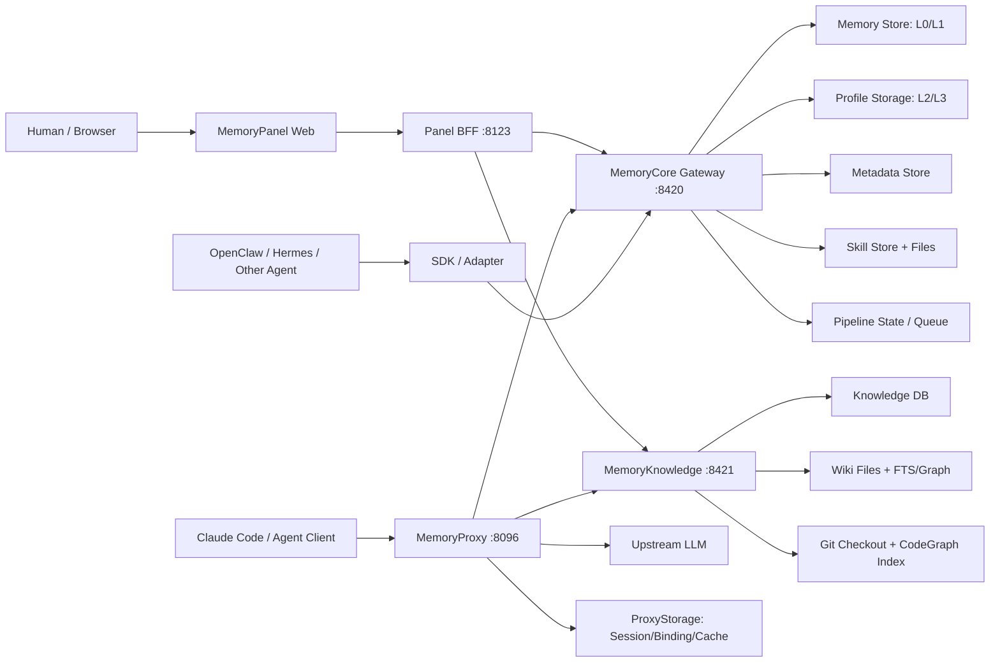
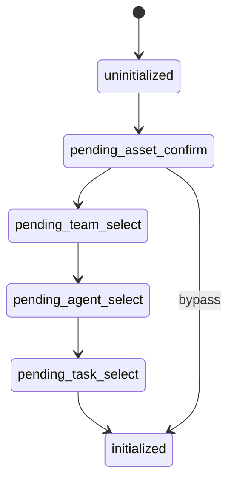
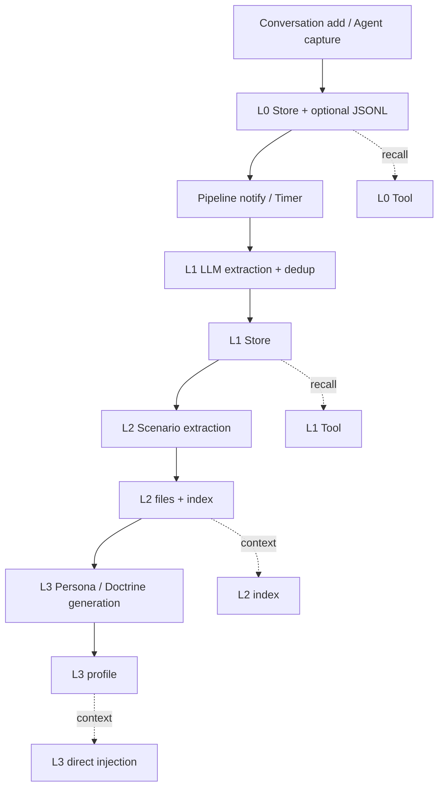
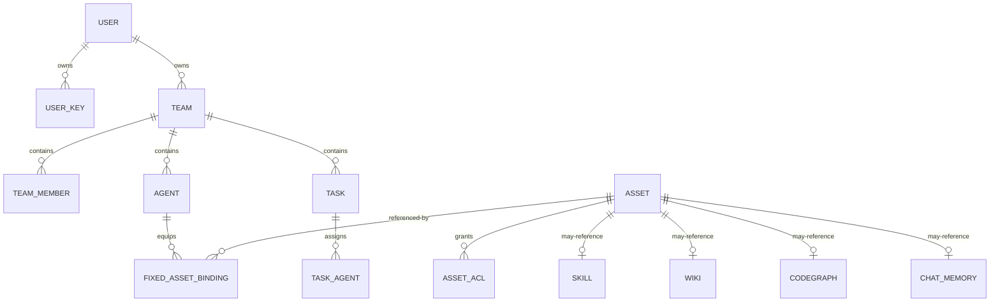
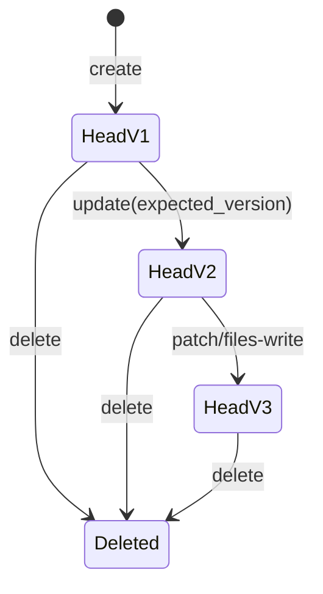

# TencentDB Agent Memory 架构与流程

**归档日期**：2026-07-31
**分类**：参考项目研究
**定位**：从C++视角理解TencentDB Agent Memory怎样采集会话、分层记忆和召回
**研究状态**：固定提交f3df793，研究于2026-08-01收口，默认只读复用

---

## 0. 先给结论

TencentDB Agent Memory（以下简称 Agent Memory）是一个 **团队级 Agent 记忆资产系统**。它不运行 Agent，不执行工作流，不管用户项目进度。它只做一件事：把外部 Agent 的对话逐层提炼成可复用的记忆、方法和技能，再用治理壳（Asset/ACL/Binding）管理这些内容，最后在下一次模型请求时把合适的内容装回 Agent。

如果你用 C++ 类比，它不是一个 `main()` 函数，而是一个 **后台索引服务**：你往里塞对话，它异步建索引、分层压缩、生成可检索的 struct，下次查询时返回拼装好的 context。

```
外部Agent回合
-> L0原始消息（证据）
-> L1原子记忆（事实/任务/方法/资产引用）
-> L2可复用场景（SOP/判断逻辑）
-> L3团队长期Doctrine（跨项目原则）
-> Skill可执行经验（带版本的操作SOP）
-> Asset/ACL/Binding治理
-> Session Loadout编译
-> 下一次Provider请求注入
-> 新回合再回流
```

**一句话**：它管理的是"记忆和能力资产"，不是用户的项目本身。

---

## 1. 它解决什么问题

作者从 3 个重复劳动问题出发：

1. 已经解释过的项目背景，不应在每次新会话重新解释。
2. 已读过的文档，不应让每个 Agent 都从第一页开始。
3. 已跑通的方法，不应由下一位 Agent 重新试错。

它把信息变成 4 类可复用资产：

| 资产 | 输入 | 产物 | Agent 使用方式 |
|---|---|---|---|
| Chat Memory | 对话 | L0-L3 分层记忆 | L3 直注入，L2 给索引，L0/L1 按需 Tool 检索 |
| Skill | 成功任务/对话 | 带版本、文件、触发边界、步骤和验证的 SOP | 列表注入、版本固定、Tool 读取或更新 |
| Wiki | 文档 | Markdown 页面、FTS 索引、wikilink 图 | Tool 搜索、读页、图扩展 |
| CodeGraph | Git 仓库 | 文件、符号、调用、影响关系索引 | Tool 搜索、调用关系和影响分析 |

**明确非目标**：

- 不创建、调度或执行远端 Agent。
- Task 只是治理标签，不是 Workflow Run。
- Proxy Session 不是 Agent Runtime Session 或 Checkpoint。
- Trace/Metric 不是产品 Evidence。
- 模型提炼的"事实"不等于经过用户接受的长期记忆。

C++ 类比：它像一个 `class MemoryIndexService`，不负责跑你的业务逻辑，只负责 `ingest()` 和 `recall()`。

---

## 2. 系统全景图



4 个核心服务进程：

| 进程 | 端口 | 职责 | 不负责 |
|---|---|---|---|
| MemoryCore Gateway | 8420 | L0-L3记忆、Metadata治理、Skill、Pipeline协调 | 不运行外部Agent，不拥有Wiki/CodeGraph内容 |
| MemoryKnowledge | 8421 | Wiki/CodeGraph内容构建、索引和查询 | 不拥有统一Asset ACL |
| MemoryProxy | 8096 | 身份验证、会话选择、上下文注入、上游转发、回写 | 不拥有长期Memory内容 |
| MemoryPanel | 8123 | 人类管理界面、聚合查询 | 不应成为第二业务数据库 |

C++ 类比：像 4 个独立进程各跑一个 `class Service`，通过 HTTP 互相调用，没有共享内存。

### 2.1 每个进程的源码落点（固定提交 f3df793）

仓库根：`/Users/xulater/Code/opc-os/tencentdb-agent-memory`。

| 进程 | 源码入口 | 在 3.6 节真实例子中负责什么 |
|---|---|---|
| MemoryCore Gateway (:8420) | `MemoryCore/src/gateway/server.ts`；内容链：`core/conversation/l0-recorder.ts`、`core/record/l1-extractor.ts`、`core/record/l1-writer.ts`、`core/scene/scene-extractor.ts`、`core/persona/persona-generator.ts`、`core/skill/conversation-add/*`；治理链：`metadata/service/metadata-service.ts`；调度链：`utils/pipeline-manager.ts`、`utils/checkpoint.ts` | L0 七波写入、13 条 L1、3 个 Scene 文件、2 次 Persona、Skill Archive/Worker/DLQ、Metadata Asset/Loadout |
| MemoryKnowledge (:8421) | `MemoryKnowledge/src/routes/`、`src/engines/`、`src/store/`、`src/source-fetcher/` | Wiki/CodeGraph 内容构建与索引（真实 Session 例子未触发，属明确未验证面） |
| MemoryProxy (:8096) | `MemoryProxy/src/handler.ts`、`src/injection/pipeline.ts`、`src/injection/injectors/*`、`src/session/*`、`src/db/*` | SessionInfo 恢复、Loadout 编译、请求改写、上游转发、L0 回写；真实注入 System 6,306 字符/User 629 字符 |
| MemoryPanel (:8123) | `MemoryPanel/src/panel/`（api/domain/infra/state）、`MemoryPanel/web/src/` | 人类管理界面与聚合查询；对应 Metadata 运行摘要中 User/Team/Agent/Asset/Binding/Loadout 的可视面 |

---

## 3. 5步处理链路（核心）

这是本文档最重要的部分。一个完整回合从"用户发消息"到"下一轮召回"经过 5 步：

### 步骤总览图

```
┌─────────────────────────────────────────────────────────────────┐
│                    一个完整回合的5步链路                           │
│                                                                 │
│  ①回合开始          ②Agent执行         ③回合结束                 │
│  (检索历史)         (外部Agent)        (写RawTurn+L1)            │
│                                                                 │
│  ┌──────────┐      ┌──────────┐      ┌──────────────────┐       │
│  │Proxy恢复  │      │Proxy转发  │      │Proxy回写L0        │       │
│  │SessionInfo│─────>│改写后的   │─────>│+通知Pipeline      │       │
│  │编译Loadout│      │Provider  │      │+Skill conversation│       │
│  │注入Context│      │请求      │      │  /add             │       │
│  └──────────┘      └──────────┘      └──────────────────┘       │
│       │                                    │                    │
│       │                                    ▼                    │
│       │                         ④异步处理(Worker)                │
│       │                         ┌──────────────────────┐        │
│       │                         │ L1: LLM提取原子记忆    │        │
│       │                         │ L2: 聚合可复用场景     │        │
│       │                         │ L3: 压缩团队Doctrine   │        │
│       │                         │ Skill: 归档+提取      │        │
│       │                         └──────────────────────┘        │
│       │                                    │                    │
│       │<───────────────────────────────────┘                    │
│       │                                                        │
│       ▼                                                        │
│  ⑤下一轮召回                                                   │
│  ┌──────────────────┐                                         │
│  │L3直注System      │                                         │
│  │L2索引注System    │                                         │
│  │L1按需Tool检索    │                                         │
│  │L0按需Tool检索    │                                         │
│  │Skill列表注入     │                                         │
│  └──────────────────┘                                         │
└─────────────────────────────────────────────────────────────────┘
```

---

### ① 回合开始：检索历史 + 编译Loadout

用户通过 Claude Code 等客户端发一个 OpenAI/Anthropic 格式的请求到 MemoryProxy。Proxy 做的第一件事不是转发，而是 **恢复会话身份和编译本轮上下文**：

```text
用户请求到达Proxy
-> Auth验证user_key
-> 恢复或初始化SessionInfo（team/agent/task/session）
-> 解析AgentContext（Messages、Tools、Params）
-> 执行Injection Hooks：
   ├─ L3 Persona/Doctrine 正文直注 System
   ├─ L2 Scene索引+摘要直注 System
   ├─ Agent/Task信息注入 System
   ├─ Skill列表+工具说明注入 System
   ├─ L1相关记忆注入最后一条User消息前
   ├─ Knowledge工具说明注入
   └─ Native Tool prepend
-> 编译完成后的请求转发给上游LLM
```

**SessionInfo 状态机**：



必须选齐 Team+Agent+Task 才启用注入；跳过会记 `bypassed=true`，后续不再注入。

**Loadout 不是持久对象，而是运行时合成**：

```text
Agent/Task快照
+ capability flags
+ Metadata Binding/ACL结果
+ Skill/Knowledge/Memory Hook
+ session Hook Cache（首轮miss会同步执行并自愈）
+ Skill Version Pin（一次会话固定读取某版本）
```

C++ 类比：

```cpp
// Loadout 像一个运行时编译的 struct，不是数据库表
struct SessionLoadout {
    AgentSnapshot agent;
    TaskSnapshot task;
    std::vector<Binding> bindings;      // 从Metadata查出来的
    std::vector<ACLEntry> acl_results; // 权限检查结果
    HookCache cache;                    // 注入块缓存
    SkillVersionPin skill_pin;          // 版本固定
    // 编译完就发给Provider，不持久化
};
```

**注入策略表**：

| 内容 | 进入Provider请求的方式 |
|---|---|
| Agent/Task | `<session_context>`先注入 System |
| Skill工具和推荐 | System 工具说明/可用 Skill 列表 |
| Knowledge | 注入Resource和Tool调用说明，模型直连Knowledge Tools |
| L3 | 正文直注 System |
| L2 | path+summary 索引直注，正文按需读 |
| L1 | Memory Bridge 按需 search/query |
| L0 | Conversation Bridge 按需 search/query |

通用 Hook 顺序：

```text
system.prefix
system.before_tools
system.after_tools
system.suffix
tools.prepend
tools.append
user.first_turn
user.before
user.after
```

**关键**：Proxy 会修改 System、Model、Header、Stream Options、Thinking Block 和上游目标，因此 **不是字节透明代理**。Hook 失败默认 fail-open，模型调用继续。

---

### ② Agent执行：外部

Agent Memory **不运行 Agent**。真正的模型调用发生在上游 LLM（OpenAI/Anthropic/本地模型）。Proxy 只是把改写后的请求转发过去，拿到流式或非流式响应，再返回给客户端。

```text
Proxy -> Upstream LLM -> 流式/非流式响应 -> 返回客户端
```

这一步对 Agent Memory 来说是"黑盒"：它不关心 Agent 内部怎样思考，只关心请求和响应的协议 Body。

C++ 类比：

```cpp
// Proxy像一个中间人，改写请求后转发
void Proxy::handle(Request& req) {
    rewrite_system_messages(req);    // 注入L3/L2/Skill
    rewrite_user_messages(req);      // 注入L1
    rewrite_tools(req);              // prepend native tools
    Response resp = upstream_->send(req);  // 转发给真LLM
    // 回写逻辑在步骤③
    return resp;
}
```

---

### ③ 回合结束：写RawTurn + L0

Provider 返回后，Proxy 从响应中抽取内容并回写：

```text
Proxy抽取最新用户消息、Assistant最终文本和Tool过程
-> 向Core写L0（逐条消息，生成新ID）
-> 把规范化Round发给Skill conversation/add
-> 后台Pipeline再提炼L1/L2/L3
```

**L0 写入流程**：

```text
recordConversation() 依次执行：
1. 若有originalUserMessageCount，按位置切出本轮新增消息
2. 否则读取全部历史，按last_captured_timestamp严格过滤
3. 只提取 user/assistant
4. 用缓存的originalUserText替换被Context注入污染的用户消息
5. 清理协议噪声，Assistant还会剥离fenced code block
6. 通过宽松的L0质量门
7. 追加JSONL；若有Store，再写L0元数据、FTS和向量
8. 在同一Checkpoint锁内推进Capture Cursor和轮次数
9. 通知Pipeline，但不在同步回合内直接跑L1
```

**L0 字段**：

```text
sessionKey / sessionId
teamId? / taskId? / userId / agentId
id / role / content / timestamp
recordedAt
```

JSONL 保留宿主消息 ID；在线 Store 会生成另一套 `l0_<session>...` ID。两套身份没有稳定统一。

**失败边界**：

- L0 批量逐条写，前缀成功后尾部可失败。
- 无请求幂等键，超时重试可能重复。
- 用户通常看不到本轮少注入或少回写了什么。

C++ 类比：

```cpp
// L0写入像一个非原子的批量append
void L0Recorder::record(const std::vector<Message>& msgs) {
    for (const auto& msg : msgs) {
        jsonl_.append(msg);           // 可能成功
        store_.upsert(msg);           // 可能失败
        pipeline_.notify();           // 通知但不等
        checkpoint_.advance(msg.ts);  // 推进游标
    }
    // 没有事务，中途崩了前缀已写、尾部丢失
}
```

---

### ④ 异步处理：Worker 提炼 L1/L2/L3/Skill

这是 Agent Memory 的核心价值所在。L0 写完后，后台 Pipeline 逐层提炼：



#### L1：把消息变成可检索陈述

`promptMode=code` 时，LLM 把对话切成 Scene 并输出 4 类 Memory：

| 类型 | 它认为是什么 | 后续用途 |
|---|---|---|
| `work_fact` | 项目事实、决定、约束、状态、风险 | 检索、场景聚合 |
| `work_task` | 待办、Owner、期限、状态、下一步 | 仍只是Memory文本 |
| `work_method` | SOP、原则、禁忌、判断标准 | L2/L3、后续Agent参考 |
| `work_artifact` | 文档、PR、Issue、设计稿、报告 | 资产引用和检索 |

每条结果进入冲突判断：

```text
新记忆 + 相似旧记忆
-> store / update / merge / skip
-> JSONL append + Store upsert/delete
```

**最重要的语义**：模型生成的 L1 **直接成为可召回内容**，没有 `Memory Candidate -> Accepted Memory` 的接受门。

#### L2：把碎片变成可复用方法

L2 读取 Cursor 后的新增 L1，生成 `scene_blocks/*.md`：

```text
场景
适用条件
核心SOP
判断逻辑
禁忌与反模式
关键事实依据
相关任务与资产
演化记录
待确认问题
```

Code Prompt 明确排除一次性任务清单和项目日报。L2 是在回答"遇到这类工作应该怎样做"，不是"这个项目现在做到哪"。

#### L3：把多个场景压成团队 Doctrine

L3 读取变化后的 Scene 和旧 Persona，生成 `persona.md`。Code 模式下它叫 Team Operating Doctrine：

```text
团队稳定工作原则
跨项目判断框架
工具和协作习惯
长期禁忌
反复验证的方法
```

它过滤具体项目进度，因此不会成为项目总览。

#### Skill：把成功操作过程固化

Skill 链保留完整回合（user/assistant/tool_call/tool_result），达到归档阈值后，Skill Review Agent 可以创建或更新：

```text
SKILL.md
版本Head
资源文件manifest
owner agent/team/task/user来源
```

#### 调度规则

```text
每个Session完成一轮
├─ 达 everyNConversations -> 立即L1
├─ 未达阈值但用户停止 -> idle timer触发L1
└─ shutdown/session end -> flush L1

L1成功
-> profile scope的L2 pending=1
-> max(now+delay, lastL2+minInterval)
-> downward-only地提前L2 timer

L2成功
-> 清pending、推进updated cursor
-> 设now+maxInterval轮询
-> 全局串行触发L3
```

C++ 类比：

```cpp
// Pipeline像一个分阶段的后台Worker
class PipelineWorker {
    void on_l0_written(Session sess) {
        if (sess.conversation_count % threshold_ == 0) {
            run_l1_extraction(sess);  // 调LLM
        } else {
            schedule_idle_timer(sess);
        }
    }
    void on_l1_done(Session sess) {
        set_l2_pending(sess.profile, true);
        schedule_l2_timer(sess);
    }
    void on_l2_done(Session sess) {
        clear_l2_pending(sess.profile);
        advance_l2_cursor(sess);
        run_l3_generation(sess);  // 全局串行
    }
    // 每层有独立Cursor，但"成功"的定义很宽松
};
```

---

### ⑤ 下一轮召回：注入 injectedContext

下一轮用户发消息时，步骤①的 Loadout 编译会读取本步产出的内容：

```text
Core输出两个区域：

prependContext
  = 每轮变化的L1 relevant memories

appendSystemContext
  = L3 persona
  + L2 scene navigation
  + memory tool guide
```

这利用 Provider Prompt Cache：稳定内容放 System，动态召回放 User 前缀。

**真实运行验证**：Proxy 装配后，Provider System 消息长度 6,306 字符；User 消息长度 629 字符；L3 正文、L2 索引、Agent Loadout 进入 System；L1 相关记忆进入最后一条 User 消息之前；6 个 Memory 操作名进入 System。

C++ 类比：

```cpp
// 下一轮召回像一个query+inject
Request Pipeline::compile_next_request(const Session& sess) {
    Request req = original_request_;
    req.system += l3_.get_persona(sess.team, sess.agent);      // 稳定，可缓存
    req.system += l2_.get_scene_index(sess.team, sess.agent);   // 稳定
    req.system += agent_loadout_.render(sess);                  // 稳定
    req.user_prepend = l1_.search(sess, query);                 // 动态
    req.tools = skill_tools_.list(sess) + original_tools_;      // 半稳定
    return req;
}
```

---

## 3.6 用真实 Session 贯穿一遍（代码事实 + 运行事实）

本节用固定提交 `f3df793` 在 2026-08-01 实际处理过的真实输入把上面的名词串起来，避免只停留在概念层：

- **输入**：一个 14 回合、28 条消息的 Codex Session 脱敏投影（采样时前 4,285 行 JSONL 的 SHA-256 = `60175a35f793fb6c026c6fbfcb72f9488f2f4822a3084e43db5c499d1b49ddb1`）；
- **投影规则**：排除 developer / recommended_plugins / environment_context，每轮取真实 user 请求 + 该轮最后一条 assistant 回复；
- **边界**：这个投影器是本次研究的适配器，不是 Agent Memory 自带能力（固定提交没有 Codex、Claude Code、Cursor 的 Session 文件解析器）。

### 每一层实际得到什么

| 步骤            | 真实运行结果                                                                                                                                                                                                                      | 源码入口                                                                                                                      |
| ------------- | --------------------------------------------------------------------------------------------------------------------------------------------------------------------------------------------------------------------------- | ------------------------------------------------------------------------------------------------------------------------- |
| ① L0 捕获       | 28 条消息分 7 波写入，每波 4 条；读回 28 条；Checkpoint `total_processed=28`、`l0_conversations_count=7`；完整历史重放新增 0；Scheduler 仍收到一次通知                                                                                                        | `MemoryCore/src/core/conversation/l0-recorder.ts`、`MemoryCore/src/core/hooks/auto-capture.ts`                             |
| ② L1 提取       | 最终保存 13 条：`work_method` 6、`work_fact` 5、`work_task` 2、`work_artifact` 0；Writer 四种动作都真实发生：store→version 0、update→删除旧+version 5、merge→删两个+version 6、skip→null                                                                 | `MemoryCore/src/core/record/l1-extractor.ts`、`l1-writer.ts`、`l1-dedup.ts`                                                 |
| ③ L2 Scene    | 第一次创建 `chat_product_direction.md`、`ux_research_method.md`、`reference_decisions.md` 三个 Scene；第二次更新同 3 个；L2 Cursor 从 `2026-08-01T09:06:00Z` 推进到 `09:12:00Z`；`scenes_processed=2`                                              | `MemoryCore/src/core/scene/scene-extractor.ts`、`scene-index.ts`                                                           |
| ④ L3 Persona  | 生成 2 次（第二次为增量模式），最终正文保留目标、稳定方法、偏好与边界，并追加 3 个 Scene 导航                                                                                                                                                                       | `MemoryCore/src/core/persona/persona-generator.ts`                                                                        |
| ⑤ Skill       | 2 组真实 Tool 事件触发 `reason=tool_calls`；先写 12 条消息 Archive，再登记 `_tasks.json` 入 Agent 队列；Worker 提取出 `ux-reference-reverse-engineering` Skill Candidate；第二个 Archive 遇 `400 schema validation failed`，达到永久失败阈值后进入 `_tasks_dlq.json` | `MemoryCore/src/core/skill/conversation-add/add-handler.ts`、`prepare-archive.ts`、`extract-worker.ts`、`skill-core-sink.ts` |
| ⑥ Metadata 治理 | 实际创建 User→Team→Agent、自动 private chat_memory Asset、`extracted_from_session` Task、UX 参考总账 Asset、抽取 Skill Asset、Agent Loadout 3 项                                                                                              | `MemoryCore/src/metadata/service/metadata-service.ts`                                                                     |
| ⑦ Proxy 装配    | Provider System 消息 6,306 字符、User 629 字符；L3 正文/L2 索引/Loadout 进 System，L1 进最后一条 User 前，6 个 Memory 操作名进 System；第二次同 Session 命中 Cache，Body 完全相同；一个 Hook 抛错时其余上下文继续注入                                                            | `MemoryProxy/src/injection/pipeline.ts`、`MemoryProxy/src/injection/injectors/*`                                           |
| ⑧ 下一轮召回       | 无 Vector Store 时 L1 结果 0；把 13 条 L1 写入真实 SQLite FTS 后召回 8 条；空 Query 时 L1=0 但 L3/L2 仍进稳定 System Context                                                                                                                       | `MemoryCore/src/core/record/l1-reader.ts`                                                                                 |
| ⑨ 闭环再跑        | 脚本继续回合新增 2 条 L0、2 条 L1（13→15）；SQLite FTS 对“个人主页模块下一步交付什么”召回 6 条                                                                                                                                                             | 同 ①—⑧                                                                                                                     |

### 每个失败分支在例子里的样子

| 失败 | 实际结果 | 对理解模块的意义 |
|---|---|---|
| 真实 Qwen 7B 输出顶层对象而非顶层数组 | Parser 报 `Unexpected non-whitespace character after JSON at position 295`；源码仍返回 `success=true/extracted=0`，标准 Factory 还会推进 L1 Cursor | L1 的“成功”不等于提取成功，Cursor 语义不可信；原始 L0 仍在，但自动链会永久跳过该批 |
| 无在线 Vector Store 的 JSONL 降级 | Reader 只保留最新 20 条；28 条真实输入中最早 10 条（5 个回合）永久落在 Cursor 前，没进 L1 | L0 与 L1 是两套身份、两套游标；降级路径会静默漏数据 |
| Skill 第二个 Archive 失败 | `retry_count=1` 后进 DLQ，Agent 队列清空，只留人工救援 | Archive→Task→Worker→DLQ 是分阶段缓冲，不是同一事务 |
| Proxy Hook 抛错 | 其余上下文继续注入（fail-open） | Proxy 是改写层，用户通常不知道本轮缺了哪些资产 |

这条真实链路回答“每个模块到底对应什么”：**Core 管内容与调度，Metadata 管治理壳，Proxy 管装载，Panel 管人看**；L0-L3/Skill 是不同时间尺度的内容对象，不是同一张表的不同名字。

---

## 4. 分层记忆模型：RawTurn -> L0 -> L1 -> L2 -> L3 -> Skill

这是 Agent Memory 最值得理解的设计。它不是"一个向量库做检索"，而是 **6 层不同时间尺度的记忆**。

### 分层总览

| 层 | 是什么 | 存储形态 | 谁生成 | 作用域 | 可靠性 |
|---|---|---|---|---|---|
| RawTurn | 客户端原始请求/响应 | 协议Body（不持久） | 客户端 | 单次请求 | 最低（不保存） |
| L0 | 原始消息证据 | JSONL + SQLite/FTS/向量 | Proxy回写/Adapter | Team+Agent+User+Session | 原始事实，但双写无统一提交 |
| L1 | 原子工作记忆 | JSONL + SQLite | LLM从L0提取 | Team+Agent+User+Session | 模型输出直接生效，无Candidate门 |
| L2 | 可复用场景块 | Markdown文件 + 索引 | LLM从L1聚合 | Team+Agent Profile | LLM直接改文件，非原子 |
| L3 | 团队长期Doctrine | Markdown文件 | LLM从L2压缩 | Team+Agent Profile | 过滤项目进度，只保留原则 |
| Skill | 可执行操作SOP | 版本化DB + 资源文件 | SkillExtractor从完整回合提取 | Agent/Task/User/Team | 有版本和CAS，但Tool Call直接写正式表 |

### 为什么分层

**核心洞察**：不同时间尺度的信息必须分开处理。

```
原始证据（L0）        -- 最具体，最不稳定，量大
-> 原子陈述（L1）     -- 提炼后可检索，但仍频繁变化
-> 场景方法（L2）     -- 跨多次对话聚合，较稳定
-> 团队原则（L3）     -- 跨项目压缩，最稳定
-> 可执行能力（Skill）-- 固化操作步骤，有版本
```

**可靠性递增还是递减？** 这是个关键问题，答案是 **维度不同**：

| 可靠性维度 | L0 | L1 | L2 | L3 | Skill |
|---|---|---|---|---|---|
| 事实保真度 | 最高（原始消息） | 中（模型提取） | 低（聚合压缩） | 最低（跨项目压缩） | 中（完整操作过程） |
| 持久化可靠性 | 低（双写无事务） | 低（无Candidate门） | 低（LLM直接改文件） | 低（LLM重写） | 中（有版本CAS） |
| 召回稳定性 | 高（FTS+向量） | 中（受Cursor影响） | 中（文件可能漂移） | 高（稳定正文） | 高（版本固定） |
| 信息损失风险 | 低（保留原文） | 中（提取可能漏） | 高（聚合丢细节） | 最高（压缩丢项目进度） | 中（只保留成功路径） |

**最重要的语义**：L3 刻意过滤具体项目进度。因此它适合做"团队长期怎样工作"，不适合回答"今天哪个 Work 阻塞"。

C++ 类比：

```cpp
// 不是一个大vector做检索，而是多层缓存
struct MemoryHierarchy {
    std::vector<RawMessage> l0;           // 原始日志，最大
    std::vector<AtomicMemory> l1;         // 提炼后的事实陈述
    std::vector<SceneBlock> l2;           // 场景方法文件
    std::string l3_persona;               // 团队原则正文
    std::vector<VersionedSkill> skills;   // 可执行SOP

    // 召回策略：L3直注、L2索引、L1/L0按需Tool
    ContextPackage compile(const Query& q) {
        ContextPackage ctx;
        ctx.system_stable = l3_persona + l2_index();
        ctx.user_dynamic = l1_search(q);
        return ctx;
    }
};
```

---

## 5. 核心数据结构（C++ struct 类比）

### L0 原始消息

```cpp
struct L0Message {
    std::string id;              // 消息ID（Store生成 l0_<session>...）
    std::string session_key;     // 会话标识
    std::string session_id;
    std::optional<std::string> team_id;
    std::optional<std::string> task_id;
    std::string user_id;
    std::string agent_id;
    std::string role;            // "user" | "assistant"
    std::string content;         // 清理后的消息正文
    int64_t timestamp;           // 消息原始时间
    int64_t recorded_at;         // 系统记录时间
    // 存储：JSONL（追加）+ SQLite（FTS5 + 向量列）
};
```

### L1 原子记忆

```cpp
struct L1Memory {
    std::string id;
    std::string content;          // 提炼后的陈述文本
    std::string type;             // work_fact | work_task | work_method | work_artifact
                                   // 或 chat 模式: persona | episodic | instruction
    int priority;                 // 0-999，任意值被接受
    std::string scene_name;       // 工作情境标签
    std::vector<std::string> source_message_ids;  // 来源L0消息ID
                                                    // 注意：merge后只复制当前新记忆来源
                                                    // 不会并入被替换旧记忆的全部来源
    json metadata;                 // 松散JSON：owner/deadline/status/scope/method_type等
    std::vector<int64_t> timestamps;
    std::string created_at;
    std::string updated_at;
    int version;                   // 新建为0，update/merge后递增
    // 作用域
    std::string session_key;
    std::optional<std::string> session_id;
    std::optional<std::string> task_id;
    std::string team_id;
    std::string user_id;
    std::string agent_id;
    // 存储：JSONL + SQLite
};
```

### L2 场景块

```cpp
struct L2SceneBlock {
    // 文件：scene_blocks/<scene_name>.md
    std::string meta_header;     // created / updated / summary / heat
    std::string scene;            // 场景名称
    std::string applicable_conditions;  // 适用条件
    std::string core_sop;         // 核心SOP
    std::string judgment_logic;   // 判断逻辑
    std::string anti_patterns;    // 禁忌与反模式
    std::string key_facts;        // 关键事实依据
    std::string related_tasks;    // 相关任务与资产
    std::string evolution_log;    // 演化记录
    std::string open_questions;   // 待确认问题
    // 作用域：Team + Agent Profile（不归某个用户或Session）
    // 存储：Markdown文件 + .metadata/scene_index.json
};
```

### L3 团队Doctrine

```cpp
struct L3Profile {
    // 文件：persona.md
    std::string stable_principles;     // 团队稳定工作原则
    std::string cross_project_framework;  // 跨项目判断框架
    std::string tool_habits;           // 工具和协作习惯
    std::string long_term_taboos;     // 长期禁忌
    std::string verified_methods;     // 反复验证的方法
    std::string scene_navigation;      // Core后处理追加的Scene导航
    // 作用域：Team + Agent Profile
    // Code模式叫 Team Operating Doctrine
    // 存储：Markdown文件
};
```

### Skill 版本快照

```cpp
struct SkillSnapshot {
    std::string skill_id;
    int version;                   // 版本号
    bool is_head;                  // 只有一个 is_head=true
    std::string content;           // SKILL.md 正文
    std::string content_hash;      // 内容哈希
    std::string manifest;          // 资源文件清单
    std::string owner_agent_id;
    std::optional<std::string> owner_team_id;
    std::optional<std::string> owner_task_id;
    std::optional<std::string> owner_user_id;
    int expected_version;          // 乐观锁：更新时必须匹配
    // 存储：SQLite（版本表）+ 文件目录（资源）
};
```

### Asset 治理壳

```cpp
struct Asset {
    std::string asset_id;
    std::string asset_type;       // skill | llm_wiki | code_graph | chat_memory
    std::string owner_user_key;
    std::optional<std::string> team_id;
    std::string visibility;       // private | team | restricted | agent | task
    std::string status;           // draft | candidate | approved | deprecated | archived | failed
                                   // 注意：实际代码会写 "active"，合同里没有这个值（漂移）
    std::string content_ref;      // 指向真实内容的引用，不包含正文
    int version;
    int use_count;
    std::optional<int64_t> expires_at;
    // 存储：Metadata Store（SQLite/MongoDB）
};
```

### AssetACL

```cpp
struct AssetACL {
    std::string asset_id;
    std::string subject;          // user_id | role | agent_id
    std::string permission;       // read | write | use | admin
    std::string effect;           // allow（deny预留但主路径是allow-only）
    // 存储：Metadata Store
};
```

### FixedAssetBinding

```cpp
struct FixedAssetBinding {
    std::string agent_id;
    std::string asset_id;         // 唯一约束：agent_id + asset_id
    std::string injection_mode;   // 注入方式
    int priority;                 // 优先级
    // 存储方式：add 用 INSERT OR IGNORE（幂等）
    //           set 在单DB事务中全量替换
    //           Panel的分配操作先list、本地改、再set（无CAS，并发可能丢更新）
};
```

### Proxy SessionInfo

```cpp
struct ProxySessionInfo {
    std::string space_id;
    std::string user_id;
    std::string user_key;         // 会持久化原始user_key（安全风险）
    std::optional<std::string> team_id;
    std::optional<std::string> agent_id;
    std::optional<std::string> task_id;
    std::string session_id;
    std::string state;            // uninitialized | pending_* | initialized | bypassed
    // 存储：Map / FS / SQLite（多节点不一致）
    // 不是 Agent Runtime Session 或 Workflow Checkpoint
};
```

---

## 6. 对象关系图



图中的 `may-reference` 是应用层引用，不是数据库外键。Metadata SQLite 虽打开 `foreign_keys=ON`，DDL 并没有为这些实体声明 FK。

**三个独立平面**：

| 平面 | 负责什么 | 不负责什么 |
|---|---|---|
| 内容平面 | L0-L3、Skill、Wiki、CodeGraph | 用户、授权、Agent装配 |
| 治理平面 | User、Team、Agent、Task、Asset、ACL、Binding | 记忆正文和模型运行 |
| 运行装载平面 | Proxy Session、Loadout、Hook、Cache、Bridge | 权威内容和工作状态 |

C++ 类比：像 3 个独立的 namespace，各自管自己的 struct，通过 ID 引用对方，但没有编译期类型约束。

---

## 7. 跨 Store 事务与恢复矩阵

这是 Agent Memory 最大的工程弱点：**没有统一提交协议**。

| 操作 | 写入边界 | 中途失败结果 | 当前恢复 |
|---|---|---|---|
| L0 批量 add | 多条 Store + notify + mirror | 前缀已写，重试可重复 | 无请求幂等；Pipeline继续 |
| L1 merge/update | Store/JSONL/Audit | 旧删新未成或两侧漂移 | 告警、后续 Cleaner/人工 |
| Skill create | Asset->资源->Skill DB | 孤儿 Asset/资源 | 读时 self-heal 只补 Asset |
| Agent create | Agent->Memory->Skill fork->Knowledge Binding | 半创建 Loadout | 用户重试/人工清理 |
| Knowledge create | KS->Core Entity->Asset | 三份状态不一致 | Callback重试1次、前端补建 |
| Knowledge delete | KS->Core Entity->Asset | 内容删了但壳仍在 | best-effort |
| Proxy L0回写 | 上游响应后异步 | 模型成功但Memory缺失 | 流式重试；非流式不一致 |

**最严重的运行问题**：L1 失败后仍标记完成并推进游标。原始 L0 仍在；但如果没有人工重放/重置，自动链永久跳过该批 L1。

C++ 类比：

```cpp
// 没有事务，像一个没有rollback的批量操作
void risky_write(const std::vector<Data>& batch) {
    for (const auto& d : batch) {
        write_a(d);   // 成功
        write_b(d);   // 可能失败，但a已写
        advance_cursor(d);  // 无论b是否失败都推进
    }
    // 崩了：前缀已写、游标已推进、丢失的永远丢失
}
```

---

## 8. Skill 生命周期



每个 `(skill_id, version)` 是不可变快照，只有一个 `is_head=1`。更新使用 `expected_version` 乐观锁，在 SQLite `BEGIN IMMEDIATE` 中切换 Head 与写新版本。

**优点**：

- 版本是不可变快照。
- expected_version 防止陈旧客户端覆盖。
- Proxy 可以按 Session 固定版本。

**缺口**：

- 文件复制在 DB 事务之外，并发写同一 vN+1 有资源清理竞态。
- Delete 实际物理删除，和 archive 注释/返回漂移。
- SkillExtractor 给模型 CRUD Tool；Tool Call 直接写正式 Skill。Candidate 是事后结果说明，不是审核中的草稿。

---

## 9. 和 Chat 的差异

> 下表的 Chat 列以 `PROJECT_CONTEXT.md` 已批准的目标产品责任和边界为主，不表示这些能力已全部实现。

| 维度 | TencentDB Agent Memory | Chat | 关系 |
|---|---|---|---|
| 核心入口 | Panel 管理 + Proxy/SDK/Adapter 接入 Agent | 对话是完整产品入口 | 部分相似 |
| 核心问题 | 经验、文档、代码怎样沉淀并给下一 Agent 使用 | 输入->意图->计划->行动->审核->执行->证据->记忆的完整闭环 | Memory 子问题重叠 |
| 资产模型 | Chat Memory/Skill/Wiki/CodeGraph + Asset/Binding/ACL | Memory、Artifact、Evidence、Work、Context 等产品对象 | 概念相邻但不等同 |
| Agent Runtime | 自有 Pipeline、Proxy、外部 Agent 宿主 | MAF 管 Agent/Session/Workflow/HITL | 技术基线不同 |
| 前后端实时协议 | Panel REST；Proxy OpenAI/Anthropic | AG-UI 管 Agent Run 实时交互 | 不同 |
| Session | Proxy 本地 Team/Agent/Task 绑定 | Product Session、MAF AgentSession、AG-UI Thread、Agent Run 必须分开 | 不能映射为一个 Session |
| 记忆/工作候选接受 | L1/L2/L3 和 Skill 模型结果可直接写正式状态 | 模型输出只是 Candidate；Work与Accepted Memory分别经过决定、版本和提交门 | **根本差异** |
| 执行与审批 | 没有通用 Work/Action/Approval 闭环 | 高影响动作必须按版本和请求内容审批 | **根本差异** |
| Evidence/Trace | 观测 Trace/Metric + 内容资产 | Evidence 是产品事实；Trace 不保存隐藏推理 | 名称相似，职责不同 |
| 状态源 | 多 Store + best-effort 协调 | Product DB、MAF Runtime、AG-UI Projection 必须分责且不可双事实源 | 可借鉴问题，不能照搬实现 |
| 授权 | Core ACL 较完整，Knowledge 最终门缺失 | 授权必须贯穿 Principal、工具、内容与管理员访问审计 | Chat 保证更强 |
| 恢复 | L0/Checkpoint 局部；Knowledge Job 不续传 | 必须区分历史恢复、活动 Run、Worker、Tool、Workflow、HITL 恢复 | Chat 范围更完整 |

**一句话总结**：

> Agent Memory 与 Chat 在"团队如何积累并给 Agent 装配可复用记忆/知识"上高度相似；它可以帮助理解一个 Memory Asset 子系统，但它本身不是 Chat 的同类完整产品，也不能替代 Chat 的 Work、Approval、Execution、Evidence、Trace 和治理闭环。

**Chat 已经比 Agent Memory 更强的部分**：产品事实、用户决定、执行治理、证据与恢复。

**Agent Memory 明显比 Chat 更成熟、值得补齐的部分**：跨 Session 持续语义提炼和按 Agent 编译 Loadout。

---

## 10. Chat 从这个项目吸收了什么

> 本节是研究启发摘要，不构成 Chat Schema 或架构批准。

### 采用 7 项

这些结构 Chat 可以直接借鉴其设计思想：

| # | 采用项 | 来源 | 理由 |
|---|---|---|---|
| 1 | 保留"证据->陈述->方法->长期模型"分层 | L0->L1->L2->L3 分层模型 | 不同时间尺度的信息必须分开处理，不能用一个向量库做检索 |
| 2 | 从 Tool-rich Session 生成 Skill Candidate | Skill链保留Tool Call/Result | 最终回答不足以提炼能力，必须保留Tool过程、失败和修复 |
| 3 | 建立 Context/Loadout Compiler | Proxy的Loadout编译 | Agent Profile + Memory + Skill + 权限 -> 一次可审计Context Package |
| 4 | 为每层设计独立增量 Cursor | 4类Cursor（Capture/L1/L2/L3） | 每层只处理新增变化，不需要每次重算整个Session |
| 5 | 稳定 System 与动态 Recall 分开 | prependContext + appendSystemContext | 长期稳定内容放可缓存System区，动态召回放User前缀，兼顾Token预算与缓存 |
| 6 | Team/Agent 作用域使记忆成为团队能力 | Team+Agent Profile | 可以形成团队Agent的共享方法，而不只保存个人偏好 |
| 7 | 内容与治理壳分离 | Asset不包含正文 | Memory/Skill/Wiki保持各自结构，Asset/ACL/Binding统一管理所有权和装载 |

### 改造 8 项

这些设计有价值，但 Chat 必须改变其实现方式才能安全采用：

| # | Agent Memory 做法 | Chat 应怎样超越 | 改造原因 |
|---|---|---|---|
| 1 | LLM输出直接写L1/L2/L3 | 先写Candidate，确定性校验后由用户或明确策略接受 | 模型输出只是候选，不自动成为已接受记忆 |
| 2 | work_task 当记忆文本 | 解析成Work候选，不能自动改权威Work状态 | work_task只有owner/deadline/status文本，无状态机 |
| 3 | 双写任一失败仍返回成功 | 使用事务Outbox、Commit Receipt、重试和对账 | 多Store无统一提交协议 |
| 4 | Cursor按"尝试过"推进 | 只按"已提交且可回放"推进 | L1失败后仍标完成并推cursor，永久跳过该批 |
| 5 | Skill Agent直接写正式Skill | Skill Candidate->测试/Evidence->Approval->Version | Tool Call直接写正式表，无用户接受门 |
| 6 | Hook失败默认静默放行 | Provider请求前显示Context完整度、降级原因和用户选择 | fail-open保住主模型调用但隐藏资产缺失 |
| 7 | ACL停在Metadata层 | 权限必须在最终内容/Tool端点再次验证 | Knowledge只校验service_id，不校验User/Team/Binding |
| 8 | Session Hook Cache无失效 | 绑定/权限/资产Revision改变时精确失效 | Hook Cache缺资产变更失效协议，可能注入过期内容 |

### 拒绝 8 项

这些设计 Chat 不应采用：

| # | Agent Memory 做法 | 拒绝原因 |
|---|---|---|
| 1 | work_task 作为工作管理 | Chat有完整Project/Work/Action/Plan/责任/状态/Revision，不能用文本记忆替代 |
| 2 | 模型输出直接生效无Candidate门 | Chat要求候选->接受->版本->使用影响->撤销的完整治理 |
| 3 | 多Store无统一提交协议 | Chat用Product DB单一权威事实源，不允许双事实源 |
| 4 | JSONL降级漏最早消息 | Chat不允许长Session静默丢失数据（Reader只保留最新20条） |
| 5 | Knowledge最终授权缺口 | Chat权限必须贯穿到内容端点，不能只校验service_id |
| 6 | fail-open对用户不可见 | Chat要求用户可见Context完整度和降级原因 |
| 7 | 后台Job不持久（BuildQueue只在内存） | Chat需要Durable Job/Outbox/Reconciliation |
| 8 | Proxy改模型请求非透明 | Chat不修改模型请求语义，AG-UI是协议边界不是改写层 |

---

## 11. 工程质量评估

固定提交的 7 维加权评分：**2.07/5**。这是研究按固定权重对锁定快照做的风险评估，不是官方评级或第三方认证。

**最强的 3 点**：

1. 产品与对象覆盖完整，超出普通 Memory SDK。
2. 记忆层级与上下文预算策略有实际方法论。
3. 内容、治理壳、运行投影和宿主 Adapter 的边界基本可辨。

**最高风险的 5 点**：

1. 0 个跟踪测试文件，Core 总构建和 Knowledge typecheck 失败。
2. CI 只监听 main 的 PR 且只覆盖 MemoryCore，其他模块没有对应门。
3. L1、跨 Store 创建、Knowledge Build/Callback 的正确性和恢复保证弱。
4. Knowledge 最终授权、Callback、TLS、凭据和 SSRF 存在安全缺口。
5. 文档、类型、运行和发布状态存在多处漂移。

**结论**：这是"产品广度强、快速演进的 Beta"，不能把功能存在当作生产保障已经存在。

---

## 12. 退化策略共同形状

| 位置 | 失败 | 现有行为 | 用户风险 |
|---|---|---|---|
| Core | Asset ensure 失败 | L0 继续写 | Memory 有内容但治理壳缺失 |
| Core | L1 LLM 失败 | extracted=0 且标完成 | 自动链跳过该批提炼，仅保留原始L0供人工重放 |
| Core | private integrations 缺失 | 本地/Noop 退化 | 配额/观测与宣称不同 |
| Panel | Core/KS 启动同步失败 | 告警并健康 | 页面可打开但功能空或失败 |
| Proxy | SQLite 不可用 | FS 退化 | 多节点会话不一致 |
| Proxy | Injection Hook 失败 | fail-open 调模型 | 用户不知本轮少了哪些资产 |
| Knowledge | Callback 失败 | 本地 ready 不回滚 | Panel/Core 看不见已建好内容 |

---

## 13. 最终记忆卡

1. 这是 **Team Memory Asset System**，不是完整 Agent Runtime。
2. 4 类资产的内容不同，治理壳统一。
3. Asset、Content、Binding、Loadout、Runtime Cache 必须分开。
4. Core 管 Memory/Meta/Skill；Knowledge 管 Wiki/CodeGraph；Proxy 管会话注入；Panel 管人类交互。
5. L0/L1 属于细粒度记忆；code 模式会识别工作事实、任务、方法和资产，但 L2/L3 会把它们压缩为 Team+Agent 的工作方法与 Operating Doctrine，而不是维护项目/任务状态。
6. L3 直注入、L2 索引、L0/L1 Tool 是其上下文预算核心。
7. Proxy 会改模型请求，不是透明代理。
8. Knowledge 的绑定发现不是最终授权。
9. 大量 fail-open 保住主模型调用，但隐藏资产缺失。
10. Checkpoint、Health、ready、completed 都必须问"具体保证了什么"。
11. 产品广度值得研究，生产保障不能从功能列表推导。
12. 与 Chat 的重叠集中在 Memory/Knowledge Asset；Chat 还承担完整工作、审批、执行、证据和治理闭环。

---

## 14. 证据索引

| 证据 | 文件 |
|---|---|
| 入口和问题路由 | `agent_knowledge/project-studies/tencentdb-agent-memory/README.md` |
| 完整架构心智模型 | `用户学习/S6-完整架构心智模型/02-完整架构心智模型.md` |
| 源码级完全掌握总账 | `用户学习/S6-完整架构心智模型/06-源码级完全掌握总账.md` |
| 数据与接口契约 | `用户学习/S3-数据与接口契约/02-数据与接口契约.md` |
| 关键链路与运行证据 | `用户学习/S4-关键链路与运行验证/02-关键链路与运行证据.md` |
| 真实Session全链Trace报告 | `用户学习/S6-完整架构心智模型/07-真实Session全链Trace与处理机制报告.md` |
| 会话后管理模型与Chat对照 | `用户学习/S6-完整架构心智模型/05-会话后管理模型与Chat对照.md` |

**固定提交**：`f3df79326dfd763f45199c441e2129d780467949`

**研究状态**：研究已于 2026-08-01 收口，默认只读复用，不重跑实验、不自动升级为 Chat 正式参考或采用决定。任何 Chat 实现仍须回到 Chat 的 `AGENTS.md`、`PROJECT_CONTEXT.md`、`PROJECT_STATE.md`、`PROJECT_PLAN.md` 和相应工作包详细设计门。

## 补充记录

- 2026-08-01：按用户要求补充“真实例子贯穿”：新增 3.6 节（14 回合/28 条真实 Session 从 L0 到 Proxy 注入、失败分支的实跑值）和 2.1 节（4 个进程→源码文件→例子动作映射，仓库 `/Users/xulater/Code/opc-os/tencentdb-agent-memory`）。内容基于固定提交与已收口证据，未重跑实验。
