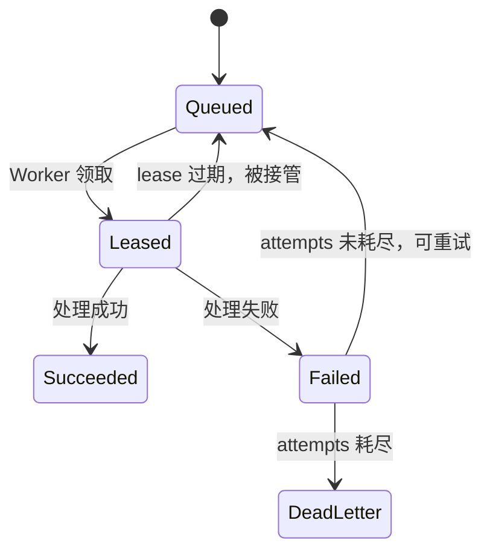

# memmy-agent 架构与流程

**归档日期**：2026-07-31
**分类**：参考项目研究
**定位**：从C++视角理解memmy-agent怎样采集会话、原子提交和异步演化
**研究状态**：固定提交211d521，研究于2026-08-01收口，默认只读复用

---

## 第 0 层：memmy-agent 是什么

你写过 C++，应该熟悉"一个程序管一件事"的思路。memmy-agent 也是一个"管一件事"的程序——它管的是 **Agent 的经验记忆**，不是 Agent 本身，不是用户的工作进度，不是项目完成状态。

一句话定位：**memmy-agent 是一个"桌面产品 + Agent Runtime + Memory Service"的多进程本地系统，核心责任是采集 Agent 每一轮的观察事实，原子提交到 SQLite，然后把昂贵的语义处理（摘要、向量、归纳、技能结晶）丢给异步 Worker 去做。**

### 它不是什么

| 它不是 | 为什么不是 |
|---|---|
| 一个聊天页面 | 它有 React UI，但 UI 只是 Memory 面板，不是聊天主界面 |
| 一个 Agent 框架 | 它内含 Agent Gateway（能跑模型循环），但那是"让 Agent 能被记忆 Hook"的手段，不是产品核心 |
| 一个数据库 | 它用 SQLite 存储，但核心是"采集→原子提交→异步演化→下一轮召回"的闭环，不是纯存储层 |
| Chat 的依赖 | Chat 研究它是为了吸收工程经验，不会整体引入；研究已于 2026-08-01 收口，默认只读复用 |

### C++ 类比

把 memmy-agent 想象成你写的一个 C++ 程序：

```cpp
// 不是这样：
class ChatApp { void run(); };  // 一个聊天应用

// 而是这样：
class MemoryService {           // 核心服务
    Database db;                // SQLite 存储
    HttpServer server;          // 对外 HTTP 合同
    WorkerPool workers;         // 异步处理池
public:
    TurnResult turn_start(TurnStartRequest);
    TurnResult turn_complete(TurnCompleteRequest);
    // ...
};

class AgentGateway {            // Agent Runtime（让 Agent 能被 Hook）
    AgentLoop loop;
    MemoryHook hook;           // beforeRun/afterRun 回调进 MemoryService
};

class DesktopShell {            // 桌面壳，监督进程
    Supervisor supervisor;
    LocalBackend backend;
};
```

三个对象各管一摊：MemoryService 管记忆，AgentGateway 管 Agent 执行，DesktopShell 管进程监督。它们通过 HTTP 通信，不是直接 import 对方的代码。

---

## 第 1 层：进程与服务架构

memmy-agent 打包成桌面应用时有 2-4 个主要 OS 进程，但始终面对 3 个后端服务边界。

```
┌─────────────────────────────────────────────────────────────────┐
│  Electron 主进程                                                 │
│  ┌──────────────────┐  ┌──────────────────────────┐             │
│  │ Desktop Shell     │  │ Local Backend            │             │
│  │ 窗口/Supervisor/  │  │ Fastify 127.0.0.1:随机   │             │
│  │ 更新              │  │ 产品管理 REST/SSE         │             │
│  └────────┬─────────┘  └──────────┬───────────────┘             │
└───────────┼──────────────────────┼─────────────────────────────┘
            │                      │
            │ spawn/复用            │ HTTP
            ▼                      ▼
┌───────────────────┐    ┌──────────────────┐
│ Memory Service    │    │ Agent Gateway    │
│ 127.0.0.1:18960   │    │ health :18970    │
│ HTTP + SQLite     │    │ WebSocket :18980 │
│                   │    │ AgentLoop/Cron   │
│ memory.sqlite     │    │ Channels         │
└───────────────────┘    └──────────────────┘
         ▲                        │
         │   Memory HTTP（主路径）│
         └────────────────────────┘
```

**关键边界**：

| 服务 | 端口 | 管什么 | 不管什么 |
|---|---|---|---|
| Local Backend | 随机 loopback | 账号、配置、Source、Memory 面板 | Agent token stream |
| Memory Service | 18960 | 经验、来源、检索、反馈、演化 | Agent 消息历史 |
| Agent Gateway | 18980（WS） | 模型循环、工具、Channel、Cron | 产品配置、Memory 表 |

C++ 类比：像你写了 3 个独立的 daemon 进程，各自 `bind` 不同端口，通过 HTTP 互相调用。Desktop Shell 是"父进程"，负责 `fork/exec` 子进程并在崩溃时重启。

**一个例外**：Local Backend 在没有 Memory Service URL 时，会直接打开 `memory.sqlite` 做有限能力 fallback（搜索/读取/删除）。这破坏了"进程隔离"的纯洁性，是已知的设计代价。

### 1.1 每个服务边界的源码落点（固定提交 211d521）

仓库根：`/Users/xulater/Code/opc-os/memmy-agent`。

| 服务 | 源码入口 | 在 2.5 节例子 A/B 中负责什么 |
|---|---|---|
| Desktop Shell | `App/shell/desktop/src/main/main.ts`、`App/shell/desktop/src/main/runtime-services.ts`（默认端口 18960/18970/18980）、`renderer-static-server.ts` | 窗口、Supervisor、子进程 spawn/崩溃重启 |
| Local Backend | `App/backend/src/index.ts::createLocalBackend`（Fastify 监听 `127.0.0.1:0`）、`App/backend/src/services/*`（account/session/panel/search/memory-detail/agent-source-scan-worker） | 账号、配置、Source、Memory 面板管理 REST/SSE |
| Memory Service | `Memory/src/index.ts`、`Memory/src/server/index.ts`（18960）、`Memory/src/service/memory-service.ts`、`Memory/src/service/session/session-turn-service.ts`、`Memory/src/service/worker/job-handlers.ts`、`worker-runner.ts`、`Memory/src/service/retrieval/retrieval-service.ts`、`Memory/src/service/evolution/*`、`Memory/src/service/embedding/embedding-job-processor.ts`、`Memory/src/service/trials/skill-trial-resolver.ts`、`Memory/src/storage/repositories.ts`、`Memory/src/storage/schema.ts` | turn.start/complete、RecallEvent、单一 SQLite 事务、Job/Processing/Change/Idempotency、L2/L3/Skill/Trial |
| Agent Gateway | `App/memmy-agent/src/core/agent-runtime/loop.ts`（AgentLoop）、`App/memmy-agent/src/entrypoints/cli/`、`entrypoints/frontend-bridge/`、`App/memmy-agent/src/memmy-memory/hook.ts`（beforeRun/afterRun） | 模型循环、工具、Channel、Cron；通过 Hook 调 Memory Service |

---

## 第 2 层：5 步处理链路总览

这是整篇文档的核心。用一条具体例子贯穿：**Agent 的 Hook 在一轮对话中调用 Memory Service，从"开始"到"下一轮召回"**。

```
① turn.start          ② Agent 执行         ③ turn.complete        ④ Worker 异步        ⑤ 下一轮召回
   检索+写RecallEvent     外部模型循环          单一SQLite事务         claim/lease/retry     Search+RecallEvent
   写started RawTurn                          写RawTurn+L1+Job       summary/embedding     形成InjectedContext
                        ←── 外部，memmy ──→                         /L2/L3/Skill
```

下面逐层展开。先记住整体节奏：

```text
Agent Hook
-> session.open（公共HTTP，建立/恢复 Memory Session）
-> turn.start（检索已有记忆，写 RecallEvent 和 started RawTurn，返回 injectedContext）
-> Agent/Tool 执行（外部，memmy 不参与）
-> turn.complete（单一 SQLite 事务：RawTurn + L1 + Processing + Job + Change + Idempotency）
-> Worker claim/lease/retry/dead-letter（summary/embedding/reflection/L2/L3/Skill）
-> Search + RecallEvent 形成下一轮 InjectedContext
-> Feedback/Trial 结果继续修正经验可靠度
```

核心工程价值用一句话说：**最小事实先原子落地，昂贵语义处理异步执行，Processing/Job/Change/Recall 留下恢复和解释血缘。**

## 第 2.5 层：两个真实例子把全部名词串起来（固定提交实跑）

### 例子 A：一轮“记住草莓”走完 HTTP/SQLite/Worker（S4 真实服务，29/29 断言）

输入（真实 HTTP 请求）：

```text
session.open(session-s4)
turn.start: “我喜欢草莓，下一次请记住。”
turn.complete: “好的，我会记住你喜欢草莓。”
```

| 步骤 | 谁处理 | 实跑返回 |
|---|---|---|
| session.open | `Memory/src/service/session/session-turn-service.ts`（open 约 275-390 行） | `sessionId / status=open|resumed / resumed / serverTime` |
| turn.start | 同上（start 约 699-835 行） | `episodeId=episode_...`、`contextPacketId=ctx_...`、`sourceMemoryIds=[]`、`injectedContext=空` |
| turn.complete | 同上（complete 约 841-1265 行） | `rawTurnId=raw_...`、`l1MemoryId=trace_...`、`jobs=[trace_summary, episode_idle_close]`、`changeSeq=7`、`scheduledEvolution=true` |
| 幂等重放 | `service.idempotent(...)` + Idempotency 表 | 同 `adapterId=s4 + requestId=req-turn-complete-1 + 相同 body` → 相同 ID/changeSeq/serverTime；answer 改成 `changed` → HTTP 409 |
| Worker | `Memory/src/service/worker/job-handlers.ts`、`worker-runner.ts` | trace_summary 成功；embedding 连续失败 6 次 → `dead_letter`（`last_error=fetch failed`）；热加载正确配置后创建【新 Job】1 次成功，旧 dead-letter 保留，Processing 恢复 `ready` |
| Search | `Memory/src/service/retrieval/retrieval-service.ts` | verbose search 返回该 L1 和 injected context |
| Delete | Memory soft delete | Memory 行仍在、`status=deleted/version=3/deleted_at!=null`，向量 association 移除，默认 search/GET 不再返回；删除响应在进程重启后仍能用相同幂等键重放 |

这条链证明：**事实、处理状态、失败历史、索引和治理删除是不同对象**。

### 例子 B：4 个回合演化出 L2/L3/Skill + Trial 闭环（S6 定向，1/1）

输入：一个 Memory Session 中的 4 个 Episode——Python/Vitest workflow、Python/unit test workflow、Python/error handling workflow、Python/exception handling workflow。每轮提交 query+answer 并添加显式正反馈，然后最多调用 20 次 `runWorkerOnce(100)` 排空演化任务（测试：`Memory/tests/service/evolution/orchestration.test.ts`“adds feedback and evolves L2/L3/Skill memories with the worker”）。

实跑断言：

| 对象 | 断言值 | 源码入口 |
|---|---|---|
| L1 | `overview.counts.L1 == 4` | `trace_summary` → `Memory/src/service/evolution/evolution-job-processor.ts` |
| L2 | ≥1；含 title/trigger/procedure/verification/boundary/source L1/confidence | `l2_association` + `l2_induction` → `Memory/src/service/evolution/policy-induction.ts` |
| L3 | ≥1；含 environment/inference/constraints/source policies/confidence | `l3_abstraction` → `Memory/src/service/evolution/world-model-pipeline.ts` |
| Skill | ≥1；能按 `REST memory workflow` 搜索到 | `skill_crystallization` → `Memory/src/service/evolution/skill-pipeline.ts` |
| Candidate | `l2_candidate_pool` 至少 1 个 promoted | `Memory/src/service/retrieval/indexed-candidate-pool.ts` |
| Worker | 至少 8 个 Job 成功；Change 有 queued/leased/succeeded | `job-handlers.ts`、`worker-runner.ts` |
| Episode 反向索引 | 写入 L2/L3/Skill IDs | `session-turn-service.ts` 同事务 |

随后 Skill 使用与反馈闭环：

```text
useSkill(skillId, episode/rawTurn/turn) → Trial(status=pending, outcome=unknown)
同 requestId 重试 → 同 Trial + duplicate=true
同 Episode 不同 requestId → 复用同一个 pending Trial（避免重复记功）
给关联回合正反馈 → 创建 skill_trial_resolve Job → Worker 处理后
Trial(status=pass, outcome=success)
Skill: trialsAttempted=1, trialsPassed=1, successRate=1,
Beta posterior alpha=2, beta=1, mean=2/3，状态 active，eta 上升
search 命中 Skill；worldModelQuery 命中 L3
```

源码入口：`Memory/src/service/trials/skill-trial-resolver.ts`、`Memory/src/service/evolution/skill-pipeline.ts`、`Memory/src/service/feedback/feedback-experience.ts`。注意 `useSkill`/`feedback` 在固定提交**没有公共 HTTP 路由**，只能通过内部 Service 调用（见第 9 层）。

---

## 第 3 层：turn.start —— 回合开始（检索 + 写 RecallEvent + 写 started RawTurn）

### 输入

Hook 调用 `POST /api/v1/turns/:turnId/start`，body 长这样（C++ struct 类比）：

```cpp
struct TurnStartRequest {
    std::string sessionId;         // 必填，必须是 open 的 Memory Session
    std::string query;             // 必填，当前用户输入；Hook 为空时用 "(conversation continued)"
    std::optional<std::string> turnId;       // 宿主稳定 Turn ID；缺省生成
    std::optional<ContextHints> contextHints; // 检索提示
    std::optional<int> contextBudget;        // 注入 Token 预算
    std::optional<RequestEnvelope> envelope; // 幂等来源与 namespace（生产应有）
};
```

### 同步处理（6 步）

```text
sanitize 输入
-> require open Session 并做 scope 调用
-> classifyIntent / end-topic 判断
-> 选择、创建或切换 Episode
-> search(vector/FTS/pattern/structural + filter/budget)
-> 记录 RecallEvent（candidate -> injected -> dropped）
-> 若本 Turn 首次出现，写 status=started 的 RawTurn
-> 写 Episode.rawTurnIds 与 Change
```

**这里已经产生观察事实了。** 所以 Agent 之后取消时，Hook 虽然不调用 `turn.complete`，数据库里仍可能留下 `started` 状态的 RawTurn。它不是一条完整 L1——只是一条"开始过但没完成"的记录。

### 输出

公共 HTTP 返回：

```cpp
struct TurnStartResponse {
    std::string turnId;
    std::string contextPacketId;
    std::string sessionId;
    std::string episodeId;
    std::string searchEventId;
    InjectedContext injectedContext;   // 下一轮注入给 Agent 的记忆上下文
    std::vector<std::string> sourceMemoryIds;
    std::vector<Hit> hits;
    std::vector<std::string> status;
    int64_t serverTime;
};
```

内部 Service 结果还含 `closedEpisodeIds[]` 和 `droppedDueToBudget[]`，用于自动 Worker 调度和诊断；HTTP 投影不返回它们。

**Hook 拿到 `injectedContext` 后做什么**：把它包成低优先级、不可信的历史块插入 Agent messages，同时把当前用户请求标为更高优先级；缓存 `episodeId` 和 `sourceMemoryIds` 供 afterRun 回传。

C++ 类比：像你在 Agent 主循环 `beforeRun()` 里 `auto ctx = memory.recall(query); inject_into_messages(ctx);`，然后继续跑模型。

---

## 第 4 层：Agent 执行（外部，memmy 不参与）

这一步 memmy 完全不参与。Agent Gateway 的 AgentLoop 跑模型循环、调工具、产生回复。memmy 只在 `turn.start` 给了上下文，等 `turn.complete` 收结果。

```text
turn.start 返回 injectedContext
-> Agent Hook 把它塞进 messages
-> AgentLoop 跑 Provider（调大模型 HTTP API）
-> 可能调工具（MCP/Browser/Shell/File）
-> 产生 answer / toolCalls / toolResults / artifacts
-> Agent Hook 缓存这些，准备调 turn.complete
```

**关键理解**：memmy 不拥有 Agent token stream。Agent 的完整消息历史由 Agent Session Manager（per-session JSONL 文件）拥有。memmy 只管"经验记忆"，不管"模型重放序列"。

---

## 第 5 层：turn.complete —— 单一 SQLite 事务（核心提交边界）

这是整个 memmy 最重要的提交边界。**已经发生的输入、输出和 Tool 过程先成为最小事实；摘要/Embedding/Policy/World/Skill 是派生过程，异步做。**

### 输入

```cpp
struct TurnCompleteRequest {
    std::string sessionId;
    std::string query;           // 必须非空
    std::string answer;          // 必须非空
    std::optional<std::string> episodeId;
    std::optional<std::string> reasoningSummary;
    std::optional<std::vector<std::string>> tags;
    std::optional<std::vector<ToolCall>> toolCalls;
    std::optional<std::vector<ToolResult>> toolResults;
    std::optional<std::vector<Artifact>> artifacts;
    std::optional<std::vector<std::string>> sourceMemoryIds;
    std::optional<Usage> usage;
    std::optional<std::string> status;  // succeeded | failed | cancelled（cancelled 被拒绝）
    std::optional<RequestEnvelope> envelope;
};
```

约束：`query` 和 `answer` 必须非空；`cancelled` 被拒绝为 `invalid_argument`。Agent Hook 在 cancelled 时直接清理本地 Turn state，不调 complete。

### 单一数据库事务内处理（8 步）

```text
① 校验幂等 key/hash、open Session 和 Episode 范围
② 从请求或 TurnStart RecallEvent 恢复实际使用的 sourceMemoryIds
③ 补全/更新 RawTurn：用户、回答、reasoning、Tool、usage、来源和 status
④ 将 RawTurn 拆成 0..n 个 step，upsert 稳定 ID 的 L1 Trace
⑤ 每个 L1 写 Change、Episode 反向索引和 Processing = summary_pending
⑥ 排队 trace_summary Job；若明确 end-topic 则关闭 Episode 并排 reflection/reward，
   其他情况排 episode_idle_close
⑦ 写 Artifact / Change
⑧ 保存完整幂等响应
```

**事务提交后才写 API Log；模型、Embedding 和深层演化不在该事务中。**

### 一次事务写了什么

| 对象 | 写了什么 | C++ 类比 |
|---|---|---|
| RawTurn | 完整回合结构（user/assistant/toolCalls/usage/status） | 一条 `struct RawTurn` 落盘 |
| L1 Trace | 0..n 条派生记忆（step extraction + 清洗） | `struct L1Memory` 数组 |
| Episode | 反向索引 rawTurnIds/l1MemoryIds | 更新 `Episode.rawTurnIds.push_back(...)` |
| Processing | 每条 L1 的处理状态 = summary_pending | `struct Processing { state = "summary_pending" }` |
| EvolutionJob | trace_summary（+ 可能的 reflection/reward/idle_close） | `struct Job { jobType = "trace_summary" }` 入队 |
| Change | 增量同步记录 | `struct Change { seq++, op = "insert" }` |
| Idempotency | 完整响应缓存 | `struct Idempotency { key, responseJson }` |

### 输出

公共 HTTP 返回：

```cpp
struct TurnCompleteResponse {
    std::string turnId;
    std::string sessionId;
    std::string episodeId;
    std::string rawTurnId;
    std::string l1MemoryId;        // 注意：公共只返回第一个 L1 ID
    bool scheduledEvolution;
    std::vector<JobRef> jobs;       // 公共仍保留 Job 引用
    int64_t changeSeq;
    int64_t serverTime;
};
```

内部结果另含 `l1MemoryIds[]`（全部）、`closedEpisodeIds[]`、`syncCursor`、`etag`、`duplicate`；这些字段会被 HTTP 投影剥离。

**关键保证**：`turn.complete` 成功只保证最小回合事实、初始 L1 和派生 Job 已经原子提交，**不保证所有 Job 已经成功**。summary/embedding 可能还在 pending 或之后失败。

### 幂等行为

| 场景 | 行为 |
|---|---|
| 相同 `adapterId + requestId + body` 重放 | 公共 HTTP 返回相同 ID、changeSeq 和原 serverTime；内部标记 `duplicate=true`（公共不暴露） |
| 相同 key 但 body 改了 | 返回 409 conflict |
| `redactRawTurn()` | **没有**幂等实现，也没有显式单一事务——已知缺口 |

---

## 第 6 层：Worker 异步处理（claim / lease / retry / dead-letter）

Job 入队了，但没人跑它就永远 `queued`。Worker 的角色就是反复领取并执行。

### Worker 单次动作

```text
claim queued/due Job 并写 leased
-> 若目标是 summary/embedding，Processing 进入 summarizing/embedding
-> processJob 按 jobType 分派 Processor
-> 成功：Job = succeeded + Change；Processor 继续排下游 Job
-> 失败：attempts/lastError 更新，Job = failed 或 dead_letter
-> Processing 回 pending 或进入 failed，并给 retry/open_settings 动作
```

C++ 类比：像你写 `class Worker { bool run_once(); }`，`run_once` 领一个 Job、执行、写结果，返回"是否处理了"。调用方写 `while (run_once() || sleep_and_retry())`。

### Job 类型（12 种）

| Job 类型 | 做什么 | 下游可能排什么 |
|---|---|---|
| `trace_summary` | 给 L1 生成摘要 | `embedding` |
| `embedding` | 给 L1 生成向量 | `l2_association` |
| `span_big_turn` | 复杂大回合拆 Span | — |
| `reflection` | Episode 关闭后反思 | `reward`, `l2_association` |
| `reward` | 回传价值给 L1 | `l2_association` |
| `negative_experience` | 负反馈生成修复经验 | — |
| `l2_association` | 把 L1 关联到已有 Policy 或进 candidate pool | `l2_induction` |
| `l2_induction` | candidate 达标后转 active | `l3_abstraction`, `skill_crystallization` |
| `l3_abstraction` | Policy cluster 形成 World Model | — |
| `skill_crystallization` | 从成功锚点生成 Skill | — |
| `skill_trial_resolve` | Skill 使用后 Trial 结果回写 | — |
| `episode_idle_close` | Episode 空闲超时关闭 | `reflection`, `reward` |

### Job 状态机



### claim / lease / retry / dead-letter 机制

```cpp
struct EvolutionJobRecord {
    std::string id;
    std::string jobType;           // 上面 12 种之一
    std::string status;            // queued | leased | succeeded | failed | dead_letter
    std::string dedupeKey;          // 去重键
    std::optional<std::string> userId;
    std::optional<std::string> sessionId;
    std::optional<std::string> episodeId;
    std::optional<std::string> targetMemoryId;
    json payload;                  // Job 特定参数
    int attempts;                  // 累计尝试次数
    int maxAttempts;               // 上限
    std::optional<int64_t> leasedUntil;  // 租约过期时间戳
    int64_t createdAt;
    int64_t updatedAt;
    std::optional<std::string> lastError;
};
```

**claim**：Worker 查 `status = 'queued' AND due_at <= now()` 的 Job，原子地改成 `leased` 并写 `leasedUntil = now + lease_seconds`。

**lease 过期接管**：如果 Worker 崩了，`leasedUntil` 过期后，别的 Worker 可以重新 claim（把 status 改回 queued 再 leased）。

**retry**：失败时 `attempts++`，如果 `attempts < maxAttempts` 则改回 `queued` 等下次重试。

**dead-letter**：`attempts >= maxAttempts` 后进入 `dead_letter`，不再自动重试。用户可以在 Panel 看到失败原因并手动 retry。

**一个 Job 行 = 一个逻辑任务**。固定源码中多次领取只累计 `attempts`，没有每次不可变的 Attempt 行（这是 Chat 要改造的点——见第 11 层）。

### 和 Chat 的 Worker/Lease 类比

| 维度 | memmy Worker | Chat Worker |
|---|---|---|
| 管什么 | 记忆处理（summary/embedding/L2/L3/Skill） | Agent 执行（跑 MAF Workflow） |
| Job 来源 | turn.complete 同事务入队 | endpoint 入队 RuntimeJobRecord |
| claim 机制 | 原子 SQL 改 status = leased | 原子 SQL 改 status = leased + lease_epoch++ |
| lease 过期 | leasedUntil 过期后可被重 claim | lease_expires_at 过期后 Reconciler 改回 queued |
| retry | attempts < maxAttempts 改回 queued | 类似，但 Chat 有 lease_epoch fence 防止旧 Worker 复活 |
| dead-letter | attempts 耗尽进 dead_letter | 类似概念 |
| 关键差异 | **Job 失败不删 Memory 文本事实** | **Job 失败不删 Product Store 事实** |

两者共享"队列 + Worker + Lease + 崩溃恢复"的同构设计，但 memmy 的 Worker 只管记忆处理（轻量、可重试、不涉及外部副作用对账），Chat 的 Worker 管 Agent 执行（重、涉及 Tool/Provider 副作用、恢复更保守）。

### 派生失败与恢复的实际预言机

```text
Embedding Job 连续 6 次失败 -> dead_letter
-> L1 文本不删除（仍在 SQLite 里）
-> Processing 进入 failed，给 retry/open_settings 动作
-> 热加载正确配置后创建【新 Job】成功
-> 旧 dead-letter 保留，Processing 恢复 ready
-> 向量与 search 重新可用
```

**它是新任务修复，不是旧 Job 改写成功。** 这是 memmy 的一个重要不变量：失败历史保留，修复不能抹掉旧失败。

---

## 第 7 层：下一轮召回（Search + RecallEvent → InjectedContext）

当 Agent 下一轮调 `turn.start` 时，Memory Service 的检索入口会被调用。

### 检索模式

支持 7 种模式：`search` / `turn_start` / `tool_driven` / `skill_invoke` / `sub_agent` / `decision_repair` / `world_model`。

### 检索通道

```text
候选使用 4 通道：
  vector（向量相似度）
  FTS（全文搜索）
  pattern（模式匹配）
  structural（结构匹配）
-> 再执行层级阈值、去重、Episode rollup、LLM filter 和预算裁剪
```

### 返回结构

```cpp
struct SearchResult {
    std::vector<Hit> hits;           // id/kind/layer/status/snippet/score/tags/source
    InjectedContext injectedContext; // sections[]: title/kind/layer/memoryIds/content/tokenEstimate
    std::vector<std::string> sourceMemoryIds;
    std::string searchEventId;
    // 内部还含 candidateMemoryIds / droppedDueToBudget / tierLatencyMs
};
```

### RecallEvent：比简单 RAG 更重要的字段组

```cpp
struct RecallEvent {
    std::string namespaceId;
    std::string sessionId;
    std::string episodeId;
    std::string turnId;
    std::string userId;
    std::string query;
    std::string queryHash;
    std::vector<std::string> layers;           // 检索了哪些层
    std::vector<std::string> candidateMemoryIds;  // 候选
    std::vector<std::string> injectedMemoryIds;    // 实际注入
    std::vector<std::string> hitMemoryIds;    // 命中
    std::vector<std::string> dropped;         // 被丢弃
    std::string outcome;                      // pending | positive | negative | ignored
    json request;
    int64_t createdAt;
};
```

**它记录"有哪些候选、最后注入了谁、谁被丢弃、结果怎样"**，给后续信用归因和审计留接口。普通 RAG 只返回检索结果，不记录"为什么没用那个"。

### 下一轮注入的完整链路

```text
turn.start 调 search
-> 4 通道检索候选
-> 过滤/去重/预算裁剪
-> 记录 RecallEvent（candidate -> injected -> dropped）
-> 返回 injectedContext + sourceMemoryIds
-> Agent Hook 包成低优先级历史块插入 messages
-> Agent 执行
-> turn.complete 把本轮实际使用的 sourceMemoryIds 写入 RawTurn
-> 形成来源反馈链（哪些记忆真正被用了）
```

---

## 第 8 层：分层记忆模型（RawTurn → L1 → L2 → L3 → Skill/Trial）

memmy 的记忆不是一张表，而是 5 层派生关系。所有层共享一张 `memories` 主表（`memoryLayer` 字段区分），专有字段放在 `properties.internal_info` JSON 里。

```
RawTurn          L1 Trace         L2 Policy        L3 World Model    Skill
(观察事实)    ->  (派生摘要)   ->  (可复用方法)  ->  (环境知识)    ->  (执行协议)
   │                │                │                 │                 │
   │ turn.complete  │ Worker         │ Worker          │ Worker          │ Worker
   │ 同事务写入     │ trace_summary  │ l2_association  │ l3_abstraction  │ skill_crystallization
   │                │ + embedding    │ + l2_induction  │                 │
   │                │                │                 │                 │
   │ 不删            │ 失败不删        │ candidate pool  │ 可 merge/跳过    │ Trial 回写成功率
   ▼                ▼                ▼                 ▼                 ▼
 status:           status:          status:           status:           status:
 succeeded/failed  activated/...    resolving/active  draft/merged      candidate/active/archived
```

### 每层是什么

| 层 | 是什么 | 谁产生 | 失败时怎样 | C++ 类比 |
|---|---|---|---|---|
| **RawTurn** | 已观察的完整回合结构（user/assistant/toolCalls/usage） | turn.complete 同事务 | 不删；cancelled 不写 L1 | `struct RawTurn` 原始日志 |
| **L1 Trace** | RawTurn 派生的步骤摘要（清洗+step extraction+summary+tags） | Worker trace_summary | 失败进 failed/ready_text_only，文本仍在 | `struct L1Memory : DerivedFrom<RawTurn>` |
| **L2 Policy** | 可复用方法（L1 关联到已有 Policy 或进 candidate pool） | Worker l2_association/induction | candidate 不达标不晋升 | `struct L2Policy` 经验规则 |
| **L3 World Model** | 环境知识（Policy cluster 形成 inference/constraints） | Worker l3_abstraction | 可 merge 或因 cooldown/无 centroid 跳过 | `struct L3WorldModel` 环境模型 |
| **Skill** | 执行协议（从成功锚点生成 procedure/invocation guide） | Worker skill_crystallization | 失败型 Policy 不自动结晶为成功 Skill | `struct Skill` 可执行技能 |

### L1 → L2 → L3 → Skill 的演化链

```text
1. RawTurn 保存完整回合；L1 由 RawTurn 派生（清洗、step extraction、summary、tags）
   复杂且正向的大回合还可再派生 Span。L1 不能替代 RawTurn 作为原始证据。

2. Episode 关闭/反馈触发 reward/reflection，把价值回传给 L1。

3. L2 association 把 L1 关联到已有 Policy；否则进入 candidate pool，足够证据后 induction。

4. L2 candidate 达标后从 resolving/candidate 转 active，排队 L3 abstraction 与 Skill crystallization。

5. L3 按 Policy cluster 形成 environment/inference/constraints，可 merge 或跳过。

6. Skill 从成功锚点生成 procedure/invocation guide，使用时创建 Trial；
   反馈后 Trial 从 pending 变 pass/fail/unknown，更新成功率、Beta posterior 和 eta。
```

### MemoryRow：4 层共表

`memories` 主表保存 4 层（L1/L2/L3/Skill），用 `memoryLayer` 字段区分：

```cpp
struct MemoryRow {
    std::string id;
    std::string timeline;
    std::string userId;
    std::string conversationId;
    std::string sessionId;
    std::string agentId;
    std::string appId;
    std::string memoryType;
    std::string memoryLayer;       // L1 | L2 | L3 | Skill
    std::string memoryKind;
    std::string status;            // activated | resolving | archived | deleted
    std::string visibility;
    std::string memoryKey;
    std::string memoryValue;
    std::vector<std::string> tags;
    json info;
    json properties_internal_info; // 各层专有字段
    std::string contentHash;
    int version;
    int64_t createdAt;
    int64_t updatedAt;
    std::optional<int64_t> deletedAt;
};
```

4 层不是 4 张主表；专有字段在 JSON 里，关系另存在 `trace_policy_links`、`l2_candidate_pool`、`skill_trials`。统一表方便检索/change/audit，代价是大量类型约束进入 JSON。

---

## 第 9 层：公共 HTTP 合同 vs 内部 Service 合同

这是 memmy 一个容易踩坑的设计。**内部 TypeScript DTO 比 HTTP 层暴露的宽得多。**

### 区分原则

```text
内部 RequestEnvelope（TypeScript）：
  requestId? / adapterId? / source?
  namespace:
    source / profileId / profileLabel? / projectId? / workspaceId?
    workspacePath? / sessionKey? / userId? / tenantId?

HTTP 层：
  为每条已注册路由重建白名单请求
  再把内部结果投影成更小的公开响应
  未列入 API_ROUTES 的方法不能当成 HTTP 客户端可调用入口
```

### 对比表

| 维度 | 公共 HTTP 合同 | 内部 Service 合同 |
|---|---|---|
| 入口 | `API_ROUTES` 白名单中的路由 | 所有 Service 方法 |
| 输入 | 白名单字段（如 `session.open` 只转交 `requestId/adapterId/namespace/sessionId/workspacePath`） | 完整 `RequestEnvelope` + 额外字段 |
| 输出 | 投影后的小响应（剥离 `duplicate/syncCursor/etag`） | 完整结果（含 cursor、ETag、duplicate 等） |
| 幂等 | 相同 ID 返回相同响应和原 serverTime，不暴露 `duplicate=true` | 内部标记 `duplicate=true` |
| Feedback | **没有公共 HTTP 路由** | `MemoryService.feedback()` 真正消费 |
| Skill Use | **没有公共 HTTP 路由** | `MemoryService.useSkill()` 接收并输出 Trial |
| RawTurn Redact/Delete | **没有公共 HTTP 路由，也没有幂等事务** | `redactRawTurn()` 存在但不完善 |

### 4 个有公共 HTTP 路由的入口

| 入口 | 路由 | 做什么 |
|---|---|---|
| session.open | `POST /api/v1/sessions/open` | 建立/恢复 Memory Session |
| turn.start | `POST /api/v1/turns/:turnId/start` | 检索 + 写 RecallEvent + started RawTurn |
| turn.complete | `POST /api/v1/turns/:turnId/complete` | 单一事务写 RawTurn + L1 + Job |
| search | `POST /api/v1/search` | 检索（verbose=false 只返回 Markdown） |

### 3 个没有公共 HTTP 路由的内部能力

| 能力 | 内部方法 | 为什么没有公共路由 |
|---|---|---|
| Feedback | `MemoryService.feedback()` | 固定提交未注册路由 |
| Skill Use | `MemoryService.useSkill()` | 固定提交未注册路由 |
| RawTurn 治理 | `redactRawTurn()` | 未注册路由 + 无幂等 + 无单一事务 |

**落地启示**：替代 HTTP 客户端不能把内部 DTO 当 API。必须为外部合同单独维护白名单输入与公共输出投影。

---

## 第 10 层：核心数据结构（C++ struct 类比）

把 memmy 的核心 TypeScript 类型用 C++ struct 表达，帮助 C++ 程序员建立心智模型。

### SessionOpenRequest

```cpp
struct SessionOpenRequest {
    std::optional<std::string> requestId;
    std::optional<std::string> adapterId;
    std::optional<Namespace> namespace_;
    std::optional<std::string> sessionId;
    std::optional<std::string> workspacePath;
};

// 公共 HTTP 只返回：
struct SessionOpenResponse {
    std::string sessionId;
    std::string status;         // open | resumed
    bool resumed;
    int64_t serverTime;
};

// 内部结果另含：userId/source/profileId/projectId/workspaceId/conversationId/
//              openedAt/changeSeq/syncCursor/duplicate
```

### TurnStartRequest

```cpp
struct TurnStartRequest {
    std::string sessionId;                    // 必填
    std::string query;                        // 必填
    std::optional<std::string> turnId;
    std::optional<ContextHints> contextHints;
    std::optional<int> contextBudget;
    std::optional<RequestEnvelope> envelope;
};
```

### TurnCompleteRequest

```cpp
struct TurnCompleteRequest {
    std::string sessionId;
    std::string query;
    std::string answer;
    std::optional<std::string> episodeId;
    std::optional<std::string> reasoningSummary;
    std::optional<std::vector<std::string>> tags;
    std::optional<std::vector<ToolCall>> toolCalls;
    std::optional<std::vector<ToolResult>> toolResults;
    std::optional<std::vector<Artifact>> artifacts;
    std::optional<std::vector<std::string>> sourceMemoryIds;
    std::optional<Usage> usage;
    std::optional<std::string> status;  // succeeded | failed（cancelled 被拒绝）
    std::optional<RequestEnvelope> envelope;
};
```

### EvolutionJobRecord

```cpp
struct EvolutionJobRecord {
    std::string id;
    std::string jobType;           // trace_summary | embedding | reflection | reward |
                                   // l2_association | l2_induction | l3_abstraction |
                                   // skill_crystallization | skill_trial_resolve |
                                   // episode_idle_close | span_big_turn | negative_experience
    std::string status;            // queued | leased | succeeded | failed | dead_letter
    std::string dedupeKey;
    std::optional<std::string> userId;
    std::optional<std::string> sessionId;
    std::optional<std::string> episodeId;
    std::optional<std::string> targetMemoryId;
    json payload;
    int attempts;
    int maxAttempts;
    std::optional<int64_t> leasedUntil;
    int64_t createdAt;
    int64_t updatedAt;
    std::optional<std::string> lastError;
};
```

### Processing

```cpp
struct Processing {
    std::string state;             // summary_pending | summarizing | embedding | ready |
                                   // ready_text_only | failed
    std::string stage;
    std::optional<std::string> activeJobId;
    int attemptCount;
    int manualRetryCount;
    int retryAction;               // retry | open_settings
    std::optional<std::string> error;
    std::optional<std::string> errorMessage;
};
```

### RecallEvent

```cpp
struct RecallEvent {
    std::string namespaceId;
    std::string sessionId;
    std::string episodeId;
    std::string turnId;
    std::string userId;
    std::string query;
    std::string queryHash;
    std::vector<std::string> layers;
    std::vector<std::string> candidateMemoryIds;
    std::vector<std::string> injectedMemoryIds;
    std::vector<std::string> hitMemoryIds;
    std::vector<std::string> dropped;
    std::string outcome;           // pending | positive | negative | ignored
    json request;
    int64_t createdAt;
};
```

### Change / Audit / Idempotency

```cpp
struct Change {
    int64_t seq;                   // 递增序列号，增量同步用
    std::string namespaceId;
    std::string kind;              // 实体类型
    std::string op;                // insert | update | delete
    std::string entityId;
    json before;
    json after;
    std::string source;
};

struct Audit {
    std::string actor;
    std::string action;            // redact | delete | retry | ...
    std::string target;
    json before;
    json after;
    json meta;
};

struct Idempotency {
    std::string key;               // adapterId + requestId + requestHash
    std::string requestHash;
    json responseJson;             // 完整响应缓存
    std::optional<int64_t> expiresAt;
};
```

---

## 第 11 层：和 Chat 的差异与 Chat 从 memmy 吸收了什么

### 差异：memmy 只管"记忆"，Chat 管完整闭环

| 维度 | memmy-agent | Chat |
|---|---|---|
| 产品定位 | Agent 经验记忆系统 | 完整 Chat 产品（对话→工作→执行→证据→交付→治理） |
| 核心闭环 | 观察→派生→归纳→技能→召回 | 输入→意图→计划→执行→证据→交付→记忆更新 |
| 工作事实 | 没有 Project/Work/Plan/Evidence/ResultCommit | 有完整工作事实环 |
| 经验学习 | 有（Episode→L1→L2→L3→Skill→Trial） | 有（候选设计，未实现） |
| Worker/Lease | 只管记忆处理（summary/embedding/L2/L3/Skill） | 管 Agent 执行（跑 MAF Workflow） |
| Session | Memory Session（open/processing/closed） | Product Session + MAF AgentSession + AG-UI Thread + Agent Run（四对象边界） |
| 授权 | namespace 携带但对象级 scope assert 为空 | Principal/Scope 由服务端重算 |
| 自动归纳 | Policy/World/Skill 主要由模型和阈值晋升 | 只产生 Candidate，经 Decision 和 Owner 提交 |

一句话：**memmy 能告诉未来 Agent"过去怎样做更好"，不能可靠回答"这个项目现在完成到哪一步、谁批准了什么、证据是否足够"。**

### Chat 从 memmy 吸收了什么（建议，非已批准决定）

以下是研究建议，不是已经批准的 Chat 实现决定。研究已于 2026-08-01 收口，默认只读复用。

#### 建议采用

| 建议采用 | 原因 | Chat 落点 |
|---|---|---|
| 原始观察与派生资产分开 | 摘要、Embedding 或模型归纳失败时仍保留发生过什么 | Message/Run/Tool/Evidence 保持原 Owner；派生物可重建 |
| 同步最小提交、异步语义深化 | 降低当前回答延迟，又能显示处理失败并恢复 | Owner 事实 + Outbox；Enrichment Job 异步消费 |
| 分层经验原则 | 具体经历、可复用方法、环境知识、执行协议的生命周期不同 | 映射为 Experience/Knowledge/Protocol 候选，不复制层名 |
| 持久幂等与变更游标 | 防止重复回合产生第二份事实，支持增量同步 | `command_id + scope + revision hash`；Cursor 不替代 revision |
| Recall 血缘 | 区分搜到、过滤、实际采用和最终结果 | RecallLedger + ContextPackage Adoption |
| 反馈闭环 | 经验需要被真实使用结果持续修正 | 优先绑定 ResultCommit/Validation/明确反馈，而非模型自评 |
| 失败历史保留 | 修复不能抹掉旧失败，否则无法审计和调优 | 新 Attempt 或新 Job 修复；旧 dead-letter/unknown 保留 |

#### 必须改造后采用

| 上游设计 | 必须怎样改造 | 原因 |
|---|---|---|
| Episode 拥有主题边界 | 改为 `EpisodeProjection`，可 supersede，不拥有 Project/Work | 主题分类可能错，不能改写工作真相 |
| L1/L2/L3/Skill 自动演化 | 只产生 Experience/Knowledge/Protocol Candidate，再经 Decision 和 Owner 提交 | 模型归纳不是用户已接受事实或执行权限 |
| Reward/Trial 衡量有效性 | 以 ResultCommit、Validation、Tool 可验证结果和明确反馈分级归因 | Run 成功或 Agent 自述不能证明任务完成 |
| Memory Service 统一入口 | 改为各 Owner 公开 Application Port，服务端重算 Principal/Scope | 调用方 namespace、Session 或数据库路径不能授权 |
| Evolution Job 行累计 attempts | 拆成逻辑 Job 与每次不可变 Attempt，并增加 lease epoch、scope snapshot 和 outcome_unknown | 旧 Worker 迟到、撤权和外发不确定必须失败关闭 |
| Search 直接返回注入文本 | 先形成 Context 候选，再由 ContextPackage 保存实际采用/排除 | 用户必须看见哪些信息影响本轮以及为什么 |
| soft delete | 增加来源失效传播、tombstone、索引剔除和独立物理清除策略 | 删除一行不等于所有派生物和缓存停止使用 |
| Skill 可被调用 | 映射为 Protocol revision，再经过 Workflow/Tool Catalog、Grant 和 Approval | "学会步骤"不等于获得执行能力或权限 |

#### 明确拒绝

| 拒绝项 | 拒绝原因 |
|---|---|
| 把 memmy-agent 整体作为 Chat 运行依赖 | 会引入第二套 Session、状态、权限和失败语义，且不能拥有 Chat 工作事实 |
| 共享 Memory 数据库或 direct SQLite 旁路 | 形成第二写协议，事务、删除、审计和失效无法保持一致 |
| 用 Session/Episode/projectId/workspaceId 代替 Project/Work | 它们只表达运行范围或关联信息，没有责任、计划、Evidence 和完成状态机 |
| 模型达到 support/gain 阈值就自动晋升为长期事实 | 语义归纳可能错，且会把局部经验无意泛化 |
| 用调用方 scope/namespace/ID 作为授权 | 固定提交已暴露对象授权或 scope 断言缺口 |
| 用 Reward、Trial、Run 终态或 Assistant 文本完成 Work | 这些只能形成弱观察；完成必须经过 Evidence/Validation/ResultCommit |
| API 返回成功就宣称异步处理或回写成功 | memmy 明确把派生放在 Job 之后 |
| 每轮默认加载完整 Session 历史 | 历史是证据源，不是无限模型 Context；会增加噪声、Token 和权限风险 |

---

## 完整链路一张图

```
[Agent Hook]                              [Memory Service]                    [SQLite]          [Worker]

session.open(namespace)
    │
    │ HTTP POST /api/v1/sessions/open
    ▼
    ├─ 检查幂等
    ├─ 规范 namespace
    ├─ 查找/创建 Session
    └─ 返回 sessionId/status/resumed
    │
    ▼ 返回 sessionId

turn.start(sessionId, turnId, query)
    │
    │ HTTP POST /api/v1/turns/:turnId/start
    ▼
    ├─ sanitize
    ├─ require open Session
    ├─ classifyIntent / end-topic
    ├─ 选择/创建/切换 Episode
    ├─ search(vector/FTS/pattern/structural + filter/budget)
    ├─ 记录 RecallEvent ────────────────────┐
    ├─ 写 status=started RawTurn ───────────┤  单一事务
    ├─ 写 Episode.rawTurnIds + Change ──────┘
    └─ 返回 injectedContext + sourceMemoryIds + hits
    │
    ▼ 返回 injectedContext

[Agent 执行（外部，memmy 不参与）]
    │
    │  AgentLoop 跑模型 + 工具
    │  产生 answer/toolCalls/artifacts
    │
    ▼

turn.complete(query, answer, tools, sourceMemoryIds, status)
    │
    │ HTTP POST /api/v1/turns/:turnId/complete
    ▼
    ┌──────────────────────────────────────┐
    │  单一 SQLite 事务（8 步）：           │
    │  ① 校验幂等 + Session + Episode      │
    │  ② 恢复 sourceMemoryIds              │
    │  ③ 补全 RawTurn                      │
    │  ④ 拆 step -> upsert L1 Trace        │
    │  ⑤ L1 写 Change + Processing         │
    │  ⑥ 排队 trace_summary Job            │
    │  ⑦ 写 Artifact/Change                │
    │  ⑧ 保存幂等响应                      │
    └──────────────────────────────────────┘
    │
    ▼ 返回 rawTurnId/l1MemoryId/jobs/changeSeq

    │                              Worker claim queued Job
    │                                  │
    │                                  ▼
    │                              写 leased
    │                                  │
    │                                  ├─ trace_summary -> L1 摘要
    │                                  ├─ embedding -> L1 向量
    │                                  ├─ reflection -> Episode 反思
    │                                  ├─ reward -> 价值回传
    │                                  ├─ l2_association -> Policy 关联
    │                                  ├─ l2_induction -> candidate 转 active
    │                                  ├─ l3_abstraction -> World Model
    │                                  ├─ skill_crystallization -> Skill
    │                                  └─ skill_trial_resolve -> Trial 回写
    │                                  │
    │                                  ├─ 成功：Job=succeeded + Change + 排下游
    │                                  └─ 失败：attempts++ 或 dead_letter
    │                                       Processing 回 pending/failed
    │
    ▼
下一轮 turn.start
    │
    ├─ search 检索已有 L1/L2/L3/Skill
    ├─ 记录新 RecallEvent
    └─ 返回新 injectedContext
    │
    ▼
Agent 消费注入的记忆上下文，继续执行
```

---

## 关键概念速查表

### 进程与服务

| 概念 | 是什么 | 端口 |
|---|---|---|
| Memory Service | 经验记忆核心服务，HTTP + SQLite | 18960 |
| Agent Gateway | Agent Runtime，模型循环 + 工具 + Channel + Cron | 18980（WS）/ 18970（health） |
| Local Backend | 产品管理 REST/SSE，账户/配置/Source/Panel | 随机 loopback |
| Desktop Shell | Electron 壳，Supervisor 监督子进程 | — |

### 记忆分层

| 层 | 是什么 | 谁产生 | 失败时 |
|---|---|---|---|
| RawTurn | 观察事实（完整回合结构） | turn.complete 同事务 | 不删 |
| L1 Trace | 派生摘要（step + summary + tags） | Worker trace_summary | 失败进 failed/ready_text_only |
| L2 Policy | 可复用方法 | Worker l2_association/induction | candidate 不达标不晋升 |
| L3 World Model | 环境知识 | Worker l3_abstraction | 可 merge/跳过 |
| Skill | 执行协议 | Worker skill_crystallization | 失败型不结晶 |

### 处理与恢复

| 概念 | 是什么 | 作用 |
|---|---|---|
| EvolutionJob | 逻辑任务行（jobType/status/attempts/leasedUntil） | 可被多次领取/重试 |
| Processing | 某条 Memory 的处理状态 | 用户可见的失败/重试入口 |
| Change | 增量同步记录（seq/kind/op/before/after） | 变更事实与游标 |
| Audit | 治理操作审计（actor/action/target） | redact/delete/retry 留痕 |
| Idempotency | 幂等响应缓存（key/requestHash/responseJson） | 丢响应后精确重放 |
| RecallEvent | 检索血缘（candidate→injected→dropped→outcome） | 信用归因和审计 |

### 状态机

| 对象 | 状态流 |
|---|---|
| Episode | Open → Processing → Closed |
| Job | Queued → Leased → Succeeded/Failed →（Failed → Queued 重试 / → DeadLetter） |
| Skill | Candidate → Active → PendingTrial → Pass/Fail/Unknown →（Active → Archived） |

---

## 一句话总结

memmy-agent 是一个"桌面产品 + Agent Runtime + Memory Service"的多进程本地系统，核心设计是 **5 步处理链路**：`turn.start` 检索已有记忆并写 started RawTurn → Agent 外部执行 → `turn.complete` 用单一 SQLite 事务原子提交 RawTurn + L1 + Processing + Job + Change + Idempotency → Worker 用 claim/lease/retry/dead-letter 异步处理 summary/embedding/L2/L3/Skill → 下一轮 Search + RecallEvent 形成 InjectedContext 注入给 Agent。它的核心工程价值是 **最小事实先原子落地，昂贵语义处理异步执行，Processing/Job/Change/Recall 留下恢复和解释血缘**。Chat 从中吸收了"原始观察与派生资产分开、同步最小提交异步语义深化、分层经验原则、持久幂等、Recall 血缘、失败历史保留"等设计原则，但必须改造"Episode→EpisodeProjection、自动归纳→Candidate、Evolution Job 行累计→不可变 Attempt、Search 直接返回→ContextPackage"，并明确拒绝"整体引入、共享数据库、用 Session/Episode 代替 Project/Work、模型自动晋升、调用方 scope 授权"。**研究已于 2026-08-01 收口，默认只读复用。**

---

## 补充记录

- 2026-07-31：首版，从 C++ 转型程序员视角拆解 memmy-agent 的进程架构、5 步处理链路、分层记忆模型、公共/内部合同区别、Worker 机制、核心数据结构和 Chat 吸收摘要。固定提交 211d521，研究于 2026-08-01 收口。
- 2026-08-01：按用户要求补充“真实例子贯穿”：新增 2.5 节（草莓回合 29/29 HTTP/SQLite 实跑 + 4 回合演化 L2/L3/Skill/Trial 闭环实跑）和 1.1 节（4 个服务边界→源码文件→例子动作映射，仓库 `/Users/xulater/Code/opc-os/memmy-agent`）。内容基于固定提交与已收口证据，未重跑实验。
