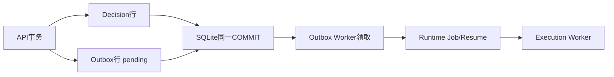

# SQLite、Alembic、事务、CAS、幂等与Outbox怎样配合

**归档日期**：2026-07-30  
**分类**：工程基础  
**关联源码**：`backend/app/product_sessions/database.py`、`backend/migrations/`、`backend/app/harness/commands.py`、`backend/app/governance/outbox.py`、`backend/app/runtime_execution/service.py`

## 问题

Chat为什么不把所有状态只放Python对象？SQLite、SQLAlchemy、Alembic、事务、CAS、幂等键与Outbox各自解决哪种
可靠性问题？它们和C++程序写文件有什么区别？

## 1. 一个具体场景

用户批准一个等待中的模型调用。API进程在“保存Decision”后立刻退出。重启后Outbox Worker仍能发布恢复命令，
Execution Worker从Checkpoint继续；同一按钮重复提交不会执行两次。



## 2. 要解决的问题

内存对象随进程退出消失；只写数据库再发内存消息会在两者之间崩溃；重复HTTP会重复建对象；两个浏览器同时修改
旧版本会互相覆盖。持久Store、事务、CAS、幂等与Outbox分别封住这些窗口。

## 3. 一句人话定义

- **SQLite**：本地关系数据库进程内库文件；不是JSON日志，也不是浏览器存储。
- **SQLAlchemy AsyncSession**：Python对一次数据库工作单元的接口；不是Product Session。
- **Alembic migration**：数据库Schema从版本A变到B的可重复脚本；不是运行时数据修复万能工具。
- **事务（Transaction）**：一组写入全成或全不成；不是跨文件系统/Provider的分布式原子保证。
- **CAS**：Compare-And-Swap，用期望row version/hash拒绝过期写；类似C++原子比较交换的业务版。
- **幂等（Idempotency）**：同一命令重复提交得到同一效果；不是“失败就随便重试”。
- **Outbox**：把“要发布的事件”与业务事实写进同一事务，之后可靠转发；不是普通日志表。

## 4. 一个具体对象样本

```json
{
  "command": {"command_id": "approve-123", "payload_hash": "abc", "result_ref": "decision-9"},
  "row": {"id": "draft-1", "row_version": 4},
  "client_update": {"expected_row_version": 4},
  "outbox": {"aggregate_id": "decision-9", "status": "pending", "attempt_count": 0},
  "after_publish": {"status": "published", "runtime_interrupt": "resumed"}
}
```

同一`command_id`配不同payload hash必须报幂等冲突，不能把第二个请求当成第一次成功结果。

## 5. 生命周期

| 对象 | 创建/存储 | 状态变化 | 谁消费 |
|---|---|---|---|
| Engine/SessionFactory | `ProductDatabase` | 应用启动到关闭 | 各Application Service |
| DB Transaction | Coordinator | begin→commit/rollback | 一个业务用例 |
| Schema revision | Alembic | upgrade链 | 应用启动前/部署流程 |
| Command record | 幂等Recorder | 首次写入后复用 | 重复API调用 |
| row_version/hash | 领域记录 | 成功写入递增/变更 | CAS检查 |
| Outbox row | 业务事务 | pending→claimed→published/failed | Outbox Worker |

协作者Repository若参与同一原子用例，必须接收调用方AsyncSession，不能自己偷偷commit。

## 6. 为什么这样设计

替代方案是每个Service方法自己开事务、成功后直接调用Worker。这样代码局部看起来独立，却会产生半提交：Decision
写了但Resume丢了，或Resume发了但Decision回滚。当前由Application Coordinator拥有事务，Outbox桥接异步边界。
代价是必须处理claim、重试和对账，但故障位置可解释。

SQLite适合当前单机工程阶段，不等于目标系统永远只支持SQLite；领域服务依赖合同和事务语义，不能依赖SQLite偶然行为。

## 7. 代码链

| 顺序 | 源码入口 | 输入 | 输出/不变量 |
|---:|---|---|---|
| 1 | [`ProductDatabase`](../../backend/app/product_sessions/database.py) | database URL | Async Engine/SessionFactory |
| 2 | Alembic revision（[`backend/migrations`](../../backend/migrations)） | 当前Schema版本 | 新Schema |
| 3 | [`HarnessCommandRecorder`](../../backend/app/harness/commands.py) | command id/hash | 幂等结果或冲突 |
| 4 | Application Coordinator | expected row version/hash | CAS成功或409 |
| 5 | Governance事务 | Decision＋Outbox | 同一commit |
| 6 | [`GovernanceOutboxWorker`](../../backend/app/governance/outbox.py) | pending行 | claim/dispatch/publish |
| 7 | [`RuntimeExecutionService`](../../backend/app/runtime_execution/service.py) | resume/enqueue | Runtime Job/Event |

## 8. 亲手验证

```bash
.venv/bin/python -m pytest -q \
  backend/tests/test_governance_idempotency.py \
  backend/tests/test_continuous_chat.py::test_outbox_worker_resumes_recorded_decision_after_api_process_restart
```

再做3个受控实验：同一command相同payload提交2次；同一command不同payload提交；两个客户端用同一个旧
`row_version`修改。预期分别是同效果、幂等冲突、一个成功一个CAS冲突。用只读SQL只查状态和ID：

```sql
SELECT aggregate_id, status, attempt_count FROM governance_outbox ORDER BY created_at DESC LIMIT 10;
SELECT version_num FROM alembic_version;
```

## 9. 掌握验收

1. 数据库事务能否把Provider HTTP调用也变成原子操作？为什么？
2. 幂等和CAS分别阻止哪种重复/并发错误？
3. 为什么Outbox必须和Decision同事务写入？
4. Repository自己commit会破坏什么？
5. 从SQLite迁移到其他数据库时，哪些业务不变量必须保持？

## 关键文件

| 文件 | 职责 |
|---|---|
| `backend/app/product_sessions/database.py` | 物理数据库入口与SessionFactory |
| `backend/migrations/` | Alembic Schema版本迁移 |
| `backend/app/harness/commands.py` | Product命令幂等 |
| `backend/app/governance/outbox.py` | 治理事件可靠发布 |
| `backend/app/runtime_execution/service.py` | Job/Lease/Event持久状态机 |

## 补充记录

- 2026-07-30：补齐M19从C++直觉到当前Store代码的L1/L2实验入口。
