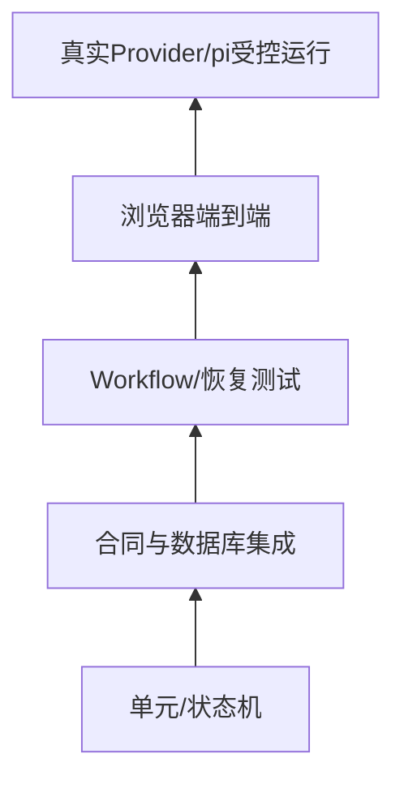

# 测试金字塔、质量门与安全修改怎样配合

**归档日期**：2026-07-30  
**分类**：工程基础  
**关联源码**：`backend/tests/`、`frontend/src/**/*.test.*`、`scripts/verify.sh`、`scripts/check-project-mastery.py`、`docs/quality-gates.md`

## 问题

测试通过到底证明了什么？要修改一个Chat能力，怎样从小测试到真实端到端逐级获得证据，而不是“pytest全绿就等于
产品完成”或每次都只靠手工点页面？

## 1. 一个具体场景

需求：`Context来源被用户排除后，不得再次进入Provider请求。`

安全修改不是只改`ContextInspector`复选框，而要固定5层证据：领域revision规则、API/HITL合同、Workflow节点、
Provider前零泄漏、浏览器可见表现。



图向上越接近真实用户，速度更慢、环境变量更多，但能证明的范围也更大。

## 2. 要解决的问题

只写单元测试可能漏掉路由和事务；只写大E2E失败时难定位；只跑真实模型又有不确定输出、成本和秘密边界。
因此不同测试各自证明一层，不互相冒充。

## 3. 一句人话定义

- **单元测试**：隔离一条纯规则/小状态机；不是所有依赖都Mock掉的大函数测试。
- **合同测试**：固定DTO、状态转换、错误和边界不变量。
- **集成测试**：让多个真实模块和临时数据库协作。
- **端到端测试（E2E）**：从用户入口到最终可见结果穿透系统；模型语义需使用分级预言机。
- **质量门**：合并/交付前必须通过的一组检查；不是一条万能命令。
- **回归指纹**：Schema、节点/边、Hash、事件或用户语义等不能无意改变的可比事实。

## 4. 一个具体测试样本

```json
{
  "scenario": "SC05",
  "input": "继续推进贪吃蛇",
  "controlled_decision": "skip context package revision 1",
  "exact_oracle": {
    "new_revision": 2,
    "previous_package_id": "revision-1-id",
    "accepted_context_items": [],
    "provider_attempts_before_next_approval": 0
  },
  "semantic_oracle": "UI清楚显示来源已排除",
  "observe_only": ["elapsed_ms", "token_count"]
}
```

exact、semantic、observe和gap四级断言必须先写；不能对模型自然语言逐字比较，也不能对安全Hash只做模糊判断。

## 5. 测试证据生命周期

| 层 | 谁创建 | 运行位置 | 证明 | 不能证明 |
|---|---|---|---|---|
| 纯规则 | 开发者 | 单进程 | 函数/状态机 | 真实路由/数据库 |
| API/DB合同 | 后端测试 | 临时SQLite | 事务、Schema、错误 | 浏览器交互 |
| Workflow/故障 | 集成测试 | MAF＋Store | 节点、恢复、不变量 | 真实Provider质量 |
| 前端类型/构建 | 前端工具 | Node/Vite | 类型、生产打包 | 用户目标达成 |
| 浏览器E2E | 浏览器＋服务 | 全栈 | 实际交互和网络 | 长期稳定性 |
| 真实Run | 已配置Provider/pi | 受控环境 | 当前版本真实外部链 | 所有随机输入 |

每份证据绑定代码快照、版本和环境；历史Run不得冒充当前版本。

## 6. 为什么这样设计

替代方案A是大量Mock：快，却可能测试自己的假实现。替代方案B是所有测试都启动浏览器和真实模型：可信但慢、
不稳定且难以覆盖故障。当前采用分层组合，测试替身用于精确状态合同，真实Run用于验证不可替代的外部边界。

测试文件也不按“每个生产文件一个测试文件”机械映射，而按行为合同和失败风险组织。

## 7. 安全修改代码链

| 顺序 | 动作 | 当前项目入口 | 退出条件 |
|---:|---|---|---|
| 1 | 写清目标与失败预言机 | `项目掌握/调试实战/scenario-manifest.json` | exact/semantic/observe/gap明确 |
| 2 | 固定最小状态机 | `backend/tests/test_*.py` | 红测试能复现风险 |
| 3 | 修改事务所有者 | Application Service/Coordinator | 不把逻辑塞Router |
| 4 | 验证架构/Schema/Workflow指纹 | 架构测试、学习检查器 | 节点/边/依赖符合规则 |
| 5 | 前端类型与生产构建 | `npm`脚本 | 0类型/构建错误 |
| 6 | 运行相关场景 | SC卡指定pytest/断点 | Store/Trace/UI一致 |
| 7 | 必要时真实Run | 安全Prompt、脱敏证据 | 同版本外部链通过 |

## 8. 亲手验证

基础质量门从仓库现有脚本/包命令读取，先执行与修改最相关的最小集合，再跑全量。本文不复制可能变化的脚本内容；
当前可固定执行：

```bash
.venv/bin/python scripts/check-project-mastery.py
.venv/bin/python -m pytest -q backend/tests/test_architecture_contract.py
cd frontend && npm run build
```

练习：给`runtimeReconnectDelayMs`增加一个边界用例，先让测试失败，再实现；然后说明它只证明前端退避计算，不能
证明Worker断线恢复。再选SC12运行后端合同，最后才用浏览器手工断网验证可见状态。

## 9. 掌握验收

1. 自动测试替身和真实Provider Run分别能证明什么？
2. 为什么模型文案用semantic oracle，Hash/Attempt数用exact oracle？
3. 修复Router错误为什么还可能需要事务/恢复测试？
4. 无行为重构前应固定哪些回归指纹？
5. 怎样判断“测试全绿但功能仍未完成”？

## 关键文件

| 文件 | 职责 |
|---|---|
| `backend/tests/` | 领域、API、Workflow、故障和集成合同 |
| `frontend/`测试与构建脚本 | 前端逻辑、类型和生产Bundle |
| `docs/quality-gates.md` | 当前工程质量门基线 |
| `scripts/check-project-mastery.py` | 学习资产与源码/Workflow覆盖反向校验 |
| `项目掌握/调试实战/scenario-manifest.json` | 场景预言机和自动证据入口 |

## 补充记录

- 2026-07-30：补齐M20测试分层、预言机和安全修改的L1/L2/L3训练入口。

