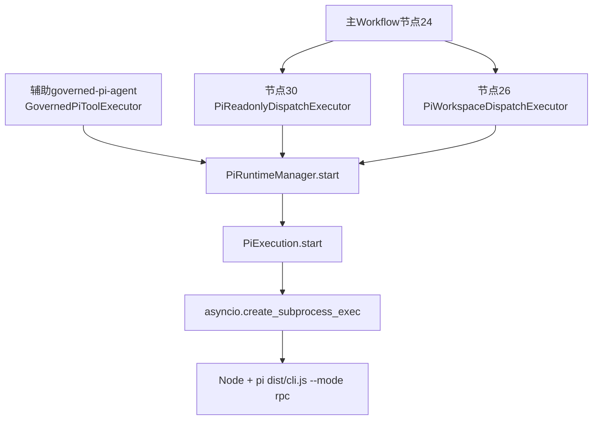
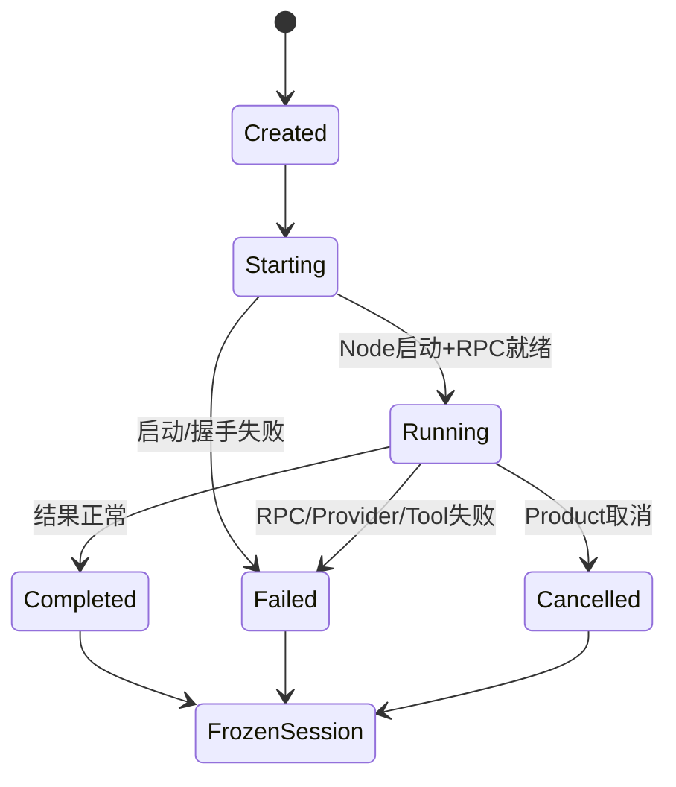

# pi子进程在哪里启动

**归档日期**：2026-07-29
**分类**：执行层与pi运行时

## 1. 直接答案

真正创建操作系统子进程的位置是：

```python
# backend/app/pi_runtime.py::PiExecution.start
self.process = await asyncio.create_subprocess_exec(...)
```

当前普通Chat发送链先走持续协作主Workflow。只有S4节点24把已授权RunSpec路由为`pi_readonly`或
`pi_workspace`时，S5节点30或26才调用`PiRuntimeManager.start()`，最终到达上述代码。

独立辅助Workflow `governed-pi-agent`也能进入同一Manager/Execution，但它不是当前普通发送区的可选根流程。

## 2. 一个具体场景

你批准一份`pi_workspace` RunSpec。节点25准备隔离worktree，节点26把任务交给pi。此时后端先创建
`PiExecution`对象，再启动Node进程运行pi的`dist/cli.js --mode rpc`。pi不是FastAPI启动时常驻的服务，
而是有实际执行任务时按需创建。

## 3. 基础概念

| 概念 | 人话定义 |
|---|---|
| `PiRuntimeManager` | Chat内管理当前活动pi execution的注册表和入口 |
| `PiExecution` | 一次pi子活动的Python侧控制对象 |
| Node子进程 | 真正运行pi TypeScript构建产物的OS进程 |
| JSONL-RPC | Chat与pi通过stdin/stdout一行一个JSON对象通信的协议 |
| pi Runtime Session | 本次pi内部转录文件；用于复核，不是Product Session |

## 4. 当前主链与辅助链



两条入口共享底层Runtime，不代表两个Workflow的产品语义相同。主Workflow前面已有Intent、Context、Draft、
RunSpec和执行路由；辅助图用于独立配置/测试/演示。

## 5. 四层调用链

### 5.1 Workflow dispatch

主链入口是：

- `execution_dispatch/workflow.py::PiReadonlyDispatchExecutor`
- `execution_dispatch/workflow.py::PiWorkspaceDispatchExecutor`

它们根据已批准RunSpec准备`task/config/tool_execution_id/workspace`，再通过pi Tool/Gateway调用Manager。

### 5.2 `PiRuntimeManager.start`

`backend/app/pi_gateway.py::PiRuntimeManager.start`会：

1. 校验Provider/模型选择和安全配置快照。
2. 清理任务并生成本次内部认证token。
3. 创建`PiExecution`。
4. 把它登记进`_executions`，便于Provider/Tool回调找到所有者。
5. 调用`await execution.start()`。

### 5.3 `PiExecution.start`

`backend/app/pi_runtime.py::PiExecution.start`会：

1. 排他创建本次pi Runtime Session文件。
2. 生成受限Extension和进程参数。
3. 根据调试快照可选加入`--inspect`/`--inspect-brk`。
4. 调用`asyncio.create_subprocess_exec`启动Node。
5. 启动stdout/stderr读取任务。
6. 通过stdin发送`set_auto_retry=false`和`prompt`等JSONL-RPC命令。

### 5.4 Node/pi内部

pi以RPC模式进入自己的Agent Session循环，提出Provider和Tool请求。Chat仍是控制边界：请求返回Chat后，
必须经过ModelCallDraft/Decision/Grant/Attempt或ToolExecution/Operation，才会真正发送或产生副作用。

## 6. 启动参数为什么这么严格

启动参数的设计意图包括：

- `--mode rpc`：不用TUI，通过机器协议通信。
- `--provider chat-governed`：Provider请求回到Chat治理边界。
- 禁用自动发现的extensions/skills/prompt templates/themes/context files：避免pi自行扩大输入和能力。
- `--approve --offline`：pi内部UI审批不是产品授权，外部调用仍由Chat控制。
- 显式Session路径：每次ToolExecution生成独立可复核转录。

完整参数可能包含本轮私密内容或短期token，不应打印到文档、Trace或聊天。

## 7. pi Session保存了什么，不保证什么

当前每个ToolExecution生成新的`chat-<tool_execution_id>` pi Session，终态后冻结为当前用户只读，并把
Session ID、字节数、SHA-256和Product Run映射写入`ToolExecution.metrics.pi_session`。

| 对象 | 当前用途 |
|---|---|
| pi Runtime Session JSONL | 复核本次pi收到的Prompt、回复和Tool消息 |
| Product Session Message/Run/Trace | 用户可恢复的权威对话和运行事实 |
| ModelCall/ToolExecution账本 | Provider/Tool的Hash、决定、Attempt和处置 |
| MAF Workflow Checkpoint | 恢复主Workflow安全点 |

pi Session不会自动续聊。下一次执行必须重新从当前ContextPackage、RunSpec和审批版本开始，否则会形成第二套
不可见上下文。

## 8. 失败与生命周期



- Node启动失败必须关闭ToolExecution，不能只在stderr留一行。
- 固定Inspector端口调试时只允许一个活动execution。
- 进程退出不自动代表Product Run成功；S5装配、Evidence、S6决定和S7最终化仍未完成。
- edit后崩溃需要根据Tool Operation账本和Workspace对账，不能只重启pi。

## 9. 调试pi源码的正确方式

使用两个VS Code窗口：

1. pi窗口打开`/Users/xulater/Code/opc-os/pi`，选择`Attach to Chat pi Runtime (9230)`等待附加。
2. Chat窗口打开`/Users/xulater/Code/Chat`，选择`Chat Full Stack (pi External Debug)`。
3. 发送会进入pi分支的任务，Chat创建带`--inspect-brk=127.0.0.1:9230`的子进程。
4. pi窗口附加后按F5继续并命中TypeScript断点。

普通`Chat Full Stack`仍会真实使用pi，只是不加Inspector。完整步骤见
[Chat与pi的两种调试模式](../调试实战/Chat与pi的两种调试模式.md)。

## 10. 亲手验证

1. 在`ExecutionRouteExecutor`确认`answer_only`任务不会进入Manager。
2. 在`PiRuntimeManager.start`记录Product Run、ToolExecution和execution内部token之间的关联，不输出token值。
3. 在`PiExecution.start`前确认非敏感参数含`--mode rpc`和`chat-governed`。
4. 在操作系统进程列表观察Node只在pi任务期间出现。
5. 执行结束后确认pi Session被冻结，但Product Run仍要经过S6/S7才成功。

## 11. 掌握验收

1. 真正创建OS进程的是哪个函数？
2. Manager和Execution各负责什么？
3. 为什么pi不是后端启动时常驻？
4. JSONL-RPC消息为什么不是Tool授权？
5. pi进程正常退出为什么不等于Product Run成功？

## 关键文件

| 文件 | 职责 |
|---|---|
| `backend/app/execution_dispatch/workflow.py` | 主Workflow的pi只读/Workspace dispatch |
| `backend/app/workflows/pi_agent.py` | 辅助governed-pi-agent入口 |
| `backend/app/pi_gateway.py` | PiRuntimeManager和Provider网关 |
| `backend/app/pi_runtime.py` | PiExecution、子进程和JSONL-RPC |
| `backend/app/tool_execution/` | ToolExecution/Operation账本 |
