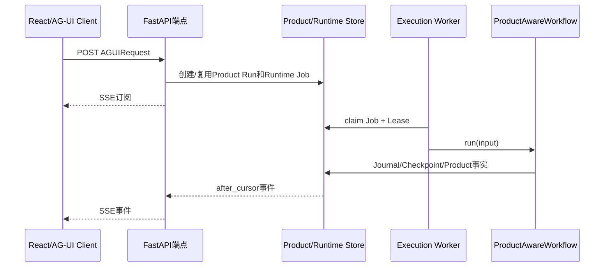
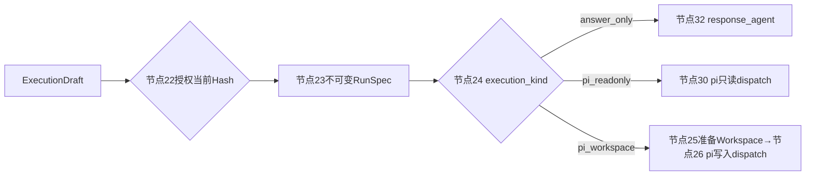

# 从用户点击发送到pi执行的完整链路

**归档日期**：2026-07-29
**分类**：执行层与pi运行时
**当前主入口**：`continuous-collaboration` v1.8.0

## 1. 一个具体场景

你在Chat网页输入：

> 找出项目掌握文档中的旧Workflow口径，先给我执行草稿，批准后在隔离Workspace修改并运行检查。

当前普通发送区不会让你选择`governed-pi-agent`辅助Definition。它只选择可发送的主Workflow
`continuous-collaboration`。主图先完成S1–S3理解，再在S4把已授权RunSpec路由到`pi_workspace`，S5的
`PiWorkspaceDispatchExecutor`才启动pi。

## 2. 全链一句话

```text
React提交
-> AG-UI POST主Workflow端点
-> Product Run + Runtime Job
-> Execution Worker领取
-> ProductAwareWorkflow启动39节点MAF图
-> S1–S3理解和规划
-> S4 ExecutionDraft审批/RunSpec/执行路由
-> S5 pi dispatch
-> PiRuntimeManager
-> PiExecution启动Node子进程
-> JSONL-RPC + Provider/Tool治理
-> Evidence/S6/S7提交
-> Event Journal/SSE
-> React渲染
```

## 3. 先认识6个“运行”

| 名称 | 人话解释 |
|---|---|
| 浏览器发送动作 | 一次UI事件，不是产品运行事实 |
| AG-UI HTTP/SSE | 一次请求与实时订阅，断线不应取消业务运行 |
| Product Run | 这次发送的长期业务状态 |
| Runtime Job/Lease | Worker可领取、续租和接管的执行任务 |
| MAF Workflow Run | 39节点图的一次运行语义 |
| pi Execution | S5内部按RunSpec启动的一次编码Agent子活动 |

它们的ID需要显式关联，不能因为都叫`run`就合成一个对象。

## 4. 12步真实时间线

| # | 代码入口 | 拿到什么 | 做什么 | 输出/可见变化 |
|---:|---|---|---|---|
| 1 | `App.tsx::submit` | 输入框text、当前Session、主Workflow Definition | 清空草稿，打开Workflow工作台，调用`send` | 页面进入running |
| 2 | `use-chat-agent.ts::send` | text、workflow id/version/endpoint | 给`HttpAgent`加User Message并调用`runAgent` | 发AG-UI JSON |
| 3 | `runtime_execution/endpoint.py::durable_agent_endpoint` | `AGUIRequest` | `prepare_agui_run`接纳Product Run，再入队Runtime Job | 立即建立SSE，不在HTTP进程跑图 |
| 4 | `runtime_execution/worker.py::run_once/_execute_claim` | 可领取Job | 领取Lease，从Registry取对应Runner | 事件写Journal |
| 5 | `workflows/runtime.py::ProductAwareWorkflow.run` | Product Run关联和AG-UI input | 建立图外产品生命周期，启动MAF图 | Checkpoint/Trace开始 |
| 6 | S1–S3主Workflow节点 | Message、Context、Intent、Plan | 形成已接受目标和可选Plan | UI可能出现Context/Intent/Plan卡 |
| 7 | `ExecutionDraftCompilerExecutor` | 目标、Context、Plan、能力、验证 | 编译可编辑Draft | UI显示执行合同 |
| 8 | `execution_authorization`→`RunSpecCompilerExecutor` | 当前Draft revision/hash和决定 | 消费一次性Grant，编译不可变RunSpec | 获准执行版本确定 |
| 9 | `ExecutionRouteExecutor` | RunSpec | 选择`answer_only/pi_readonly/pi_workspace` | 只有后两者进入pi |
| 10 | `PiReadonlyDispatchExecutor`或`PiWorkspaceDispatchExecutor` | RunSpec、Snapshot、Tool配置 | 调用`PiRuntimeManager.start` | 创建ToolExecution/pi execution |
| 11 | `PiExecution.start` | 已治理任务和安全运行快照 | `asyncio.create_subprocess_exec`启动Node+pi CLI RPC模式 | pi进程出现，stdin/stdout传JSONL |
| 12 | Provider/Tool Gate→S5–S7 | pi请求、Tool结果、Evidence、候选 | 逐次审批/执行/对账，最终幂等提交产品事实 | Journal→SSE→React终态 |

## 5. 前端到底发送了什么

`App.tsx::submit`使用当前`selectedWorkflow`。当前目录只有主Workflow是`selectable=True`，因此普通用户链是：

```tsx
void send(text, control, {
  endpointUrl: workflowEndpointUrl(selectedWorkflow.endpoint),
  workflowId: selectedWorkflow.id,
  workflowVersion: selectedWorkflow.version,
});
```

`use-chat-agent.ts::send`把这些信息放进AG-UI运行请求。浏览器提交的是协议DTO和选择，不拥有Product Run、
Approval或RunSpec；后端会重新校验Definition和访问范围。

## 6. 为什么HTTP端点不直接执行39节点



模型/Tool可能运行几分钟。若HTTP进程直接拥有执行，浏览器断线或API重启就会让运行真相消失。Job、Lease、
Journal把“接纳”“执行”“订阅”分开，允许重连和Worker接管。

## 7. 主Workflow怎样决定使用pi

节点24只读取已授权RunSpec：



路由不再重读用户原话，也不能把只读授权升级成可写。`governed-pi-agent`仍存在于6个Workflow目录中，
用于独立配置/测试/演示3节点pi图；它不是当前普通发送链的选择入口。

## 8. pi子进程怎样启动

```text
PiReadonlyDispatchExecutor / PiWorkspaceDispatchExecutor
-> PiRuntimeManager.start(task, config, tool_execution_id, ...)
-> 创建PiExecution并登记到_executions
-> PiExecution.start()
-> asyncio.create_subprocess_exec(
     node,
     --enable-source-maps,
     pi dist/cli.js,
     --mode rpc,
     --provider chat-governed,
     ...
   )
```

真实参数还包含受控Session、扩展、离线和禁用自动发现等设置。不要把完整参数、System Prompt、环境变量或
Provider凭据复制到文档/Trace。

## 9. JSONL-RPC不等于授权

pi通过stdin/stdout提出：

- 一次Provider请求；
- 一次`read/grep/find/ls/edit`请求；
- 最终结果或错误事件。

Chat收到请求后仍要创建ModelCallDraft、Decision/Grant/Attempt或ToolExecution/Operation。RPC消息只表示
“pi想做”，不是“已经获准做”。真正的Provider传输和Tool副作用由Chat Gate控制。

## 10. 可写与只读路径的差异

| 项目 | `pi_readonly` | `pi_workspace` |
|---|---|---|
| Workspace | 绑定Snapshot只读视图 | 受管detached Git worktree |
| Tool | read/grep/find/ls | 有界读取+绑定Hash的精确edit |
| 节点 | 30–31 | 25–29 |
| Evidence | 只读结果/Trace | diff Artifact、Validation、Completion Claim |
| 是否提交Git | 否 | 仍不自动commit/push |

## 11. 失败和恢复

- 浏览器断线：Product Run/Worker继续；重连用Cursor补事件。
- API进程重启：Job和Journal仍在Store，执行不由SSE连接拥有。
- Worker失去Lease：旧Worker不能写终态；Reconciler决定接管。
- pi启动失败：ToolExecution失败关闭，不能返回假成功。
- Tool请求已派发但响应丢失：进入`outcome_unknown`并先对账，不能盲重试。
- 等待审批：Decision持久化，MAF Checkpoint保存图位置。

## 12. 推荐断点

1. `frontend/src/App.tsx::submit`：`selectedWorkflow.id/version`。
2. `backend/app/runtime_execution/endpoint.py::durable_agent_endpoint`：`accepted.product_run_id`。
3. `backend/app/runtime_execution/worker.py::_execute_claim`：Job/Lease/endpoint key。
4. `backend/app/workflows/runtime.py::ProductAwareWorkflow.run`：Product Run与MAF映射。
5. `backend/app/execution_dispatch/workflow.py::ExecutionRouteExecutor.handler`：RunSpec execution kind。
6. `backend/app/pi_gateway.py::PiRuntimeManager.start`：安全task/config和ToolExecution ID。
7. `backend/app/pi_runtime.py::PiExecution.start`：参数只核对非敏感开关。
8. Provider/Tool Gate：Decision、Grant、Attempt/Operation关联。

## 13. 亲手验证

1. 用`answer_only`任务证明不会创建pi子进程。
2. 用只读任务证明走节点30–31，Tool列表无edit。
3. 用可写任务证明先经过节点22授权，再创建隔离Workspace和pi进程。
4. 中断浏览器SSE再重连，确认同一Product Run继续而非新建重复Run。
5. 从一个ToolOperation ID反查pi execution、Product Run、RunSpec和Decision Hash。

## 14. 掌握验收

1. 为什么当前普通链不从`governed-pi-agent`端点开始？
2. Product Run、Runtime Job、MAF Run和pi Execution各是谁？
3. HTTP端点为什么只接纳和订阅，不跑完整Workflow？
4. 节点24为什么只能读RunSpec？
5. pi提出Tool请求后，Chat还要做哪几层治理？

## 关键文件

| 文件 | 职责 |
|---|---|
| `frontend/src/App.tsx` | Composer提交和主Workflow选择 |
| `frontend/src/use-chat-agent.ts` | AG-UI HttpAgent消息与运行 |
| `backend/app/runtime_execution/endpoint.py` | Product Run接纳、Job入队、SSE Cursor订阅 |
| `backend/app/runtime_execution/worker.py` | Job领取、Lease和Runner执行 |
| `backend/app/workflows/runtime.py` | ProductAwareWorkflow与图外产品生命周期 |
| `backend/app/execution_dispatch/workflow.py` | S4执行路由与S5 pi dispatch |
| `backend/app/pi_gateway.py` | PiRuntimeManager |
| `backend/app/pi_runtime.py` | PiExecution子进程和JSONL-RPC |
