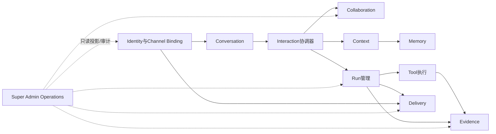
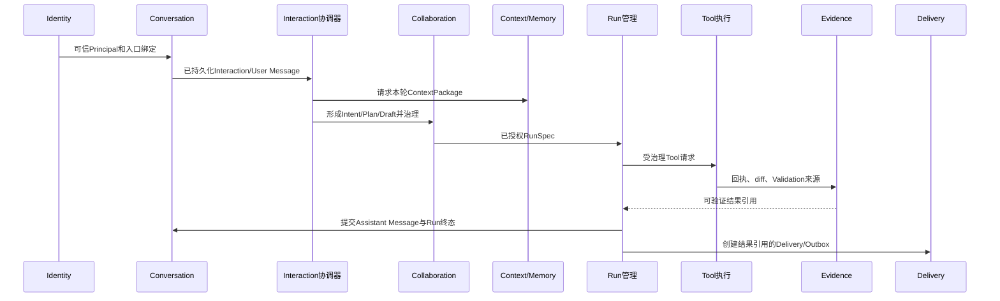

# 11个产品模块的职责与代码落点

**归档日期**：2026-07-29
**更新日期**：2026-07-30
**分类**：架构与模块
**事实状态**：11模块总体架构已批准；各模块实现成熟度不同

## 1. 一个具体场景

你说：

> 继续Chat项目，改完文档后把结果发回当前网页；以后我也可能从Telegram继续。

这一句话不是“一个Agent模块”完成的。它至少牵涉：谁是你、哪段会话、目标是什么、采用哪些Context、
如何执行、Tool是否真的发生、结果证据、怎样发回入口，以及管理员能看见哪些运营事实。

## 2. 为什么要分模块

模块不是按文件数量切块，而是按4个问题划边界：

1. 谁拥有这类权威状态？
2. 哪些状态必须在同一个事务里改变？
3. 失败后由谁恢复或对账？
4. 哪类需求变化会让这部分代码一起变化？

若把所有逻辑放进Workflow Executor，一个路由函数就会同时拥有用户、消息、审批、Run、Tool和Evidence，
任何修改都可能破坏全链路，也无法判断失败后该重放哪一步。

## 3. 先从0计算：11个模块怎样产生

### 3.1 先有场景，后有模块

总体架构先要覆盖9类用户场景：

1. 重新打开旧会话并继续。
2. 用户纠正系统误解的Intent或Plan。
3. 高风险外部操作只能在精确审批后发生。
4. 浏览器断线重连后继续查看同一次Run。
5. Worker在Tool调用前后崩溃时，系统能判断是重试、对账还是停止。
6. 从OPC-OS Chat进入同一产品会话和工作。
7. Context/Evidence来源被删除或权限被撤销后，派生结论不再被静默使用。
8. 从Telegram等Channel收发同一工作结果，并分清产品完成和平台送达。
9. 超级管理员受授权、受审计地查看用户、使用、Work、Artifact和异常。

每个场景都要按同一算法继续追问：

```text
用户目的
→ 可能的失败/越权/假成功
→ 系统必须守住的保证
→ 为保证而必须持久化的对象或政策
→ 对象的创建者、修改者、生命周期、事务和恢复者
→ 候选责任
```

例如“Worker在Tool后崩溃”不会直接得到“要用MAF”，而会得到两组必须分开的事实：

- Run需要Attempt、Job、Lease、Event和恢复动作，因为它要判断“这次运行还由谁执行”。
- Tool需要Execution、Operation、幂等键、回执和对账，因为它要判断“外部副作用到底发生了没有”。

这两个问题的生命周期和恢复方式不同，所以不能用一个`run_status`字段合并。

### 3.2 第一轮会得到13个候选，不是11个

| # | 候选责任 | 最小独立性证据 |
|---:|---|---|
| 1 | Identity | Principal、认证会话、Role/Grant的安全生命周期 |
| 2 | Channel Binding | 外部sender/chat与Principal/Product Session的映射、revision和撤销 |
| 3 | Conversation | Product Session、Interaction、Message、分支/归档的长期生命周期 |
| 4 | Interaction协调 | 一次入站的幂等、顺序和跨模块用例边界 |
| 5 | Intent / Work / Plan | 用户可修正的目标、计划、版本与接受状态 |
| 6 | Execution Governance | Draft、Decision、Grant、Approval Hash和RunSpec的确定性安全门 |
| 7 | Context | 本轮真正采用的来源、revision、预算和选择理由 |
| 8 | Memory | 明确接受、可跨会话复用、可因来源失效的长期记忆 |
| 9 | Run Management | Product Run、Attempt、Job、Lease、Event、Cursor和恢复动作 |
| 10 | Tool Execution | ToolExecution、Operation、外部回执、幂等和结果未知 |
| 11 | Evidence | Artifact元数据、Validation、Evidence、Completion Claim和Provenance |
| 12 | Delivery | Outbox、Delivery Attempt、Receipt和多接收方重试 |
| 13 | Admin Operations | 用户活动口径、运营投影、新鲜度和管理员访问审计 |

### 3.3 为什么13最后变成11

当前批准粒度做了2次顶层合并：

1. **Identity + Channel Binding → Identity与Channel Binding**：当前两者共同完成“外部发送者如何成为可信Principal，可访问什么”；但内部对象不合并。若将来Binding出现独立管理员、合规或迁移生命周期，应重新审核拆分。
2. **Intent/Work/Plan + Execution Governance → Collaboration**：两者共同定义人和AI正在协作完成什么、什么候选已被接受、什么精确动作可执行；代码上仍保留`collaboration_*`、`harness/`与`governance/`子边界。

```text
13个候选 - 2次顶层合并 = 11个当前产品模块
```

这是基于已批准场景、设计和源码重建的可审核推导，不是宣称当初就有一份完整的“13减2”历史稿。
更完整的场景→风险→保证→候选链见[Chat总体架构与一次点击的七层链路](./Chat总体架构与一次点击的七层链路.md#7-11个产品模块不是列出来的从0推导全过程)。

## 4. 每个最终模块为什么不能被相邻模块吃掉

| 模块 | 与相邻模块必须分开的冲突 |
|---|---|
| Identity与Channel Binding | Principal和授权是信任事实；Conversation ID、Telegram chat ID或AG-UI thread ID都只是关联ID，不能反向充当权限 |
| Conversation | 它保存“发生过什么”；Context保存“本轮选了什么”，Memory保存“什么被允许长期复用” |
| Collaboration | 它决定目标、计划和已授权执行合同；Run只执行已编译的RunSpec，不应在运行中偷换目标 |
| Context | 每次Run的来源和预算会变，且需要可复现；Conversation全历史和Memory长期接受都不能直接等于本轮Context |
| Memory | 只有明确接受的候选才可跨会话复用；Message出现过或Context用过都不代表已接受 |
| Interaction协调器 | Interaction可能产生0..n个Run，也可能只答复、修正Work或等待审批；因此不能与Run管理一对一合并 |
| Run管理 | Product Run是长期用户事实，Attempt/Job是执行尝试，MAF Checkpoint是框架控制点；三者可映射但不能合并 |
| Tool执行 | 外部副作用可能在Chat未拿到回应时已发生；Run失败重试不能直接推导Tool应重试 |
| Evidence | 它回答“结果凭什么成立”；Tool回答“操作发生了什么”，Delivery回答“结果有没有送达” |
| Delivery | 它在产品结果已提交后通过Outbox/Attempt/Receipt送达；送达失败不应倒退Run或重新生成答案 |
| Super Admin Operations | 只从权威模块的公开查询/事件建可重建投影；不拥有Work、Artifact或Run终态，也不能因高权限跳过敏感内容访问审计 |

## 5. 11模块总图



箭头表示通过公开合同依赖，不表示一个模块可以直读另一个模块的私表。

## 6. 11个模块逐一解释

| # | 模块 | 用户价值 | 拥有的核心对象 | 明确不负责 | 当前代码落点/状态 |
|---:|---|---|---|---|---|
| 1 | Identity与Channel Binding | 知道“谁在操作、从哪个入口来、可访问什么” | Principal、Authentication Session、Role/Grant、Channel Binding | 不用`threadId/chatId`冒充身份 | 目标已批准，正式实现尚未开始；概念见`概念空间/Chat/身份与外部入口.md` |
| 2 | Conversation | 保存可重开的对话和消息证据 | Product Session、Interaction、Message、分支/归档 | 不保存MAF控制流位置 | 当前纵向实现主要在`backend/app/product_sessions/`、`frontend/src/features/session/` |
| 3 | Collaboration | 把输入变成可修正的目标、计划和执行治理对象 | Intent、Plan、ExecutionDraft、RunSpec、Decision、Grant、Approval | 不直接执行Tool，不把模型候选当事实 | `collaboration_intents/`、`collaboration_protocols/`、`harness/`、`governance/`；**当前局部实现** |
| 4 | Context | 给本轮装配有来源、有预算、有版本的输入 | ContextPackage、Context Item、Source Adoption、Repository Snapshot引用 | 不拥有完整Message或长期Memory | `collaboration_contexts/`、`project_resources/`、`step_inputs/`、`harness/`；directory/detail纵向链已实现 |
| 5 | Memory | 保存明确接受、可长期复用的事实/偏好 | Accepted Memory、revision、失效关系 | 不把TurnSummary或模型自述自动当Memory | `harness/`、`governance/turn_digest.py`和S6/S7候选链承载一部分；**完整来源失效与独立能力尚未完成** |
| 6 | Interaction协调器 | 让一次用户输入按同一用例边界穿过各模块 | 用例协调状态、幂等命令、步骤关联 | 不成为所有领域表的拥有者 | `product_sessions/service.py::prepare_agui_run`、`workflows/runtime.py`、`workflows/continuous_chat*.py`；统一多Channel Ingress未实现 |
| 7 | Run管理 | 断线、暂停、取消、接管后仍知道运行真相 | Product Run/Attempt、Runtime Job、Lease、Event、Trace、恢复动作 | 不把HTTP连接或MAF完成当产品成功 | `product_sessions/`、`runtime_execution/`、`workflows/runtime.py`；**当前局部实现**，完整强退/多设备/故障矩阵仍缺 |
| 8 | Tool执行 | 让每个外部副作用可授权、幂等、对账 | Tool Definition、ToolExecution、Operation、外部回执、补偿记录 | 不自行扩权或决定Run成功 | `tool_execution/`、`execution_dispatch/`、`pi_gateway.py`、`pi_runtime.py`已覆盖只读与隔离edit纵向链 |
| 9 | Evidence | 解释结果凭什么成立、来源是否仍有效 | Evidence、Artifact、Validation、Completion Claim、Provenance | 不用Assistant结论冒充证据 | `evidence/`、`execution_dispatch/result_gate.py`已有SD4-C纵向链 |
| 10 | Delivery | 区分产品结果已完成与外部入口已送达 | Delivery、Outbox、Attempt、Receipt、重试计划 | 不重新生成答案或改变Run终态 | 目标已批准；当前仅有产品Outbox/入口相关基础，不等于完整跨Channel Delivery模块 |
| 11 | Super Admin Operations | 受审计地看谁登录、怎样使用、Work/Artifact进度与异常 | Activity Event/Window、Usage Aggregate、Operations Projection、Admin Audit | 不拥有业务进度、不默认可读正文 | 目标已批准，专项Schema/API/隐私设计和正式实现尚未开始 |

“已批准”只表示边界是产品基线，不表示11个模块都已开发完成。

## 7. 一次消息怎样穿过11模块



Super Admin Operations不在业务写链中，它消费公开事件/查询形成可重建投影；投影失效不能反向改Work。

## 8. 当前目录为什么没有整齐的11个`modules/*`

总体架构先定义目标责任，但当前仓库是按已批准纵向切片逐步演进的。已有代码目录使用
`product_sessions`、`governance`、`tool_execution`等具体能力名，并没有为了让目录看起来漂亮而
批量创建11个空壳。

判断模块是否存在，不能只看是否有同名文件夹，要检查：对象、状态所有者、应用合同、事务边界、失败恢复
和测试是否真实存在。后续重构也不能机械移动目录而改变Schema、Workflow节点或审批Hash。

## 9. 为什么UI、MAF、Store、Trace和Artifact没有另算1个顶层模块

| 名称 | 当前定位 | 不列入11个产品模块的原因 |
|---|---|---|
| React UI | 交互面和可重建投影 | 它展示多模块的事实，不拥有Product真相 |
| MAF Agent/Workflow | 智能控制运行时 | 它拥有Agent/Workflow语义，但不拥有Chat产品授权、Run终态和Evidence |
| Product/Runtime/Artifact Store | 持久化与基础设施 | 它们回答“状态存在哪里”，模块回答“谁拥有并解释状态” |
| Trace/Observability | 跨模块可观察合同 | Product Trace、技术Trace、Evidence审计和运营指标的口径/权限不同，不能粗暴建一个新事实源 |
| Project/Work | Collaboration内部能力，当前一部分由`harness/`承载 | 当前与Intent/Plan/RunSpec共同表达可修正协作；独立权限、事务与恢复成熟时可重审拆分 |
| Artifact | Evidence内部对象，Blob放Artifact Store | 当前主要支撑Validation/Evidence/Claim；若以后有独立编辑、版本、分享和权限生命周期，可升格 |

## 10. 模块间的5条硬边界

1. Conversation的Message、ContextPackage和Accepted Memory是3类对象。
2. Collaboration的Approval只授权具体Draft/Subject，不能直接写Tool外部副作用。
3. MAF Checkpoint辅助Run恢复，但不拥有Product Run终态。
4. Evidence证明结果；Finalizer决定是否满足成功门；Delivery只负责送达。
5. Super Admin投影可重建，不能成为Project/Work/Artifact第二事实源。

## 11. 当前实现与目标架构怎样一起读

读任何模块都做两列笔记：

| 当前代码事实 | 已批准目标保证 |
|---|---|
| 已有哪些对象、表、API、Executor、测试 | 最终模块必须拥有/不拥有什么 |
| 当前恢复到哪一级 | 完整故障场景还要求什么 |
| 哪些前端页面已经有投影 | 哪些用户场景仍未实现 |

这样不会把目标文档误读成现状，也不会因为当前目录还小就忘记完整产品边界。

## 12. 亲手验证“这个模块应不应存在”

先不写代码，拿一个新需求，例如“用户可对Artifact逐段评论并邀请其他人协作”，做一次设计演算：

1. 用户场景：谁对哪个Artifact的哪个版本做什么？
2. 失败与安全：版本已变、权限撤销、评论重复和内容删除怎么处理？
3. 新对象：Comment Thread、Anchor、Artifact Revision、Grant是否有独立生命周期？
4. 现有Evidence模块能否不扭曲“证明结果”的责任就承担协作编辑？
5. 若评论/版本/分享有独立事务、权限、恢复和变化节奏，这就是将Artifact升格为顶层模块的证据；否则先做Evidence内部能力。

然后再对当前代码做实证验证：

1. 在`coverage-manifest.json`把11模块分别映射到M00–M26学习单元。
2. 任选一个S4执行授权Run，沿Decision→RunSpec→ToolExecution→Evidence找4个不同所有者。
3. 查一次Assistant Message提交和Delivery/Outbox，解释“结果完成”和“送达成功”的差别。
4. 删除前端缓存并刷新，确认权威会话仍从Product Store恢复。
5. 阅读Super Admin设计，列出它能查询但不能直接修改的4类源事实。

## 13. 掌握验收

1. 能否从9类场景先得到13个候选，再解释2次合并为什么得到11？
2. 为什么“模块”不等于一个目录？
3. Context与Memory为什么必须分开？
4. Run管理和MAF Runtime各拥有哪部分状态？
5. Tool成功、Evidence有效、Run成功、Delivery成功为何是4个不同事实？
6. 哪3个模块仍主要是目标设计而非完整实现？
7. 遇到一个新需求时，能否判断它应进现有模块、保留为内部子能力，还是升格为第12个顶层模块？

## 关键文件

| 文件 | 职责 |
|---|---|
| `docs/overall-architecture-proposal.md` | 已批准11模块的完整责任基线 |
| `docs/overall-architecture-research.md` | 模块推导证据和参考覆盖 |
| `PROJECT_STATE.md` | 各能力当前已完成与未完成事实 |
| `项目掌握/coverage-manifest.json` | 模块、学习单元与源码面的机器映射 |
| `scripts/check-project-mastery.py` | 防止目标模块或源码面从学习范围中丢失 |
