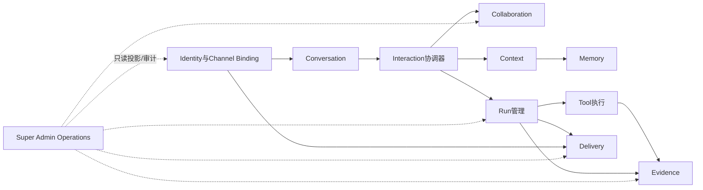
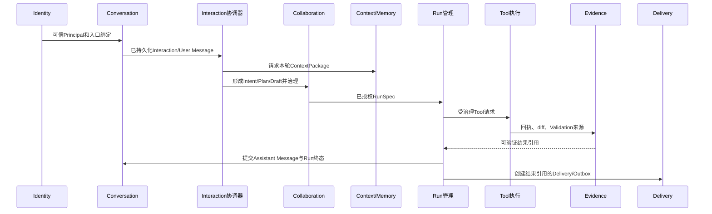

# 11个产品模块的职责与代码落点

**归档日期**：2026-07-29
**分类**：架构与模块
**事实状态**：11模块总体架构已批准；各模块实现成熟度不同

## 1. 一个具体场景

你说：

> 继续Chat项目，改完文档后把结果发回当前网页；以后我也可能从Telegram继续。

这一句话不是“一个Agent模块”完成的。它至少牵涉：谁是你、哪段会话、目标是什么、采用哪些Context、
如何执行、Tool是否真的发生、结果证据、怎样发回入口，以及管理员能看见哪些运营事实。

## 2. 为什么要分模块

模块不是按文件数量切块，而是按4个问题划边界：

1. 谁拥有这类权威状态？
2. 哪些状态必须在同一个事务里改变？
3. 失败后由谁恢复或对账？
4. 哪类需求变化会让这部分代码一起变化？

若把所有逻辑放进Workflow Executor，一个路由函数就会同时拥有用户、消息、审批、Run、Tool和Evidence，
任何修改都可能破坏全链路，也无法判断失败后该重放哪一步。

## 3. 11模块总图

箭头表示通过公开合同依赖，不表示一个模块可以直读另一个模块的私表。

## 4. 11个模块逐一解释

| # | 模块 | 用户价值 | 拥有的核心对象 | 明确不负责 | 当前代码落点/状态 |
|---:|---|---|---|---|---|
| 1 | Identity与Channel Binding | 知道“谁在操作、从哪个入口来、可访问什么” | Principal、Authentication Session、Role/Grant、Channel Binding | 不用`threadId/chatId`冒充身份 | 目标已批准，正式实现尚未开始；概念见`概念空间/Chat/身份与外部入口.md` |
| 2 | Conversation | 保存可重开的对话和消息证据 | Product Session、Interaction、Message、分支/归档 | 不保存MAF控制流位置 | 当前纵向实现主要在`backend/app/product_sessions/`、`frontend/src/features/session/` |
| 3 | Collaboration | 把输入变成可修正的目标、计划和执行治理对象 | Intent、Plan、ExecutionDraft、RunSpec、Decision、Grant、Approval | 不直接执行Tool，不把模型候选当事实 | `collaboration_intents/`、`collaboration_protocols/`、`execution_governance/`、主Workflow已有较深纵向切片 |
| 4 | Context | 给本轮装配有来源、有预算、有版本的输入 | ContextPackage、Context Item、Source Adoption、Repository Snapshot引用 | 不拥有完整Message或长期Memory | `collaboration_contexts/`、`repository_resources/`，directory/detail链已实现 |
| 5 | Memory | 保存明确接受、可长期复用的事实/偏好 | Accepted Memory、revision、失效关系 | 不把TurnSummary或模型自述自动当Memory | 当前主要通过`product_harness/`与S6/S7候选提交形成纵向切片，完整独立能力仍需继续演进 |
| 6 | Interaction协调器 | 让一次用户输入按同一事务/状态机穿过各模块 | 用例协调状态、幂等命令、步骤关联 | 不成为所有领域表的拥有者 | `workflows/product.py`、`workflows/continuous_chat*.py`及应用组合根承担当前实现 |
| 7 | Run管理 | 断线、暂停、取消、接管后仍知道运行真相 | Product Run/Attempt、Runtime Job、Lease、Event、Trace、恢复动作 | 不把HTTP连接或MAF完成当产品成功 | `product_sessions/`、`runtime_jobs/`、`runtime_worker.py`、`product_finalization/`已有纵向切片；完整故障矩阵仍在推进 |
| 8 | Tool执行 | 让每个外部副作用可授权、幂等、对账 | Tool Definition、ToolExecution、Operation、外部回执、补偿记录 | 不自行扩权或决定Run成功 | `tool_execution/`、`execution_dispatch/`、`pi_gateway.py`、`pi_runtime.py`已覆盖只读与隔离edit纵向链 |
| 9 | Evidence | 解释结果凭什么成立、来源是否仍有效 | Evidence、Artifact、Validation、Completion Claim、Provenance | 不用Assistant结论冒充证据 | `evidence/`、`execution_dispatch/result_gate.py`已有SD4-C纵向链 |
| 10 | Delivery | 区分产品结果已完成与外部入口已送达 | Delivery、Outbox、Attempt、Receipt、重试计划 | 不重新生成答案或改变Run终态 | 目标已批准；当前仅有产品Outbox/入口相关基础，不等于完整跨Channel Delivery模块 |
| 11 | Super Admin Operations | 受审计地看谁登录、怎样使用、Work/Artifact进度与异常 | Activity Event/Window、Usage Aggregate、Operations Projection、Admin Audit | 不拥有业务进度、不默认可读正文 | 目标已批准，专项Schema/API/隐私设计和正式实现尚未开始 |

“已批准”只表示边界是产品基线，不表示11个模块都已开发完成。

## 5. 一次消息怎样穿过11模块

Super Admin Operations不在业务写链中，它消费公开事件/查询形成可重建投影；投影失效不能反向改Work。

## 6. 当前目录为什么没有整齐的11个`modules/*`

总体架构先定义目标责任，但当前仓库是按已批准纵向切片逐步演进的。已有代码目录使用
`product_sessions`、`execution_governance`、`tool_execution`等具体能力名，并没有为了让目录看起来漂亮而
批量创建11个空壳。

判断模块是否存在，不能只看是否有同名文件夹，要检查：对象、状态所有者、应用合同、事务边界、失败恢复
和测试是否真实存在。后续重构也不能机械移动目录而改变Schema、Workflow节点或审批Hash。

## 7. 模块间的5条硬边界

1. Conversation的Message、ContextPackage和Accepted Memory是3类对象。
2. Collaboration的Approval只授权具体Draft/Subject，不能直接写Tool外部副作用。
3. MAF Checkpoint辅助Run恢复，但不拥有Product Run终态。
4. Evidence证明结果；Finalizer决定是否满足成功门；Delivery只负责送达。
5. Super Admin投影可重建，不能成为Project/Work/Artifact第二事实源。

## 8. 当前实现与目标架构怎样一起读

读任何模块都做两列笔记：

| 当前代码事实 | 已批准目标保证 |
|---|---|
| 已有哪些对象、表、API、Executor、测试 | 最终模块必须拥有/不拥有什么 |
| 当前恢复到哪一级 | 完整故障场景还要求什么 |
| 哪些前端页面已经有投影 | 哪些用户场景仍未实现 |

这样不会把目标文档误读成现状，也不会因为当前目录还小就忘记完整产品边界。

## 9. 亲手验证

1. 在`coverage-manifest.json`把11模块分别映射到M00–M26学习单元。
2. 任选一个S4执行授权Run，沿Decision→RunSpec→ToolExecution→Evidence找4个不同所有者。
3. 查一次Assistant Message提交和Delivery/Outbox，解释“结果完成”和“送达成功”的差别。
4. 删除前端缓存并刷新，确认权威会话仍从Product Store恢复。
5. 阅读Super Admin设计，列出它能查询但不能直接修改的4类源事实。

## 10. 掌握验收

1. 为什么“模块”不等于一个目录？
2. Context与Memory为什么必须分开？
3. Run管理和MAF Runtime各拥有哪部分状态？
4. Tool成功、Evidence有效、Run成功、Delivery成功为何是4个不同事实？
5. 哪3个模块仍主要是目标设计而非完整实现？

## 关键文件

| 文件 | 职责 |
|---|---|
| `docs/overall-architecture-proposal.md` | 已批准11模块的完整责任基线 |
| `docs/overall-architecture-research.md` | 模块推导证据和参考覆盖 |
| `PROJECT_STATE.md` | 各能力当前已完成与未完成事实 |
| `项目掌握/coverage-manifest.json` | 模块、学习单元与源码面的机器映射 |
| `scripts/check-project-mastery.py` | 防止目标模块或源码面从学习范围中丢失 |
