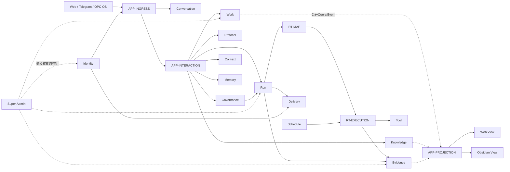

# 14个状态所有者与3个应用组件的职责与代码落点

**归档日期**：2026-07-29  
**更新日期**：2026-07-30  
**分类**：架构与模块  
**事实状态**：14个状态所有者、3个应用组件和3类运行时职责已获总体架构批准；实现成熟度不同

## 1. 先用一个场景理解为什么要分3类责任

你说：

> 每天给我安排英语学习；我既能在Web看学习看板，也能在Obsidian看当天材料。

系统至少要回答3类不同问题：

1. **谁拥有事实**：学习Project、计划、资料、协议、日程、Run、Evidence分别由谁保存和解释？
2. **谁协调一次请求**：从Web或Obsidian来的输入，怎样读取多个事实源并形成一个原子用例？
3. **谁实际运行**：哪个Worker到点触发，MAF怎样运行，Tool怎样受控执行，进程失败怎样恢复？

所以正式架构不再把所有东西都叫“模块”，而是明确区分：

- 14个逻辑状态所有者；
- 3个应用组件；
- 3类运行时与基础设施职责。

这是一套**目标责任图**，不是已经创建了14张表、20个目录或20个进程。

## 2. 划边界的4个问题

状态所有者不是按文件数量切块，而是按4个问题划边界：

1. 谁解释这类权威状态的含义？
2. 哪些状态必须在同一个事务或状态机中改变？
3. 失败后由谁恢复、对账或标记结果未知？
4. 哪类产品需求变化会让这部分规则一起变化？

应用组件则回答“一个用例怎样跨所有者协调”，运行时职责回答“已经批准的工作怎样真正运行”。三者不能因
当前代码放在同一个文件里就合并所有权。

## 3. 从历史11模块演进到当前14个状态所有者

### 3.1 2026-07-24的历史基线

旧基线从9类场景得到13个候选责任，再做2次顶层合并：

```text
13个候选
- Identity与Channel Binding合并1次
- Intent/Work/Plan与Execution Governance合并1次
= 11个历史模块
```

这一步首次把完整产品责任从“聊天页面和Agent”中分离出来，仍有价值，但后续场景穿透暴露了4个结构问题：

1. Interaction Coordinator是跨模块应用协调者，不是领域事实所有者。
2. Work、Knowledge、Protocol和Governance拥有不同对象、生命周期、权限和变化原因，不应继续被一个
   `Collaboration`顶层模块吞并。
3. “每天/每周/到期后继续”需要独立Schedule定义、Trigger和Misfire语义，不能放在Memory或Worker配置里。
4. Web、Obsidian和第三方前端需要同源投影合同，但Projection本身不拥有Project/Work事实。

### 3.2 2026-07-30的正式演进

```text
11个历史模块
- 1个Interaction协调器（下沉为应用组件）
+ 3个净新增所有者（Collaboration拆成Work/Knowledge/Protocol/Governance）
+ 1个Schedule所有者
= 14个逻辑状态所有者

同时明确3个应用组件：Ingress、Interaction、Projection
同时归并3类运行时责任：MAF、Execution、Platform
```

这个结果由16类场景、23项目标能力和D1-D4审核决定共同约束。完整双向追踪见
[目标能力、架构责任与开发地图](../../docs/product-capability-architecture-map.md)。

## 4. 14个逻辑状态所有者

| # | 状态所有者 | 用户价值 | 拥有的核心对象 | 明确不负责 | 当前实现状态/主要落点 |
|---:|---|---|---|---|---|
| 1 | Identity与Channel Binding | 知道谁在操作、从哪个入口来、有什么权限 | Principal、Authentication Session、Role/Grant、Channel Binding | 不用`threadId/chatId`冒充身份 | 目标已批准；正式认证与多入口链未实现，概念见`身份与外部入口.md` |
| 2 | Conversation | 保存可重开的会话、Interaction和消息证据 | Product Session、Interaction、Message、分支/归档 | 不保存MAF控制流或本轮Context选择 | `backend/app/product_sessions/`、`frontend/src/features/session/`已有纵向实现 |
| 3 | Work | 让Project、Work、Plan和Action可长期推进 | Project、WorkItem、TaskPlan revision、Plan Node、ActionItem | 不拥有知识正文、执行授权或运行终态 | `backend/app/harness/`已有纵向实现；W4-01公开边界已批准，物理拆分尚未执行 |
| 4 | Knowledge | 积累项目资料、学习材料、Note和来源关系 | Knowledge Item、Note、Resource引用、来源与版本 | 不决定本轮采用哪些内容，也不把材料自动变成Memory | 当前由`harness/`、`project_resources/`等承载局部能力；W4-01公开边界已批准，独立物理模块尚未迁移 |
| 5 | Protocol | 保存可版本化、可绑定作用域的协作方法 | Protocol Definition、revision、Binding、解析结果 | 不拥有具体Work、Approval或Runtime Workflow图 | `collaboration_protocols/`已有7类协议与4级Binding纵向链 |
| 6 | Collaboration Governance | 让意图、候选、决定和执行授权可见、可改、可审计 | Intent Set/Intent、Clarification、ExecutionDraft、Decision、Grant、Approval、RunSpec | 不拥有Work内容，不直接执行Tool | `collaboration_intents/`、`governance/`和相关Workflow已有局部实现 |
| 7 | Context | 固定本轮采用了什么来源、版本、预算和理由 | ContextPackage、Context Item、Source Adoption、Snapshot引用 | 不拥有完整历史、Knowledge正文或长期Memory | `collaboration_contexts/`、`project_resources/`、`step_inputs/`已有两阶段Context链 |
| 8 | Memory | 保存经接受、可跨会话复用且可失效的长期信息 | Accepted Memory、revision、来源与失效关系 | 不把Message、TurnDigest或Context自动当记忆 | `harness/`和TurnDigest候选链已有局部能力；完整失效传播未完成 |
| 9 | Run管理 | 在断线、暂停、取消、接管后仍知道运行真相 | Product Run/Attempt、Runtime Job、Lease、Event、Cursor、恢复动作 | 不把HTTP连接或MAF完成当产品成功 | `product_sessions/`、`runtime_execution/`与Workflow runtime已有局部实现 |
| 10 | Tool执行 | 让外部读取与副作用可授权、幂等、对账 | Tool Definition、ToolExecution、Operation、外部回执、补偿记录 | 不自行扩权或决定Run成功 | `tool_execution/`、`execution_dispatch/`和pi适配已有纵向链 |
| 11 | Evidence | 解释结果凭什么成立、来源是否有效 | Artifact、Evidence、Validation、Completion Claim、Provenance | 不用Assistant结论或Tool返回值冒充证明 | `evidence/`与Result Gate已有纵向链，完整生命周期仍在交付中 |
| 12 | Schedule | 保存周期工作、提醒、复习的业务时间语义 | Schedule Definition/revision、Trigger、Misfire决定、触发血缘 | 不是cron配置、Calendar格子或Worker Lease | D1边界已批准；Schema、合同、Worker均未实现 |
| 13 | Delivery | 区分产品完成与结果是否送达某入口 | Delivery、Outbox、Attempt、Receipt、重试计划 | 不重新生成答案或改变Run终态 | 目标已批准；现有Outbox只是局部基础，不等于完整跨Channel Delivery |
| 14 | Super Admin Operations | 受审计地看登录、使用、Work/Artifact进度和异常 | Activity Event/Window、Usage Aggregate、Operations Projection、Admin Audit | 不拥有业务进度，不默认读取正文 | 目标已批准；专项Schema/API/隐私设计和实现尚未开始 |

“已批准”只表示目标责任边界已成为正式基线，不表示详细字段、API、Schema或实现已经批准。

## 5. 3个应用组件

| 应用组件 | 负责什么 | 不拥有什么 | 当前状态 |
|---|---|---|---|
| APP-INGRESS / Interaction Ingress | 接收Web、AG-UI、Telegram、OPC-OS等入口请求，解析身份/绑定，去重并转成统一内部Envelope | 不拥有Message、Work、Run或Delivery事实 | Web入口已有局部链；统一多Channel入口未实现 |
| APP-INTERACTION / Interaction Coordinator | 作为一次Interaction用例的唯一事务协调者，按顺序调用Conversation、Governance、Context、Run等公开合同 | 不拥有万能领域表，不把一次Interaction强制等同一次Run | 当前主Workflow和应用服务承担局部形态；正式公开合同待W1-01 |
| APP-PROJECTION / Projection Query & Command Gateway | 组合多个所有者的Read Model，输出带版本、来源、新鲜度和未知状态的投影；把外部编辑变成候选命令 | 不直接写领域表，不让Obsidian成为第二事实源 | 固定`local-user` Scope的只读Envelope、Personal Workspace、Project Dossier及Obsidian Tree/ZIP已实现；Identity裁剪、写回命令与增量物化仍未实现 |

Projection与React UI不同：前者是服务端应用合同，后者只是其中一个呈现Adapter。Obsidian也只是Adapter。

## 6. 3类运行时与基础设施职责

| 运行责任 | 负责什么 | 不能冒充什么 |
|---|---|---|
| RT-MAF | Agent、AgentSession、Workflow、Checkpoint、Executor、模型与Tool调用的框架运行语义 | Product Session、Approval、Product Run终态或Evidence所有者 |
| RT-EXECUTION | Worker、Tool Gateway、外部Runtime、Workspace、Validator、Schedule Trigger Worker、Reconciler | Product Work/Run事实源，或绕过RunSpec扩大权限的执行者 |
| RT-PLATFORM | 数据库、对象存储、队列、Secret、日志指标、备份、部署、容量和灾难恢复 | 业务对象语义和产品完成判断 |

物理部署时多类责任可以暂时同进程，逻辑所有权仍不能合并。

## 7. 正式目标总图



箭头表示公开合同依赖，不表示组件可以直读其他所有者的私表。

## 8. 两条场景穿透

### 8.1 新建“小朋友学习AI”项目

```text
Web输入
→ APP-INGRESS建立可信Request Context并去重
→ Conversation先保存User Message
→ APP-INTERACTION调用Governance形成可修正Intent
→ Work创建Project/Work/Plan候选
→ Knowledge关联课程资料与来源
→ Protocol绑定适龄、安全、教学节奏规则
→ Context固定本轮实际采用的信息
→ Governance形成ExecutionDraft并按策略审核
→ Run/MAF/Execution执行获准步骤
→ Evidence验证产物
→ Work只在完成门成立后推进状态
→ APP-PROJECTION分别生成Web Dossier和Obsidian README投影
```

这里“项目是什么、现阶段、下一步、资料和成果”来自同一组权威对象，不靠Chat气泡或Obsidian目录猜。

### 8.2 每天学习英语

```text
Work保存学习目标与计划
→ Knowledge积累单词、短文、视频和来源
→ Protocol保存复习方法、难度与选择规则
→ Schedule保存时区、重复规则、暂停和漏跑策略
→ Trigger Worker发现到期，只创建带幂等键的Trigger/Run请求
→ Governance/Context为当天Run编译受控输入
→ Run执行，Evidence记录练习和验证结果
→ Work/Memory按明确提交门积累进展
→ Projection生成今日学习队列、日历和Obsidian材料页
```

Schedule负责“应该何时发生”，Worker只负责“发现到期并可靠触发”，两者不能合并。

## 9. 为什么当前目录没有14个同名文件夹

总体架构先定义目标责任，当前仓库则按已批准的纵向切片演进。已有目录仍使用
`product_sessions`、`harness`、`governance`、`tool_execution`等具体能力名；本次批准没有授权批量
创建空目录、移动代码、建表或迁移。

判断一个模块是否真正落地，要检查6项证据：

1. 领域对象与状态机；
2. 唯一状态所有者；
3. 公开命令/查询/事件合同；
4. 事务与并发边界；
5. 失败、恢复与对账语义；
6. 测试和用户可见场景。

目录同名只能证明文件存在，不能证明这6项成立。

## 10. 当前实现与目标架构怎样一起读

读任何责任都做两列笔记：

| 当前代码事实 | 已批准目标保证 |
|---|---|
| 已有哪些对象、表、API、Executor、页面和测试 | 最终责任必须拥有/不拥有什么 |
| 当前恢复到哪一级 | 完整故障场景还要求什么 |
| 哪些页面已经有投影 | 哪些用户场景仍未实现 |

不要把目标文档误读成现状，也不要因为物理目录尚未拆分就缩小完整产品责任。

## 11. 亲手验证“责任是否缺失”

拿一个新需求，例如“用户可以给Artifact逐段评论并邀请别人协作”，做一次场景穿透：

1. 列出正常路径、权限撤销、版本冲突、重复提交、断线和删除后的行为。
2. 标出每一步创建、读取、修改的对象，以及谁拥有它。
3. 若某个对象没有所有者，就是架构缺口；有所有者但没有合同，是详细设计缺口。
4. 若合同已批准但当前代码不存在，是实现缺口；代码存在但没有失败/恢复证据，是验证缺口。
5. 只有当新对象拥有独立生命周期、权限、事务、恢复和变化节奏，才提议升格为新状态所有者。

这套方法比“再写一份总账”更严格：总账只负责显露缺口，场景→能力→所有者→工作包→验收证据链才决定
后续究竟开发什么。

## 12. 掌握验收

1. 能否解释11个历史模块怎样演进为14个状态所有者？
2. 为什么Interaction和Projection是应用组件，不是事实所有者？
3. Work、Knowledge、Protocol和Governance为什么不能再塞回一个Collaboration模块？
4. Schedule定义、Trigger Worker和Calendar View分别属于哪类责任？
5. Tool成功、Evidence有效、Run成功、Work完成和Delivery成功为何是5个不同事实？
6. 能否判断一个缺口属于架构、详细设计、实现还是验证，而不是只说“功能没做”？
7. 能否用同一Project ID/revision解释Web看板和Obsidian目录为何不会形成两套事实？

## 关键文件

| 文件 | 职责 |
|---|---|
| `docs/overall-architecture-proposal.md` | 已批准的14+3+3正式责任基线 |
| `docs/product-capability-architecture-map.md` | 16类场景、23项能力、责任、缺口、工作包和验收的双向地图 |
| `docs/product-capability-manifest.json` | 防止能力、所有者、缺口、工作包和主序漂移的机器关系 |
| `PROJECT_STATE.md` | 各能力当前已完成与未完成事实 |
| `项目掌握/coverage-manifest.json` | 架构责任、学习单元与源码面的机器映射 |
| `scripts/check-project-mastery.py` | 防止目标责任或源码面从学习范围中消失 |
