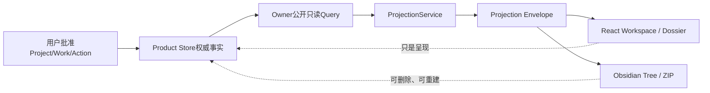

# APP-PROJECTION怎样把同一Project呈现到Web与Obsidian

**归档日期**：2026-07-30  
**分类**：架构与模块  
**关联源码**：`backend/app/projections/`、`backend/app/harness/projection_queries.py`、`frontend/src/features/workspace/`、`frontend/src/features/projects/`、`frontend/src/features/projections/`

## 一个具体场景

用户说：

> 给孩子建一个 AI 学习 Project，我负责陪同，Chat 负责生成材料，老师负责反馈。

用户批准候选内容后，Product Store 中应该留下有稳定 ID 和 revision 的
`Project -> Work -> Plan/Action -> Note/Evidence`事实。这些事实必须有两种同时成立的读法：

1. 在 Chat Web 的“我的工作台”中看到学习 Project，进入 Project Dossier 后看到目标、Work、
   当前责任、Note、Evidence 覆盖与已知缺口。
2. 下载 ZIP 后在 Obsidian 中按稳定目录阅读同一 Project：用户、Chat/AI、外部协作者
   各有1份责任文件，Work、Knowledge、Evidence、Method 和 Review 也都有明确位置。

标题可以修改，页面可以换样式，Obsidian 文件也可以删除后重建；但 Project ID、源 revision、
责任状态和“尚不知道”的原因必须一致。

## 问题

为什么已经有 Project、Work、Action 和 Note，用户仍然可能“脱离聊天就不知道项目是什么”？

因为权威领域对象解决的是“什么事实真的成立”，不会自动解决以下呈现问题：

1. 一个页面要同时组合多少个所有者的事实。
2. 用户、Chat/AI、外部协作者分别应看哪些行动。
3. “真的没有”、“尚不知道”、“只有部分”、“无权查看”和“读取失败”如何区分。
4. Web 卡片、Obsidian Markdown 和未来第三方前端如何不各自重新解释状态。
5. Project 改名、重复导出或黑客标题为什么不会改变身份、覆盖别的文件或产生第二事实源。

## 一句人话定义

**APP-PROJECTION（投影查询与命令网关）是把多个权威状态所有者的公开读模型组合成稳定用户视图的应用组件。**

它不是：

- 第15个领域状态所有者；
- Project、Work、Evidence 或 Schedule 的第二数据库；
- 把聊天摘要变成项目说明的模型 Prompt；
- 让 Markdown 复选框直接修改 Product Store 的文件监听器；
- MAF Workflow 或 AG-UI 运行状态。

当前已实现的是固定 `local-user` Scope 下的**只读**切片：Web 查看、目录预览和 ZIP 下载。
真实 Identity、跨用户字段裁剪、Obsidian 双向写回和增量同步还没有实现。

## 一个具体对象样本

下面是一份**教学用裁剪样本**，形状来自当前合同和测试，ID为示意值，不是某个真实用户数据：

```json
{
  "view_schema": "project-dossier.v1",
  "subject": {"kind": "project", "id": "project-ai-child-01", "revision": 3},
  "projection_revision": "<64位sha256>",
  "source_revisions": [
    {"owner": "MOD-WORK", "resource_kind": "project", "resource_id": "project-ai-child-01", "revision": "3"},
    {"owner": "MOD-KNOWLEDGE", "resource_kind": "note", "resource_id": "note-safety-01", "revision": "2:1"}
  ],
  "sections": {
    "work": {"state": "available", "reason_code": null},
    "evidence": {"state": "partial", "reason_code": "harness_evidence_references_only"},
    "schedule": {"state": "unknown", "reason_code": "schedule_not_implemented"},
    "delivery": {"state": "unknown", "reason_code": "delivery_not_implemented"}
  },
  "data": {
    "project": {"title": "小朋友AI学习", "kind": "learning", "status": "active"},
    "role_lanes": [
      {"assignee_kind": "user", "label": "你来做", "items": [{"title": "陪同完成第一次体验"}]},
      {"assignee_kind": "agent", "label": "Chat / AI执行", "items": [{"title": "生成年龄适配材料"}]},
      {"assignee_kind": "external", "label": "外部协作", "items": [{"title": "老师提供反馈"}]}
    ]
  }
}
```

`projection_revision` 是语义内容的 Hash，不包含每次生成时钟。因此只要权威事实没变，
隔三小时重新请求仍得到同一语义 revision、同一文件树 Hash 和字节一致的 ZIP。

## 从权威事实到两种前端



这条链有4个绝不能混合的形态：

| 形态 | 例子 | 创建者 | 保存位置 | 是否权威 |
|---|---|---|---|---|
| 领域事实 | Project、WorkItem、ActionItem、NoteRevision | 各状态所有者的命令服务 | Product Store | 是 |
| Owner读快照 | `HarnessProjectionQueryService.project_snapshot()` | MOD-WORK/MOD-KNOWLEDGE当前物理边界 | 一次只读事务内存 | 否，是带来源的公开快照 |
| 稳定读模型 | `personal-workspace.v1` / `project-dossier.v1` | `ProjectionService` | 当前即时组合，不入库 | 否，可重建 |
| 呈现产物 | React DOM、Markdown、ZIP | Web/Obsidian Adapter | 浏览器或用户下载位置 | 否，可丢弃 |

## 用户、Chat/AI与外部协作者看什么

### 1. 用户在 Personal Workspace 看什么

`全部 / 生活 / 工作 / 学习 / 研究`只是同一 Project 模型的查询筛选：

| Project `kind` | 工作台领域 |
|---|---|
| `delivery` | 工作 |
| `learning` | 学习 |
| `research` | 研究 |
| `personal` | 生活 |

每张卡显示目标、状态、开放 Work/Action、阻塞、3类责任数、下一行动和稳定 Project ID。
无 Project 的独立 Work 只在“全部”中显示为 `unclassified`；Projection 不根据“缴水费”等标题
猜它属于生活还是工作。

### 2. Project Dossier 的3条责任泳道

| 责任主体 | 显示什么 | 不得冒充什么 |
|---|---|---|
| `user` / 你来做 | 用户的正式Action，或尚未转Action的已接受Plan步骤 | Agent建议不是用户承诺 |
| `agent` / Chat与AI | 可授权给Chat/AI的正式行动 | 隐藏推理或未批准Tool不是行动 |
| `external` / 外部协作 | 老师、同事、客户等外部依赖 | “已发送请求”不是“对方已完成” |

去重规则也很重要：如果 Action 已经引用某个 PlanNode，只显示更具体的 Action，不能在同一泳道
重复计数同一步。

### 3. 不同产品读者的信息边界

| 读者 | 目标显示 | 当前实现 |
|---|---|---|
| 普通用户 | 自己Scope中允许的Workspace/Dossier和Obsidian导出 | 固定`local-user`只读切片 |
| Collaborator | Grant字段范围；私人Memory应裁剪 | 未实现 |
| Agent/Worker | 只读RunSpec和当前步最小输入，不把人类Dossier整份塞入Prompt | 已有StepInput边界，不消费Dossier |
| Super Admin | 默认只看运营摘要、异常、新鲜度；敏感正文额外授权并审计 | 未实现 |
| 第三方Adapter | 只获得宣告支持的schema和裁剪字段 | 当前可使用只读JSON/ZIP合同 |

真实 Identity 实现后，字段裁剪必须在服务端组合前完成，不能先把私密字段下发再用 CSS 隐藏。

## Obsidian 中具体有哪些目录和文件

对一个 `learning` Project，当前 Adapter 生成：

```text
README.md
Projects/{project-id}/
├── README.md
├── Work/
│   └── {work-id}.md
├── Responsibilities/
│   ├── user.md
│   ├── agent.md
│   └── external.md
├── Knowledge/
│   └── {note-id}.md
├── Evidence/
│   └── README.md
├── Resources/
│   └── repositories.md
├── Methods/
│   └── protocol.md
├── Reviews/
│   └── current.md
├── Learning/
│   └── review-queue.md
└── .chat-projection/
    └── manifest.json
```

非学习 Project 没有 `Learning/review-queue.md`。路径只使用服务端验证的 ID，不使用标题。
所以即使标题是 `../../儿童:AI\计划`，标题也只会出现在 Markdown 正文，不会进入路径。

每个 Markdown 至少有这些 Frontmatter：

```yaml
chat_schema: "obsidian-project-file.v1"
chat_kind: "project"
chat_id: "project-ai-child-01"
source_revision: "3"
projection_schema: "project-dossier.v1"
projection_revision: "<64位sha256>"
source_snapshot_at: "2026-07-30T10:00:00+00:00"
read_only: true
```

`manifest.json` 记录源 revision vector、文件路径、大小、Hash 和 `payload_tree_hash`。ZIP 另有包含
Manifest 的 `tree_hash`。这两个 Hash 含义不同，不能只叫“导出Hash”。

## 生命周期：谁创建、谁修改、何时结束

1. **创建权威事实**：用户批准 Project/Work/Plan/Action 候选后，对应 Owner 命令在 Product Store
   中提交 ID、revision、Trace 和 Outbox。Projection 不参与这个写事务。
2. **读快照**：`HarnessProjectionQueryService` 在一次 Owner-local 只读事务中取 Project、Work、Plan、
   Action、Note、Accepted Memory 和公开活动。
3. **组合Envelope**：`ProjectionService` 加入Protocol/Repository可选快照、责任去重、section state、
   source revision vector 和语义Hash。它不开写事务、不调模型。
4. **网络传输**：FastAPI Router 只做路径/DTO/错误/ETag边界，不直接读表。
5. **Web呈现**：React 保存领域筛选、当前打开 Project 和文件预览等短期页面状态；刷新后
   仍从服务端重读 Project 事实。
6. **Obsidian物化**：`render_obsidian_project_tree()` 纯函数生成验证过的文件集；`zip_bytes()`
   固定顺序、时间戳、权限和压缩方式。同一输入字节一致。
7. **结束/失效**：当源 revision 变化，旧 Envelope/ZIP 只是旧快照；它不能对新事实继续发号施令。
   删除下载文件不会删除 Project。

## 代码链

### 链 A：打开“我的工作台”

| 顺序 | 稳定符号 | 输入 → 处理 → 输出 |
|---:|---|---|
| 1 | [`WorkspaceView`](../../frontend/src/features/workspace/workspace-view.tsx) | `domain/searchQuery` → 加载/筛选页面状态 → Project卡和摘要 |
| 2 | [`getWorkspaceProjection`](../../frontend/src/features/projections/projection-api.ts) | domain → `GET /api/projections/workspace` → 类型化Envelope |
| 3 | [`create_projection_router`](../../backend/app/projections/api.py) 内的`workspace` | 网络DTO → 应用Query → JSON、ETag、revision header |
| 4 | [`ProjectionService.workspace`](../../backend/app/projections/service.py) | Project IDs/Owner快照 → 领域分类、计数、队列、状态 → `personal-workspace.v1` |
| 5 | [`HarnessProjectionQueryService`](../../backend/app/harness/projection_queries.py) | Scope → Product Store只读查询 → 带ID/revision的公开快照 |

### 链 B：打开 Project Dossier 并下载 Obsidian

| 顺序 | 稳定符号 | 输入 → 处理 → 输出 |
|---:|---|---|
| 1 | [`ProjectDossier`](../../frontend/src/features/projects/project-dossier.tsx) | `projectId` → 读Dossier/目录/下载 → 责任、Work、Knowledge、缺口与文件预览 |
| 2 | `getProjectDossier/getObsidianProjectTree/getObsidianProjectArchive` | 稳定ID → 3个REST请求 → JSON或ZIP |
| 3 | `ProjectionService.project_dossier` | Owner快照 → 责任去重、section降级、来源向量 → `project-dossier.v1` |
| 4 | [`render_obsidian_project_tree`](../../backend/app/projections/obsidian.py) | Dossier → 路径/大小/Hash验证 → `ObsidianProjectTree` |
| 5 | `ObsidianProjectTree.zip_bytes` | 按路径排序文件 → 固定ZIP元数据 → 字节稳定归档 |

`App.tsx` 与 `usePrimaryNavigation()` 只组合一级页面和浏览器便利状态；它们不拥有 Project、
Dossier 或 Projection revision。

## 为什么不采用更简单的方案

### 备选 A：前端各自请求 Project、Work、Note 后自己拼

看起来少了一个后端组合层，但 Web、Obsidian 和第三方前端会分别实现责任去重、状态解释、
权限裁剪和缺口表达。三份逻辑必然漂移，还会把应在服务端发生的敏感字段裁剪推给前端。

### 备选 B：把 Obsidian 文件当作 Project 数据库

标题重命名、同步冲突、复选框、断电写入和插件改写都会直接变成业务命令，却缺少当前
revision、CAS、HITL、Validation 和 Evidence。因此当前固定为 `read_only: true`。

### 备选 C：给生活、学习、研究各建一套 Project 表和页面

这会产生多套状态机、权限、完成语义和恢复逻辑。当前方案复用同一 `Project/Work/Action/Note/Evidence`，
只用 Project `kind`、版本化Protocol 和Projection差异表达场景。

## 常用场景怎样落地

| 场景 | 权威对象 | Web呈现 | Obsidian呈现 | 当前必须诚实显示的缺口 |
|---|---|---|---|---|
| 客户官网交付 | `delivery Project + Work/Action` | 工作卡、3类责任、阻塞 | Work/责任/Review | 正式日期触发仍需Schedule |
| 学英语 | `learning Project + learning_unit Work + Note` | Learning Queue、练习与反馈 | 额外`Learning/review-queue.md` | 下次复习时间为unknown |
| 小朋友学AI | 同一learning模型＋安全协议 | 家长/AI/老师责任 | 同一学习目录 | 不伪造儿童Identity和隐私授权 |
| 暑假旅行 | `personal Project` | 生活卡、家庭成员外部责任 | 通用Dossier目录 | 订票/支付需Tool审批与对账 |
| 家庭AI设备研究 | `research Project + research Work/Note` | 来源Note、冲突与专家责任 | Knowledge/Evidence | 外部来源失败不能用模型补造 |
| 软件开发 | Project＋Repository Binding＋Evidence | 仓库摘要、pi行动、Evidence | `Resources/repositories.md` | 不泄露绝对路径/密钥 |
| 内容创作 | Work＋Artifact＋Evidence＋Delivery | 进度与部分Evidence | Work/Evidence/Review | Artifact Gallery/Delivery仍unknown |
| 灵感捕获 | Note/Idea候选 | 不自动进入Project卡 | 不自动生成Project目录 | 需用户决定升级为Project |
| 独立缴费事项 | 无Project Work | “全部”中的未归类Work | 当前无Project ZIP | 系统不猜领域 |
| 每周复盘 | Schedule→Run→Review/Evidence | 未来Calendar/队列 | 当前只有`Reviews/current.md` | 不伪造下次触发 |
| 超级管理员看护 | Identity/Admin Ops运营投影 | 独立Admin Console | 敏感导出需额外Grant | 当前没有管理员视图 |

## 失败、空、部分与不知道

| 状态 | 精确含义 | 例子 |
|---|---|---|
| `available` | 查询成功且有事实 | 已有1个Work |
| `empty` | 查询成功且权威结果真为空 | 没有任何Note |
| `partial` | 只有部分权威关系 | 当前只读Work/Action中的Evidence引用 |
| `unknown` | 能力未实现或来源不足 | Schedule没实现，不是下次复习为0 |
| `forbidden` | 当前Principal无权读 | 未来Collaborator不能读私人Memory |
| `error` | 该来源本次读取失败 | Repository区块失败，其他区块仍可用 |

核心 Project 不存在或不属于当前Scope时，整个Dossier返回404，不能生成一份假空档案。

## 亲手验证

### 1. 运行不污染正式Product Store的合同测试

```bash
.venv/bin/python -m pytest backend/tests/test_projections.py -q
```

应观察4组合同：

1. 工作/学习/研究/生活复用同一Project模型，独立Work不猜分类。
2. user/agent/external责任泳道和Action/PlanNode去重。
3. 恶意标题不进路径，同一事实的tree与ZIP字节稳定。
4. Workspace/Dossier/Tree/ZIP/ETag/404的HTTP合同。

### 2. 在浏览器 Network 中观察

先使用已有Project，不为调试往正式数据库写测试记录：

1. 打开“我的工作台”，在 Network 中找 `GET /api/projections/workspace?domain=...`。
2. 打开一个Project，查看Dossier请求的 `ETag`、`X-Projection-Revision`和
   `X-Projection-Schema-Version`。
3. 点击“预览目录结构”，选择一个文件后确认预览内容包含 `read_only: true`。
4. 下载ZIP，确认路径使用Project/Work/Note ID，不使用可变标题。

### 3. 运行前端和窄屏场景

```bash
cd frontend
npm test
npx playwright test e2e/personal-workspace.spec.ts
```

预期同时验证桌面与 Pixel 5：工作台、Dossier、Note正文、unknown Schedule、稳定Obsidian路径、
ZIP下载、无横向溢出和axe无障碍检查。

## 当前设计已兑现与未兑现

### 已兑现

1. 4个领域筛选、3条责任泳道、Workspace、Project Dossier 和学习队列。
2. 4个只读REST端点，稳定schema/revision/ETag。
3. 稳定ID目录、Frontmatter、Manifest、路径/容量安全门和确定性ZIP。
4. 同一Product Store事实在Web与Obsidian中关键字段一致，没有新增Projection表或迁移。

### 未兑现

1. Principal/Role/Grant、真实Scope过滤、Collaborator和Super Admin字段裁剪。
2. Obsidian双向ChangeSet、CAS冲突、Sync Attempt、离线合并和增量Cursor。
3. Schedule/Calendar/复习触发、Delivery/Receipt、完整Artifact/Evidence/Provenance区块。
4. 大量Project的稳定分页Cursor、持久Read Model Cache、跨实例Projection Worker；100项上限的
   `partial/*_truncated`提示已经实现，不再冒充全量。
5. 服务器直接写用户Vault；这当前刻意不支持，避免任意路径写入和无审核副作用。

## 掌握验收

1. 为什么 Project 不是文件夹，`Projects/{project-id}`却仍然是一个很好的人类阅读入口？
2. 为什么 `unknown(schedule_not_implemented)` 不能显示为“下次复习 0 天后”？
3. Action已经引用PlanNode时，责任泳道为什么只能显示Action？
4. 如果要让Obsidian修改正式写回，你会把Identity、source revision、三方Diff、CAS、HITL、
   Validation、Owner Command 和新Projection按什么顺序连接？
5. 新增“家庭健康”视图时，怎样判断它只需新Projection/Protocol，还是真的需要新的状态所有者？

## 关键文件

| 文件 | 职责 |
|---|---|
| [`docs/projection-contract-dossier-queue-obsidian-readonly-detailed-design.md`](../../docs/projection-contract-dossier-queue-obsidian-readonly-detailed-design.md) | 已批准详细设计、场景穿透和未兑现边界 |
| [`backend/app/projections/contracts.py`](../../backend/app/projections/contracts.py) | Envelope、section state、源revision和语义Hash |
| [`backend/app/harness/projection_queries.py`](../../backend/app/harness/projection_queries.py) | 当前Work/Knowledge物理包的公开只读边界 |
| [`backend/app/projections/service.py`](../../backend/app/projections/service.py) | Personal Workspace、Project Dossier、责任去重与区块降级 |
| [`backend/app/projections/obsidian.py`](../../backend/app/projections/obsidian.py) | 纯确定性文件Adapter、路径/容量安全和ZIP |
| [`backend/app/projections/api.py`](../../backend/app/projections/api.py) | 类型化REST、错误转换、ETag和归档下载 |
| [`frontend/src/features/workspace/workspace-view.tsx`](../../frontend/src/features/workspace/workspace-view.tsx) | 个人工作台、领域筛选、Project卡和独立Work |
| [`frontend/src/features/projects/project-dossier.tsx`](../../frontend/src/features/projects/project-dossier.tsx) | Dossier、3条责任、知识、缺口、目录预览和ZIP下载 |
| [`frontend/src/features/projections/projection-api.ts`](../../frontend/src/features/projections/projection-api.ts) | Web所消费的类型化Projection合同 |
| [`backend/tests/test_projections.py`](../../backend/tests/test_projections.py) | 分类、责任、确定性、安全、HTTP/ETag和404合同 |
| [`frontend/e2e/personal-workspace.spec.ts`](../../frontend/e2e/personal-workspace.spec.ts) | 桌面/移动用户路径、下载、无溢出和axe |

## 补充记录

- 2026-07-30：W4-03固定Scope只读切片实现后，首次把“域事实 → 角色视图 → Web/Obsidian Adapter
  → 可验证文件”作为独立学习单元，不再用总账或页面名称代替落地合同。
