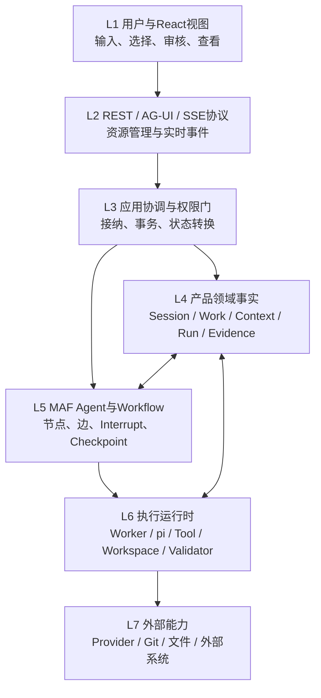
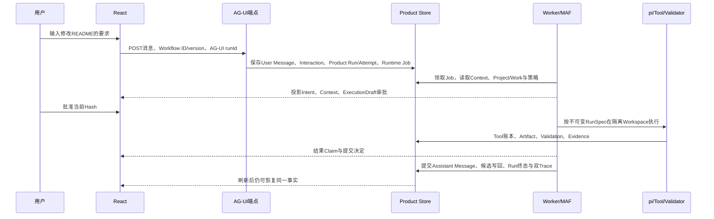

# Chat总体架构与一次点击的七层链路

**归档日期**：2026-07-29
**分类**：架构与模块
**关联源码**：`frontend/src/App.tsx`、`backend/app/api/`、`backend/app/product_sessions/`、`backend/app/workflows/`、`backend/app/runtime_execution/`

## 问题

Chat为什么不能理解成“网页把问题发给模型，再把答案显示出来”？一次点击到底穿过了哪些架构层？

## 1. 先看一个贯穿全文的例子

假设Chat里已经有一个正式Project“Chat”，你输入：

> 继续Chat项目，把README里的旧Workflow节点数改成39。修改前让我确认，完成后运行文档检查。

这句话同时要求系统完成7件不同的事：保存原话、找到正确Project、选择相关Context、形成计划、取得
授权、在隔离Workspace修改文件、用Evidence证明结果。一个模型调用无法可靠拥有这些全部责任。

## 2. 7个基础架构词

| 词 | 人话定义 | 在本项目中不是什么 |
|---|---|---|
| View / 视图 | 用户看到和操作的React界面 | 不是权威业务状态 |
| Protocol / 协议 | 两个边界之间约定怎样传数据 | 不是数据库或领域对象 |
| Adapter / 适配器 | 把外部协议转换成内部合同 | 不是产品核心 |
| Application Coordinator / 应用协调器 | 按用例顺序调用领域能力并拥有事务 | 不是万能Service |
| Domain Object / 领域对象 | 产品长期承认并管理的事实 | 不是模型临时输出 |
| Runtime / 运行时 | 真正驱动Workflow、Worker、模型和Tool的机制 | 不是Product事实源 |
| Store / 存储 | 某类状态的物理或逻辑保存位置 | 物理共用SQLite也不表示逻辑所有权合并 |

## 3. 七层架构



### L1：React视图

`App.tsx`和Feature组件收集输入、选择Workflow、展示审批、节点、Trace和结果。浏览器可以保存草稿、
当前Tab和Workbench宽度，但不能自行宣布Work完成。

### L2：协议边界

REST管理Product Session、Project、Work、Evidence等资源；AG-UI over HTTP/SSE管理一次Agent Run的
请求、流式事件和Interrupt/Resume投影。两者并存是因为“长期资源管理”和“实时运行”不是一个问题。

### L3：应用协调

HTTP Router只解析请求并调用应用服务。`ProductSessionService`、治理协调器和Evidence协调器负责状态
转换、唯一事务、权限、CAS、幂等和失败语义。Router不能直接改数据库。

### L4：产品事实

Product Session、Message、Interaction、Intent、Work、ContextPackage、Decision、Product Run、
Evidence等需要跨刷新、跨进程、跨天存在，因此由Product Store拥有。模型只能提出候选。

### L5：MAF运行时

MAF运行版本化Workflow图，调用Executor，产生事件，遇到`request_info`时暂停并保存Checkpoint。MAF
不拥有Project、Work、长期Memory或产品成功终态。

### L6：执行运行时

Execution Worker领取Runtime Job；pi子进程通过JSONL RPC工作；Tool Gateway控制能力；Execution
Workspace隔离写入；Validator执行确定性检查。这一层能产生副作用，所以必须有授权和账本。

### L7：外部能力

模型Provider、Git、文件系统和未来外部业务系统拥有自己的状态。Chat只能通过明确合同调用，不能把
“超时没收到结果”直接当成“没有执行”。

## 4. 例子怎样穿过7层



每一步的输入对象都会变形：

```text
Input Draft
-> AG-UI Request DTO
-> Product Message + Interaction + Product Run
-> CollaborationState运行投影
-> ContextPackage / Intent Set / ExecutionDraft / RunSpec
-> Runtime Job / ToolExecution / Artifact / Evidence
-> Assistant Message + Run终态 + Trace
```

“变形”不是重复造数据。每种对象解决不同责任：DTO负责传输，领域对象负责长期事实，Runtime对象负责
执行，View Model负责展示。它们通过稳定ID关联。

## 5. 为什么不做成一个大Agent

| 看似简单的方案 | 会失败在哪里 |
|---|---|
| 把所有历史放进Prompt | Token无限增长，旧主题污染当前任务，用户无法审核采用来源 |
| 让Agent自己维护Project和Memory | 模型输出会冒充正式事实，跨进程和换模型后漂移 |
| MAF Session保存一切 | 运行时Checkpoint无法承担产品查询、权限、归档和长期生命周期 |
| 前端保存全部状态 | 刷新、换设备和并发后产生多个事实源 |
| Tool成功就把Work标完成 | Tool返回、Evidence有效、Artifact存在和Work完成是4个判断 |

## 6. 当前实现与目标架构

当前已经有React/REST/AG-UI、Product Store、39节点主Workflow、模型治理、Runtime Worker、pi只读与
隔离编辑、Evidence/Artifact/Validation/Result Commit和双Trace主干。

完整目标仍缺正式Identity/Channel Binding、可靠Delivery、Super Admin Operations、完整跨进程pi与
Tool恢复、Provenance失效传播、容量/SLO/备份等。目标位置存在不表示代码已经存在。

## 7. 代码阅读顺序

| 顺序 | 稳定符号/目录 | 问题 |
|---:|---|---|
| 1 | `frontend/src/App.tsx`、`use-chat-agent.ts` | 用户点击后前端发了什么 |
| 2 | `runtime_execution/endpoint.py` | HTTP在哪里终止，怎样接纳和入队 |
| 3 | `product_sessions/service.py` | 哪些产品事实先落库 |
| 4 | `runtime_execution/worker.py` | 谁领取并执行Job |
| 5 | `workflows/runtime.py` | Product生命周期怎样包住MAF |
| 6 | `workflows/continuous_chat_factory.py` | 39节点和43条边怎样连接 |
| 7 | `continuous_chat.py`及执行/Evidence模块 | 每个节点具体做什么 |
| 8 | `product_sessions/trace_reports.py` | 终态怎样形成可读报告 |

## 8. 你可以自己做的实验

1. 在前端`submit`、AG-UI端点、`prepare_agui_run`、Worker和`ProductAwareWorkflow.run`下断点。
2. 只记录Product Session、Product Run、Runtime Job和Workflow版本，不复制私密正文。
3. 断开浏览器SSE，观察Worker是否继续；重新打开后用REST和Cursor恢复。
4. 对照Product Store、MAF Checkpoint、Runtime Journal和浏览器状态，写出每一项的所有者。

## 掌握验收

1. 为什么REST和AG-UI不能合并成一个“聊天接口”？
2. 为什么MAF Workflow成功仍不能直接把Work标为完成？
3. Product Store、Checkpoint、Runtime Journal和React状态各自解决什么问题？
4. 指出一次点击在哪一层产生Product Run、在哪一层产生Tool副作用。

## 关键文件

| 文件 | 职责 |
|---|---|
| [PROJECT_CONTEXT.md](../../PROJECT_CONTEXT.md) | 稳定产品边界 |
| [总体架构基线](../../docs/overall-architecture-proposal.md) | 已批准目标模块和合同 |
| [架构新手导读](../../docs/architecture-beginner-guide.md) | 更完整的对象级运行说明 |
| [主Workflow工厂](../../backend/app/workflows/continuous_chat_factory.py) | 当前图事实 |

## 补充记录

- 2026-07-29：建立项目掌握目录中的总体架构教材，明确当前实现与目标缺口。
