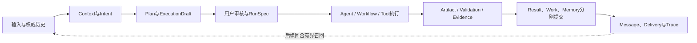
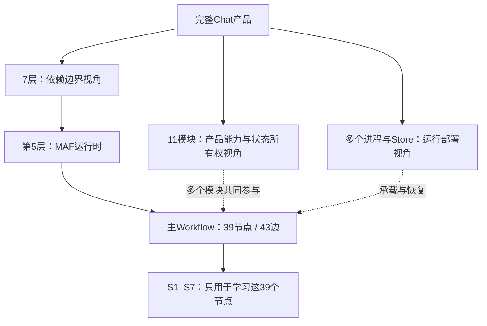
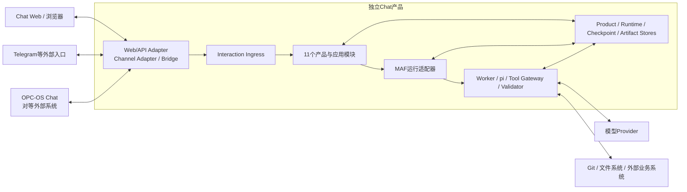
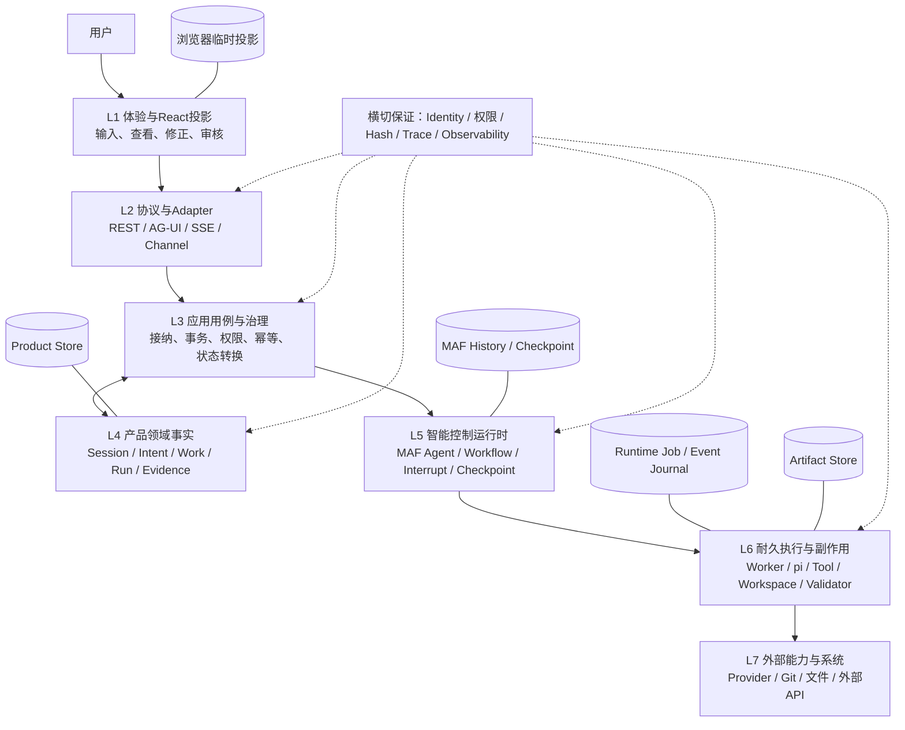
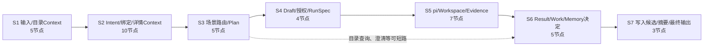
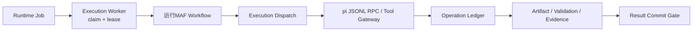
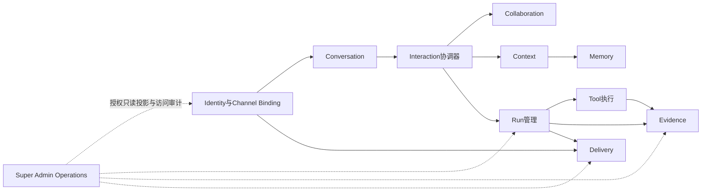
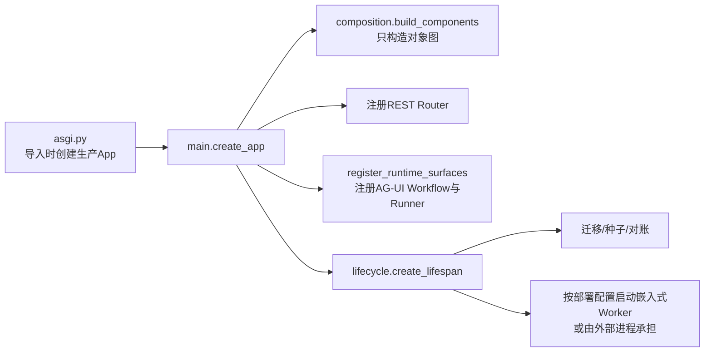
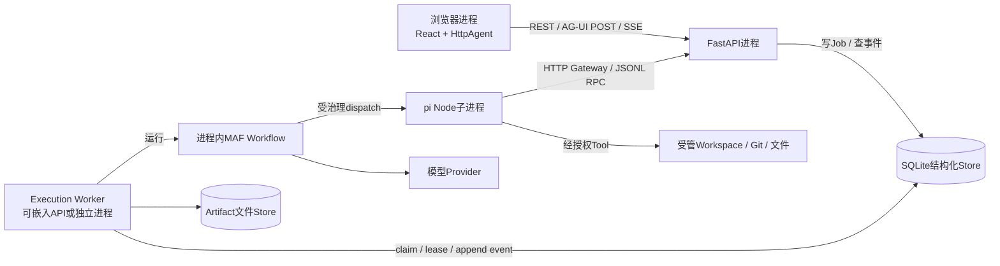
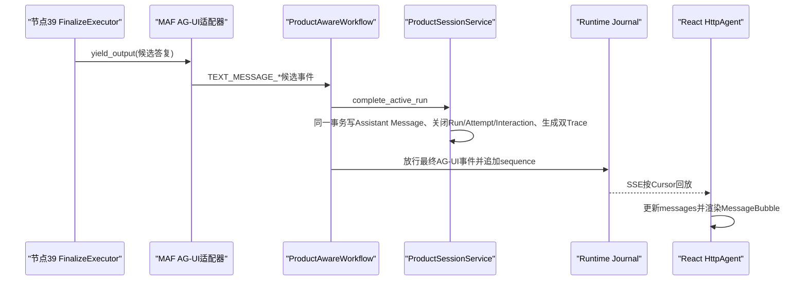

# Chat总体架构：从产品理论到当前代码的七层心智模型

**归档日期**：2026-07-30

**分类**：架构与模块

**文档角色**：进入任何SC调试场景前的架构前置课

**事实状态**：目标总体架构已批准；当前实现成熟度按本文逐项标注

**关联源码**：`frontend/src/`、`backend/app/main.py`、`backend/app/composition.py`、
`backend/app/product_sessions/`、`backend/app/workflows/`、`backend/app/runtime_execution/`、
`backend/app/execution_dispatch/`、`backend/app/evidence/`

## 问题

Chat在概念上为什么这样设计？“层、模块、进程、协议、Store、对象、Workflow节点”分别是什么？
选择React、FastAPI、AG-UI、MAF、Worker、pi和SQLite后，理论怎样落到当前代码？掌握这些以后，为什么
才能真正读懂SC01这类调试文档并开始开发？

## 0. 先给结论：你缺的不是更多节点，而是一张开发心智地图

是的，这份架构前置课应该先于SC01。SC01回答“某一种输入实际怎样跑”；本篇先回答下面5个问题：

1. Chat作为完整产品究竟解决什么问题。
2. 为什么要划出7层边界，每层保护什么产品保证。
3. 11个产品模块怎样分工，它们为何不等于7层。
4. 理论边界怎样由当前技术选型和源码落实。
5. 一条真实数据为什么会先后变成View状态、网络DTO、产品事实、MAF状态和Runtime事件。

本文不再把“前后端已经会跑”当作隐含前提。如果你还不能从C++的“源码→可执行文件→进程”类比到
Chat的“TSX→Vite/Node→浏览器”和“Python模块→CPython/Uvicorn→FastAPI”，先读[从C++到Chat：前后端怎样跑起来](../00-从这里开始/从C++到Chat前后端怎样跑起来.md)。那篇课负责“程序如何活起来”；本文负责“为什么要这样分”。

本文统一使用3种事实标记：

| 标记 | 准确含义 |
|---|---|
| **当前已实现** | 当前源码和测试已经存在；只保证本文写明的范围 |
| **当前局部实现** | 主干已存在，但恢复、UI、来源类型或场景矩阵仍有明确缺口 |
| **目标已批准，尚未实现** | 架构位置和责任已经批准，不表示有对应代码或Schema |

读完本文后再进入SC01，学习路径应当是：

```text
先理解“为什么这样分”
→ 能判断一个对象属于谁
→ 能沿真实源码找到对象怎样变形
→ 再用断点、SQL和Trace验证某个场景
→ 最后才能安全修改其中一层
```

## 1. 先固定一个贯穿全文的具体场景

假设你在Chat中输入：

> 继续Chat项目，检查README里的Workflow节点数；如果不是39，修改前让我确认，修改后运行文档检查。

这不是“把一句话发给模型”这么简单。一个可信的产品至少要处理下面12件事：

1. 原样保存用户输入，不能只留下模型改写后的版本。
2. 确认当前用户和Product Session有权限访问目标Project。
3. 从正式Project、Repository、近期摘要等来源选择本轮Context，并说明来源。
4. 把一句自然语言拆成可修正的Intent和Plan。
5. 把“阅读、可能修改、运行检查”编译成可见的ExecutionDraft。
6. 让用户批准当前Draft的精确版本；内容变化后旧批准必须失效。
7. 冻结不可变RunSpec，防止执行时偷偷换目标或参数。
8. 在受管Workspace中调用pi或Tool，而不是直接污染活动仓库。
9. 记录每个外部操作的请求、结果、未知状态和幂等语义。
10. 保存Artifact、Validation、Evidence和Claim，不能只相信Agent说“完成了”。
11. 分别决定答复能否显示、Work能否推进、Memory能否接受。
12. 最后提交Assistant Message、Run终态和Trace；刷新后仍能恢复。

当前代码已经打通这条纵向主干的大部分能力，但UI完整度、通用Tool恢复、跨进程pi恢复和若干产品模块仍
不完整。架构文档必须同时告诉你“应该是什么”和“当前做到哪里”，不能把目标图冒充现状。

## 2. 架构不是从框架名称出发，而是从6个产品问题出发

本项目不是因为选了MAF才需要这些对象。顺序恰好相反：先有产品问题和必须守住的保证，再选择技术承载它们。

| # | 原始产品问题 | 如果只做“网页→模型→文本” | 推导出的架构保证 |
|---:|---|---|---|
| 1 | Prompt和答案困在一次会话 | 刷新、换设备或重启后事实断裂 | Product Session、Message、Interaction和长期Product Store独立存在 |
| 2 | 用户说“继续”时缺少稳定上下文 | 全塞历史会污染当前任务；少塞又丢关键事实 | Context按来源、revision、预算和采用理由装配，完整历史只作证据源 |
| 3 | Intent、Plan、Work和结果没有生命周期 | 模型每轮重新解释，无法修正、版本化或恢复 | Collaboration模块保存候选、接受状态、版本、Hash和关系 |
| 4 | AI可能在用户看见前就执行 | Prompt里一句“先问我”无法成为安全边界 | ExecutionDraft → Decision/Grant → RunSpec → Tool Operation形成硬门 |
| 5 | 模型候选容易被当成正式事实 | 幻觉可能直接修改Work、Memory或完成状态 | 模型只产候选；确定性代码负责校验、授权和Product提交 |
| 6 | 失败、重启或外部超时后难以判断发生了什么 | 重试可能重复副作用，也可能产生假成功 | Product Run/Attempt、Runtime Job/Lease、Checkpoint、账本、Evidence和Trace分开 |

因此，Chat的完整产品闭环是：



这条闭环才是系统理论。React、AG-UI、MAF和pi只是分别承载其中一部分责任的技术。

## 3. 先把7个容易混淆的维度拆开

### 3.1 “7层”“11模块”“S1–S7”不是同一套分类

| 维度 | 当前数量 | 它回答的问题 | 例子 |
|---|---:|---|---|
| 架构层 | 7层 | 一次请求跨越哪些责任和依赖边界 | React视图、协议、应用、产品事实、MAF、执行Runtime、外部能力 |
| 产品模块 | 11个 | 哪类产品能力和权威状态由谁长期拥有 | Conversation、Context、Run管理、Evidence |
| 主Workflow学习阶段 | S1–S7，共7组 | 如何理解39个MAF节点的职责区 | S1输入与目录Context、S4授权与RunSpec |
| MAF节点与边 | 39节点、43边 | 当前`continuous-collaboration@1.8.0`实际怎样调度 | `input_acceptance`、`scenario_router`、`result_finalization` |
| 部署进程 | 按运行配置变化 | 哪段代码在哪个OS进程存活和失败 | 浏览器、API进程、Worker进程、pi子进程 |
| Store | 逻辑上5类核心状态位置 | 状态在哪里持久化、由谁解释 | Product Store、Runtime Journal、Checkpoint、Artifact Store、浏览器投影 |
| 项目交付阶段 | 0–8，共9个 | 项目建设先做什么、后做什么 | 与一次Run的执行顺序无关 |

最重要的关系是：



所以“系统有7层”和“主Workflow分成7个学习阶段”只是数字相同，含义完全不同。

### 3.2 层、模块、对象、协议、进程和Store的人话定义

| 词 | 一句话定义 | 它不是什么 |
|---|---|---|
| 层（Layer） | 按依赖方向划出的责任边界；上层通过合同使用下层 | 不是目录数、进程数或运行步骤数 |
| 模块（Module） | 围绕一种产品能力、状态所有权和变化原因组织的纵向能力 | 不一定只有一个文件夹，也不等于一张表 |
| 对象（Object） | 某个边界内有明确身份、字段和生命周期的数据 | 同名字段不表示同一个对象 |
| 协议（Protocol） | 两个边界之间怎样传输和解释数据的约定 | 不是数据库、领域模型或业务授权 |
| 适配器（Adapter） | 把一种外部协议/实现转换成内部合同 | 不是产品核心，也不拥有产品终态 |
| 进程（Process） | 一段代码实际运行、崩溃和重启的OS边界 | 不自动等于架构层或产品模块 |
| Store（状态库） | 某类状态的权威或运行保存位置 | 物理共用SQLite不代表逻辑所有权合并 |
| Workflow | 有节点、边、路由、暂停和恢复语义的控制流图 | 不是整个产品，也不是Product Session |
| Agent | 负责语义理解或生成的智能部件 | 不是权限系统、数据库、Tool或完整Chat |
| Tool | 在明确合同下读取或改变外部世界的能力 | 模型说“已执行”不等于Tool真的成功 |
| Approval / 审批 | 用户对精确版本Subject作出的决定，并通过Grant约束消费 | 不是聊天文本中的一句“可以” |

### 3.3 4个最容易混用的“会话/运行”对象

| 对象 | 人话 | 所有者 | 生命周期 | 不能拿来做什么 |
|---|---|---|---|---|
| Product Session | 用户可以重开、继续、归档的产品会话容器 | Conversation / Product Store | 跨多轮、刷新和重启 | 不能表示MAF当前执行到哪个节点 |
| AG-UI Thread | AG-UI协议用来关联前端交互流的线程ID | 协议边界 | 随协议交互存在 | 即使暂时与Product Session ID同值，也不能当授权 |
| MAF AgentSession / Workflow Checkpoint | Agent历史或Workflow暂停点的运行时状态 | MAF Runtime | 随Agent/Workflow运行和恢复 | 不能替代Project、Message、Work和Evidence查询 |
| Product Run | 用户长期可见的一次执行及其终态 | Run管理 / Product Store | 从accepted到终态，可含多次Attempt | 不能等同一次HTTP连接或一个AG-UI runId |

`MAF AgentSession`和`Workflow Checkpoint`是两种不同的MAF运行对象；上表只因它们都属于L5运行时状态而
并排说明，代码和Store中仍必须分别建模。

Product Run下面还会有：

- **Run Attempt**：同一个Product Run的第几次实际尝试。
- **Runtime Job**：Worker可领取、续租、取消和恢复的运行任务。
- **AG-UI Run**：前后端实时协议中的一次关联ID。
- **Tool Execution / Operation**：某次外部Runtime及其内部副作用账本。

这些ID可以关联，但职责不能合并。

## 4. 完整Chat产品在系统边界中的位置

Chat是独立完整产品；Telegram、OPC-OS Chat、模型Provider、Git和文件系统都是边界外依赖或对等系统。



从这张图可以得到5个边界结论：

1. Web只是Chat自己的客户端，不是Chat产品本身。
2. 外部Channel必须先经过Adapter和统一入站合同，不能直接调用MAF或写Product表。
3. MAF在产品内部负责智能运行语义，但不拥有整个产品。
4. Provider、pi、Git和文件系统提供能力，不能决定用户身份或Product成功。
5. Store属于Chat产品责任；外部系统不能成为第二个Product事实源。

## 5. 七层架构总图：它是一次请求的依赖地图

### 5.1 总图



这不是说每个场景都必须触发7层。SC01“我有哪些项目”会进入MAF，但在产品数据库中确定性查询，
不会调用pi、Tool、Provider或Git，因此L6只承担Worker/Journal，L7完全不参与业务执行。

### 5.2 为什么需要这7条边界

分层时不先设定“必须有7层”，而是沿一次请求连续检查4个分界信号：

1. **责任所有者变了吗**：例如React只投影，Application Coordinator拥有用例事务，Product Module拥有长期事实。
2. **信任和确定性变了吗**：网络DTO是不可信输入，模型输出是候选，产品提交是确定性事实，Tool是真实副作用。
3. **失败与存活时间变了吗**：HTTP可在毫秒级断开，Run可跨请求，Workflow可暂停，Tool副作用甚至可在Chat超时后继续存在。
4. **可控范围变了吗**：Chat可控自己的Product/Runtime状态，但不能原子控制Provider、Git、文件系统或外部平台。

一个边界只有在“删掉它会让两类责任争抢事实、权限、事务或恢复解释权”时才保留。用这个方法得到下面7条边界；它是教学和依赖视图，
不是要求代码必须出现`layer1`...`layer7`目录。

| 层 | 它隔开的变化或失败 | 如果删掉这条边界 |
|---|---|---|
| L1体验 | 页面交互变化 vs 产品事实变化 | React本地状态会冒充正式Run、Work或审批 |
| L2协议 | 网络格式变化 vs 内部业务合同 | AG-UI字段、HTTP重连或Channel SDK会污染领域规则 |
| L3应用 | 单次用例/事务 vs 长期领域状态 | Router、Workflow节点和Repository会争抢事务所有权 |
| L4领域 | 产品承认的事实 vs 模型/运行候选 | 模型文本、Checkpoint或前端缓存会成为第二事实源 |
| L5智能控制 | 语义理解/图调度 vs 真实副作用 | Agent只要“想调用Tool”就可能越权执行 |
| L6执行 | 可重放控制流 vs 不一定可逆的外部操作 | Worker崩溃后无法判断该重试、对账还是停止 |
| L7外部 | Chat可控状态 vs Chat不可控系统 | 超时会被误判为未执行，Provider/Git状态会污染Product终态 |

### 5.3 七层不是传统“UI—业务—数据库”三层的机械扩写

普通三层应用通常默认一次HTTP请求内就能完成业务；Agent产品额外存在3类不能忽略的时间跨度：

1. 模型或Tool调用可能很慢、暂停审批、断线或跨进程恢复。
2. 模型的语义候选与确定性的产品提交不是同一件事。
3. Tool可能产生不可逆副作用，HTTP超时也不能证明它没发生。

因此本项目显式拆出协议、MAF控制运行时和耐久执行边界。这是问题复杂度推导出来的，不是为了追求层数。

## 6. 逐层看：理论责任、内部部件、对象、技术和当前代码

### 6.1 L1：体验与React投影层

**人话定义**：把服务端事实和实时事件变成用户能看见、修正和操作的界面。它不拥有Product事实。

| 项目 | 当前内容 |
|---|---|
| 为什么存在 | 用户必须看见Intent、Context、ExecutionDraft、审批、运行、Evidence和失败；纯文本气泡不够 |
| 内部部件 | App Shell、Home、Conversation Pane、Session Sidebar、Context Inspector、Draft/Model/Tool审核、Workflow/Trace视图 |
| 输入 | REST资源DTO、AG-UI事件、用户键盘/点击、浏览器网络状态 |
| 输出 | REST命令、AG-UI Run请求、审核/取消/重试动作、纯页面状态 |
| 可以本地保存 | 草稿、当前Tab、弹窗、布局、Runtime Cursor等交互投影 |
| 不可本地决定 | Message是否正式提交、Run是否成功、Work是否完成、Approval是否有效 |
| 技术 | React 19.2.7、TypeScript 6.0.3、Vite 8.1.5、`@ag-ui/client 0.0.57`、Zustand 5.0.14 |
| 状态 | **当前局部实现**：主要Workbench和移动入口已存在；完整Evidence、Identity、Delivery和Super Admin体验未完成 |

当前点击发送的直接代码链：

1. [`App.submit`：React回调](../../frontend/src/App.tsx#L443)读取`draft`与所选Workflow。
2. [`useChatAgent.send`：React Hook回调](../../frontend/src/use-chat-agent.ts#L240)创建AG-UI消息和Run关联ID。
3. [`HttpAgent.runAgent`](../../frontend/src/use-chat-agent.ts#L257)发起AG-UI请求并订阅SSE。
4. [`useChatAgent`中的`agent.subscribe`](../../frontend/src/use-chat-agent.ts#L177)把事件投影进React。
5. [`ConversationPane`](../../frontend/src/features/chat/conversation-pane.tsx#L208)遍历消息。
6. [`MessageBubble`](../../frontend/src/features/chat/message-bubble.tsx#L15)渲染一条消息。
7. [`useUiStore`](../../frontend/src/ui-store.ts#L10)只保存页面Chrome状态，注释明确禁止接管Message和Run。

### 6.2 L2：协议与Adapter层

**人话定义**：终止HTTP、SSE或外部Channel协议，把网络数据转换成可信内部调用。它不是产品业务层。

为什么同时使用REST和AG-UI：

| 协议 | 解决的问题 | 典型对象 | 为什么另一个不能替代 |
|---|---|---|---|
| REST | 创建、查询、修订、归档长期产品资源 | Session、Project、Intent revision、Evidence、Run查询 | 资源查询不应依赖一条持续SSE连接 |
| AG-UI over HTTP/SSE | 一次Agent Run的流式消息、步骤、状态、Interrupt/Resume投影 | `RunAgentInput`、`RUN_STARTED`、`STEP_*`、`TEXT_MESSAGE_*` | 实时事件不能成为长期产品事实API |
| Channel/Bridge合同 | Telegram、未来外部平台或OPC-OS Chat的入站/出站转换 | `ChannelEnvelope`、Delivery Receipt | 平台原生ID和SDK不能直接进入产品核心 |

当前Web链路的代码入口：

- [`durable_agent_endpoint`：FastAPI AG-UI端点](../../backend/app/runtime_execution/endpoint.py#L58)把`AGUIRequest`转为Python字典并接纳/入队。
- [`event_stream`：SSE回放器](../../backend/app/runtime_execution/endpoint.py#L84)按Runtime Sequence输出持久事件。
- [`create_product_router`](../../backend/app/api/product_router.py)注册Session、Run、配置等产品REST资源。
- [`create_harness_router`](../../backend/app/harness/api.py)、[`create_collaboration_intent_router`](../../backend/app/collaboration_intents/api.py)等Router只做边界转换。

状态：Web REST与AG-UI为**当前已实现**；正式Channel Adapter、统一Interaction Ingress和OPC-OS Bridge为
**目标已批准，尚未实现**。当前公网Basic Auth也不能冒充正式Identity授权。

### 6.3 L3：应用用例与治理层

**人话定义**：按一个用户用例协调多个领域能力，拥有事务、权限门、幂等、并发和失败语义。它不是万能Service。

这一层回答的是“按什么顺序做、谁可以做、失败时停在哪里”，例如：

```text
校验请求
→ 先保存User Message / Interaction / Product Run
→ 创建Runtime Job
→ 运行中按Hash暂停审批
→ 只消费当前Grant
→ 最后原子提交Assistant Message和Product终态
```

当前关键协调入口：

| 符号 | 当前职责 |
|---|---|
| [`create_app`](../../backend/app/main.py#L35) | 装配Router、生命周期和Runtime表面；不拥有产品规则 |
| [`build_components`](../../backend/app/composition.py#L128) | 组合根创建Service、Adapter、Worker和Store对象图；不启动任务 |
| [`ProductSessionService.prepare_agui_run`](../../backend/app/product_sessions/service.py#L672) | 校验历史、幂等和单活动Run，创建Message/Interaction/Run/Attempt |
| [`RuntimeExecutionService.enqueue`](../../backend/app/runtime_execution/service.py#L100) | 以稳定Hash创建或复用Runtime Job |
| [`ProductAwareWorkflow.run`](../../backend/app/workflows/runtime.py#L120) | 用Product生命周期包住MAF运行和最终提交 |
| [`ExecutionGovernanceService`](../../backend/app/governance/service.py) | Draft、Decision、Grant、RunSpec和消费约束 |
| [`ResultCommitCoordinator`](../../backend/app/evidence/result_commit.py#L90) | Evidence重检与结果提交门 |

关键设计规则：HTTP Router不直接修改表；被调用的Repository或规则不自行开启/提交调用方事务；一个用例只应有
一个Application Coordinator拥有事务。

状态：Web主链和多个治理用例为**当前已实现/局部实现**；真实Principal授权、所有入口统一Ingress、完整多设备
冲突体验仍未完成。

### 6.4 L4：产品领域事实层

**人话定义**：保存Chat长期承认的产品事实、状态机和不变量。模型输出、MAF状态和浏览器缓存都只能引用它。

当前已经存在的主要事实簇：

| 事实簇 | 代表对象 | 当前代码落点 |
|---|---|---|
| 对话 | Product Session、Interaction、Message、Product Run、Run Attempt | [`product_sessions/`](../../backend/app/product_sessions/) |
| 协作目标 | Project、Work、Plan、TurnSummary、Accepted Memory | [`harness/`](../../backend/app/harness/) |
| 意图与协议 | Intent Set/Revision、Collaboration Protocol/Binding | [`collaboration_intents/`](../../backend/app/collaboration_intents/)、[`collaboration_protocols/`](../../backend/app/collaboration_protocols/) |
| Context | ContextPackage、Adoption、Source Revision、StepInputProjection | [`harness/`](../../backend/app/harness/)、[`collaboration_contexts/`](../../backend/app/collaboration_contexts/)、[`step_inputs/`](../../backend/app/step_inputs/) |
| 执行治理 | ExecutionDraft/Revision、Decision、Grant、RunSpec、Policy Evaluation | [`governance/`](../../backend/app/governance/) |
| Tool与Workspace账本 | ToolExecution、Operation、ExecutionWorkspace、Repository Snapshot | [`tool_execution/`](../../backend/app/tool_execution/)、[`execution_workspaces/`](../../backend/app/execution_workspaces/) |
| 结果证据 | Artifact、Revision、Validation、Evidence、Claim、Result Commit | [`evidence/`](../../backend/app/evidence/) |

一个对象能进入L4，不是因为它“重要”，而是因为它需要满足至少一种长期保证：可查询、可版本化、可授权、
可恢复、可审计或可与后续回合关联。

状态：Conversation、Collaboration、Context、Run、Tool、Evidence已有广泛纵向实现；完整Identity、Delivery、
Super Admin及若干生命周期仍缺。因此L4整体只能标为**当前局部实现**。

### 6.5 L5：MAF智能控制运行时层

**人话定义**：使用Microsoft Agent Framework（MAF）运行Agent和Workflow，负责节点调度、语义调用、
Interrupt和Checkpoint等运行时语义。MAF不是Chat产品数据库，也不是产品授权者。

当前版本事实：

```text
agent-framework-core 1.11.0
agent-framework-ag-ui 1.0.0rc8
agent-framework-openai 1.10.1
```

当前主图入口：

- [`build_continuous_collaboration_workflow`](../../backend/app/workflows/continuous_chat_factory.py#L76)：构造
  `continuous-collaboration@1.8.0`的39节点、43边和两个Switch。
- [`CollaborationState`](../../backend/app/workflows/continuous_chat_contracts.py#L20)：节点之间传递的冻结运行投影，
  只保存本轮需要的值和Product对象ID。
- [`ProductAwareWorkflow`](../../backend/app/workflows/runtime.py#L88)：Chat对MAF AG-UI Workflow的产品生命周期包装。
- [`CONTINUOUS_WORKFLOW_LEARNING_STAGES`](../../backend/app/continuous_workflow_learning.py#L39)：S1–S7教学分组，
  不改变真实图。

S1–S7只嵌在L5内部：



MAF负责“哪个Executor接到什么状态、下一条边是什么、何时Interrupt”；Chat确定性代码仍负责：对象身份、
权限、Hash、状态机、Product事务、外部副作用授权、Evidence有效性和最终成功语义。

状态：39节点主图、模型治理、HITL与Checkpoint主干为**当前已实现/局部实现**；安装版AG-UI仍是RC，
Checkpoint薄桥依赖版本锁定；不能把当前连续Workflow的恢复能力外推到所有嵌套Workflow或所有Tool副作用。

### 6.6 L6：耐久执行与副作用层

**人话定义**：让耗时执行脱离HTTP连接，领取Job并管理Lease；对pi、Tool、Workspace、Validation和副作用
提供授权、账本、隔离和恢复。它不决定产品目标，也不能凭Tool返回自行宣布Work完成。

内部有两条不同责任链：



| 符号/目录 | 责任 |
|---|---|
| [`ExecutionWorker.run_once`](../../backend/app/runtime_execution/worker.py#L141) | 领取一个Job并取得Lease |
| [`ExecutionWorker._execute_claim`](../../backend/app/runtime_execution/worker.py#L196) | 运行Runner，先持久化每个公开事件再供SSE回放 |
| [`RuntimeExecutionService`](../../backend/app/runtime_execution/service.py#L83) | Job、Lease、Cursor、Event Journal、取消和对账 |
| [`ExecutionDispatchService`](../../backend/app/execution_dispatch/service.py#L208) | 根据冻结RunSpec准备只读或Workspace执行 |
| [`PiRuntimeManager`](../../backend/app/pi_gateway.py#L53) | 启动/复用受管pi子进程，承载JSONL RPC边界 |
| [`PiExecution`](../../backend/app/pi_runtime.py#L465) | 一次pi执行及其模型/Tool治理回调 |
| [`ExecutionWorkspaceService`](../../backend/app/execution_workspaces/service.py) | 创建、保留和对账隔离Workspace |
| [`ResultPipelineCoordinator`](../../backend/app/evidence/result_pipeline.py#L87) | Artifact、Validation、Evidence和Claim纵向管线 |

状态：Runtime Job/Worker/Journal、pi只读、受管Workspace精确编辑、Operation账本和Evidence主链为
**当前已实现/局部实现**。活动pi只保证当前已写明的同进程恢复边界；跨进程续跑、通用外部Tool副作用恢复、
容量与Lease风暴矩阵仍未完成。

### 6.7 L7：外部能力与系统层

**人话定义**：Chat调用但不能完全控制其事务和可用性的系统。它们有自己的状态、错误和幂等语义。

当前或目标外部能力包括：

- 模型Provider：接收经批准的精确请求，返回模型可见输出和传输元数据。
- Git与文件系统：拥有源码、分支、worktree和文件的真实状态。
- pi内部模型与Tool：作为受管外部编码Runtime工作，但不拥有Chat产品事实。
- 未来业务API、通知平台和知识源。
- OPC-OS Chat：对等系统，通过Bridge互操作，不是Chat的上位事实源。

这一层最关键的失败语义是`outcome_unknown`：请求超时只证明Chat没有拿到确定结果，不能证明外部操作没有
发生。因此L6必须记录Attempt、幂等键、外部回执和对账状态，L4再决定Product后果。

状态：多个模型Provider、Git/文件、pi集成为**当前已实现/局部实现**；通用外部业务集成、正式Channel和
Delivery为**目标已批准，尚未实现**。

## 7. 11个产品模块不是列出来的：从0推导全过程

先说一个必须客观的事实：**11不是数学上唯一正确的模块数，也不是从MAF或某个参考项目复制来的。**
它是当前已批准总体架构在“产品能力与状态所有权”这个粒度上的基线。未来详细设计可以证明某个内部能力
应升格为独立模块，或两个模块已真正共享状态、事务与恢复语义；但不能为了凑数量合并，也不能让产品责任消失。

下面的过程是基于已批准用户场景、当前架构、研究证据和已有源码做的**可审核重建**。它用于让你重新算出当前结论，
不伪装成当初每次讨论的逐字历史。

### 7.1 先定义：什么才算一个“产品模块”

当一组能力同时出现下面信号时，才值得成为独立产品模块：

1. 它拥有一类长期有意义的产品事实或确定性政策，不只是临时函数。
2. 这些对象有自己的生命周期、权限、版本或状态机。
3. 它们有自己的事务、并发、失败恢复或对账边界。
4. 这类需求会因为同一组产品原因一起变化。
5. 若放进相邻模块，会造成第二事实源、错误授权、不可恢复或无法独立验证。

反过来，React页面、AG-UI协议、MAF Runtime、SQLite和Worker都很重要，但它们分别是交互面、协议、运行时、存储实现和进程角色，
不因此自动成为“产品模块”。

### 7.2 第1步：从9类完整用户场景出发

第2节的6个问题是核心协作闭环的抽象问题，但它们还不是可执行验收场景。Chat又是独立、可多入口、需持续运营的完整产品，所以还要加入身份/外部集成和超级管理员运营保证。
两类起点组合后，才展开成9类端到端场景：

| 起点 | 展开成的验收场景 | 为什么需要从抽象问题展开 |
|---|---|---|
| 6个核心产品问题 | 重开会话、纠正意图、高风险审批、断线续接、Worker/Tool崩溃、来源失效 | 同一个问题会在正常、失败和恢复分支中要求不同对象，不能只写“应可恢复” |
| 独立产品身份与外部集成责任 | 从OPC-OS Chat进入、从Telegram收发 | 必须验证协议终止、身份Binding、事实源和Delivery回执，不能只说“支持多Channel” |
| 独立运营责任 | 超级管理员看护用户、使用、工作、作品和异常 | 必须验证授权、指标口径、投影新鲜度和敏感访问审计，不能用技术监控替代 |

因此“6个问题”和“9类场景”不是数量不一致，而是**问题空间→可验收场景**的展开：一个场景可同时验证多个问题，一个问题也需要多个正常/失败场景才能证明。

总体架构中已批准的9类目标场景是起点，而不是先写模块名再找场景解释：

| # | 用户真正想完成的事 | 若只有“聊天页+一个Agent”的失败 | 必须产生的产品保证 |
|---:|---|---|---|
| 1 | 重新打开旧会话并继续 | 只能恢复一段Prompt或前端缓存 | 长期会话、消息、交互和当前工作可分别恢复 |
| 2 | 纠正系统误解的意图或计划 | “纠正”只变成另一条无人消费的Message | Intent、Plan和执行候选有版本、状态和修正入口 |
| 3 | 审核后才允许高风险外部操作 | 模型文本中一句“已同意”就可能越权 | 审批绑定精确Draft、revision、Hash和可消费Grant |
| 4 | 浏览器断线后回来继续看同一次运行 | HTTP断开即丢失进度或重新执行 | Run、Attempt、Job、Lease、Event和Cursor有独立耐久生命周期 |
| 5 | Worker在Tool后崩溃仍不重复副作用 | 超时被误解为“什么都没发生” | 每次Tool/Operation有授权、幂等键、回执、`outcome_unknown`和对账 |
| 6 | 从OPC-OS Chat进入同一工作 | 外部Thread ID被当成身份或产品会话 | 外部协议在Adapter终止，可信Principal、Binding和Product Session明确映射 |
| 7 | 来源被删除或权限被撤销 | 旧结论和长期记忆仍被静默使用 | Context记录本轮采用；Memory记录明确接受；来源失效可传播 |
| 8 | 从Telegram收发同一工作结果 | 平台SDK深入核心，生成成功被误当成送达成功 | 入站Adapter与统一Ingress分开；产品完成与多接收方Delivery/Receipt分开 |
| 9 | 超级管理员受审计地查看用户、使用、工作和作品 | 把机器耗时当用户时长，或管理页直读私表 | 信身份授权、活动口径、可重建运营投影、数据新鲜度和管理员访问审计 |

这9行还没有得出11个模块；它们只是确定“系统不能丢掉哪些保证”。

### 7.3 第2步：从失败与保证反推独立责任

对每条保证继续问5个问题：“要保存什么？谁可以改？何时开始/结束？失败后谁恢复？和相邻责任合并会丢掉什么？”
会先得到下面13个**候选责任**，而不是直接得到11个最终模块：

| 候选 | 从哪类风险被逼出来 | 必须拥有的事实/政策 | 不独立处理的后果 |
|---|---|---|---|
| C1 Identity | 伪造用户、跨用户越权 | Principal、Authentication Session、Role/Grant | 外部ID或Product Session ID会被当授权 |
| C2 Channel Binding | 外部入口与内部对象错绑 | channel identity、binding revision、撤销与能力约束 | Telegram/OPC-OS协议细节会污染产品核心 |
| C3 Conversation | 刷新、重启、分支后历史丢失 | Product Session、Interaction、Message、branch/archive | 前端缓存或MAF历史会变成产品事实源 |
| C4 Interaction协调 | 一条输入被重放、乱序或在多模块半提交 | 入站幂等、per-session顺序、用例步骤与事务协调 | Router、Workflow和Repository会各自提交一部分 |
| C5 Intent/Work/Plan | 模型每轮重解目标，用户无法纠正 | Intent、Project/Work、Plan、revision、acceptance | 目标只存在Message JSON中，没有可查状态 |
| C6 Execution Governance | 候选直接变成执行或高风险操作 | Draft、Decision、Grant、Approval Hash、RunSpec | Prompt中的“请先问我”会被当安全边界 |
| C7 Context | 无边界历史污染模型，或本轮来源无法复现 | ContextPackage、Item、source revision、预算、采用理由 | 无法说清“这轮究竟用了什么” |
| C8 Memory | 模型说过的内容被自动当成长期真相 | Accepted Memory、revision、provenance、invalidation | Message出现过就会等于可跨会话复用 |
| C9 Run Management | HTTP断开、Worker崩溃或重试后运行真相丢失 | Product Run、Attempt、Job、Lease、Event、Cursor、恢复动作 | AG-UI连接或MAF Checkpoint会被误当产品终态 |
| C10 Tool Execution | 外部副作用重复、越权或结果未知 | Tool Definition、ToolExecution、Operation、幂等与回执 | 模型的Tool Call消息无法证明真实操作结果 |
| C11 Evidence | 模型声称完成，但没有产物、验证或来源 | Artifact元数据、Validation、Evidence、Claim、Provenance | Tool成功或Assistant文本会被当成产品完成 |
| C12 Delivery | 产品已完成，但外部接收方未收到 | Delivery、Outbox、Attempt、Receipt、retry schedule | 生成成功、SSE显示成功和多Channel送达会被混为一个布尔值 |
| C13 Admin Operations | 运营口径失真、敏感数据越权、管理投影反向成真 | Activity、Usage Aggregate、Operations Projection、Admin Audit | 技术Observability或直读业务库会冒充独立运营保证 |

### 7.4 第3步：先拆出13个候选，再做2次有边界的合并

候选责任不等于最终顶层模块。要两两检查：是否共享主要事实所有者、信任/事务边界、失败恢复和变化原因。当前基线做了2次合并：

| 合并前 | 合并后 | 当前为什么合并 | 什么时候应重新审查拆分 |
|---|---|---|---|
| C1 Identity + C2 Channel Binding | Identity与Channel Binding | 当前都围绕“一个外部发送者如何变成可信Principal，并可访问哪个产品对象”；撤销Binding与授权校验同属信任入口。内部仍保留Identity与Binding子能力 | 出现多租户身份联邦、大量Channel独立运营、Binding有自己的管理员/合规/迁移生命周期 |
| C5 Intent/Work/Plan + C6 Execution Governance | Collaboration | 它们共同定义“用户和AI正在试图完成什么，哪个候选被接受，哪个精确动作可以发生”；Draft到RunSpec是工作协作合同的确定性门。代码上已保留`collaboration_*`、`harness`和`governance`子边界 | Work成为独立协作产品面，或执行治理出现独立安全管理员、策略发布、事务与审计生命周期 |

因此：

```text
13个候选责任
- 1次Identity / Channel Binding顶层合并
- 1次Collaboration / Execution Governance顶层合并
= 11个当前产品模块
```

这不表示合并后可以把子边界写成一个大Service。“同属一个顶层产品模块”与“代码必须放在一个目录/事务”是两件事。

### 7.5 第4步：为什么其他重要东西没有单独算进11个

| 看起来也像模块的东西 | 当前归类 | 不单独算产品模块的原因 | 可能升格的条件 |
|---|---|---|---|
| Chat Web / React UI | L1交互与投影 | 展示多个模块的事实，但不拥有它们 | 不应因界面变复杂就变成事实源 |
| REST / AG-UI / Channel Adapter | L2协议与转换 | 终止wire协议并转为内部合同，不拥有Product终态 | 作为适配器子系统可独立部署，仍不因此成为产品事实模块 |
| MAF Agent / Workflow | L5智能控制运行时 | 负责语义和图调度，Product Run、权限和Evidence仍由Chat拥有 | 不升格为产品事实源；通过适配器可替换 |
| Product/Runtime/Artifact Store | 基础设施与逻辑Store | 它们回答“状态存在哪里”，不回答“哪类产品能力拥有状态” | 可独立部署，但仍是多模块共用的持久化合同 |
| Trace / Observability | 跨模块可观察合同 | 技术Trace、Product Trace、Evidence审计和运营指标的所有者不同；粗暴合成一个模块会重新混淆口径 | 若出现独立的访问控制、保留、查询、导出和对账生命周期，再审查顶层升格 |
| Project / Work | 当前属Collaboration内部能力，代码由`harness/`承载一部分 | 当前与Intent、Plan、RunSpec共同表达可修正的协作工作 | 若独立协作、权限、工作流、查询和事务边界成熟，可升格 |
| Artifact | 当前是Evidence模块内部对象；Blob位于Artifact Store | 当前主要价值是支撑Validation、Evidence和Claim | 若变成独立编辑、版本、分享和权限产品面，再拆分 |

### 7.6 第5步：11个最终模块放进七层

层是横向依赖边界；模块是纵向产品能力。一个模块通常横跨L2–L6，所以不能要求“每层恰好一个模块”。



| # | 模块 | 主要层 | 拥有的产品责任 | 当前代码落点与真实状态 |
|---:|---|---|---|---|
| 1 | Identity与Channel Binding | L2–L4 | Principal、认证会话、Role/Grant、Channel Binding | **目标已批准，尚未实现**；当前固定`local-user`和边缘Basic Auth不能替代 |
| 2 | Conversation | L1–L4 | Product Session、Interaction、Message、分支/归档 | `product_sessions/`、前端`features/session/`；**当前局部实现** |
| 3 | Collaboration | L1、L3–L5 | Intent、Plan、Draft、RunSpec、Decision/Grant | `collaboration_intents/`、`collaboration_protocols/`、`governance/`；**当前局部实现** |
| 4 | Context | L3–L5 | ContextPackage、来源、采用、revision、预算 | `harness/`、`collaboration_contexts/`、`step_inputs/`；**当前局部实现** |
| 5 | Memory | L3–L5 | 摘要候选、Accepted Memory、来源与失效 | `harness/`和TurnSummary链；**当前局部实现**，完整来源失效传播未完成 |
| 6 | Interaction协调器 | L2–L5 | 统一接纳、幂等、用例编排、并发策略 | 当前由`prepare_agui_run`、`ProductAwareWorkflow`等纵向承载；统一多Channel Ingress未实现 |
| 7 | Run管理 | L1、L3–L6 | Product Run、Attempt、Runtime关联、取消/Retry/Restart | `product_sessions/`、`runtime_execution/`；**当前局部实现**，完整强退/多设备矩阵仍缺 |
| 8 | Tool执行 | L3–L7 | Tool配置、Execution、Operation、副作用状态 | `tool_execution/`、`execution_dispatch/`、`pi_runtime.py`；pi纵向已实现，通用Tool仍局部 |
| 9 | Evidence | L1、L3–L7 | Artifact、Validation、Evidence、Claim、结果提交 | `evidence/`；后端主链已实现，完整用户视图和部分通用模板未完成 |
| 10 | Delivery | L2–L4、L6–L7 | 出站任务、Outbox、Attempt、Receipt、重试 | **目标已批准，尚未实现**；AG-UI当场回流不等于可靠Delivery |
| 11 | Super Admin Operations | L1–L4 | 用户活动、使用聚合、运营投影、管理员访问审计 | **目标已批准，尚未实现**；诊断API和个人Home不能替代 |

当前源码没有机械创建11个空的`modules/*`目录，这是有意的。架构模块表达责任和状态所有权；当前代码按已批准的
纵向切片逐步形成`product_sessions`、`harness`、`governance`、`runtime_execution`等真实边界。只有当事务、
依赖和变化原因证明需要重组时，才应该重构目录，不能为了“图和文件夹一一对应”制造空壳。

### 7.7 以后遇到新需求，怎样判断是否优化模块

不要先问“新建哪个目录”，而要用这条决策链重算：

```text
新用户场景
→ 新失败或安全风险
→ 必须新增的产品保证
→ 新对象/政策与生命周期
→ 状态、事务、权限、恢复和变化原因
→ 现有模块能否在不扭曲边界的情况下承担
→ 保留内部能力 / 升格为顶层模块 / 调整现有边界
```

有5个客观升格信号：独立权威对象、独立状态机、独立安全主体，独立失败/恢复时间线，以及与宿主模块显著不同的变化节奏。
只因为文件变多、名字很重要或希望画图对称，都不是拆模块的证据。

每个模块的更细对象、合同、失败和代码落点见[11个产品模块的职责与代码落点](./11个产品模块的职责与代码落点.md)。

## 8. 理论怎样通过技术选型落地

### 8.1 不是“用了什么”，而是“它替哪条保证工作”

| 理论保证 | 技术选择 | 当前代码落实 | 选择带来的限制 |
|---|---|---|---|
| 浏览器不是事实源 | React只做View；`HttpAgent`投影Run；Zustand只存页面状态 | `App.tsx`、`use-chat-agent.ts`、`ui-store.ts` | 刷新必须从REST和Runtime Cursor恢复，前端代码更多 |
| 长期资源与实时Run分开 | REST + AG-UI over HTTP/SSE | 产品Router + `durable_agent_endpoint` | 两套协议要通过稳定ID关联，不能各建一份状态 |
| Router不拥有业务事务 | FastAPI薄Router + Application Service | `main.py`装配；各`api.py`转调Service | 初看调用层次更多，但事务边界可测试 |
| 产品事实与运行状态分开 | SQLAlchemy/Alembic Product表 + Runtime/Checkpoint表 | `ProductDatabase`承载不同逻辑Store | 当前多数结构化表物理共用SQLite，必须靠模型/服务边界维护所有权 |
| 语义智能与确定性治理分开 | MAF Agent/Workflow + Chat确定性Executor/Policy | 39节点图、纯合同函数、治理Service | 不能把所有规则写进Prompt；节点和对象更多但可审计 |
| HTTP断线不取消执行 | Runtime Job + Worker + Lease + Event Journal/Cursor | `runtime_execution/endpoint.py`、`service.py`、`worker.py` | Product终态和Runtime终帧是有序双事务，需要Reconciler收敛 |
| 模型建议不等于真实副作用 | pi JSONL RPC + Tool Gateway + Operation账本 | `pi_gateway.py`、`pi_runtime.py`、`tool_execution/` | pi有独立进程和协议故障，恢复范围必须逐项声明 |
| 写入不能污染活动仓库 | Git受管worktree / Execution Workspace | `execution_workspaces/`、`execution_dispatch/` | 需要快照新鲜度、清理、保留和合入策略 |
| Tool成功不等于产品完成 | Artifact Store + Validator + Evidence + Claim Gate | `evidence/`完整后端纵向链 | 需要更多对象和复检，但能防伪造/过期Evidence |
| 外部调用必须可审计 | ModelCall Draft/Attempt、传输Trace、双Trace | `governance/model_call_audit.py`、`product_sessions/trace_reports.py` | 不记录密钥、完整Provider Payload或隐藏推理 |

### 8.2 为什么选MAF，而不是让Chat自己手写全部Agent循环

MAF已经提供Agent、Workflow图、Executor、事件、Interrupt和Checkpoint等运行时语义。本项目复用这些通用能力，
但把下面内容留在Chat：

```text
MAF负责：节点调度、Agent调用、运行事件、Interrupt、Checkpoint语义
Chat负责：产品对象、权限、Context选择、审批Hash、事务、Tool副作用、Evidence、Run终态
```

这样既没有重复造一套与MAF竞争的Agent运行时，也没有把完整产品压缩成一个MAF Session或Prompt。

### 8.3 为什么选AG-UI，而不是自定义一套Agent事件协议

AG-UI提供前后端对一次Agent Run的标准请求、流式消息、步骤、状态和Interrupt/Resume投影。Chat在它外面增加的
Product Run、Runtime Journal和REST资源不是“第二套Agent事件协议”，而是分别解决长期产品事实和耐久回放。

### 8.4 为什么当前仍用SQLite，却强调多个Store

当前默认结构化数据使用SQLAlchemy + Alembic + SQLite，Artifact正文使用受管文件系统。这里必须区分：

```text
物理数据库：当前可以是同一个backend/.data/chat.db
逻辑Store：Product事实、Runtime事件、MAF Checkpoint仍由不同服务和状态机解释
```

物理共库降低当前本地产品的部署复杂度；逻辑分开保留了未来独立扩缩、保留策略和失败恢复的边界。不能因为表在
同一文件中，就让MAF Checkpoint查询替代Product Session，或让Runtime Event直接改Work终态。

## 9. 当前代码实际怎样搭起来

### 9.1 组合根：先创建对象图，再启动生命周期



直接入口：

1. [`backend/app/asgi.py`](../../backend/app/asgi.py)是默认ASGI入口，只在这里读取私有运行配置。
2. [`create_app`](../../backend/app/main.py#L35)注册Router、Runtime表面和Lifespan。
3. [`build_components`](../../backend/app/composition.py#L128)构造数据库、Service、MAF Runner、Worker、pi和Evidence对象图。
4. [`register_runtime_surfaces`](../../backend/app/composition.py#L361)把每个AG-UI endpoint绑定到匹配的Runtime Runner。
5. [`create_lifespan`](../../backend/app/lifecycle.py#L17)初始化Schema/种子、先对账遗留状态，再启动嵌入式Worker。
6. [`create_api_app`](../../backend/app/main.py#L129)允许API与Worker采用分进程部署；逻辑合同不因此变化。

### 9.2 当前进程拓扑



“Worker可嵌入API或独立进程”是部署选择，不改变Runtime Job和Lease合同。当前开发App默认可启动嵌入式Worker；
`create_api_app`关闭嵌入式Worker，供外部分工部署使用。

### 9.3 5类核心状态位置

这5类也不是从数据库产品名倒推出来的，而是由状态需要跨越的5种不同失败边界推导出来：

| 需要跨越的失败/时间边界 | 对状态的要求 | 因此形成 |
|---|---|---|
| 用户刷新、换设备、服务重启、长期审计 | 保存产品承认的长期事实 | Product Store |
| HTTP/SSE断线、Worker崩溃、Lease过期、运行接管 | 保存活动任务的所有权、事件和回放位置 | Runtime Store / Event Journal |
| Agent/Workflow暂停、HITL与安全恢复点 | 保存MAF能解释的History、Checkpoint和控制位置 | MAF History / Checkpoint |
| 大文件、内容去重、复检和损坏/孤儿对账 | 保存不适合放进业务行的不可变内容 | Artifact Store |
| 页面重绘、局部操作和短暂网络抖动 | 仅保留可丢失、可重建的交互投影 | 浏览器状态 |

“5类逻辑Store”不等于“5个物理数据库”。当前Product、Runtime和一部分MAF表可以物理共用SQLite，但它们的解释者、写入合同、保留时间和恢复语义仍然不同。

| 状态位置 | 保存什么 | 谁写/解释 | 当前恢复用途 | 不能替代 |
|---|---|---|---|---|
| Product Store | Session、Message、Intent、Work、Run、Decision、Tool账本、Evidence | 产品/应用模块 | 刷新、重启、审计和后续回合 | MAF控制流位置 |
| Runtime Store / Event Journal | Job、Lease、Cursor、AG-UI公开事件 | RuntimeExecutionService / Worker | 断线回放、Worker接管、取消/对账 | Product成功事实 |
| MAF History / Checkpoint | Agent历史、Workflow暂停快照与节点运行引用 | MAF适配层 | HITL或安全点恢复 | Product查询、授权和长期Memory |
| Artifact Store | 内容寻址Artifact Blob及其受控路径 | Evidence/Artifact协调器 | 结果复检、去重、损坏/孤儿对账 | Artifact元数据和Claim状态机 |
| 浏览器状态 | 草稿、布局、订阅投影、Cursor | React / HttpAgent | 即时交互和重连 | 任何权威产品事实 |

更细解释见[进程、协议与Store为什么必须分开](./进程协议与Store为什么必须分开.md)。

### 9.4 本文其他核心结论的“从哪里来”审计

| 架构结论 | 它不是从哪里来 | 实际推导/证据入口 | 是设计还是代码事实 |
|---|---|---|---|
| Chat完整产品闭环 | 不是因为选了MAF | 第2节6个原始产品问题→可恢复、可修正、可授权、可验证的保证 | 已批准产品/架构基线；实现完整度另看PROJECT_STATE |
| 7层 | 不是传统三层架构机械扩展 | 第5.2节的责任所有者、信任/确定性、失败时间线和外部可控性4轴 | 已批准架构的教学/依赖视图 |
| 4类容易混淆的会话/运行对象 | 不是4个同义ID | 第3.3节按所有者、生命周期、基数和授权责任分开 | 架构硬边界；当前部分ID同值只是实现简化 |
| 11个产品模块 | 不是从参考项目目录复制 | 第7节9类用户场景→13个候选责任→2次有边界合并 | 已批准顶层粒度；不是永久数量目标 |
| React / REST / AG-UI / MAF / Worker / pi等技术分工 | 不是因为技术流行 | 第8.1节“每项技术替哪条产品保证工作”，再由安装版源码/实测校准 | 已批准技术路线 + 当前代码事实 |
| 当前API / Worker / pi进程拓扑 | 不是架构图凭空设计 | 第9.1–9.2节直接对应`asgi.py`、`composition.py`、`lifecycle.py`、Runtime Worker和pi子进程 | 当前代码事实；部署可选项另标注 |
| 5类逻辑Store | 不是当前有5个数据库产品 | 第9.3节按需跨越的用户/服务/Worker/Workflow/Artifact/页面失败时间线推导 | 逻辑状态边界；当前多类可物理共用SQLite |
| S1–S7与39节点/43边 | 不是系统理论分成7阶段 | S1–S7是`continuous_workflow_learning.py`对当前`continuous-collaboration@1.8.0`图的学习分组；39/43由Catalog/Graph Factory生成校验 | 当前代码快照和教学分组，不是顶层架构常数 |

这张表是完整性索引，不重复各节内容。它的用法是：看到一个数字或架构名词时，先找到它的推导轴和事实状态，再进入下文追真实数据和代码。

## 10. 一条真实数据怎样在边界间变形

下面不是示意Run，而是2026-07-29实际运行的SC01：用户输入“我有哪些项目”。这一场景不调用模型或Tool，
因此特别适合先看清架构骨架。

### 10.1 同一条真实Run的关联ID

| 对象 | 真实值 | 所属边界 |
|---|---|---|
| Product Session | `791f7ee1-c4c1-4f2a-8056-a6cf4beebc84` | L4 Conversation事实 |
| AG-UI User Message | `b170cfbb90454f7a9bfa1dee458b0d91` | L1/L2协议对象 |
| AG-UI Run | `be9fda2671ec498a8690734230139bf6` | L2协议关联 |
| Product User Message | `10bd5e03-5f7f-4929-b3e3-cdb388a8a205` | L4权威输入 |
| Interaction | `3a7d4a67-26bd-40b4-9201-e1b457853779` | L4一次交互 |
| Product Run | `c8f26dd0-4a6d-4d97-957f-30b419fa7541` | L4长期运行事实 |
| Run Attempt | `1fcaa162-c0be-4a48-9b92-77f3f0eb2caf` | L4第1次实际尝试 |
| Runtime Job | `557c2936-d1d6-4d82-bfe8-12776abdddbe` | L6 Worker任务 |
| directory ContextPackage | `4bd2522a-c05e-46a9-a525-f1cad7500f68` | L4 Context事实 |
| Intent Set | `070a1920-5ac9-41c0-961d-7bc0ac783220` | L4 Collaboration事实 |
| Product Assistant Message | `3a2278ad-9ba4-41a1-b499-71a62bcde11c` | L4最终答复事实 |

这些不是“同一个Run ID换了名字”。每个对象的创建者、生命周期和失败语义都不同，只通过外键或映射关联。

### 10.2 从输入框到网络DTO

`App.submit`看到的是页面状态：

```json
{
  "draft": "我有哪些项目",
  "workflow": {
    "id": "continuous-collaboration",
    "version": "1.8.0",
    "endpoint": "/api/workflows/continuous-collaboration/run"
  },
  "session_id": "791f7ee1-c4c1-4f2a-8056-a6cf4beebc84"
}
```

`HttpAgent`把它变成AG-UI网络DTO；下面是写入Runtime Job的真实裁剪值：

```json
{
  "messages": [{
    "id": "b170cfbb90454f7a9bfa1dee458b0d91",
    "role": "user",
    "content": "我有哪些项目"
  }],
  "run_id": "be9fda2671ec498a8690734230139bf6",
  "thread_id": "791f7ee1-c4c1-4f2a-8056-a6cf4beebc84",
  "forwarded_props": {
    "workflow": {"id": "continuous-collaboration", "version": "1.8.0"}
  }
}
```

DTO负责“怎样传输”。它还不是Product Message：协议ID由浏览器生成，服务端仍要验证历史、权限、幂等和内容Hash。

### 10.3 从DTO到Product事实和Runtime任务

[`prepare_agui_run`](../../backend/app/product_sessions/service.py#L672)在Product事务中创建Message、Interaction、
Product Run和Attempt。真实Product Run裁剪值：

```json
{
  "id": "c8f26dd0-4a6d-4d97-957f-30b419fa7541",
  "session_id": "791f7ee1-c4c1-4f2a-8056-a6cf4beebc84",
  "interaction_id": "3a7d4a67-26bd-40b4-9201-e1b457853779",
  "initial_agui_run_id": "be9fda2671ec498a8690734230139bf6",
  "status": "accepted",
  "request_hash": "a19d7cc9c9b7e8fc28abce6f0f7511ae81f91293672ac7a2ffbfee6a4434d5cc",
  "current_user_message_id": "10bd5e03-5f7f-4929-b3e3-cdb388a8a205",
  "execution_draft_revision_id": null,
  "run_spec_id": null
}
```

随后[`RuntimeExecutionService.enqueue`](../../backend/app/runtime_execution/service.py#L100)在第二个短事务创建Job：

```json
{
  "id": "557c2936-d1d6-4d82-bfe8-12776abdddbe",
  "product_run_id": "c8f26dd0-4a6d-4d97-957f-30b419fa7541",
  "run_attempt_id": "1fcaa162-c0be-4a48-9b92-77f3f0eb2caf",
  "workflow_definition_id": "continuous-collaboration",
  "workflow_version": "1.8.0",
  "status": "queued",
  "recoverability": "safe_requeue",
  "external_dispatch_state": "not_started"
}
```

Product Run回答“用户这次执行是什么、最终怎样”；Runtime Job回答“哪个Worker有运行权、事件到第几条、能否接管”。

### 10.4 从Product事实到MAF节点状态

Worker取得`lease_epoch=1`后，把原请求交给`ProductAwareWorkflow`和MAF。39个节点之间实际传递的是
[`CollaborationState`](../../backend/app/workflows/continuous_chat_contracts.py#L20)，本轮关键变化为：

```text
节点1后：origin_prompt="我有哪些项目"，scenario="clarify"
节点3后：directory_context_package_id="4bd2522a-..."，context_items=4项
节点6/9后：scenario="simple_question"，query_kind="project_catalog"，Intent Set已接受
节点10后：project_catalog_result.formal_project_count=2
节点15后：protocol_selection="simple-answer@1"
节点17后：response="当前共有 2 个正式 Project：..."，Work/Memory候选均为空
```

`CollaborationState`不是万能数据库：ContextPackage和Intent Set已经在Product Store；State只保存下一节点所需的
投影和ID，使MAF Checkpoint可以恢复控制流而不成为第二份产品事实。

### 10.5 从MAF输出回到Product终态和React

本轮实际经过23个节点，跳过16个执行/模型节点；模型Attempt为0，ToolExecution为0。回程顺序是：



实际结果：Product Trace 72条、Runtime Journal 142条、Product Run为`succeeded`、Assistant Message已落库。
因此刷新后REST恢复的是同一个Product Message，而不是依赖浏览器内存里的气泡。

这条真实链的23个节点、每一步变量、SQL和断点已经在
[SC01：从输入框到正式Project列表](../调试实战/场景/SC01-确定性查询正式Project目录.md)逐项展开；读到那里时，
你已经知道每个对象为什么存在，不需要再猜它属于哪一层。

## 11. 写入场景为什么会比SC01继续多走一段

SC01是权威只读查询，所以它没有ExecutionDraft、RunSpec、pi、Artifact或Evidence。若执行本篇开头的README修改，
对象链会继续扩展：


这条链每增加一个对象都在隔开一种不可混合的判断：

| 判断 | 对象 | 为什么不能省略 |
|---|---|---|
| 用户准备让系统做什么 | ExecutionDraft revision | 可编辑；内容变化必须产生新revision |
| 用户批准了哪一版 | Decision / Grant / Consumption | 审批必须绑定Subject Hash，不能复用旧“同意” |
| Runtime最终应执行什么 | RunSpec | 执行期间不可悄悄漂移 |
| 在哪里、基于哪个代码快照执行 | Workspace / Repository Snapshot | 防止污染活动仓库并检测来源过期 |
| 外部动作实际发生了什么 | ToolExecution / Operation | 模型文本不是副作用证据 |
| 结果内容是什么 | Artifact / Revision | 内容有Hash、来源和版本 |
| 结果是否满足确定性要求 | Validation / Evidence | Tool返回成功不代表要求满足 |
| 产品是否接受完成声明 | Claim / Result Commit | Evidence过期、缺失或冲突时必须失败关闭 |

对应的调试实战是[SC10：隔离精确编辑与Evidence提交](../调试实战/场景/SC10-隔离精确编辑与Evidence提交.md)；
在掌握SC01骨架后再进入它。

## 12. 当前实现与目标架构之间的事实差异

| 能力 | 目标设计 | 当前事实 | 开发时不能误判 |
|---|---|---|---|
| Identity | Principal、Authentication Session、Role/Grant、Channel Binding | 固定本地Scope，公网仍是Basic Auth验证阶段 | `threadId`、`chatId`和`local-user`都不是正式授权模型 |
| Conversation | 完整生命周期、分支、跨入口连续性 | Product Session/Message/Interaction/Run纵向已存在 | 已完成历史恢复不能外推为所有活动Run恢复 |
| Interaction Ingress | Web和所有Channel共享可信入站端口 | 当前Web AG-UI接纳链已存在，统一Channel Ingress未实现 | 不要让未来Adapter直接调用MAF或私表 |
| Context/Memory | 多来源权限、revision、失效全图传播 | 两阶段Context、摘要和Repository新鲜度已实现一部分 | 有Context ID不表示所有来源仍有效 |
| MAF恢复 | Workflow/HITL按批准边界恢复 | 主Workflow薄桥已实现，安装版AG-UI RC8有兼容约束 | 不能声称所有嵌套Workflow/Tool都可跨进程恢复 |
| Runtime | 多Worker、Lease、Cursor、取消、对账、容量治理 | 核心纵向链已实现并测试 | 尚缺完整强退、背压、保留清理和Lease风暴矩阵 |
| pi/Tool | 可治理、可对账、按副作用类型恢复 | pi只读与隔离精确编辑主链存在 | 活动pi跨进程续跑和任意Tool副作用恢复未完成 |
| Evidence | Artifact到Result Commit完整用户闭环 | 后端主链较完整，用户视图和部分通用模板仍缺 | Validator成功、Evidence有效、Claim可提交不是同一个状态 |
| Delivery | 结果提交与跨Channel可靠送达分离 | 正式Delivery模块未实现 | SSE显示成功不等于外部平台已送达 |
| Super Admin | 真实身份授权、运营投影和管理员访问审计 | 未实现 | Home、诊断API和技术耗时都不能冒充运营看护台 |

总体架构图展示的是完整目标系统；当前代码是沿纵向场景逐步落实的实现。差异不是问题，隐瞒差异才会让读者
误判代码。当前时点的完整清单始终以[`PROJECT_STATE.md`](../../PROJECT_STATE.md)为准。

## 13. 上手开发时怎样用这张图定位改动

拿到需求后，不要先搜索一个模糊函数名；先按下面顺序判断：

1. **用户可见结果是什么**：属于L1哪个View？刷新后是否仍应存在？
2. **它是资源命令还是实时Run事件**：走REST还是AG-UI？是否需要新Adapter合同？
3. **哪个应用用例拥有事务**：谁负责权限、幂等、CAS和失败终态？
4. **哪个模块拥有权威对象**：对象的ID、revision、Hash、状态机和Repository在哪里？
5. **是否需要语义判断或Workflow恢复**：若需要，才进入MAF Agent/Executor和图接线。
6. **是否产生外部副作用**：若产生，必须进入Worker、Tool Gateway、Operation、Workspace和对账边界。
7. **用什么证明完成**：Artifact、Validation、Evidence、Claim和Product提交门是否齐全？
8. **哪些Trace和测试会证明没有假成功**：正常、拒绝、断线、重复、并发和恢复至少选相关分支。

### 13.1 按层阅读当前源码的最短路径

| 顺序 | 直接符号/目录 | 读完要能回答 |
|---:|---|---|
| 1 | [`App.submit`](../../frontend/src/App.tsx#L443)、[`useChatAgent`](../../frontend/src/use-chat-agent.ts#L70) | 用户点击后前端创建了哪些协议对象 |
| 2 | [`durable_agent_endpoint`](../../backend/app/runtime_execution/endpoint.py#L58) | HTTP在哪里终止，为什么先接纳再入队 |
| 3 | [`ProductSessionService.prepare_agui_run`](../../backend/app/product_sessions/service.py#L672) | 哪些Product事实先落库，怎样防重复/历史漂移 |
| 4 | [`RuntimeExecutionService`](../../backend/app/runtime_execution/service.py#L83)、[`ExecutionWorker`](../../backend/app/runtime_execution/worker.py#L76) | HTTP断开后谁继续执行、谁持有Lease和Cursor |
| 5 | [`ProductAwareWorkflow.run`](../../backend/app/workflows/runtime.py#L120) | Product生命周期怎样包住MAF输出与最终提交 |
| 6 | [`build_continuous_collaboration_workflow`](../../backend/app/workflows/continuous_chat_factory.py#L76) | 39节点与43边怎样连接，两个Switch怎样短路 |
| 7 | [`CollaborationState`](../../backend/app/workflows/continuous_chat_contracts.py#L20) | 节点间值与Product事实为什么只通过ID/投影关联 |
| 8 | [`ExecutionDispatchService`](../../backend/app/execution_dispatch/service.py#L208) | RunSpec怎样变成受治理pi/Workspace执行 |
| 9 | [`ResultPipelineCoordinator`](../../backend/app/evidence/result_pipeline.py#L87) | Tool结果怎样变成Artifact、Validation、Evidence和Claim |
| 10 | [`ProductSessionService.complete_active_run`](../../backend/app/product_sessions/service.py#L1132) | 为什么Assistant Message落库后才允许Product成功 |

### 13.2 改动影响的快速判断

| 如果你修改 | 至少同步检查 |
|---|---|
| React消息或审批UI | REST/AG-UI合同、Hydrate、断线重连、窄屏、可访问性；不能创建第二事实源 |
| REST/AG-UI DTO | 前后端类型、错误码、ID映射、幂等Hash、旧客户端/事件兼容 |
| Product对象或状态机 | Alembic迁移、事务、CAS、历史数据、Trace投影、删除/恢复语义 |
| Workflow节点或边 | Definition版本、39/43事实、Checkpoint兼容、必经/禁止路径、场景预言机 |
| ExecutionDraft/RunSpec/Approval | revision/hash、旧Grant失效、Consumption、防TOCTOU和越权测试 |
| Tool/Workspace/pi | 副作用账本、幂等、超时、`outcome_unknown`、崩溃对账、路径/网络边界 |
| Evidence/Result Commit | Artifact当前性、来源失效、Validation、Claim绑定、拒绝独立路径、原子提交 |

## 14. 亲手验证：先做一次20分钟架构巡游

不要一开始就追39个节点。先用SC01输入族完成下面实验：

1. 启动前后端，创建或选择Product Session，输入“我有哪些项目”。
2. 在[`App.submit`](../../frontend/src/App.tsx#L443)停住，记录`draft`、`sessionId`和Workflow版本。
3. 在[`durable_agent_endpoint`](../../backend/app/runtime_execution/endpoint.py#L58)停住，对比camelCase网络字段与
   `input_data`的snake_case结构。
4. 在[`prepare_agui_run`](../../backend/app/product_sessions/service.py#L672)停住，观察协议Message ID怎样映射为新的
   Product Message、Interaction、Run和Attempt ID。
5. 在[`RuntimeExecutionService.enqueue`](../../backend/app/runtime_execution/service.py#L100)停住，确认Runtime Job
   引用Product Run/Attempt但拥有独立状态。
6. 在[`ExecutionWorker.run_once`](../../backend/app/runtime_execution/worker.py#L141)停住，观察`lease_epoch`和
   `endpoint_key`怎样选择Runner。
7. 在[`CollaborationState`](../../backend/app/workflows/continuous_chat_contracts.py#L20)对应节点中观察
   `directory_context_package_id`、`intent_set_id`和`response`逐步出现。
8. 运行中断开浏览器SSE；确认Worker继续、Runtime Journal继续增长，重连按Cursor回放而不是重启Run。
9. 最后核对Product Assistant Message、Product Run终态、Product Trace和Runtime Journal；它们数量与用途不同。
10. 再打开[SC01完整实验](../调试实战/场景/SC01-确定性查询正式Project目录.md)，逐节点验证23条实际路径。

实验中不要输出`backend/config.json`、密钥、完整Provider Payload或私密Prompt。SC01本身应为0模型、0Tool，
因此最适合作为架构巡游。

## 15. 掌握验收：能回答这些才算具备进入SC01和开发的前提

1. 不背模块名，能否从“重开会话、纠正意图、高风险执行、断线恢复、多Channel、来源失效、管理员看护”重新推导出13个候选责任和2次合并？
2. 为什么七层、11模块和S1–S7不能互相替代？各自回答什么问题？
3. 为什么AG-UI `threadId`暂时等于Product Session ID，也不能作为授权或把两个对象合并？
4. 一条输入为什么要同时产生Product Run、Run Attempt和Runtime Job？浏览器断线影响哪一个？
5. 为什么`CollaborationState`中已经有Intent和Context，仍要把Intent Set和ContextPackage写入Product Store？
6. MAF成功、Tool成功、Validation通过、Evidence有效、Product Run成功分别是谁决定的？
7. REST、AG-UI、Runtime Journal和MAF Checkpoint各解决什么问题？
8. 若增加“把结果发送到Telegram”，应该新增/使用哪些Adapter、Identity Binding和Delivery对象，为什么不能在
   Workflow末尾直接调用Telegram SDK？
9. 若修改一个Workflow节点，怎样判断是否必须升级Definition版本并补Checkpoint/场景测试？
10. 当前哪些模块只是目标、哪些已有纵向实现？举出至少3个不能冒充“已经完成”的缺口。
11. 给你一个Product Run ID，你能否沿Product Store → Runtime Job → MAF Trace → Tool/Evidence → Assistant Message
    解释同一轮，而不把ID和Store混在一起？
12. 给出一个新需求时，能否按“场景→风险→保证→对象→所有权”判断它应进现有模块、成为子能力还是升格为新模块？

如果这12题能用自己的话讲清楚，你就已经具备阅读SC01的架构基础；SC01接下来训练的是L2“能定位真实值”，
而不是重新背一遍术语。

## 关键文件

| 文件 | 职责 |
|---|---|
| [PROJECT_CONTEXT.md](../../PROJECT_CONTEXT.md) | 稳定产品问题、闭环、对象边界和原则 |
| [PROJECT_STATE.md](../../PROJECT_STATE.md) | 当前已实现、未实现、风险和真实验证事实 |
| [总体架构基线](../../docs/overall-architecture-proposal.md) | 已批准的完整目标模块、合同、场景和状态所有权 |
| [架构新手导读](../../docs/architecture-beginner-guide.md) | 更细的目标对象和一次点击说明；读当前实现时以本文和PROJECT_STATE为准 |
| [11个产品模块](./11个产品模块的职责与代码落点.md) | 每个模块的职责、对象和代码成熟度 |
| [核心对象词典](./核心对象词典-谁创建谁保存谁消费.md) | View、DTO、Envelope、领域对象和Runtime对象生命周期 |
| [进程、协议与Store](./进程协议与Store为什么必须分开.md) | 运行部署、通信和状态位置专题 |
| [主Workflow工厂](../../backend/app/workflows/continuous_chat_factory.py) | 当前39节点、43边和Switch的接线事实 |
| [SC01完整调试链](../调试实战/场景/SC01-确定性查询正式Project目录.md) | 本篇架构理论的第一条真实验证用例 |

## 补充记录

- 2026-07-29：建立七层架构总地图初稿。
- 2026-07-30：按“小白必须先拥有完整开发心智模型”的要求重写；新增6个产品问题推导、7层与11模块及
  S1–S7的维度区分、逐层理论→技术→源码→状态映射、组合根/进程/Store图、SC01真实对象与数据变形、
  当前/目标差异、开发定位方法和架构巡游实验。
- 2026-07-30：补齐“9类用户场景→13个候选责任→2次有边界合并→11个产品模块”的可审核推导；说明未单列UI、MAF、Store、Trace、Project/Work和Artifact的原因，并补充5类逻辑Store的失败边界来源与未来模块优化判定法。
