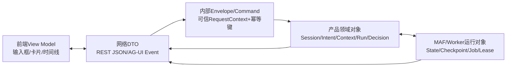
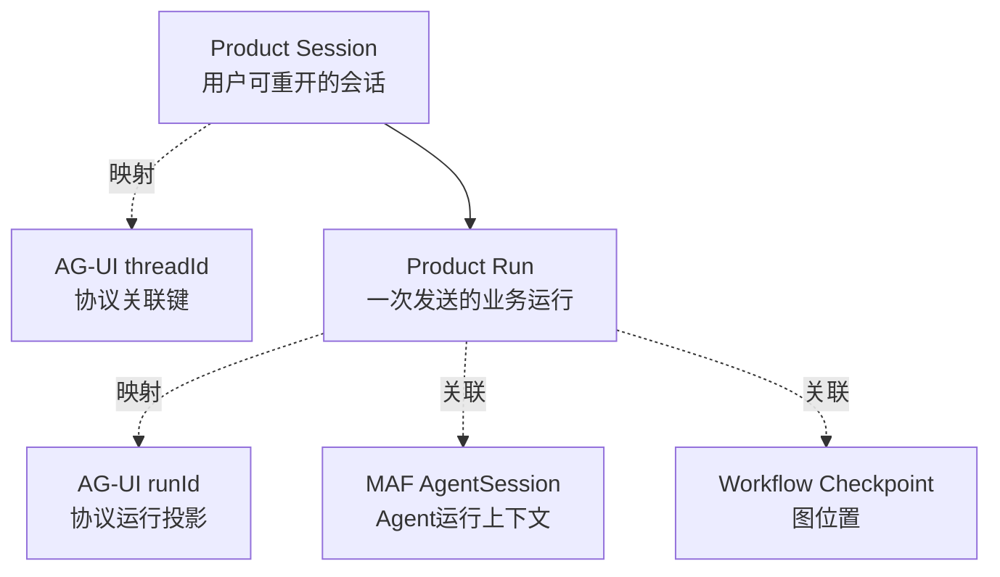

# 核心对象词典：谁创建、谁保存、谁消费

**归档日期**：2026-07-29
**分类**：架构与模块

## 1. 先看同一句话会变成多少种对象

你在输入框写“继续Chat项目”。在屏幕上它是字符串；发送后先成为AG-UI DTO；进入后端后成为可信的
Interaction/User Message；Workflow里又变成`CollaborationState.prompt`；模型请求时只作为获准Context和
任务的一部分；最终还会派生Intent、ContextPackage、TurnSummary和Trace。

这些对象正文可能相似，但责任完全不同。理解Chat源码的第一步不是背类名，而是每次追问：

> 这个对象在哪一层？谁创建？谁拥有？存在哪里？活多久？谁能修改？谁消费？用户能看见什么？

## 2. 五层对象总图



DTO是边界投影，不是数据库事实；运行对象帮助执行，不自动变成产品事实。

## 3. 对象责任总表

| 对象 | 创建者 | 权威所有者/存储 | 生命周期 | 主要消费者 | 用户可见性 |
|---|---|---|---|---|---|
| Frontend View Model | React Query/Hook/组件 | 浏览器内存；可重建 | 页面或缓存周期 | React组件 | 直接可见 |
| REST DTO | HTTP Adapter | 不长期拥有；由领域对象投影 | 一次请求/响应 | 前后端Adapter | 可见且脱敏 |
| AG-UI Event | AG-UI Projector | Event Journal/Product状态可重建 | 流式传输/前端重放 | AG-UI Client | 可见 |
| RequestContext | 可信入口 | 请求内存 | 一次命令 | Application Coordinator | 通常只显示安全身份投影 |
| Product Session | Conversation服务 | Product Store | 可跨天、可重开 | 历史页、Interaction协调器 | 可见 |
| Interaction | Interaction Ingress/Conversation | Product Store | 一次用户输入及其处理关联 | 协调器、审计 | 部分可见 |
| Message | Conversation服务 | Product Store | 长期证据，按保留规则 | UI、Context候选、搜索 | 可见 |
| TurnSummary | S7节点38 | Product Session Store | 跨Run的派生索引 | S1候选召回、UI摘要 | 可见或可解释 |
| ContextPackage revision | Context服务/S1或S2节点 | Context Product Store | 某Run使用的版本长期可追溯 | Agent任务、审批、Trace | 可查看来源投影 |
| Intent Set revision | S2节点7 | Collaboration Store | 本轮及后续纠正历史 | Plan、Draft、UI | 可修正 |
| Plan revision | S3模型+决定 | Collaboration Store | 当前目标版本相关 | Draft编译、UI | 可修正/跳过 |
| ExecutionDraft revision | S4节点21 | Collaboration/Execution Governance Store | 授权前可形成新revision | 审批、RunSpec编译 | 可编辑/审批 |
| Decision Subject | 治理服务 | Decision Store | 不可变审计事实 | Policy、Decision、Grant | 以决策卡投影可见 |
| Decision/Approval | Policy或用户响应 | Decision Store | 长期审计 | Grant、提交门、Trace | 可见 |
| Grant | 治理服务 | Grant Store | 一次性，消费后终止 | Run/Tool/Commit门 | 通常显示状态，不暴露内部令牌 |
| RunSpec | S4节点23 | Execution Governance Store | Product Run期间及审计期不可变 | Runtime Worker、Tool Gate | 可查看安全摘要 |
| Product Run/Attempt | Run管理 | Product Store | 从排队到终态，跨进程 | Worker、UI、恢复器 | 可见 |
| Runtime Job/Lease | Run管理/Worker | Runtime Job Store | 可领取、续租、过期、接管 | Worker/Reconciler | 诊断投影可见 |
| CollaborationState | Workflow入口与各Executor | MAF运行消息/Checkpoint序列化 | 一次图运行 | 下一个Executor | 通过节点Trace间接可见 |
| MAF AgentSession | MAF适配器 | MAF Session Store | 一次Agent连续运行语义 | MAF Agent | 通常不直接展示 |
| Workflow Checkpoint | MAF Workflow | Checkpoint Store | 暂停/恢复到图终止 | MAF Runtime | 仅恢复/诊断投影 |
| ToolExecution/Operation | Tool执行模块 | Tool Ledger | 准备→授权→派发→终态/对账 | Tool Gate、Run、Evidence | 可见安全摘要 |
| Artifact/Evidence/Claim | Evidence模块 | Evidence Store+Artifact存储 | 版本化、可失效 | Finalizer、证据页、审计 | 可查看 |
| Delivery/Receipt | Delivery模块 | Delivery Store/Outbox | 待发→送达/失败 | Channel Adapter、UI | 可见状态 |
| Machine/Human Trace | Finalization/Trace服务 | Product Store | 随Run长期保留 | 调试、审计、学习视图 | 脱敏后可见 |

## 4. 四个最容易混淆的Session/Run对象



即使早期实现里某些ID字符串暂时相同，也不能据此合并授权或生命周期。

## 5. 一个对象的完整生命史：ExecutionDraft

1. S4节点21读取已接受Intent、Context、Plan、能力和Validation要求。
2. 编译器创建Draft revision 1及canonical Hash，写Product Store。
3. REST/AG-UI投影把安全字段展示给用户。
4. 用户修改路径范围，应用服务创建revision 2；revision 1保留。
5. 决策服务注册revision 2的Decision Subject并记录accept。
6. Grant绑定revision 2 Hash并只允许消费一次。
7. 节点23从获准revision 2编译不可变RunSpec。
8. Worker只消费RunSpec，不再重读可编辑Draft或用户原话。
9. Trace长期引用Draft/Decision/RunSpec ID，便于审计。

这条生命史同时体现“候选→版本→决定→不可变执行合同→证据引用”。

## 6. 为什么DTO、领域对象和运行对象不能共用一个模型类

一个万能`ChatState`看似少转换，但会造成：

1. 浏览器可以提交本应由服务器生成的`approved=true`。
2. 数据库迁移被前端展示字段牵着走。
3. MAF升级迫使Product Session/Run一起迁移。
4. 私有路径、Provider Payload或内部错误容易泄露到响应。
5. 暂停恢复时无法区分“产品事实已写”和“运行内存有值”。

明确投影边界会多一些DTO和转换代码，但能让授权、版本、隐私和升级各自独立。

## 7. Store不是一个模糊的“数据库”

| Store | 保存什么 | 不保存什么 |
|---|---|---|
| Product Store | Session、Message、Intent、Context、Decision、Run、Trace等权威事实 | MAF隐藏推理 |
| Checkpoint Store | Workflow执行位置和可恢复运行状态 | 完整产品会话 |
| Runtime Job Store | Job、Lease、Cursor和Worker接管事实 | 用户长期Memory |
| Artifact Store | diff、文件等大内容；元数据/Hash由Evidence拥有 | 无来源的随意文件 |
| Browser Store | UI选择、缓存、流式投影 | 权威业务状态 |

物理上几类Store可以暂时共用同一SQLite文件，但逻辑所有者和事务边界仍不同。

## 8. 代码阅读方法：每遇到一个对象画7列

```text
名称 | 创建符号 | 输入 | 权威Store | 可变方式 | 消费者 | 失败/恢复
```

例如看到`ContextPackage`，不要只搜索类定义；继续搜索`create/save/get latest/revision/hash`、API投影、
Executor消费、Trace序列化和测试。这样才是掌握对象，而不是认识字段。

## 9. 亲手验证

1. 用一个Product Run ID串起Product Session、AG-UI thread/run、MAF Checkpoint和Runtime Job ID。
2. 在浏览器Network中找一个DTO，再在后端找对应领域对象，列出被脱敏或不可由客户端提交的字段。
3. 修改ExecutionDraft一次，确认旧revision、Decision Subject和新Hash均保留。
4. 刷新浏览器，确认View Model丢失后可由Product Store和事件重放恢复。
5. 停在HITL处，分别观察Product Decision与MAF Checkpoint，解释为什么需要两份状态。

## 10. 掌握验收

1. 相同文本为什么可以同时出现在Message、ContextItem和TurnSummary里却不是同一对象？
2. Product Run和AG-UI runId有什么差别？
3. `CollaborationState`为什么不能成为产品事实源？
4. 为什么物理同库不等于逻辑同Store？
5. 给一个新对象，你会用哪7个问题判断其架构位置？

## 关键文件

| 文件 | 职责 |
|---|---|
| `PROJECT_CONTEXT.md` | 四对象边界和稳定产品模型 |
| `docs/overall-architecture-proposal.md` | 对象所有权、ID链和11模块基线 |
| `backend/app/workflows/continuous_chat_contracts.py` | Workflow运行状态对象 |
| `backend/app/product_sessions/` | Product Session/Run/Message/Trace |
| `backend/app/execution_governance/` | Draft、RunSpec、Decision和Grant |
| `backend/app/runtime_jobs/` | Job、Lease、Cursor和恢复对象 |
