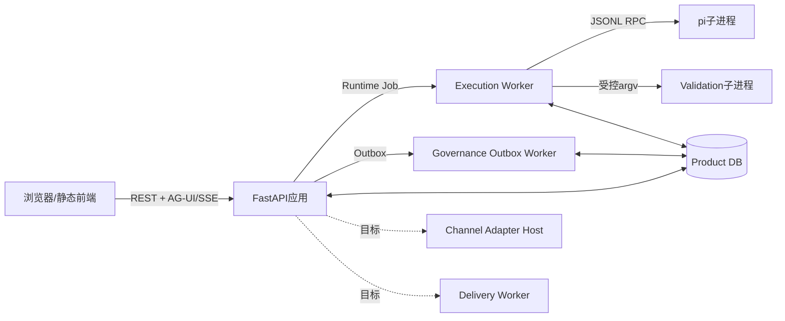

# 进程、协议与Store为什么必须分开

**归档日期**：2026-07-29
**更新日期**：2026-07-30
**分类**：架构与模块
**关联源码**：`backend/app/asgi.py`、`backend/app/runtime_execution/`、`backend/app/product_sessions/`、`backend/app/workflows/checkpoints.py`

## 问题

FastAPI、Worker、MAF、AG-UI、SQLite、Checkpoint、Journal看起来都在同一个项目里，为什么要分这么多？

## 1. 三个维度先分开

- **进程**回答“哪段程序正在运行、崩溃会带走哪些内存”。
- **协议**回答“两个边界怎样交换消息、失败怎样表达”。
- **Store**回答“状态保存在哪里、谁拥有它、用来恢复什么”。

一个进程可以实现多个协议；一个SQLite文件可以物理保存多个逻辑Store；这都不允许合并职责。

## 2. 当前与目标运行角色

本地调试可以把API与Worker嵌在同一个OS进程中，部署也可以拆开。逻辑角色保持分开，才能解释：API
断开是否取消Run、Worker崩溃谁接管、Outbox是否重复投递、pi进程是否仍存在。

## 3. 9个协议边界

“9个”是当前源码和运行方式的边界清单，不是目标架构必须永久保持的数量。推导方法是：沿一次运行找出每一次“进程、信任级别、状态所有者或外部系统发生变化”的跨越；
跨越处必须有可版本化输入/输出、身份、幂等、超时和错误语义，所以形成一个协议边界。新增Telegram、OPC-OS Bridge或其他外部系统时，数量会变，但判定法不变。

| 协议 | 两端 | 失败时首先看什么 |
|---|---|---|
| REST | React ↔ 产品资源API | Problem Detail、HTTP状态、资源revision |
| AG-UI HTTP/SSE | React Agent Client ↔ Run端点 | AG-UI runId、事件sequence、Cursor |
| Provider HTTP/SSE/JSON | Chat ↔ 模型Provider | ModelCallAttempt、dispatch/receive/decode |
| pi JSONL RPC | Chat ↔ pi子进程stdin/stdout | JSONL事件、pi Session、进程终态 |
| Provider Gateway HTTP | pi ↔ Chat模型治理边界 | 短期执行身份、Draft/Grant/Attempt |
| Tool Gateway HTTP | pi ↔ Chat Tool治理边界 | Tool proposal、Approval、Operation/Attempt |
| SQLAlchemy/Alembic | 应用服务 ↔ 关系数据库 | 事务、CAS、Schema revision |
| Git/文件系统 | Workspace服务 ↔ Repository/Artifact | Snapshot、文件Hash、Diff、对账 |
| Nginx/反向SSH | 远端浏览器 ↔ 本地Chat | 认证、Relay进程、端到端健康 |

未来外部Channel与Delivery还会增加平台协议，但必须先转换成可信Interaction/Delivery合同，不能直连数据库。

## 4. 10个状态位置

这里的“10个状态位置”是为崩溃调试准备的**细粒度状态现场清单**，不是另一套产品模块，也不与总体架构的“5类核心逻辑Store”竞争：

| 两种视图 | 回答什么 | 例子 |
|---|---|---|
| 5类核心逻辑Store | Chat内部哪类状态按何种恢复语义保存 | Product、Runtime、MAF、Artifact、Browser |
| 10个状态位置 | 一次真实故障时可能要去哪些Chat内部或外部现场查真相 | 除上述内部Store，还有Git Workspace、pi Session、进程日志、Provider外部状态和Delivery现场 |

列出一个状态位置的标准是：它能在其他组件不知情时独立保留或丢失真实状态，而且故障恢复时必须单独询问它。因此Provider外部状态也要进调试清单，
即使它根本不在Chat的数据库中。

| 状态位置 | 保存什么 | 不用它恢复什么 |
|---|---|---|
| Product Store | Session、Message、Work、Context、Decision、Run、Evidence | 不保存浏览器布局 |
| MAF Checkpoint Store | 图版本、暂停位置、运行时恢复载荷 | 不替代产品消息历史 |
| Runtime Journal | 活动Run公开事件、sequence和Cursor | 不成为Product终态 |
| Artifact/Evidence Store | 产物字节、Revision、Claim和验证关系 | 不表示已Delivery |
| Execution Workspace/Git | 隔离代码快照与Diff | 不等于已合入活动仓库 |
| pi Session JSONL | 单次pi执行转录 | 不自动成为下一次Chat Context |
| 进程日志/Metrics | 诊断、耗时、关联ID | 不作为业务事实源 |
| 浏览器草稿/页面状态 | 未提交输入、当前Tab、布局 | 不保存权威历史 |
| Provider外部状态 | 远端请求和计费事实 | Chat超时不能抹掉它 |
| Delivery状态（目标） | Attempt、Receipt、失败与重试 | 不改变生成结果是否正确 |

## 5. 一个崩溃例子

用户已批准ExecutionDraft，Worker刚把Provider请求发出去便崩溃：

1. Product Store知道Run和Attempt存在。
2. Runtime Journal可能只有`dispatch_started`，没有完成事件。
3. MAF Checkpoint知道控制流位置，但不能证明Provider是否处理请求。
4. Provider外部状态可能已经计费并生成结果。
5. 系统必须标记`outcome_unknown`或进入对账，而不能创建新Attempt盲重发。

这个例子说明：多Store不是“复杂化”，而是在不确定失败中保持诚实。

## 6. 代码入口

| 主题 | 入口 |
|---|---|
| 应用与进程组合 | `asgi.py`、`composition.py`、`lifecycle.py` |
| AG-UI接纳与SSE | `runtime_execution/endpoint.py` |
| Job/Lease/Journal | `runtime_execution/service.py`、`worker.py` |
| Product Store | `product_sessions/database.py`及各领域模型 |
| MAF Checkpoint | `workflows/checkpoints.py` |
| pi进程 | `pi_gateway.py`、`pi_runtime.py` |
| Artifact/Validation | `evidence/artifact_store.py`、Validation Runtime模块 |

## 7. 你可以自己做的实验

1. 正常Run中分别记录Product Run ID、Run Attempt ID、Runtime Job ID和AG-UI runId。
2. 浏览器断开：验证订阅结束但Job不被自动取消。
3. 在审批等待点重启Worker：核对Checkpoint、Decision和Outbox怎样接回。
4. 不输出私密正文，只查各Store中的ID、状态、sequence和Hash前缀。

## 掌握验收

1. 能否用“跨进程/信任/所有者/外部系统”重新找到当前9个协议边界？
2. 同一个SQLite文件里为什么仍然可以有多个逻辑Store？
3. 为什么5类核心逻辑Store和10个故障状态位置不矛盾？
4. SSE断线、Worker崩溃、Provider超时分别影响哪些状态？
5. 为什么Checkpoint存在仍不能自动重做Tool副作用？

## 补充记录

- 2026-07-29：补齐进程、协议和Store的基础架构导读。
- 2026-07-30：补齐9个协议边界的跨边界推导法，并明确“5类核心逻辑Store”与“10个故障状态位置”是两种粒度。
