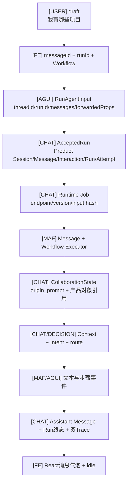

# 一句Prompt如何逐层变成Chat对象

**目标**：不只看字段名，而是看同一句`我有哪些项目`在一条真实Run中逐层变成了什么  
**真实样本**：SC01，Product Run `c8f26dd0-4a6d-4d97-957f-30b419fa7541`  
**说明**：ID和项目数量是2026-07-30这次历史运行的观察值；你的新Run会生成新值

## 0. 先认7种数据来源

本文给字段加学习标签；标签不是代码Schema的一部分。

| 标签 | 谁产生 | 例子 |
|---|---|---|
| `[USER]` | 用户原始表达 | `我有哪些项目` |
| `[FE]` | Chat前端 | client message ID、run ID、Workflow选择 |
| `[AGUI]` | AG-UI客户端/协议适配 | `threadId/runId/messages/forwardedProps` |
| `[CHAT]` | Chat产品代码 | Product Run、ContextPackage、Intent Set、Runtime Job |
| `[MAF]` | Microsoft Agent Framework运行时 | Message、Executor调度、Workflow事件、Checkpoint |
| `[MODEL]` | Provider模型候选 | Intent/Response/Summary候选；SC01为0次 |
| `[DECISION]` | 规则、Policy或用户审批 | 路由选择、Grant、提交/拒绝决定 |

“叠加”不是把所有内容拼成一个超级Prompt。不同层只添加自己负责的字段，并把权威对象留在自己的Store。

## 1. 全链总图：原话没有消失，但获得了不同身份



## 2. 第0跳：输入框里只是React页面状态

发送前：

```json
{
  "draft": "我有哪些项目",
  "selectedWorkflow": {
    "id": "continuous-collaboration",
    "version": "1.8.0",
    "endpoint": "/api/workflows/continuous-collaboration/run"
  },
  "sessionId": "791f7ee1-c4c1-4f2a-8056-a6cf4beebc84"
}
```

| 问题 | 答案 |
|---|---|
| 创建者 | `[USER]`提供`draft`；`[CHAT/FE]`提供当前Session和Workflow选择 |
| 当前Store | React内存状态；还不是本轮新增的权威Message |
| 为什么需要Workflow选择 | 同一个Chat可以运行6个已注册Workflow，后端必须拒绝版本漂移 |
| 代码 | [`App.submit`](../../frontend/src/App.tsx#L443) |
| 断点看什么 | `draft`、`activeSession.id`、`selectedWorkflow` |

点击后，`App.submit`把输入框清空并把字符串交给`useChatAgent.send`。清空输入框不等于删除消息；消息随后由
AG-UI Client本地投影，并由后端接纳门持久化。

## 3. 第1跳：前端给原话加“协议运输身份”

`useChatAgent.send`生成2个ID：

```json
{
  "agui_message_id": "b170cfbb90454f7a9bfa1dee458b0d91",
  "agui_run_id": "be9fda2671ec498a8690734230139bf6"
}
```

然后调用：

```ts
agent.addMessage({ id: messageId, role: "user", content: text });
await agent.runAgent({
  runId,
  forwardedProps: { workflow: { id: workflowId, version: workflowVersion } },
});
```

本层新增的是`[FE]`关联信息，不是业务判断：

```json
{
  "threadId": "791f7ee1-c4c1-4f2a-8056-a6cf4beebc84",
  "runId": "be9fda2671ec498a8690734230139bf6",
  "messages": [
    {
      "id": "b170cfbb90454f7a9bfa1dee458b0d91",
      "role": "user",
      "content": "我有哪些项目"
    }
  ],
  "forwardedProps": {
    "workflow": {"id": "continuous-collaboration", "version": "1.8.0"}
  }
}
```

`@ag-ui/client 0.0.57`的`HttpAgent`负责把当前messages、threadId、runId、state、tools、context和
forwardedProps组成`RunAgentInput`并POST。**这是框架客户端行为**；Chat负责给它URL、身份、Workflow选择和
页面状态，不重写另一套核心Agent事件协议。

代码：[`useChatAgent.send`](../../frontend/src/use-chat-agent.ts#L240)。断点后Continue，因为下一跳跨HTTP。

## 4. 第2跳：Pydantic把网络DTO规范成Python字典

FastAPI收到请求后，`AGUIRequest`先校验结构，再由：

```python
input_data = request_body.model_dump(mode="json", exclude_none=True)
```

得到：

```json
{
  "messages": [
    {
      "id": "b170cfbb90454f7a9bfa1dee458b0d91",
      "role": "user",
      "content": "我有哪些项目"
    }
  ],
  "run_id": "be9fda2671ec498a8690734230139bf6",
  "thread_id": "791f7ee1-c4c1-4f2a-8056-a6cf4beebc84",
  "forwarded_props": {
    "workflow": {"id": "continuous-collaboration", "version": "1.8.0"}
  }
}
```

这里主要发生`camelCase -> snake_case`，没有理解用户意图。这样做是因为浏览器/TypeScript习惯camelCase，
Python项目习惯snake_case；Pydantic在协议边界统一校验，后续业务层不必到处兼容两种拼写。

| 项 | 归属 |
|---|---|
| Uvicorn监听端口、调用ASGI应用 | 框架/服务器 |
| FastAPI按路径找到路由、Pydantic解析DTO | 框架 |
| `/api/workflows/.../run`及接纳顺序 | Chat |
| 代码 | [`durable_agent_endpoint`](../../backend/app/runtime_execution/endpoint.py#L58) |

## 5. 第3跳：同一句话第一次变成权威产品事实

`ProductSessionService.prepare_agui_run`不是“把Prompt传给模型”，而是先回答：这个用户消息能否成为一轮合法的
产品运行？它校验Session、历史前缀、幂等、单活动Run和控制字段，然后在Product事务里建立：

```text
Product User Message
Interaction
Product Run
Run Attempt
AG-UI runId映射
run.accepted Trace
```

裁剪后的真实Product Run：

```json
{
  "id": "c8f26dd0-4a6d-4d97-957f-30b419fa7541",
  "session_id": "791f7ee1-c4c1-4f2a-8056-a6cf4beebc84",
  "interaction_id": "3a7d4a67-26bd-40b4-9201-e1b457853779",
  "initial_agui_run_id": "be9fda2671ec498a8690734230139bf6",
  "request_hash": "a19d7cc9c9b7e8fc28abce6f0f7511ae81f91293672ac7a2ffbfee6a4434d5cc",
  "status": "accepted",
  "current_user_message_id": "10bd5e03-5f7f-4929-b3e3-cdb388a8a205",
  "execution_draft_revision_id": null,
  "run_spec_id": null
}
```

为什么AG-UI Message ID和Product Message ID不相同：前者服务一次协议流关联，后者是数据库权威事实主键。即使两者
某次恰好同值，也不能用协议ID代替授权或数据库身份。

代码：[`prepare_agui_run`](../../backend/app/product_sessions/service.py#L672)。这套Product对象和事务门是
**Chat增加的产品流程**，不是AG-UI或MAF自动提供的。

## 6. 第4跳：请求变成可以脱离浏览器继续运行的Job

接纳成功后，`RuntimeExecutionService.enqueue`在第二个短事务建立：

```json
{
  "id": "557c2936-d1d6-4d82-bfe8-12776abdddbe",
  "product_run_id": "c8f26dd0-4a6d-4d97-957f-30b419fa7541",
  "run_attempt_id": "1fcaa162-c0be-4a48-9b92-77f3f0eb2caf",
  "endpoint_key": "/api/workflows/continuous-collaboration/run",
  "workflow_definition_id": "continuous-collaboration",
  "workflow_version": "1.8.0",
  "status": "queued",
  "recoverability": "safe_requeue",
  "input_hash": "427a22582c8b76782ee3e4c531611de270bd28d4aa3b5bc1a308bbcaad50e755",
  "external_dispatch_state": "not_started"
}
```

新增这些字段的原因：

| 字段 | 为什么存在 |
|---|---|
| `product_run_id/run_attempt_id` | 把运行时执行归回产品事实和具体尝试 |
| `endpoint_key` | Worker重启后仍能找回正确Runner，不保存Python对象 |
| `workflow_definition_id/version` | 防止用另一版图静默继续 |
| `input_hash` | 幂等与漂移检测 |
| `recoverability/external_dispatch_state` | 判断崩溃后可安全重领还是结果未知 |

这套持久Job/Lease/Journal是**Chat增加的运行治理**。FastAPI的`StreamingResponse`只会流数据，不会自动让断线后的
任务继续，也不会自动建立恢复语义。

## 7. 第5跳：Worker用稳定引用重新取得执行所有权

Worker从数据库领取Job后形成`claim`：

```json
{
  "job_id": "557c2936-d1d6-4d82-bfe8-12776abdddbe",
  "product_run_id": "c8f26dd0-4a6d-4d97-957f-30b419fa7541",
  "run_attempt_id": "1fcaa162-c0be-4a48-9b92-77f3f0eb2caf",
  "lease_epoch": 1,
  "endpoint_key": "/api/workflows/continuous-collaboration/run"
}
```

Worker按`endpoint_key`从Registry取`ProductAwareWorkflow`。这里没有React调用栈；能证明“这是刚才那条消息”的是
Job里的Product Run/Attempt和原始`input_data`。

代码：[`ExecutionWorker._execute_claim`](../../backend/app/runtime_execution/worker.py#L204)。

## 8. 第6跳：Chat桥接层把Product生命周期包在MAF外面

`ProductAwareWorkflow.run`先再次调用`prepare_agui_run`。此时找到相同`agui_run_id + request hash`，返回原
`AcceptedRun`，不重复创建产品对象。随后它：

```text
标记Product Run running
-> 记录workflow.started
-> 调用MAF AgentFrameworkWorkflow.run
-> 收集MAF/AG-UI事件与assistant_text
-> 处理中断、失败或成功
-> 成功时调用Product最终提交门
```

分工必须说清：

| 能力 | 谁提供 |
|---|---|
| Workflow图调度、Executor消息传递、运行事件、Checkpoint基础 | MAF |
| MAF事件转换为AG-UI运行/步骤/文本事件 | `agent-framework-ag-ui` |
| Product Run/Attempt、状态门、双Trace、幂等接纳 | Chat的`ProductAwareWorkflow`与产品服务 |

MAF并不知道Chat的Project、Work、Evidence或Product Run语义。Chat也没有自己再造一套与AG-UI竞争的前后端核心
Agent事件协议。

## 9. 第7跳：MAF Message进入39节点，状态逐步叠加

安装版适配器把AG-UI messages转为MAF Message，并按Chat构建的Workflow图调用Executor。节点间主要传
`CollaborationState`，它是冻结的运行投影；节点用`dataclasses.replace`产生下一版。

同一真实Run的关键状态变化：

```text
节点1 input_acceptance后
  origin_prompt="我有哪些项目"                    [USER]
  recent_turn_summaries=()                         [CHAT]
  project_candidates=()                            [CHAT]
  scenario="clarify"                              [CHAT默认值，不是最终决定]

节点3/5 Context后
  directory_context_package_id="4bd2522a-..."     [CHAT]
  project_matches=(2个正式Project投影)              [CHAT/Product DB]
  context_items=(2个Project项 + 2个Repository项)   [CHAT]

节点6/9 Intent后
  scenario="simple_question"                      [DECISION]
  intent.query_kind="project_catalog"             [CHAT确定性护栏]
  intent.needs_plan=false                          [CHAT确定性护栏]
  intent_set_id="070a1920-..."                    [CHAT/Product DB]
  intent_set_revision_hash="c1f97319..."          [CHAT]

节点10/15后
  selected_project_id=null                         [DECISION：目录查询不绑定单项目]
  project_catalog_result.formal_project_count=2    [CHAT/Product DB]
  protocol_selection.protocol_key="simple-answer" [DECISION]

节点17后
  response="当前共有 2 个正式 Project：..."       [CHAT确定性查询]
  turn_summary.query_kind="project_catalog"       [CHAT候选]
  work_state_candidates=[]                         [CHAT候选]
  memory_candidates=[]                             [CHAT候选]
```

本场景经过`intent_agent`节点，但确定性护栏在Chat Executor内部直接识别正式Project目录查询，因此：

```text
ModelCallDraft = 0
Provider Attempt = 0
ExecutionDraft = 0
RunSpec = 0
ToolExecution = 0
```

这正好说明3个层次不能混：**MAF负责调用节点，Chat节点决定是否需要模型，Provider只在治理门允许时被调用。**

完整23个实际节点、16个跳过节点和每步实值看
[SC01完整链路](./场景/SC01-确定性查询正式Project目录.md#9-第三段实值传递把23个实际节点逐个走一遍)。

## 10. 第8跳：候选输出先成为Product事实，再告诉浏览器“完成”

回程顺序：

```text
FinalizeExecutor.yield_output(response)
-> MAF/AG-UI生成TEXT_MESSAGE_*事件
-> ProductAwareWorkflow累积assistant_text
-> complete_active_run同事务写Assistant Message和Run终态、双Trace
-> Worker验证Product已经终态
-> Runtime Journal追加RUN_FINISHED
-> FastAPI按sequence输出SSE
-> @ag-ui/client更新messages
-> React重新渲染并回到idle
```

最终2种Message：

```json
{
  "agui_assistant_message": {
    "id": "09ae556d-bea0-41e1-ac86-76a46222e3c2",
    "purpose": "协议流中的消息关联"
  },
  "product_assistant_message": {
    "id": "3a2278ad-9ba4-41a1-b499-71a62bcde11c",
    "agui_message_id": "09ae556d-bea0-41e1-ac86-76a46222e3c2",
    "run_id": "c8f26dd0-4a6d-4d97-957f-30b419fa7541",
    "role": "assistant",
    "status": "committed",
    "purpose": "刷新、恢复和审计使用的权威事实"
  }
}
```

必须先提交Product事实再发送`RUN_FINISHED`，否则浏览器可能先显示成功，而刷新后Message消失，形成假成功。

## 11. 一张表区分“基础设施替你做了什么”与“项目后来加了什么”

| 层 | 框架/库原生 | Chat项目实现 |
|---|---|---|
| 浏览器UI | 浏览器事件循环、React渲染/Hook | 页面、输入状态、工作台、审批卡和Feature组件 |
| 开发运行 | Node执行Vite、Python执行Uvicorn | 启动脚本、端口、路由装配和配置边界 |
| Agent前端协议 | AG-UI Client组RunAgentInput、解析事件 | Session/Workflow选择、产品REST、重连接合 |
| HTTP | Uvicorn/ASGI/FastAPI/Pydantic/StreamingResponse | 接纳门、错误语义、Runtime Job入队、Cursor响应头 |
| Agent运行时 | MAF Message、Workflow、Executor、事件、Checkpoint能力 | 39节点图、每个业务Executor、ProductAwareWorkflow |
| 产品治理 | SQLAlchemy提供ORM/事务工具 | Product Session、Intent、Context、Approval、Evidence等事实与不变量 |
| 执行恢复 | asyncio提供任务；数据库提供持久化能力 | Lease Worker、Journal、Cursor、Reconciler和结果未知语义 |
| 模型/Tool | Provider或pi提供具体推理/执行 | 每次调用Draft、Hash、Decision、Grant、Attempt和最小权限门 |

## 12. 亲手调试时每跳只做4个动作

1. 在[来路与下一跳](./从断点停住到知道来路和下一跳.md)的公共主干断点停住。
2. 把本节JSON里的历史ID替换成你变量窗中的新ID。
3. 用来源标签说明每个新增字段是谁加的、为什么加。
4. 到下一跳确认上一步输出成为输入；跨边界就Continue并用稳定ID接回。

不要在变量窗展开`Authorization`、完整Provider Body、私密Context正文或密钥。想对账时优先查ID、状态、Hash、
数量、节点和Reason Code。

## 掌握验收

1. 原始Prompt在哪些对象中保留，哪些对象只存它的Hash或引用？
2. 为什么AG-UI runId、Product Run ID和Runtime Job ID必须是3种身份？
3. `camelCase -> snake_case`是业务理解吗？是谁完成的？
4. MAF调用了`intent_agent`，为什么本场景仍可做到0 Provider Attempt？
5. 为什么`RUN_FINISHED`必须晚于Product Assistant Message提交？
