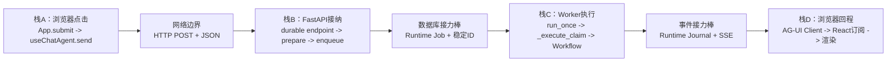

# 从断点停住到知道来路和下一跳

**适合谁**：第一次调试React、FastAPI和异步Worker，只会一点C++也可以  
**学习目标**：任何断点停住后，能在2分钟内回答“谁调我、数据从哪来、我加了什么、下一跳去哪”  
**配套实值课**：[一句Prompt如何逐层变成Chat对象](./一句Prompt如何逐层变成Chat对象.md)  
**前置静态地图**：[源码目录、文件职责与模块流程](../00-从这里开始/Chat源码目录文件职责与模块流程地图.md)  
**长期成长路线**：[从Web小白到能设计开发Chat](../00-从这里开始/从Web小白到能设计开发Chat的学习路线.md)

## 0. 先给结论：一次发送不是一条能从头Step Into到底的函数调用

C++单进程程序常见的是：

```text
main -> a() -> b() -> c()
```

Chat的一次发送会跨浏览器、网络、FastAPI异步任务、数据库和Worker。它至少有4段调用栈：



所以你在Worker断点的Call Stack里看不到`App.submit`，不是调试器坏了，而是中间已经跨过HTTP和持久Job。
跨边界后要靠`Product Run ID`、`Runtime Job ID`、`AG-UI runId`等关联值接回同一条业务链。

## 1. 断点停住后固定做这7步

先不要逐行读函数。按这个顺序看：

1. 看文件路径：它属于前端、协议入口、产品应用、MAF Workflow、Runtime还是Store？
2. 看当前函数名：这是事件回调、路由函数、应用服务、Executor还是框架内部方法？
3. 看Call Stack上1–3层：当前这段同步代码是谁调用的？
4. 看入口变量：只挑本场景的5–8个关键字段，不展开密钥、完整Provider Body和隐私正文。
5. 看当前函数将创建或改变什么对象。
6. 看“下一跳”表，决定按Step Over、Step Into还是Continue。
7. 记下稳定关联ID；如果下一跳跨网络、队列或进程，就用ID找下一段栈，不能硬按Step Into。

调试器的3个按钮可以这样理解：

| 操作 | 含义 | Chat第一遍何时用 |
|---|---|---|
| Step Over | 执行当前行，但不钻进函数内部 | 默认选择；跳过React、SQLAlchemy、Pydantic和MAF内部细节 |
| Step Into | 进入这一行调用的函数 | 只在表中标为“进入”的Chat边界使用 |
| Continue | 一直跑到下一个断点 | 跨网络、异步任务、Worker或大量框架代码时使用 |

## 2. 从目录到函数：先认这条公共主干

下面是SC01–SC15共用的“高速公路”。不同场景只是在Workflow内分叉。

```text
frontend/src/
  App.tsx
    App.submit                         用户点击入口
  use-chat-agent.ts
    useChatAgent.send                  组消息与AG-UI运行参数
    agent.subscribe(...)               消费回程事件

backend/app/
  runtime_execution/endpoint.py
    durable_agent_endpoint             HTTP接纳、入队、订阅Journal
  product_sessions/service.py
    prepare_agui_run                   建Product Message/Run/Attempt
  runtime_execution/service.py
    RuntimeExecutionService.enqueue    建持久Runtime Job
  runtime_execution/worker.py
    ExecutionWorker.run_once           轮询；空队列也反复调用
    ExecutionWorker._execute_claim     有Job后才进入的执行主循环
  workflows/runtime.py
    ProductAwareWorkflow.run           Product生命周期包住MAF运行
  workflows/continuous_chat.py
    各种Executor                       39节点的业务分支
  product_sessions/service.py
    complete_active_run                最终产品事实提交门
```

源码直达：[`App.submit`](../../frontend/src/App.tsx#L443)、
[`useChatAgent.send`](../../frontend/src/use-chat-agent.ts#L240)、
[`durable_agent_endpoint`](../../backend/app/runtime_execution/endpoint.py#L58)、
[`prepare_agui_run`](../../backend/app/product_sessions/service.py#L672)、
[`ExecutionWorker._execute_claim`](../../backend/app/runtime_execution/worker.py#L204)、
[`ProductAwareWorkflow.run`](../../backend/app/workflows/runtime.py#L120)。

行号只是入口提示；代码变化后先搜索符号名。文档里写成`类名.方法名`时，它就是方法，不需要猜。

## 3. 一次发送的动态调用与下一跳

| # | 谁把它调到这里 | 当前断点 | 当前要看 | 当前层输出 | 下一跳与按键 |
|---:|---|---|---|---|---|
| 1 | 浏览器按钮`onClick` | `App.submit` | `draft/status/activeSession/selectedWorkflow` | `text + workflow选择` | Step Into `send`，或Continue到#2 |
| 2 | `App.submit` | `useChatAgent.send` | `content/messageId/runId/agent.url` | `RunAgentInput`所需参数、本地User消息 | Step Over到`agent.runAgent`，然后Continue |
| 3 | `@ag-ui/client`经HTTP调用；不是JS函数直调 | `durable_agent_endpoint` | `request_body/input_data` | `AcceptedRun + EnqueuedRuntime` | Step Into #4、#5；接纳完成后Continue |
| 4a | `durable_agent_endpoint` | `prepare_agui_run`第一次 | `thread_id/run_id/incoming/existing_protocol` | Product Message/Interaction/Run/Attempt | Step Over事务后返回#3 |
| 5 | `durable_agent_endpoint` | `RuntimeExecutionService.enqueue` | `accepted/endpoint_key/input_data` | Runtime Job、Cursor | Step Over后返回#3；不要期待直接进入Worker |
| 6 | 应用Lifespan启动的Worker循环 | `ExecutionWorker.run_once` | `claim` | 无Job返回False；有Job交给`_execute` | 初学者不要下此热点断点 |
| 7 | `run_once -> _execute` | `ExecutionWorker._execute_claim` | `claim.job_id/product_run_id/lease_epoch/input_data` | Journal事件与Job终态 | Step Over到`runner.run`，Continue到#8 |
| 8 | Worker按`endpoint_key`从Registry取Runner | `ProductAwareWorkflow.run` | `input_data/thread_id/agui_run_id` | MAF事件流 + Product Trace | Step Into #4b，再Continue到场景Executor |
| 4b | `ProductAwareWorkflow.run` | `prepare_agui_run`第二次 | `existing_protocol/is_resume` | 幂等复用原Product Run | Step Over返回#8；不是重复建Run |
| 9 | MAF按Workflow图调度 | 场景Executor | `state/self.id/当前产品对象ID` | 新`CollaborationState`或HITL请求 | 按场景卡Continue到下一Executor |
| 10 | `ProductAwareWorkflow.run`在图完成后调用 | `complete_active_run` | `assistant_text/agui_message_id/run/attempt` | Assistant Message、终态Run、双Trace | Step Over事务提交，再Continue |
| 11 | Worker把事件先写Journal，HTTP订阅再回放 | `onMessagesChanged/onRunFinishedEvent` | `nextMessages/result.outcome` | React页面状态 | Step Over看组件重渲染 |

这里有2个特别容易误会的事实：

1. `prepare_agui_run`正常会命中2次：HTTP接纳时创建，Worker进入`ProductAwareWorkflow`时幂等复核。
2. `ExecutionWorker.run_once`空闲也会轮询，可能不停暂停；第一遍应使用只在领取到Job后命中的`_execute_claim`。

## 4. 静态调用图、动态调用图、数据血缘、责任图不是一回事

| 图 | 回答的问题 | 例子 |
|---|---|---|
| 静态调用图 | 代码里可能调用谁 | `submit`可能调用`send` |
| 动态调用图 | 本轮实际调用了谁 | SC01未进入Provider，SC02进入3次 |
| 数据血缘 | 一个值从哪来、变过几次、存在哪 | `draft`变成AG-UI Message，再映射为Product Message |
| 责任图 | 谁拥有这个事实、谁只是搬运/投影 | Product DB拥有Message；React只显示它 |

看Call Stack只能解决前2种图的一小段。要获得整个系统的掌控感，必须把Call Stack和稳定ID、Store、Trace结合。

## 5. 三种调试手段怎样分工

| 手段 | 最适合回答 | 不擅长 |
|---|---|---|
| IDE红点断点 | 临时停某一行；可单独启停 | 跨进程历史、已经发生的路径 |
| 源码`breakpoint()`/`debugger;` | 教材入口不会因换电脑丢失 | Python默认会真暂停，不能像红点一样右键禁用 |
| Product/Runtime Trace | 同一Run实际经过什么、为什么选择、事件顺序 | 不能查看隐藏推理，也不替代局部变量调试 |

当前仓库已经注入一组代码级断点。它们适合“按需组合”，不适合30个同时跑：

- 公共主干`core`：BP-27、28、01、04、03、07、09、16、19、06、29。
- SC01确定性查询：公共主干再加BP-10、11、20、13、21、17、18。
- 模型治理：重点BP-13、14、15，不要误以为`prepare`必定创建Draft。
- pi执行：重点BP-22–26。
- 恢复：重点BP-05、06、07、29、30。
- 热点观察：BP-02、08只在专门研究Worker轮询或Trace写入时启用。

代码级Python断点存在时，普通测试或非调试启动应设置`PYTHONBREAKPOINT=0`，否则可能进入`pdb`。完整操作和
当前断点事实看[断点清单与调试配置](./断点清单与调试配置.md)。

## 6. 跨边界时用哪根“接力棒”

| 边界 | 上一段栈结束于 | 下一段栈从哪开始 | 用什么值接回 |
|---|---|---|---|
| 浏览器→FastAPI | `agent.runAgent` | `durable_agent_endpoint` | `threadId + AG-UI runId` |
| HTTP接纳→Worker | `enqueue` | `_execute_claim` | `Runtime Job ID + Product Run ID + Run Attempt ID` |
| Worker→MAF节点 | `runner.run` | Executor handler | `Product Run ID + workflow version + executor_id` |
| MAF→Product提交 | `yield_output` | `complete_active_run` | `Product Run ID + AG-UI assistant messageId` |
| Worker→浏览器 | `append_event` | AG-UI Client订阅 | `Runtime Job ID + event sequence/cursor` |

如果将来Worker单独进程运行，VS Code里更不可能出现从FastAPI一路连到Worker的Call Stack。正确做法仍是用这些
ID在日志、Trace、数据库和另一个调试进程之间对账。

## 7. 每次断点记录用这张卡

```text
场景：SC__
当前层/文件/符号：
由谁调用：
为什么本场景会走到这里：
入口关键值（最多8个）：
每个值的来源：[USER]/[FE]/[AGUI]/[CHAT]/[MAF]/[MODEL]/[DECISION]
本函数新增/改变：
写入哪个Store：
框架原生还是Chat自建：
下一跳：
按键：Step Over / Step Into / Continue
本轮实际值和预言机偏差：
```

## 8. 你达到哪一级了

| 级别 | 过关动作 |
|---|---|
| L1看懂 | 能解释为什么Worker断点的Call Stack里没有React |
| L2定位 | 给一个Product Run ID，能找出Job、Attempt、Workflow节点和最终Message |
| L3预测 | 发送前能写出本场景会命中/跳过的边界及关键对象变化 |
| L4修改 | 新增节点或路由后，能同时补来路、数据血缘、Trace和测试 |

第一次实操不要追求把一个800行函数逐行看懂。先沿公共主干跑通1次，再选择一个场景分叉；你真正要建立的是
“能预测下一跳”的能力。

## 掌握验收

1. 为什么`enqueue`之后不能靠Step Into直接走到Worker？
2. 为什么`prepare_agui_run`一次正常发送可能命中2次？
3. 在`_execute_claim`停住时，怎样证明它来自刚才那次点击？
4. 为什么源码断点、IDE断点和Trace缺一不可？
5. 如果你不知道下一跳，先看Call Stack、Workflow图还是Runtime Job？分别适用于什么边界？
