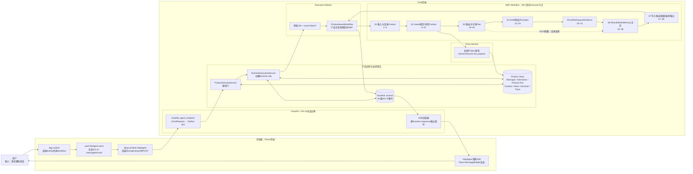
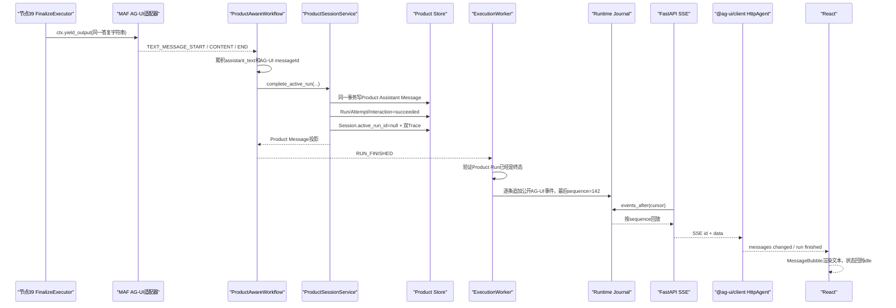

# SC01：从输入框到正式Project列表——0模型调用的完整链路

<!-- debug-scenario: id=SC01; status=current; oracle=exact -->

**归档日期**：2026-07-30  
**输入族**：只查看正式Project目录，不创建、不修改、不执行  
**自动证据**：[`test_explicit_project_catalog_query_cannot_be_rewritten_as_create_or_clarify`](../../../backend/tests/test_continuous_chat.py#L1745)

**实测样本**：Product Run `c8f26dd0-4a6d-4d97-957f-30b419fa7541`，2026-07-29，`continuous-collaboration@1.8.0`
**阅读目标**：不搜索函数名，直接下断点，并解释React、AG-UI、FastAPI、Runtime Worker、MAF Workflow、
Product Harness、Product Store和Trace之间怎样传递这一条真实数据。

> 本文只讲SC01。所有JSON、ID、Hash、状态、节点数和事件数都来自上面的同一条真实Run；
> 为了阅读裁掉字段时会明确写“真实值的裁剪投影”，不会把示意数据冒充实测。

## 0. 先给结论：不是“整个系统只有7个阶段”

项目里同时存在3套容易混淆的“阶段”：

| 名称 | 数量 | 它回答什么 | 本场景怎样使用 |
|---|---:|---|---|
| Chat七层架构 | 7层 | React、协议、应用、领域、MAF、执行Runtime、外部能力分别负责什么 | SC01穿过前6层，但不调用外部模型/Tool |
| 主Workflow学习阶段 | S1–S7，共7组 | 怎样按设计责任理解39个真实MAF节点 | SC01经过S1、S2、S3、S6、S7，跳过S4、S5 |
| 项目交付阶段 | 0–8，共9个 | 整个Chat产品先建设什么、后建设什么 | 与一次Run的执行顺序无关 |

源码把S1–S7定义为**学习分组**，不会在运行时创建7个对象，也不会改变MAF图：
[`CONTINUOUS_WORKFLOW_LEARNING_STAGES`：Python常量](../../../backend/app/continuous_workflow_learning.py#L39)。

但它也不是随意按行数切成7份。它把已经存在于产品设计中的7类责任压缩成可学习边界：

1. 先保存输入并形成有界目录Context。
2. 再形成可版本化Intent、绑定Project/Work并加载详情。
3. 再根据已接受Intent选择场景，必要时规划。
4. 真要执行时，先把可编辑草稿授权并冻结为RunSpec。
5. 需要pi或写入时，在受治理Runtime、Workspace和Evidence边界执行。
6. 模型/执行结果仍只是候选，分别决定Result、Work和Memory后果。
7. 最后才写长期事实、摘要、Assistant Message和Run终态。

准确说法是：

> S1–S7是“由产品保证和状态所有权推导出的主Workflow设计职责区”。代码为了避免把它们误写成
> 7个MAF节点、7个事务或7个部署进程，正式名称仍保留为“学习阶段”。

## 1. 先看全系统：S1–S7到底嵌套在哪里



| 部件 | 本场景负责 | 明确不负责 |
|---|---|---|
| React | 收集输入、选择Workflow、投影消息和运行状态 | 不决定Project事实，不宣布Run成功 |
| AG-UI | 规定请求DTO和`RUN_STARTED`、`STEP_*`、`TEXT_MESSAGE_*`、`RUN_FINISHED`等事件 | 不是数据库、不是Workflow引擎、不是授权身份 |
| FastAPI + Runtime Worker | 接纳请求、持久入队，让执行不依赖HTTP连接寿命 | 不替MAF定义节点语义 |
| MAF Workflow | 按节点、边和SwitchCase运行Executor；必要时Checkpoint/Interrupt | 不拥有Project、Work、Message或产品成功事实 |
| Chat Harness + Product Store | 查询权威Project，保存Message、Intent、Context、Decision、Run和Trace | 不依赖模型“记得”项目 |

设计依据已经存在于：

- [七层架构总地图](../../架构与模块/Chat总体架构与一次点击的七层链路.md#3-七层架构)；
- [REST、AG-UI、Product DB、MAF所有权边界](../../../PROJECT_CONTEXT.md#101-协议运行时与状态所有权)；
- [Product Session、AG-UI Thread、MAF状态、Product Run四对象边界](../../../PROJECT_CONTEXT.md#71-四个必须区分的对象)；
- [总体架构的ID链与4个提交门](../../../docs/overall-architecture-proposal.md#102-4个提交门)。

## 2. 为什么正好分成S1–S7，而不是把39个节点平铺

| 阶段 | 设计问题与要保护的保证 | 已有设计依据 | 当前代码怎样落实 | SC01实际情况 |
|---|---|---|---|---|
| S1 输入接纳与目录Context | 必须先保留原话；只带回轻量、可审核、有来源的Context，不能把完整历史塞给模型 | [Product Harness两阶段Context](../../../docs/product-harness-detailed-design.md#7-两阶段上下文) | [阶段定义](../../../backend/app/continuous_workflow_learning.py#L40)，[MAF接线](../../../backend/app/workflows/continuous_chat_factory.py#L390) | 经过5节点；创建1个directory ContextPackage，139 Tokens |
| S2 Intent、绑定与详情Context | “用户说了什么”不能直接等于“系统要做什么”；Intent要版本化，Project必须来自权威目录；只有绑定后才加载详情 | [核心领域对象](../../../PROJECT_CONTEXT.md#7-核心领域对象)，[目录先于详情](../../../docs/product-harness-detailed-design.md#L242) | [阶段定义](../../../backend/app/continuous_workflow_learning.py#L54)，[接线](../../../backend/app/workflows/continuous_chat_factory.py#L395) | 经过10节点；确定性Intent；不绑定某一个Project；detail Context不适用 |
| S3 路由与可选Plan | 下游不能重新猜意图；目录查询、澄清、规划和默认执行必须按公开规则唯一选择 | [`simple-answer`与权威查询优先](../../../docs/chat-harness-protocol-context-detailed-design.md#L90) | [阶段定义](../../../backend/app/continuous_workflow_learning.py#L73)，[4路Switch](../../../backend/app/workflows/continuous_chat_factory.py#L408) | 走`project_catalog`第1条Case；节点17形成答复和摘要 |
| S4 Draft、授权与RunSpec | 真正执行前，用户要看见“做什么、用什么、影响什么”；内容变化后旧授权失效 | [Execution提交门](../../../docs/overall-architecture-proposal.md#L810) | [阶段定义](../../../backend/app/continuous_workflow_learning.py#L87)，[接线](../../../backend/app/workflows/continuous_chat_factory.py#L419) | 全跳过；查询不是执行，所以Draft=0、RunSpec=0 |
| S5 pi、Workspace与Evidence | Tool/文件副作用不能由模型文本代表；写入要隔离、记账、验证并形成Claim/Evidence | [Tool副作用门](../../../docs/overall-architecture-proposal.md#L813) | [阶段定义](../../../backend/app/continuous_workflow_learning.py#L100)，[接线](../../../backend/app/workflows/continuous_chat_factory.py#L443) | 全跳过；ToolExecution=0 |
| S6 响应、摘要与提交决定 | 一个答复可以显示，不代表Work或长期Memory也应改变；3类后果必须分别决定 | [模型候选不自动成为事实](../../../PROJECT_CONTEXT.md#8-产品原则) | [阶段定义](../../../backend/app/continuous_workflow_learning.py#L116)，[汇流接线](../../../backend/app/workflows/continuous_chat_factory.py#L452) | 跳过两个模型节点；经过Result/Work/Memory三个决定点 |
| S7 产品事实与终态 | 只提交获准候选；摘要不能替代原始Message；Assistant Message落库后才允许成功终态 | [Finalization门](../../../docs/overall-architecture-proposal.md#L815) | [阶段定义](../../../backend/app/continuous_workflow_learning.py#L130)，[图内终点](../../../backend/app/workflows/continuous_chat_factory.py#L458)，[图外事务门](../../../backend/app/product_sessions/service.py#L1132) | 经过3节点；保存1条TurnSummary、1条Assistant Message、2份Trace报告 |

为什么不切成更多或更少：

1. S1与S2不能合并：目录Context先帮助理解目标，详情Context只能在目标绑定后加载，否则会跨项目污染。
2. S3与S4不能合并：选择“该走哪类流程”不等于授权“按这一版合同执行”。
3. S5不能并入MAF Agent：模型提出Tool调用不等于产品已经授权并记录副作用。
4. S6与S7不能合并：候选决定和权威事务写入是两个不同失败边界。
5. S1–S7不是事务边界或部署进程；把它们写成运行对象会和真实MAF节点、Product Store事务、
   Worker Job及Checkpoint冲突。

## 3. 本场景允许你自由输入到什么程度

你不必照抄固定Prompt，但要保持用户目的仍是“只查看正式Project目录”。

### 3.1 当前确定性护栏明确覆盖

- `我有哪些项目？`
- `列出我的项目。`
- `我想查看现有的项目列表。`
- `我有哪些项目？只查看正式列表，不要创建任何事项。`

护栏源码是[`is_project_catalog_query()`：Python纯函数](../../../backend/app/workflows/continuous_chat_contracts.py#L335)。
它先移除“不要创建”这类否定短语，再检查精确句式、关键词和全匹配正则。

### 3.2 不属于SC01

| 输入 | 为什么不能套用SC01 |
|---|---|
| `新建一个项目` | 是创建意图，不是只读目录 |
| `列出项目并修改Chat代码` | 至少2个Intent，目录分支不能吞掉执行目标 |
| `继续那个项目` | 需要解析唯一Project或澄清 |
| `说说你怎么看项目管理` | 是知识问答，不是Product目录查询 |
| `帮我盘点最近在忙什么` | 当前护栏不保证命中，可能进入模型Intent节点 |

“可以随意输入”的准确含义是：你可以自由改写同一目的，但只有命中确定性护栏的输入才承诺
`ModelCallAttempt=0`。未命中护栏的同义句即使最终仍被模型识别为`project_catalog`，也已经发生一次
模型调用，不能拿SC01的0模型预期判定它失败。

## 4. 运行前预言机：先写答案，再开始调试

| 观察项 | SC01必须满足 | 2026-07-29实测 |
|---|---|---|
| Workflow | `continuous-collaboration@1.8.0` | 相同 |
| Intent | `scenario=simple_question`、`query_kind=project_catalog`、`confidence=1.0` | 相同 |
| 意图执行方式 | `execution_mode=deterministic_guard` | 相同 |
| 模型/Tool | ModelCall Attempt=0；ToolExecution=0 | 0 / 0 |
| 场景路由 | `project_catalog → project_catalog_query` | 第1条Case命中 |
| MAF实际路径 | 23个必经节点；16个节点未走 | 23 / 16 |
| Product长期写入 | Project、Work、Accepted Memory新增数均为0 | 0 / 0 / 0 |
| 本轮应写事实 | User Message、Interaction、Product Run/Attempt、Runtime Job、1个ContextPackage、1个Intent Set、1个TurnSummary、1个Assistant Message、双Trace | 全部存在 |
| Product终态 | `succeeded` | `succeeded`，约640 ms |
| 用户答复 | 当前库有项目就列权威目录；为空就明确没有正式Project | 当时列出2个正式Project |

自动测试使用全新空数据库，因此断言“当前还没有正式Project”；历史实测Run所在数据库当时有2个Project。
**Project数量和名称是运行数据，不是固定预言机；数据来源、路由、零模型、零副作用和终态才是固定合同。**

## 5. 同一条真实Run的ID总账

### 5.1 这些ID不是同一个对象

| 对象 | 真实ID | 谁创建/拥有 | 关系 |
|---|---|---|---|
| Product Session | `791f7ee1-c4c1-4f2a-8056-a6cf4beebc84` | Product Store | 本轮Web映射中同时作为AG-UI `threadId`，但职责仍不同 |
| AG-UI User Message | `b170cfbb90454f7a9bfa1dee458b0d91` | 前端`HttpAgent` | 映射到Product User Message |
| AG-UI Run | `be9fda2671ec498a8690734230139bf6` | 前端`useChatAgent.send()` | 只做协议关联；`run_protocol_ids`保存映射 |
| Product User Message | `10bd5e03-5f7f-4929-b3e3-cdb388a8a205` | ProductSessionService | 权威输入事实 |
| Interaction | `3a7d4a67-26bd-40b4-9201-e1b457853779` | ProductSessionService | 一次完整交互 |
| Product Run | `c8f26dd0-4a6d-4d97-957f-30b419fa7541` | ProductSessionService | 用户长期可见的一次执行 |
| Run Attempt | `1fcaa162-c0be-4a48-9b92-77f3f0eb2caf` | ProductSessionService | 本Run第1次实际尝试 |
| Runtime Job | `557c2936-d1d6-4d82-bfe8-12776abdddbe` | RuntimeExecutionService | Worker领取、Lease和事件游标 |
| directory ContextPackage | `4bd2522a-c05e-46a9-a525-f1cad7500f68` | Product Harness | 本轮Context revision 1 |
| Intent Set | `070a1920-5ac9-41c0-961d-7bc0ac783220` | CollaborationIntentService | 1个Intent，最终accepted |
| TurnSummary | `62a1499c-5f0a-4f10-94e0-7a6dea18906c` | TurnSummaryPersistExecutor | 后续有界召回候选 |
| AG-UI Assistant Message | `09ae556d-bea0-41e1-ac86-76a46222e3c2` | MAF AG-UI适配层 | 流式文本事件使用 |
| Product Assistant Message | `3a2278ad-9ba4-41a1-b499-71a62bcde11c` | Product Finalization事务 | 刷新后恢复的权威答复 |

### 5.2 两套事件Sequence也不能混

| 事件账 | 数量 | 作用 |
|---|---:|---|
| Product Trace `trace_events.sequence=1..72` | 72 | 记录产品Run、节点公开内容和状态；终态生成双Trace |
| Runtime Journal `runtime_event_records.sequence=1..142` | 142 | 保存AG-UI公开事件，支持SSE回放与断线接回 |
| Human Trace里的实际节点 | 23 | 从72条Product Trace中确定性归纳本轮走过的MAF节点 |

所以“Trace Sequence 52”和“Runtime Sequence 137”不矛盾：它们属于两本不同的账。

## 6. 第一段实值传递：React → AG-UI → Product接纳 → Runtime Job

### 6.1 用户点击发送前

直接断点：

1. [`App.submit`：React事件回调](../../../frontend/src/App.tsx#L443)
2. [`useChatAgent.send`：React Hook回调](../../../frontend/src/use-chat-agent.ts#L240)

本轮关键变量：

```json
{
  "draft": "我有哪些项目",
  "selectedWorkflow": {
    "id": "continuous-collaboration",
    "version": "1.8.0",
    "endpoint": "/api/workflows/continuous-collaboration/run"
  },
  "sessionId": "791f7ee1-c4c1-4f2a-8056-a6cf4beebc84"
}
```

`App.submit`清空输入框，把文字、Workflow ID/version和endpoint交给`send`。`send`调用
[`createClientId()`：浏览器关联ID函数](../../../frontend/src/client-id.ts#L20)生成：

```json
{
  "agui_message_id": "b170cfbb90454f7a9bfa1dee458b0d91",
  "agui_run_id": "be9fda2671ec498a8690734230139bf6"
}
```

然后执行`agent.addMessage(...)`与`agent.runAgent(...)`。`HttpAgent`是`@ag-ui/client 0.0.57`
提供的客户端；它组装`RunAgentInput`、HTTP POST并消费SSE。它不是MAF，也不直接查数据库。

### 6.2 线上请求进入FastAPI后变成什么

断点：[`durable_agent_endpoint`：FastAPI路由函数](../../../backend/app/runtime_execution/endpoint.py#L58)。
建议停在第64、66、67行，观察`request_body`、`input_data`、`accepted`、`enqueued`。

Pydantic把AG-UI的camelCase字段规范成Python的snake_case。本轮最终写入
`runtime_jobs.input_payload_json`的真实请求是：

```json
{
  "messages": [
    {
      "id": "b170cfbb90454f7a9bfa1dee458b0d91",
      "role": "user",
      "content": "我有哪些项目"
    }
  ],
  "run_id": "be9fda2671ec498a8690734230139bf6",
  "thread_id": "791f7ee1-c4c1-4f2a-8056-a6cf4beebc84",
  "forwarded_props": {
    "workflow": {
      "id": "continuous-collaboration",
      "version": "1.8.0"
    }
  }
}
```

### 6.3 Product接纳门先写什么

断点：[`ProductSessionService.prepare_agui_run`：Python应用服务方法](../../../backend/app/product_sessions/service.py#L672)。

它先校验`threadId/runId`、幂等内容、Session状态、单活动Run和“服务端历史前缀 + 恰好1条新User消息”。
通过后，第810–926行在一个Product事务里创建/更新：

```text
Product Session.active_run_id
Interaction
Product Run
Run Attempt
Product User Message
AG-UI Run ↔ Product Run映射
Trace #1 run.accepted
```

Product Run真实行的裁剪投影：

```json
{
  "id": "c8f26dd0-4a6d-4d97-957f-30b419fa7541",
  "session_id": "791f7ee1-c4c1-4f2a-8056-a6cf4beebc84",
  "interaction_id": "3a7d4a67-26bd-40b4-9201-e1b457853779",
  "initial_agui_run_id": "be9fda2671ec498a8690734230139bf6",
  "request_hash": "a19d7cc9c9b7e8fc28abce6f0f7511ae81f91293672ac7a2ffbfee6a4434d5cc",
  "status": "accepted",
  "current_user_message_id": "10bd5e03-5f7f-4929-b3e3-cdb388a8a205",
  "execution_draft_revision_id": null,
  "run_spec_id": null
}
```

AG-UI消息ID与Product Message ID不同；Product Store通过字段映射它们，不把协议ID当数据库主键或授权。

### 6.4 Runtime Job在第二个短事务入队

断点：[`RuntimeExecutionService.enqueue`：Python应用服务方法](../../../backend/app/runtime_execution/service.py#L100)。

本轮真实Job：

```json
{
  "id": "557c2936-d1d6-4d82-bfe8-12776abdddbe",
  "product_run_id": "c8f26dd0-4a6d-4d97-957f-30b419fa7541",
  "run_attempt_id": "1fcaa162-c0be-4a48-9b92-77f3f0eb2caf",
  "endpoint_key": "/api/workflows/continuous-collaboration/run",
  "workflow_definition_id": "continuous-collaboration",
  "workflow_version": "1.8.0",
  "status": "queued",
  "recoverability": "safe_requeue",
  "input_hash": "427a22582c8b76782ee3e4c531611de270bd28d4aa3b5bc1a308bbcaad50e755",
  "external_dispatch_state": "not_started"
}
```

入队时，`Run Attempt.runtime_kind`从接纳门初建的`in_process`改成`execution_worker`。

开发者注意：`prepare_agui_run`和`enqueue`各自开启短事务，Runtime Job不是和User Message/Product Run
在同一个SQL事务中创建。`prepare_agui_run` Docstring里“Runtime Job同事务”的描述比代码旧；调试时以
这里列出的真实调用顺序和数据库行为为准。

## 7. 第二段实值传递：Worker → ProductAwareWorkflow → MAF

### 7.1 Worker怎样取得运行权

直接断点：

- [`ExecutionWorker.run_once`：Worker轮询方法](../../../backend/app/runtime_execution/worker.py#L141)
- [`ExecutionWorker._execute_claim`：Job执行主循环](../../../backend/app/runtime_execution/worker.py#L196)

本轮`claim`关键值：

```json
{
  "job_id": "557c2936-d1d6-4d82-bfe8-12776abdddbe",
  "product_run_id": "c8f26dd0-4a6d-4d97-957f-30b419fa7541",
  "run_attempt_id": "1fcaa162-c0be-4a48-9b92-77f3f0eb2caf",
  "lease_epoch": 1,
  "endpoint_key": "/api/workflows/continuous-collaboration/run"
}
```

Worker按`endpoint_key`取出`ProductAwareWorkflow`，执行
`async for event in runner.run(claim.input_data)`。每个AG-UI事件先写Runtime Journal，再由HTTP请求按
sequence回放；浏览器断线不会自动取消Worker。

### 7.2 为什么ProductAwareWorkflow又调用一次接纳门

断点：[`ProductAwareWorkflow.run`：Chat自定义AG-UI/MAF桥接方法](../../../backend/app/workflows/runtime.py#L120)。

Worker进入后，第133行再次调用`prepare_agui_run(input_data)`。这一次不会再创建Run：

```text
run_protocol_ids已存在同一个agui_run_id
→ 校验请求内容与Product Store历史完全一致
→ 返回原来的AcceptedRun
→ Product Run仍是c8f26dd0...
```

这是幂等复用，不是“创建两次Product Run”。当前包装器既能被耐久端点调用，也保留自身Product接纳语义；
若以后收敛职责，必须保留“只创建一次、内容漂移即冲突”的合同。

### 7.3 MAF实际提供什么

当前安装版本：

```text
agent-framework-core 1.11.0
agent-framework-ag-ui 1.0.0rc8
```

关键入口：

- [`ProductAwareWorkflow`：Chat子类](../../../backend/app/workflows/runtime.py#L88)
- [`AgentFrameworkWorkflow.run`：安装版MAF AG-UI适配器方法](../../../.venv/lib/python3.12/site-packages/agent_framework_ag_ui/_workflow.py#L295)
- [`run_workflow_stream`：安装版MAF事件转换函数](../../../.venv/lib/python3.12/site-packages/agent_framework_ag_ui/_workflow_run.py#L743)
- [`build_continuous_collaboration_workflow`：Chat图工厂函数](../../../backend/app/workflows/continuous_chat_factory.py#L76)

实际顺序：

```text
ProductAwareWorkflow.run
→ MAF AgentFrameworkWorkflow.run
→ run_workflow_stream把AG-UI消息转成MAF Message
→ workflow.run(message=messages, stream=True)
→ MAF按WorkflowBuilder图调用Executor handler
→ MAF事件转成AG-UI STEP/ACTIVITY/TEXT/RUN事件
→ ProductAwareWorkflow同时追加Product Trace
```

SC01虽然0次模型调用，仍完整运行MAF Workflow。`intent_agent`是一个“可调用模型的Executor节点”，
不是“每次经过都必然调用模型”；本轮在handler内部命中确定性护栏后直接产出Intent。

## 8. 39节点之间真正传的对象：CollaborationState

[`CollaborationState`：Python frozen dataclass](../../../backend/app/workflows/continuous_chat_contracts.py#L19)
是MAF节点之间传递的本轮有界工作状态，不是Product Store中的“一张万能表”。

| 形态 | 例子 | 保存位置 | 作用 |
|---|---|---|---|
| Product事实 | ContextPackage、Intent Set、Product Run | SQLite Product Store | 跨刷新、跨进程、审计仍成立 |
| MAF运行投影 | CollaborationState | 当前Workflow与Checkpoint | 把下一个节点需要的值和产品对象ID传过去 |
| Step输入投影 | StepInputProjection | Product Store | 让用户和开发者看到每个节点实际拿到了什么 |
| AG-UI事件 | STEP_STARTED、TEXT_MESSAGE_CONTENT | Runtime Journal + SSE | 把运行过程投影给浏览器 |

只保留`CollaborationState`会在进程退出时丢产品事实；每个节点只查数据库又会让节点合同和Checkpoint
变得隐式。因此状态中既有少量运行值，也有`ContextPackage ID`等稳定引用。

同一真实Run的状态变化：

```text
节点1后
origin_prompt="我有哪些项目"
recent_turn_summaries=()
project_candidates=()
scenario="clarify"

节点3/5后
directory_context_package_id="4bd2522a-..."
project_matches=(2个正式Project投影)
context_items=(2个Project目录项 + 2个Repository目录项)

节点6/9后
scenario="simple_question"
intent.query_kind="project_catalog"
intent.needs_plan=false
intent_set_id="070a1920-..."
intent_set_revision_hash="c1f97319..."

节点10后
selected_project_id=null
project_catalog_result.formal_project_count=2

节点15后
protocol_selection.protocol_key="simple-answer"
protocol_selection.revision=1

节点17后
response="当前共有 2 个正式 Project：..."
turn_summary.query_kind="project_catalog"
turn_summary.work_state_candidates=[]
turn_summary.memory_candidates=[]
```

每个节点用`dataclasses.replace(state, ...)`生成下一份状态，而不是让多个Executor随意共享可变大字典。

## 9. 第三段实值传递：把23个实际节点逐个走一遍

先看本轮真实路径。方框里的数字是**39节点总图中的设计编号**，不是Trace Sequence：


一行节点账要这样读：

- **输入**：进入这个Executor前，`CollaborationState`或外部输入里本轮真的是什么值。
- **处理**：点击链接会直接落到当前代码行；同时写清它是函数、方法还是通用类。
- **输出**：该节点发给下一个节点的实际值，不是理想化示意。
- **Store/Trace**：权威事实写在哪里，以及用哪个Product Trace Sequence核对。
- **断点看什么**：停住后在调试器变量窗里展开哪些局部变量；无需再搜索符号名。

### 9.1 S1：输入与目录Context，节点1–5

| # / 节点 | 直接源码与符号类型 | 本轮实际输入 → 处理 → 输出 | Store / Trace / 断点 |
|---:|---|---|---|
| 1 `input_acceptance` | [`IntakeExecutor.accept`：Python异步实例方法、MAF `@handler`](../../../backend/app/workflows/continuous_chat.py#L292) | `messages`最后一条是`{role:"user", content:"我有哪些项目"}`；规范化后取最后一条User文本，同时查询最近8条摘要和开放澄清；输出`origin_prompt="我有哪些项目"`、`recent_turn_summaries=()`、`pending_clarification=null`。 | 不新增长期业务对象；Trace `#4`。断在292行，看`messages → normalized → prompt → summaries → state`。 |
| 2 `context_candidates` | [`CandidateContextExecutor.select_candidates`：Python异步实例方法、MAF `@handler`](../../../backend/app/workflows/continuous_chat.py#L341) | 输入`available_summaries=0`；确定性关键词召回，不调用模型；输出`selected=[]`，所以`recent_turn_summaries`仍为空。 | Trace `#8`。断在341行，看`keywords`、`pending`、`scored`、`selected`。 |
| 3 `harness_directory_context` | [`HarnessDirectoryContextExecutor.assemble`：Python异步实例方法、MAF `@handler`](../../../backend/app/workflows/continuous_chat.py#L407) | 输入Prompt和0条摘要；[`HarnessService.directory_context_items`：Product Harness查询方法](../../../backend/app/harness/service.py#L1768)读取正式Project及Repository轻量目录；创建候选`ContextPackage 4bd2522a-...`；输出2个`project_matches`和4个已采用`context_items`。 | 写`context_packages` 1行、`context_adoption_records` 4行；Trace `#11`。断在407行，看`items`、`projects`、`package`、`next_state`。 |
| 4 `context_adoption` | [`ProductDecisionExecutor.decide`：Python通用决定点方法、MAF `@handler`](../../../backend/app/workflows/continuous_chat.py#L895)；[本节点的Factory实例](../../../backend/app/workflows/continuous_chat_factory.py#L117) | Subject是`ContextPackage 4bd2522a-...`；策略适用，`final_action="auto_continue"`；输出State内容不变并继续。这里的`scenario="clarify"`只是Intent尚未产生时的初始默认值，不代表系统决定澄清。 | `policy_evaluations.id=6e72fd5e-...`，Subject `e82c21fd-...`；Trace `#14`。断在895及984行，看`self.id`、`content`、`subject`、`evaluation`、`preview`。 |
| 5 `directory_context_revision` | [`HarnessContextRevisionExecutor.project`：Python异步实例方法、MAF `@handler`](../../../backend/app/workflows/continuous_chat.py#L696) | 按当前Product Run与`stage="directory"`重新取最新版Package；实际拿到revision 1；把4个`adopted_sources`重新投影进State，防止节点4修改/排除后旧内存值残留。 | 不建新revision；Trace `#17`。断在696行，看`self._stage`、`package`、`next_state.context_items`。 |

节点3创建的`ContextPackage`真实头部：

```json
{
  "id": "4bd2522a-c05e-46a9-a525-f1cad7500f68",
  "run_id": "c8f26dd0-4a6d-4d97-957f-30b419fa7541",
  "stage": "directory",
  "revision": 1,
  "selected_project_id": null,
  "token_budget": 1800,
  "estimated_tokens": 139,
  "status": "candidate",
  "package_hash": "bd65fef2c9c9064ac984c097482f00ef1f2c31830fcb11eafe56be1c21d6e238"
}
```

4个采用项不是一个含糊的“有Context”，而是：

| ordinal | source_kind | source_id | title | source_revision | Tokens |
|---:|---|---|---|---|---:|
| 0 | `project_directory` | `d27ed820-...` | SD3 Live Fixture | `2` | 20 |
| 1 | `project_directory` | `00c5cf52-...` | Chat | `2` | 31 |
| 2 | `repository_directory` | `bd84566e-...` | SD3 Live Fixture · SD3 Live Fixture | `c47a9a8f...` | 46 |
| 3 | `repository_directory` | `ebf05cf7-...` | Chat · Chat | `3255944e...` | 42 |

这解释了为什么目录Context也包含Repository目录项：此时只暴露仓库身份、角色、Head短值和脏状态，
**没有读取文件正文**；以后绑定唯一Project时，S2才允许装配详情Context。

### 9.2 S2：Intent、Project绑定、详情Context和协议，节点6–15

| # / 节点 | 直接源码与符号类型 | 本轮实际输入 → 处理 → 输出 | Store / Trace / 断点 |
|---:|---|---|---|
| 6 `intent_agent` | [`GovernedSemanticAgentExecutor.prepare`：Python通用Agent Executor方法、MAF `@handler`](../../../backend/app/workflows/continuous_chat.py#L1325)；[`is_project_catalog_query`：确定性纯函数](../../../backend/app/workflows/continuous_chat_contracts.py#L335)；[`project_catalog_intent`：Intent构造纯函数](../../../backend/app/workflows/continuous_chat_contracts.py#L394) | 输入`origin_prompt="我有哪些项目"`；第1335行护栏返回True，直接构造Intent并在第1349行发送State，**没有执行**`self._begin(...)`；输出`scenario="simple_question"`、`query_kind="project_catalog"`、`needs_plan=false`、`model_call_count=0`。 | `model_call_drafts=0`、`model_call_attempts=0`；Trace `#20`。断在1335行，看条件值；再停1357行确认已经`return`。 |
| 7 `intent_set_projection` | [`IntentSetProjectionExecutor.project`：Python异步实例方法、MAF `@handler`](../../../backend/app/workflows/continuous_chat.py#L1970) | 输入1个确定性Intent；`record_candidate`把候选拆成Set、Intent和不可变revision；输出`intent_set_id=070a1920-...`、revision 1、Hash `c1f97319...`、status `candidate`。 | 写Intent 4张表；Trace `#23`。断在1970行，看`candidates`、`projected`、`next_state`。 |
| 8 `intent_binding` | [`ProductDecisionExecutor.decide`：通用产品决定点方法](../../../backend/app/workflows/continuous_chat.py#L895)；[本节点Factory实例](../../../backend/app/workflows/continuous_chat_factory.py#L155) | Subject是Set里1个Intent；策略`auto_continue`；输出State不改内容，允许节点9接受精确revision。 | `policy_evaluations.id=b1f84fdc-...`，Subject `fc52f214-...`；Trace `#26`。断点看`self.id="intent_binding"`、`subject.subject_hash`、`preview.final_action`。 |
| 9 `intent_set_acceptance` | [`IntentSetAcceptanceExecutor.accept`：Python异步实例方法、MAF `@handler`](../../../backend/app/workflows/continuous_chat.py#L2048) | 再按相同候选幂等取得当前revision；因为`scenario!="clarify"`，以期望Hash接受；输出`status="accepted"`，revision与Hash不变。 | 更新Intent Set及Intent的accepted revision引用；Trace `#29`。断在2064行，看`projected.current_revision.revision_hash`与`accepted`。 |
| 10 `harness_project_resolver` | [`HarnessProjectResolverExecutor.resolve`：Python异步实例方法、MAF `@handler`](../../../backend/app/workflows/continuous_chat.py#L472)；[`HarnessService.list_projects`：权威Product查询方法](../../../backend/app/harness/service.py#L157) | Intent的`project_hint=null`，因此不猜唯一Project，`selected_project_id=null`；但`query_kind=project_catalog`触发权威列表查询；输出`formal_project_count=2`及完整`assistant_response`。 | 只读`product_projects`；Trace `#32`。断在472行，看`hint`、`catalog_requested`、`projects`、`catalog_result`。 |
| 11 `project_work_binding` | [`ProductDecisionExecutor.decide`：通用产品决定点方法](../../../backend/app/workflows/continuous_chat.py#L895)；[本节点Factory实例](../../../backend/app/workflows/continuous_chat_factory.py#L174) | 输入`project_hint=null`、`selected_project_id=null`、2个目录候选；目录查询不需要绑定唯一Project或Work，所以`applicable=false`；输出原State。 | `policy_evaluations.id=3c87ed8e-...`、`result_status="not_applicable"`；Trace `#35`。断在935行，看`self.spec.applicable(state)`为什么为False。 |
| 12 `harness_detail_context` | [`HarnessDetailContextExecutor.assemble`：Python异步实例方法、MAF `@handler`](../../../backend/app/workflows/continuous_chat.py#L576) | 输入`selected_project_id=null`；第582行直接记录“不适用”并原样发送State；不会跨Project读取Work、Note、Memory或文件。 | detail `context_packages=0`；Trace `#38`。断在576行，看第582行条件和`state.detail_context_package_id=null`。 |
| 13 `detail_context_adoption` | [`ProductDecisionExecutor.decide`：通用产品决定点方法](../../../backend/app/workflows/continuous_chat.py#L895)；[本节点Factory实例](../../../backend/app/workflows/continuous_chat_factory.py#L189) | 输入`context_package_id=null`；没有详情候选，所以决定点不适用；State仍保留S1的4个目录Context项。 | `policy_evaluations.id=4e247202-...`、`result_status="not_applicable"`；Trace `#41`。断在935行，看`self.id="detail_context_adoption"`。 |
| 14 `detail_context_revision` | [`HarnessContextRevisionExecutor.project`：Python异步实例方法、MAF `@handler`](../../../backend/app/workflows/continuous_chat.py#L696) | 以`stage="detail"`查询当前Run，返回`package=null`；第702–704行原样发送State并返回。 | Trace只有节点开始`#43`和完成`#44`，**没有`workflow.node.content`**；这是当前可观察性缺口，不应伪造输入/输出。断在702行看`package is None`。 |
| 15 `collaboration_protocol_resolver` | [`CollaborationProtocolResolverExecutor.resolve`：Python异步实例方法、MAF `@handler`](../../../backend/app/workflows/continuous_chat.py#L773) | 输入`scenario="simple_question"`、`query_kind="project_catalog"`、无Project绑定；按WorkItem→Project→User→System顺序命中System Binding；输出`simple-answer@1`，规则`authoritative-query-first`和`no-implicit-work`。 | 定义ID `44f307a7-...`，Binding ID `938a6aab-...`，selection Hash `648044f1...`；Trace `#46`。断在773行，看`resolution`、`definition`、`selection`、`next_state.protocol_selection`。 |

节点6生成并在节点9接受的Intent真实值：

```json
{
  "intent_set_id": "070a1920-5ac9-41c0-961d-7bc0ac783220",
  "intent_set_revision_id": "2dce3938-18b2-45b3-bc02-e94e8635aa68",
  "intent_revision_id": "98f5e118-b2cc-4b6c-a36f-6e0204bae815",
  "revision_hash": "c1f9731957214741bb748d818a83eab258e47dfc07fab0a42281230334bcb54d",
  "status": "accepted",
  "intent": {
    "branch_key": "intent_1",
    "scenario": "simple_question",
    "query_kind": "project_catalog",
    "goal": "查看现有项目列表",
    "expected_outcome": "返回Product Harness中的正式项目目录",
    "confidence": 1.0,
    "project_hint": null,
    "needs_plan": false,
    "needs_clarification": false,
    "constraints": ["只读查询，不创建Project或Work"]
  }
}
```

两个正式Project的事实来自节点10调用Product Store，不来自S1目录文本，也不来自模型：

```json
[
  {
    "id": "d27ed820-cf8a-4e0b-9d5e-f715b28f9d63",
    "title": "SD3 Live Fixture",
    "kind": "delivery",
    "status": "active",
    "row_version": 2,
    "goal": "验证Chat受治理隔离精确编辑"
  },
  {
    "id": "00c5cf52-8b20-424a-ba50-dccec7f8a6ea",
    "title": "Chat",
    "kind": "delivery",
    "status": "active",
    "row_version": 2,
    "goal": "把对话转化为连续、可审核、可执行、可恢复的协作闭环，并让Chat能够安全地认识和持续开发自己"
  }
]
```

### 9.3 S3：确定性路由与目录答复，节点16–17

| # / 节点 | 直接源码与符号类型 | 本轮实际输入 → 处理 → 输出 | Store / Trace / 断点 |
|---:|---|---|---|
| 16 `scenario_router` | [`ScenarioRouterExecutor.route`：Python异步实例方法、MAF `@handler`](../../../backend/app/workflows/continuous_chat.py#L2114)；[`is_project_catalog_state`：Switch条件纯函数](../../../backend/app/workflows/continuous_chat_contracts.py#L581)；[4条边的声明顺序](../../../backend/app/workflows/continuous_chat_factory.py#L408) | 输入accepted Intent；`selection_mode="first_match"`；第1条Case看到`query_kind="project_catalog"`后选`project_catalog → project_catalog_query`，后3条不再派发。输出State内容不变，改变的是MAF下一跳。 | Trace `#49`保存4个Option、实际值与未选原因。断在2116行看`route_decision`；再看Factory 411行条件返回True。 |
| 17 `project_catalog_query` | [`ProjectCatalogExecutor.answer`：Python异步实例方法、MAF `@handler`](../../../backend/app/workflows/continuous_chat.py#L2152)；[`render_project_catalog_result`：确定性渲染纯函数](../../../backend/app/workflows/continuous_chat_contracts.py#L416) | 复用节点10的`catalog_result`，不再次猜测；输出`response`和确定性`turn_summary`，其中`work_state_candidates=[]`、`memory_candidates=[]`。 | 只读，无模型/Tool写入；Trace `#52`。断在2152行，看`catalog_result`、`projects`、`response`、`summary`、`next_state`。 |

路由器的4个实际选项：

| 顺序 | branch → target | 实际条件 | 结果 |
|---:|---|---|---|
| 1 | `project_catalog → project_catalog_query` | `intent.query_kind="project_catalog"` | matched=true，selected=true |
| 2 | `clarification → clarification` | `state.scenario="simple_question"` | 未选；前一Case已命中 |
| 3 | `planning → planning_agent` | `needs_plan=false` | 未选；前一Case已命中 |
| 4 | `direct_response → execution_draft_compiler` | Default | 未选；前一Case已命中 |

节点17产生的答复就是后面一路提交的同一字符串：

```text
当前共有 2 个正式 Project：
- SD3 Live Fixture（delivery · active）：验证Chat受治理隔离精确编辑
- Chat（delivery · active）：把对话转化为连续、可审核、可执行、可恢复的协作闭环，并让Chat能够安全地认识和持续开发自己
```

### 9.4 为什么从17直接跳到34

总图编号18–33仍然存在，但MAF Switch只会派发一条分支。节点17在Factory中直接连到`result_commit`：
[`add_edge(project_catalog, result_decision)`](../../../backend/app/workflows/continuous_chat_factory.py#L455)。

因此“跳过”不是这些节点启动后又退出，而是它们根本没有收到MAF消息：

```text
节点17发出CollaborationState
→ MAF查图：project_catalog_query的下游是result_commit
→ 节点18–33没有被调度
→ Runtime Journal中没有它们的STEP_STARTED
→ Product Trace中也没有它们的workflow.node事件
```

### 9.5 S6：把Result、Work、Memory三种后果分开决定，节点34–36

这3个节点都复用[`ProductDecisionExecutor.decide`：Python通用决定点方法](../../../backend/app/workflows/continuous_chat.py#L895)，
但Factory注入的`ProductDecisionSpec`不同，所以不要把它们看成“重复做同一件事”。

| # / 节点 | 本轮实际输入 | 决策与实际输出 | Store / Trace / 断点 |
|---:|---|---|---|
| 34 `result_commit` | 上面的完整`response`；TurnSummary含“正式Project数量为2”，Work/Memory候选为空 | Result候选适用，策略`auto_continue`，允许它继续走最终消息提交；这时还没有写Assistant Message。 | `policy_evaluations.id=796793a8-...`，Subject `85bb1405-...`；Trace `#55`。断在895、984行，看`self.id="result_commit"`。 |
| 35 `work_state_commit` | `candidates=[]` | 不适用；不能因为回答了一个问题就创建或推进Work。 | `policy_evaluations.id=cc495d04-...`；Trace `#58`。断在935行看`applicable=false`。 |
| 36 `memory_commit` | `candidates=[]` | 不适用；TurnSummary候选不等于Accepted Memory。 | `policy_evaluations.id=ab612dcb-...`；Trace `#61`。断在935行看`applicable=false`。 |

这就是S6不能删掉的原因：即使SC01很简单，也必须留下可审计证据证明“答复被允许显示”与
“没有顺手改Work/Memory”是3个独立结论。

### 9.6 S7：提交获准候选、保存摘要、产出最终文本，节点37–39

| # / 节点 | 直接源码与符号类型 | 本轮实际输入 → 处理 → 输出 | Store / Trace / 断点 |
|---:|---|---|---|
| 37 `harness_candidate_commit` | [`HarnessCandidateCommitExecutor.commit`：Python异步实例方法、MAF `@handler`](../../../backend/app/workflows/continuous_chat.py#L2473) | 输入`work_count=0`、`memory_count=0`；第2480行走“不适用”分支，原样发送State。 | Project/Work/Accepted Memory新增均为0；Trace `#64`。断在2473行，看两个`candidates`列表。 |
| 38 `turn_summary_persist` | [`TurnSummaryPersistExecutor.persist`：Python异步实例方法、MAF `@handler`](../../../backend/app/workflows/continuous_chat.py#L2542) | 输入节点17的确定性摘要；补上原始Product Message和Product Run来源引用；保存为`candidate`；输出带`digest_version=1`的摘要。 | 写`turn_summaries` 1行：ID `62a1499c-...`，Hash `764d6363...`；Trace `#67`。断在2542行，看`summary`、`persisted`、`persisted_digest`。 |
| 39 `result_finalization` | [`FinalizeExecutor.finalize`：Python异步实例方法、MAF `@handler`](../../../backend/app/workflows/continuous_chat.py#L2651) | 输入`execution_draft_revision_id=null`、`run_spec_id=null`、已保存摘要；第2690行`ctx.yield_output(response)`把同一答复交给MAF输出流。 | 此节点本身仍不写Assistant Message；Trace `#70`，节点完成`#71`。断在2651行，看`response`，单步到`ctx.yield_output`。 |

TurnSummary的真实裁剪投影：

```json
{
  "id": "62a1499c-5f0a-4f10-94e0-7a6dea18906c",
  "status": "candidate",
  "summary_hash": "764d6363b92fde3f953490b782d7d2ca584d563cea99302161ed73fff779e7ca",
  "summary": {
    "digest_version": 1,
    "topic": "查看现有项目列表",
    "confirmed_facts": [{
      "text": "当前正式Project数量为2",
      "source_refs": [{"kind": "product_query", "id": "project_catalog"}]
    }],
    "work_state_candidates": [],
    "memory_candidates": [],
    "source_refs": [
      {"kind": "product_message", "id": "10bd5e03-5f7f-4929-b3e3-cdb388a8a205"},
      {"kind": "product_run", "id": "c8f26dd0-4a6d-4d97-957f-30b419fa7541"}
    ],
    "query_kind": "project_catalog"
  }
}
```

## 10. 16个未执行节点：为什么没走、代码在哪里

“未执行”也是本场景预言机的一部分。下面每个名字都是**MAF Executor节点ID**；链接直达实现，不需要搜索。

| 总图编号 / 节点 | 实现符号和类型 | SC01为什么不应执行 | 如果意外出现意味着什么 |
|---:|---|---|---|
| 18 `clarification` | [`ClarificationExecutor`：Python MAF Executor类](../../../backend/app/workflows/continuous_chat.py#L2399) | Intent明确且置信度1.0 | 护栏或路由把明确查询误判成歧义 |
| 19 `planning_agent` | [Factory中`GovernedSemanticAgentExecutor`实例](../../../backend/app/workflows/continuous_chat_factory.py#L216) | `needs_plan=false` | 简单目录查询被错误升级为规划并可能触发模型 |
| 20 `plan_acceptance` | [Factory中的`ProductDecisionExecutor`实例](../../../backend/app/workflows/continuous_chat_factory.py#L229) | 没有Plan候选 | 出现没有来源的Plan决定 |
| 21 `execution_draft_compiler` | [`ExecutionDraftCompilerExecutor`：Python MAF Executor类](../../../backend/app/workflows/continuous_chat.py#L2198) | 目录分支在节点17短路 | 只读查询被编译成执行请求 |
| 22 `execution_authorization` | [Factory中的`ProductDecisionExecutor`实例](../../../backend/app/workflows/continuous_chat_factory.py#L246) | `ExecutionDraft=null` | 系统要求授权一个不存在或不必要的执行 |
| 23 `run_spec_compiler` | [`RunSpecCompilerExecutor`：Python MAF Executor类](../../../backend/app/workflows/continuous_chat.py#L2332) | 未授权ExecutionDraft | 生成了无授权来源的不可变执行合同 |
| 24 `execution_route` | [`ExecutionRouteExecutor`：Python MAF Executor类](../../../backend/app/execution_dispatch/workflow.py#L79) | `RunSpec=null` | 无合同就选择Runtime，属于严重边界错误 |
| 25 `execution_workspace_prepare` | [`ExecutionWorkspacePrepareExecutor`：Python MAF Executor类](../../../backend/app/execution_dispatch/workflow.py#L202) | 没有pi编辑任务 | 只读查询创建了隔离Git Workspace |
| 26 `pi_workspace_dispatch` | [`PiWorkspaceDispatchExecutor`：Python MAF Executor子类](../../../backend/app/execution_dispatch/workflow.py#L1127) | 没有Workspace或Tool授权 | 目录查询启动了外部pi与潜在副作用 |
| 27 `pi_workspace_result_assembly` | [`PiWorkspaceResultAssemblyExecutor`：Python MAF Executor类](../../../backend/app/execution_dispatch/workflow.py#L1140) | 没有pi编辑结果 | 出现无ToolExecution来源的结果 |
| 28 `result_claim_prepare` | [`ResultClaimPrepareExecutor`：Python MAF Executor类](../../../backend/app/execution_dispatch/result_gate.py#L102) | 没有Artifact/Evidence要声明 | 为普通答复伪造Completion Claim |
| 29 `result_claim_decision` | [`ResultClaimDecisionExecutor`：Python MAF Executor类](../../../backend/app/execution_dispatch/result_gate.py#L172) | 没有Claim | 对不存在的Evidence做提交决定 |
| 30 `pi_readonly_dispatch` | [`PiReadonlyDispatchExecutor`：Python MAF Executor类](../../../backend/app/execution_dispatch/workflow.py#L280) | Project目录由Product Store直接回答，不需代码检查 | 权威数据库查询被错误外包给pi |
| 31 `pi_readonly_result_assembly` | [`PiReadonlyResultAssemblyExecutor`：Python MAF Executor类](../../../backend/app/execution_dispatch/workflow.py#L1055) | 没有pi只读执行 | 出现无ToolExecution来源的只读结果 |
| 32 `response_agent` | [Factory中`GovernedSemanticAgentExecutor`实例](../../../backend/app/workflows/continuous_chat_factory.py#L312) | 节点17已经确定性渲染答复 | 模型可能改写或编造权威Project目录 |
| 33 `turn_summary_agent` | [Factory中`GovernedSemanticAgentExecutor`实例](../../../backend/app/workflows/continuous_chat_factory.py#L356) | 节点17已产生确定性摘要，并直接汇入节点34 | 为固定目录事实多花一次模型调用 |

所以本场景的“0模型、0工具、0Draft、0RunSpec”不是性能上的偶然，而是4条产品保证：

1. Product事实由Product Store回答。
2. 只读查询不伪装成执行。
3. 没有执行就不生成授权合同。
4. 没有副作用就不启动pi、Workspace、Claim或Evidence链。

## 11. 第四段实值传递：节点39 → Product提交 → SSE → React

节点39只把**候选文本**交给MAF。真正成功还要完成下面这条回程：



### 11.1 每一跳的代码与实际数据

| 顺序 | 直接源码与符号类型 | 实际做了什么 | 本轮证据 |
|---:|---|---|---|
| 1 | [`FinalizeExecutor.finalize`：MAF Executor处理方法](../../../backend/app/workflows/continuous_chat.py#L2651) | `ctx.yield_output(response)`输出字符串 | Product Trace `#70–71` |
| 2 | [`AgentFrameworkWorkflow.run`：安装版MAF AG-UI适配器方法](../../../.venv/lib/python3.12/site-packages/agent_framework_ag_ui/_workflow.py#L295) 与 [`run_workflow_stream`：安装版事件转换函数](../../../.venv/lib/python3.12/site-packages/agent_framework_ag_ui/_workflow_run.py#L743) | 把MAF输出转成AG-UI文本事件；这部分是安装版`agent-framework-ag-ui 1.0.0rc8`的行为 | AG-UI Assistant Message ID `09ae556d-...` |
| 3 | [`ProductAwareWorkflow.run`：Chat自定义异步生成器](../../../backend/app/workflows/runtime.py#L120) | 一边转发公开事件，一边累积`assistant_text`；在真正返回终态前调用Product提交门 | 第457–461行提交同一文本和AG-UI Message ID |
| 4 | [`ProductSessionService.complete_active_run`：Product最终事务方法](../../../backend/app/product_sessions/service.py#L1132) | 同一事务写Assistant Message、关闭Run/Attempt/Interaction、释放Session活动Run、写`run.succeeded`并物化双Trace | Product Assistant Message `3a2278ad-...`；Product Trace `#72`；2份Trace报告 |
| 5 | [`ExecutionWorker._execute_claim`：Runtime Job执行循环](../../../backend/app/runtime_execution/worker.py#L196) | 每个事件先转公开Payload、检查取消，再追加Journal；终态事件前确认Product Run确实已终态 | Runtime Job `557c2936-...`最终`succeeded` |
| 6 | [`durable_agent_endpoint.event_stream`：FastAPI内部异步生成器](../../../backend/app/runtime_execution/endpoint.py#L84) | 从`start_sequence`开始调用`events_after`，用SSE `id`回放；看到`RUN_FINISHED`才结束HTTP流 | Response Header包含Runtime Job ID和Cursor |
| 7 | [`useChatAgent`订阅：React Effect](../../../frontend/src/use-chat-agent.ts#L174) | `onMessagesChanged`更新React消息；`onRunFinishedEvent`清理活动Run并把状态置为`idle` | 第178–210行 |
| 8 | [`ConversationPane`消息映射：React JSX](../../../frontend/src/features/chat/conversation-pane.tsx#L208) → [`MessageBubble`：React函数组件](../../../frontend/src/features/chat/message-bubble.tsx#L15) | 按Message ID渲染User/Assistant气泡；`getMessageText`把AG-UI内容规整成文本 | 用户看到与Runtime `#137`相同的答复 |

Runtime Journal最后7条真实事件：

| Runtime Sequence | AG-UI事件 | 关键Payload |
|---:|---|---|
| 136 | `TEXT_MESSAGE_START` | `messageId=09ae556d-...`、`role=assistant` |
| 137 | `TEXT_MESSAGE_CONTENT` | `delta`是上面完整的2项Project列表 |
| 138 | `STEP_FINISHED` | `stepName=result_finalization` |
| 139 | `ACTIVITY_SNAPSHOT` | `result_finalization=completed` |
| 140 | `STEP_FINISHED` | `stepName=superstep:22` |
| 141 | `TEXT_MESSAGE_END` | 同一个AG-UI Assistant Message ID |
| 142 | `RUN_FINISHED` | `threadId=791f7ee1-...`、`runId=be9fda26...` |

为什么要先提交Product事实，再放行`RUN_FINISHED`：

> 如果浏览器先看见“完成”，而Assistant Message或Run终态随后提交失败，刷新页面就会得到假成功。
> 当前顺序保证`RUN_FINISHED`只能描述已经提交成功的Product Run。

本轮最终两种Message必须分开：

```json
{
  "agui_assistant_message": {
    "id": "09ae556d-bea0-41e1-ac86-76a46222e3c2",
    "purpose": "一次流式协议中的消息关联"
  },
  "product_assistant_message": {
    "id": "3a2278ad-9ba4-41a1-b499-71a62bcde11c",
    "agui_message_id": "09ae556d-bea0-41e1-ac86-76a46222e3c2",
    "run_id": "c8f26dd0-4a6d-4d97-957f-30b419fa7541",
    "role": "assistant",
    "status": "committed",
    "purpose": "刷新、恢复和审计使用的权威Product事实"
  }
}
```

## 12. 你亲手调试一遍：第一次只下12个边界断点

### 12.1 启动前

1. 在VS Code运行`Chat Full Stack`。它启动FastAPI/进程内Execution Worker和Vite。
2. 浏览器打开页面，选择`continuous-collaboration@1.8.0`。
3. 浏览器开发者工具打开`Network`并勾选`Preserve log`。
4. Python断点直接下在VS Code；当前前端启动配置是`node-terminal`，不会自动附加浏览器JS调试器，
   所以前端两个断点请在浏览器DevTools的`Sources`中打开`App.tsx`和`use-chat-agent.ts`设置。
5. 第一遍先用`我有哪些项目`复现本文；第二遍再自由改写，例如`请帮我列出当前项目`。

### 12.2 按这个顺序下断点

| # | 断点直达 | 类型 | 停住时先看 | SC01应该看到 |
|---:|---|---|---|---|
| 1 | [`App.submit`](../../../frontend/src/App.tsx#L443) | React事件回调 | `draft`、`activeSession.id`、`selectedWorkflow` | Prompt、Session和`1.8.0` |
| 2 | [`useChatAgent.send`](../../../frontend/src/use-chat-agent.ts#L240) | React Hook回调 | `text`、`messageId`、`runId`、`agent.url` | 两个新AG-UI ID，URL指向主Workflow |
| 3 | [`durable_agent_endpoint`](../../../backend/app/runtime_execution/endpoint.py#L58) | FastAPI路由函数 | `request_body`、`input_data`、`accepted`、`enqueued` | camelCase已经规范成snake_case；先接纳、再入队 |
| 4 | [`ProductSessionService.prepare_agui_run`](../../../backend/app/product_sessions/service.py#L672) | Python应用服务方法 | `session_id`、`agui_run_id`、`incoming`、`existing_protocol`、`product_run_id` | 第一次创建Product事实；Worker内第二次幂等返回同一Run |
| 5 | [`RuntimeExecutionService.enqueue`](../../../backend/app/runtime_execution/service.py#L100) | Python应用服务方法 | `accepted`、`input_data`、`job`、`start_sequence` | 新Job为`queued`、`start_sequence=0` |
| 6 | [`ExecutionWorker.run_once`](../../../backend/app/runtime_execution/worker.py#L141) | Worker轮询方法 | `claim` | Job ID、Attempt ID、`lease_epoch=1` |
| 7 | [`ProductAwareWorkflow.run`](../../../backend/app/workflows/runtime.py#L120) | Chat/MAF桥接异步生成器 | `input_data`、`accepted`、`thread_id` | 第二次接纳复用同一Product Run |
| 8 | [`IntakeExecutor.accept`](../../../backend/app/workflows/continuous_chat.py#L292) | MAF Executor处理方法 | `messages`、`prompt`、`state` | `origin_prompt`等于原话 |
| 9 | [`GovernedSemanticAgentExecutor.prepare`](../../../backend/app/workflows/continuous_chat.py#L1325) | MAF Agent Executor处理方法 | `self.id`、`self._result_kind`、护栏条件 | `intent_agent`、`intent`、True；不进入`_begin` |
| 10 | [`ScenarioRouterExecutor.route`](../../../backend/app/workflows/continuous_chat.py#L2114) | MAF路由Executor处理方法 | `state.intent`、`route_decision` | 第1条Case命中`project_catalog` |
| 11 | [`ProjectCatalogExecutor.answer`](../../../backend/app/workflows/continuous_chat.py#L2152) | MAF查询Executor处理方法 | `catalog_result`、`projects`、`response`、`summary` | 数据库当前正式Project列表 |
| 12 | [`ProductSessionService.complete_active_run`](../../../backend/app/product_sessions/service.py#L1132) | Product最终事务方法 | `assistant_text`、`agui_message_id`、`message`、`run.status` | 写Message后`run.status="succeeded"`，再产生Runtime终态 |

第一次别用“步入”追进SQLAlchemy和MAF内部数百层。每个断点只完成3件事：

1. 把表中“应该看到”的值在变量窗里找到。
2. 用`Step Over`走到本方法的`ctx.send_message`、`ctx.yield_output`或事务结束。
3. 到下一断点确认上一步输出真的成为下一步输入。

第二遍想掌握39节点图，再把第9节每一行的Executor入口都设为断点；SC01只会命中23个，另外16个
断点保持灰色/未命中，这本身就是路径证据。

### 12.3 输入前先写你的预期

对`请帮我列出当前项目`，发送前先写：

```text
输入族：SC01，只读正式Project目录
必须：query_kind=project_catalog
必须：ModelCall Attempt=0
必须：ToolExecution=0
必须：ExecutionDraft=0、RunSpec=0
必须：选project_catalog_query
必须：Project/Work/Accepted Memory新增=0
必须：Product Run=succeeded
允许变化：Project数量、名称、goal、ID、耗时
```

如果你的自由输入是`帮我盘点最近在忙什么`，不能提前写“0模型”——当前确定性护栏没有承诺识别它。
先在节点6看护栏是False还是True，再按真实分支换用SC02/SC03等场景预言机。

### 12.4 浏览器里实际会发生什么

1. 点击发送后User气泡立即由前端本地`agent.addMessage`投影出来，状态变`running`。
2. Network中POST保持为`text/event-stream`；响应头包含`X-Runtime-Job-Id`和`X-Runtime-Cursor`。
3. 节点运行时会收到`STEP_STARTED/FINISHED`和`ACTIVITY_SNAPSHOT`；它们描述公开进度，不是隐藏推理。
4. `TEXT_MESSAGE_CONTENT`到达后Assistant气泡出现。
5. `RUN_FINISHED`到达后状态回到`idle`。
6. 刷新页面后，消息来自Product Store恢复；若刷新后消失，就是最终提交链错误，不能算场景通过。

### 12.5 运行后用已有检查器判定路径

本文历史Run可直接复盘：

```bash
.venv/bin/python scripts/inspect-debug-scenario.py \
  --scenario SC01 \
  --session-id 791f7ee1-c4c1-4f2a-8056-a6cf4beebc84 \
  --run-id c8f26dd0-4a6d-4d97-957f-30b419fa7541
```

预期输出：

```text
场景：SC01 确定性查询正式Project目录
Product Run：c8f26dd0-4a6d-4d97-957f-30b419fa7541 · succeeded
Workflow：continuous-collaboration@1.8.0
节点预言机：required=23，actual=23，missing=[]，unexpected=[]
模型Attempt：0
结果：节点预言机通过
```

新Run则把页面/Network取得的Product Session ID和Product Run ID替换进去。检查器读取终态human Trace，
不会拿“当前代码应该怎样走”反推历史路径。

## 13. 用只读SQL把真实值逐项对上

默认开发库是`backend/.data/chat.db`；私有运行配置可能覆盖路径。只在本机确认实际数据库位置，
不要读取、复制或输出`backend/config.json`。

```bash
sqlite3 -readonly backend/.data/chat.db
```

进入SQLite后先执行：

```sql
.headers on
.mode box
```

### 13.1 Product Run、Attempt和Runtime Job是不是同一条链

```sql
SELECT
  r.id AS product_run_id,
  r.status AS run_status,
  r.initial_agui_run_id,
  r.interaction_id,
  r.current_user_message_id,
  r.assistant_message_id,
  a.id AS run_attempt_id,
  a.attempt_number,
  a.runtime_kind,
  a.status AS attempt_status,
  j.id AS runtime_job_id,
  j.status AS job_status,
  j.lease_epoch,
  j.last_event_sequence,
  j.external_dispatch_state
FROM product_runs r
JOIN run_attempts a ON a.run_id = r.id
JOIN runtime_jobs j ON j.run_attempt_id = a.id
WHERE r.id = 'c8f26dd0-4a6d-4d97-957f-30b419fa7541';
```

应看到1个Run、1个Attempt、1个Job，3者均`succeeded`，`last_event_sequence=142`。

### 13.2 Product Trace里的23个实际节点

```sql
SELECT
  MIN(sequence) AS first_trace_sequence,
  json_extract(payload, '$.executor_id') AS executor_id
FROM trace_events
WHERE run_id = 'c8f26dd0-4a6d-4d97-957f-30b419fa7541'
  AND event_type = 'workflow.node'
GROUP BY json_extract(payload, '$.executor_id')
ORDER BY first_trace_sequence;
```

应返回23行。节点14虽然没有`workflow.node.content`，仍能由`workflow.node`开始/完成事件证明实际执行。

若要看本文第9节引用的公开输入输出：

```sql
SELECT
  sequence,
  json_extract(payload, '$.executor_id') AS executor_id,
  json_extract(payload, '$.content_type') AS content_type,
  json_extract(payload, '$.public_input') AS public_input,
  json_extract(payload, '$.public_output') AS public_output
FROM trace_events
WHERE run_id = 'c8f26dd0-4a6d-4d97-957f-30b419fa7541'
  AND event_type = 'workflow.node.content'
ORDER BY sequence;
```

### 13.3 ContextPackage和4个采用项

```sql
SELECT
  p.id,
  p.stage,
  p.revision,
  p.selected_project_id,
  p.token_budget,
  p.estimated_tokens,
  p.status,
  a.ordinal,
  a.source_kind,
  a.source_id,
  a.source_revision,
  a.title,
  a.adopted,
  a.reason,
  a.token_estimate
FROM context_packages p
JOIN context_adoption_records a ON a.context_package_id = p.id
WHERE p.run_id = 'c8f26dd0-4a6d-4d97-957f-30b419fa7541'
ORDER BY p.stage, p.revision, a.ordinal;
```

应返回4行，Tokens合计`20+31+46+42=139`；没有`stage=detail`的Package。

### 13.4 Intent怎样从Set一路关联到不可变revision

```sql
SELECT
  s.id AS intent_set_id,
  s.status AS set_status,
  sr.id AS set_revision_id,
  sr.revision AS set_revision,
  sr.revision_hash AS set_revision_hash,
  i.id AS intent_id,
  i.branch_key,
  ir.id AS intent_revision_id,
  ir.scenario,
  ir.query_kind,
  ir.goal,
  ir.expected_outcome,
  ir.confidence,
  ir.needs_plan,
  ir.needs_clarification,
  ir.constraints_json
FROM collaboration_intent_sets s
JOIN collaboration_intent_set_revisions sr ON sr.id = s.accepted_revision_id
JOIN collaboration_intents i ON i.intent_set_id = s.id
JOIN collaboration_intent_revisions ir ON ir.id = i.accepted_revision_id
WHERE s.run_id = 'c8f26dd0-4a6d-4d97-957f-30b419fa7541'
ORDER BY i.ordinal;
```

应返回1个accepted Intent；`query_kind=project_catalog`、`needs_plan=0`、`needs_clarification=0`。

### 13.5 证明0模型、0工具、0Draft、0RunSpec

```sql
SELECT
  (SELECT COUNT(*) FROM model_call_attempts
   WHERE run_id = 'c8f26dd0-4a6d-4d97-957f-30b419fa7541') AS model_attempts,
  (SELECT COUNT(*) FROM tool_executions
   WHERE run_id = 'c8f26dd0-4a6d-4d97-957f-30b419fa7541') AS tool_executions,
  (SELECT COUNT(*) FROM execution_drafts
   WHERE interaction_id = (
     SELECT interaction_id FROM product_runs
     WHERE id = 'c8f26dd0-4a6d-4d97-957f-30b419fa7541'
   )) AS execution_drafts,
  (SELECT COUNT(*) FROM run_specs
   WHERE bound_run_id = 'c8f26dd0-4a6d-4d97-957f-30b419fa7541') AS run_specs;
```

4列都必须是`0`。

### 13.6 Runtime Journal和最终Message

```sql
SELECT
  sequence,
  agui_event_type,
  json_extract(public_payload_json, '$.messageId') AS message_id,
  json_extract(public_payload_json, '$.stepName') AS step_name,
  is_terminal
FROM runtime_event_records
WHERE runtime_job_id = '557c2936-d1d6-4d82-bfe8-12776abdddbe'
  AND sequence >= 134
ORDER BY sequence;

SELECT
  id AS product_message_id,
  agui_message_id,
  role,
  status,
  run_id,
  ordinal,
  revision
FROM product_messages
WHERE run_id = 'c8f26dd0-4a6d-4d97-957f-30b419fa7541'
ORDER BY ordinal;
```

第一个查询应以`RUN_FINISHED / 142 / is_terminal=1`结束；第二个查询应有User和Assistant各1条，
Assistant的`agui_message_id`等于Runtime文本事件中的`09ae556d-...`。

## 14. 现在你已经能从哪里开始开发

下面不是“再去搜索一个名字”，每一项都给出最小修改入口和必须回归的保证。

| 你要改变什么 | 首要代码入口 | 为什么从这里改 | 至少要守住什么 |
|---|---|---|---|
| 增加/收紧“列出项目”的确定性句式 | [`is_project_catalog_query`：纯函数](../../../backend/app/workflows/continuous_chat_contracts.py#L335) | 它唯一决定节点6是否0模型短路 | 创建类语句不能误命中；否定创建仍能命中；补参数化测试 |
| 改SC01生成的Intent字段 | [`project_catalog_intent`：纯函数](../../../backend/app/workflows/continuous_chat_contracts.py#L394) | Intent形状集中在这里，不散落在UI/路由 | `query_kind`、只读约束、`needs_plan=false`及Hash版本语义 |
| 改正式Project的查询范围或排序 | [`HarnessService.list_projects`：Product查询方法](../../../backend/app/harness/service.py#L157) | Product Store才拥有“正式Project”事实 | scope隔离、状态过滤、上限和稳定排序；不能查聊天摘要代替 |
| 改目录答复文字 | [`render_project_catalog_result`：纯函数](../../../backend/app/workflows/continuous_chat_contracts.py#L416) | 有项目、只有对话候选、两者都空的3种文案在同一处 | 不把候选说成正式事实；节点10和17复用同一结果 |
| 改4条场景路由的优先级 | [`add_switch_case_edge_group`：MAF图接线](../../../backend/app/workflows/continuous_chat_factory.py#L408) | MAF按声明顺序first-match | Project目录必须早于默认执行；Trace要同步解释每条未选原因 |
| 改S1目录Context内容 | [`HarnessService.directory_context_items`：Harness查询方法](../../../backend/app/harness/service.py#L1768) | 这里决定来源、版本、正文边界与Token估算 | 不读无界历史/文件正文；每项保留source revision、原因、预算 |
| 改前端发送字段 | [`useChatAgent.send`：React Hook回调](../../../frontend/src/use-chat-agent.ts#L240) | 这里生成AG-UI ID并调用`runAgent` | 不能把Product Run ID当AG-UI runId；Workflow ID/version要随请求固化 |
| 改接纳/幂等规则 | [`ProductSessionService.prepare_agui_run`：应用服务方法](../../../backend/app/product_sessions/service.py#L672) | 它是创建Product事实前的唯一接纳门 | 历史前缀、单活动Run、同runId内容漂移冲突、事务无半状态 |
| 改断线回放 | [`durable_agent_endpoint.event_stream`](../../../backend/app/runtime_execution/endpoint.py#L84) 与 [`RuntimeExecutionService.events_after`](../../../backend/app/runtime_execution/service.py#L769) | SSE寿命和执行寿命在这里分开 | Cursor绑定Job、严格Sequence、终态一次、断线不取消Worker |
| 改浏览器最终渲染 | [`useChatAgent`事件订阅](../../../frontend/src/use-chat-agent.ts#L174) 与 [`MessageBubble`组件](../../../frontend/src/features/chat/message-bubble.tsx#L15) | 前者投影AG-UI Store，后者只展示 | 不另建第二套消息事实源；刷新仍从Product Store恢复 |

### 14.1 如果你要新增第40个Workflow节点

至少同步8处，缺一项都可能让“代码能跑、历史不能恢复或文档说错”：

1. 新Executor及输入/输出合同。
2. [MAF图Factory的节点实例与边](../../../backend/app/workflows/continuous_chat_factory.py#L76)。
3. [Workflow版本常量](../../../backend/app/workflows/continuous_chat.py#L163)：图语义改变必须升级版本。
4. Checkpoint图签名与旧版本恢复策略。
5. [S1–S7学习映射](../../../backend/app/continuous_workflow_learning.py#L39)：若仍属于现有责任区就加入；不要为凑数新增阶段。
6. Trace公开输入/输出及空值原因；不得记录隐藏推理、密钥或完整Provider Payload。
7. [场景机器预言机](../scenario-manifest.json)里的required/forbidden nodes。
8. 合同测试、真实Run和`scripts/check-project-mastery.py`。

### 14.2 当前最值得补的Trace点

[`HarnessContextRevisionExecutor.project`第702–704行](../../../backend/app/workflows/continuous_chat.py#L702)
在没有detail Package时直接返回，造成节点14只有开始/完成事件，没有公开的
`{status:"not_applicable", reason:"本轮没有detail ContextPackage"}`，也没有StepInputProjection。

正确优化方向是补一条脱敏`workflow.node.content`，而不是让文档猜值。本轮按“只优化SC01”的范围，
只把缺口和建议断点写清，没有修改运行代码。

## 15. 自动测试实际证明了什么

运行：

```bash
.venv/bin/python -m pytest -q \
  backend/tests/test_continuous_chat.py::test_explicit_project_catalog_query_cannot_be_rewritten_as_create_or_clarify
```

[测试源码](../../../backend/tests/test_continuous_chat.py#L1745)在3个全新Product Session中分别输入：

1. `我有哪些项目？`
2. `我想查看现有的项目列表`
3. `我有哪些项目？只查看正式列表，不要创建任何事项。`

它固定外部Provider Transport为空，并精确断言：

- 3个Run都`succeeded`；
- 空测试库答复“当前还没有已创建的正式 Project”；
- 答复不包含“开始一个新的项目”；
- `transport.prepared == []`且`governance.model_calls == []`；
- TurnSummary的`query_kind=project_catalog`；
- Intent Trace为`deterministic_intent_guard`且`model_call_count=0`；
- 路由第1个Option选中`project_catalog_query`，共公开4个Option。

它没有证明“未来任意中文同义句都0模型”，也没有证明真实数据库永远有2个Project。前者受护栏合同限制，
后者是每次运行时数据。

S1–S7和39节点映射另由：

```bash
.venv/bin/python -m pytest -q backend/tests/test_continuous_workflow_learning_comments.py
.venv/bin/python scripts/check-project-mastery.py
```

校验学习分组与实际图目录一致；本文历史Run再由`inspect-debug-scenario.py`证明当时确实走23、避开16。

## 16. SC01通过标准与已知缺口

### 16.1 你的新Run满足这11项才算通过

- [ ] 输入在SC01同一目的族内，或你明确记录护栏未承诺该表达。
- [ ] Product User Message先于Workflow执行落库。
- [ ] Product Run、Attempt、Runtime Job的ID链能对上。
- [ ] directory ContextPackage来源、revision、预算和采用原因可见。
- [ ] Intent Set accepted revision与Hash可见。
- [ ] `query_kind=project_catalog`且路由第1条Case命中。
- [ ] 实际23个节点全部出现，16个禁止节点全部不出现。
- [ ] ModelCall Attempt、ToolExecution、ExecutionDraft、RunSpec均为0。
- [ ] Project、Work、Accepted Memory没有因本轮新增。
- [ ] Product Run、Attempt、Runtime Job都成功，Runtime最终Sequence只终态一次。
- [ ] 刷新页面后Assistant Message仍存在，并且双Trace可读取。

### 16.2 当前代码/材料的4个真实缺口

1. **节点14可观察性**：没有detail Package时缺`workflow.node.content`和StepInputProjection；本文只能用
   Trace `#43–44`与断点证明“执行过并原样返回”。
2. **接纳门Docstring落后代码**：[`prepare_agui_run`说明](../../../backend/app/product_sessions/service.py#L672)
   仍写“Runtime Job同事务”，实际是端点先提交Product接纳事务，再由`enqueue`开启第二个短事务。
3. **自动路径断言还可更强**：现有SC01 pytest精确验证护栏、零模型和关键路由；23/16全路径目前由
   场景Manifest + 真实Run检查器组合验证，尚未在同一个自动测试里逐项断言。
4. **前端断点入口不完整**：`Chat Full Stack`的前端是Vite `node-terminal`，不是自动附加浏览器的
   JS Debug配置；新手仍需在DevTools下前端断点。

### 16.3 关于“七阶段”最严谨的当前结论

- **已有文档确实提供设计依据**：两阶段Context、Intent/Project绑定、执行授权、Evidence、三类提交和
  Product最终事务门都有正式设计。
- **代码确实把39节点维护为S1–S7**，并有测试保证不漏节点。
- **但此前没有一份独立设计文档完整论证“为什么恰好7组”**。第2节是根据已有产品保证、状态所有权、
  图接线和真实Run做的贯通解释；它是教学心智模型，不把S1–S7提升成新的部署层、事务或获批领域对象。
- 整个系统的七层架构、主Workflow的S1–S7、项目计划的0–8共9阶段必须始终分开。

## 17. 跑完后你应该能回答的9个问题

1. 为什么`threadId`当前等于Product Session ID，仍不能说AG-UI Thread就是Product Session？
2. 为什么点击发送会创建AG-UI Run、Product Run、Run Attempt和Runtime Job 4种不同身份？
3. 为什么S1能看到2个Project和2个Repository项，却不能读取任一仓库文件正文？
4. 为什么名为`intent_agent`的节点本轮执行了，但ModelCall Attempt仍是0？
5. 为什么目录查询不绑定某一个`selected_project_id`反而是正确结果？
6. 为什么节点14执行过，却没有`workflow.node.content`，你用什么证据确认它？
7. 为什么节点17之后直接到34，谁决定这条边，16个节点为什么没有“先运行再退出”？
8. 为什么Result可以`auto_continue`，Work和Memory仍必须分别记录`not_applicable`？
9. 为什么MAF已经产出`RUN_FINISHED`候选还不够，必须先完成Product最终事务再让Worker写终态Journal？

能不看本文，用断点里的真实变量、Store行和两套Sequence回答这9题，才算真正掌握SC01，并具备修改这条
链路而不破坏产品边界的起点。
