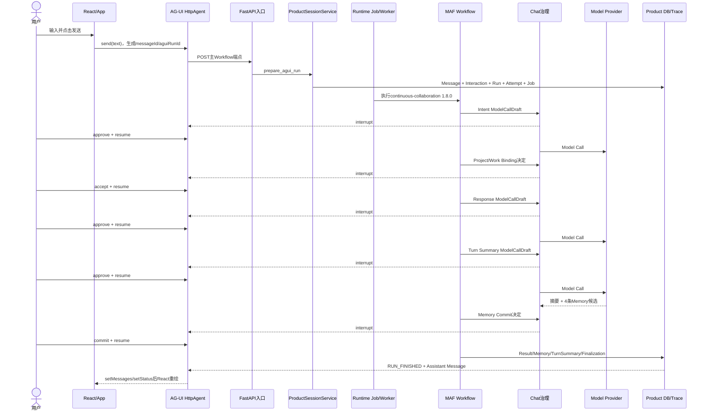

# SC02：普通问答与三次模型调用治理——同一真实Run逐跳教材

<!-- debug-scenario: id=SC02; status=current; oracle=semantic -->

**归档日期**：2026-07-30

**输入族**：单一问答，不要求创建事项、不要求Tool、不需要Plan

**教材成熟度**：L2——当前Workflow `1.8.0`同一真实Run，已对齐前端、AG-UI、MAF、39节点、3次Model Call、数据库和Trace

**自动证据**：`backend/tests/test_continuous_chat.py::test_continuous_workflow_simple_question_uses_three_governed_model_calls`

## 0. 先说结论：你这次到底要验证什么

SC02不是“模型最后答对一句话”这么简单。你要亲手验证7件事：

1. 浏览器把一句文字变成AG-UI请求，不是直接调用Python函数。
2. 后端先创建Product Message、Interaction、Product Run、Run Attempt和Runtime Job，再由Worker运行MAF Workflow。
3. 普通问答实际经过主Workflow的确定性节点；模型不决定整个流程。
4. Intent、Response、Turn Summary是3次独立模型调用，各自有Draft、Hash、审批、Grant、Attempt和采用去向。
5. MAF负责节点调度、interrupt/resume和Checkpoint；Chat增加产品对象、授权、精确请求治理和最终提交门。
6. `answer_only`只说明不调用Tool/Workspace，不自动保证“绝不产生长期Memory”。
7. 当前真实Run暴露了一个设计风险：普通问答最终人工提交了4条推断型Memory。这不是理想预言机，但确实是当前行为。

先学过[TypeScript与React基础](../../00-从这里开始/TypeScript-React与Chat前端基础.md)和
[Vite与浏览器API基础](../../00-从这里开始/Vite-浏览器API与Chat网络调试基础.md)，再跑本场景。

## 1. 本教材采用的真实证据，不是示意数据

本地`backend/.data/chat.db`已有一条2026-07-29完成的当前版本真实模型Run。本文不展示密钥、认证Header、完整
Provider Request Body或隐藏推理，只展示用户可见内容、结构化产品数据、ID、Hash前缀、Token和状态。

### 1.1 输入与终态坐标

| 对象 | 真实值 |
|---|---|
| 用户输入 | `帮我看一下Chat项目的backend目录下有哪些文件` |
| Workflow | `continuous-collaboration` `1.8.0` |
| Product Session | `27bb2acb-02ae-47f9-95d3-a362043d5231` |
| Interaction | `27dc587f-af4d-4eef-a685-3f1d489b1f6a` |
| Product Run | `f411f7b4-6533-4ea8-8f69-5a5a8f9fca68`，`succeeded` |
| 初始AG-UI Run ID | `1e6fc39fb21645ae90012b4462e96f5e` |
| User / Assistant Message | `464bc6ea...` / `c6c9478f...` |
| Run Attempt | `d795ec56-9a41-4fe8-9821-de227c12a86b`，`succeeded` |
| Runtime Job | `8d17c96d-4432-42f6-9141-f02b693e9474`，`succeeded` |
| Runtime Journal | 最后事件序号`257`，可恢复性`terminal` |
| Human Trace | 137条事件；28个实际节点；5次等待审批/恢复 |
| Tool / Workspace | `0 / 0` |

初始AG-UI Run ID、Product Run、Run Attempt和Runtime Job是4种对象。它们关联同一轮，但创建者、生命周期、存储和
恢复责任不同，不能合成一个`runId`概念。

### 1.2 最终回答说明了当前能力边界

Response Agent没有假装实时读过目录，而是明确说：

> 当前信息来自已装配的README和文档引用，不是实时完整文件列表；若要完整结果，需要只读文件系统能力。

这证明本轮是`answer_only`：模型只能用已批准Context回答，没有调用`ls/find`，也没有启动pi或Workspace。

## 2. 全链路总图：一次Product Run，5次暂停，3次模型发送



Network面板会看到初始请求加多次Resume，但数据库中仍是1个Product Run和1个Run Attempt。每次Resume接回同一持久
Workflow现场，不是从输入节点新建一轮。

## 3. 第1跳：React怎样把输入交给AG-UI

| 顺序 | 源码位置 | 它是什么 | 输入 | 输出/副作用 |
|---:|---|---|---|---|
| 1 | [`ChatComposer`](../../../frontend/src/features/chat/chat-composer.tsx#L39) | React函数组件 | `draft`、`onSubmit`等Props | 表单提交事件 |
| 2 | [`App.submit`](../../../frontend/src/App.tsx#L443) | `App`内部回调 | 当前草稿、Workflow、Retry | 清空草稿并调用`send` |
| 3 | [`useChatAgent`](../../../frontend/src/use-chat-agent.ts#L81) | 自定义React Hook | Session、历史、Runtime Job | 返回消息、状态和动作 |
| 4 | [`send`](../../../frontend/src/use-chat-agent.ts#L247) | Hook内异步回调 | Prompt、控制、Workflow | 调`HttpAgent.runAgent()` |

点击文件看定义行；断点停在`send`时，按Call Stack的4→3→2→1反向找来路。

### 3.1 输入在前端逐值变化

```text
draft = "帮我看一下Chat项目的backend目录下有哪些文件"

App.submit:
lastSubmittedPrompt = 同一字符串
draft = ""

useChatAgent.send:
text = content.trim()
messageId = 浏览器生成的消息关联ID
runId = 浏览器生成的AG-UI Run ID
agent.messages += { id: messageId, role: "user", content: text }
status = "running"
```

`HttpAgent`来自AG-UI Client，它做协议组装、SSE解析和交互投影。Chat增加Workflow选择、Product Session、Retry/Restart、
审批卡、结果未知和服务端权威恢复。

浏览器在这里提供表单事件、Fetch/Promise、AG-UI订阅和React重绘；`sessionStorage`只保存页面视图或Cursor，不是
Run权威状态。

## 4. 第2跳：FastAPI先接纳产品事实，不直接在请求里跑完模型

| 顺序 | 源码位置 | 责任 |
|---:|---|---|
| 1 | [`durable_agent_endpoint`](../../../backend/app/runtime_execution/endpoint.py#L58) | 接收AG-UI请求，创建/复用持久Job并返回事件流 |
| 2 | [`prepare_agui_run`](../../../backend/app/product_sessions/service.py#L672) | 事务内校验并创建Product对象 |
| 3 | `ExecutionWorker._execute_claim`（BP-03） | Worker领取Job并执行 |
| 4 | [`ProductAwareWorkflow.run`](../../../backend/app/workflows/runtime.py#L120) | 把Product Run与MAF图关联；图完成后再走产品终态门 |

真实创建结果：

```text
AG-UI request
├─ Product Message(user) 464bc6ea...
├─ Interaction          27dc587f...
├─ Product Run          f411f7b4...
├─ Run Attempt          d795ec56...
└─ Runtime Job          8d17c96d...
```

为什么先落库：HTTP会断、页面会刷新、Worker会退出。若模型只存在请求协程里，系统就无法证明Run有没有开始、能否续接、
Provider是否收到请求。

## 5. MAF做什么，Chat又增加了什么

MAF的Workflow图负责当前节点、Edge、Executor收发`CollaborationState`、interrupt/resume和Checkpoint。它不替Chat
决定Product Session/Run怎样持久化，也不拥有ModelCallDraft、Decision/Grant、输出采用去向和最终产品提交。

4个语义节点共用[`GovernedSemanticAgentExecutor`](../../../backend/app/workflows/continuous_chat.py#L1263)：

```text
prepare             节点入口；确定性护栏不命中才_begin Draft
  -> _advance       新鲜度 + 持久治理对象 + Policy分支
      -> interrupt  require_human时暂停MAF
      -> _dispatch  复核Hash，消费一次性Grant，发送精确字节
      -> _deliver   解码并写output_disposition，形成对应候选
```

源码定义：[`prepare`](../../../backend/app/workflows/continuous_chat.py#L1353)、
[`_advance`](../../../backend/app/workflows/continuous_chat.py#L1393)、
[`_dispatch`](../../../backend/app/workflows/continuous_chat.py#L1528)、
[`_deliver`](../../../backend/app/workflows/continuous_chat.py#L1855)。

## 6. 真实28节点账：每一步拿到什么、交出什么

| 段 | 实际节点 | 输入 → 关键输出 | 为什么需要 |
|---|---|---|---|
| A 接纳 | 1 `input_acceptance` | Prompt → `CollaborationState` | 固定可追踪回合 |
| B 目录Context | 2–5 | 摘要/项目/仓库目录 → Directory ContextPackage | 完整历史不默认进模型；来源可审核 |
| C Intent | 6–9 | 请求+目录Context → 模型#1 → 接受的Intent Set | 模型只提候选；结构对象承载后续决策 |
| D Project/详情/协议 | 10–15 | `project_hint=Chat` → Chat Project → Detail Context → `simple-answer` | 先绑定项目再扩充详情 |
| E 路由合同 | 16、21–24 | Intent/Context/Protocol → Draft → 授权 → RunSpec → `answer_only` | 路由基于不可变授权合同 |
| F 回答/摘要 | 32–33 | RunSpec → 模型#2回答；回答+Intent → 模型#3摘要 | 用户答案与下一轮摘要职责不同 |
| G 提交 | 34–39 | 回答/Work/Memory候选 → Decisions → 持久化 → Finalization | Provider 200不是产品成功 |

未访问的11个节点是17目录查询、18澄清、19–20规划、25–29 Workspace/Evidence、30–31 pi只读。这个Prompt绑定了
Chat Project，所以节点14 `detail_context_revision`也实际经过；不绑定Project详情的普通问答可以不经过它。137条Trace
不是137个节点；模型节点会因Draft、interrupt、resume、新鲜度和输出产生多条事件。

## 7. 数据怎样逐层叠加

### 7.1 Prompt → 两级ContextPackage

先装轻量目录：

```json
{
  "id": "890d1f92-951a-466e-ba8b-7ecce7e620f4",
  "stage": "directory",
  "revision": 1,
  "estimated_tokens": 139,
  "source_count": 4,
  "adopted_count": 4,
  "package_hash_prefix": "5dea0622a14e"
}
```

Intent给出`project_hint=Chat`并通过绑定决定后，再装详情：

```json
{
  "id": "c5275536-9178-48ed-8782-e61b11fa5b5e",
  "stage": "detail",
  "revision": 1,
  "status": "adopted",
  "selected_project_id": "00c5cf52-8b20-424a-ba50-dccec7f8a6ea",
  "estimated_tokens": 5008,
  "source_count": 21,
  "adopted_count": 15,
  "package_hash_prefix": "b27d16af1df6"
}
```

“21个候选、15个采用”比“相关资料都拼进Prompt”多一层账，但能回答每个来源为何进入、哪个版本、哪些未采用。

### 7.2 Model #1 → Intent revision

```json
{
  "branch_key": "list_chat_backend_files",
  "scenario": "simple_question",
  "goal": "列出Chat项目backend目录下的文件",
  "expected_outcome": "用户能看到Chat项目backend目录下的文件列表",
  "confidence": 0.95,
  "project_hint": "Chat",
  "needs_plan": false,
  "needs_clarification": false,
  "constraints": ["仅列出backend目录下的文件", "针对Chat项目仓库"]
}
```

节点7把模型JSON投影成Intent Set、Intent和各自revision。接受的Intent hash是`1ccff83f06cc`，来源指向ModelCall
revision `9ec12291-d15e-46f1-b45f-54a2fcf1d4ad`。用户修正时建立新revision，不覆盖旧证据。

### 7.3 Intent + Context + Protocol → ExecutionDraft

节点21由[`ExecutionDraftCompilerExecutor`](../../../backend/app/workflows/continuous_chat.py#L2254)得到：

```json
{
  "draft_id": "296b48a4-2489-4f35-aa26-8b447ca33cb3",
  "revision_id": "1d68fa34-9728-4f74-af7a-3b87e7819d77",
  "plan_mode": "direct",
  "runtime_target": {"mode": "answer_only"},
  "capability_grant": {"side_effects": "none"},
  "protocol_key": "simple-answer",
  "status": "accepted",
  "context_hash_prefix": "10858b901939",
  "draft_hash_prefix": "4046a9bef262"
}
```

普通回答也要Draft，因为系统必须声明本轮只允许模型网络、无文件写入和Tool副作用，并把Context、Intent、协议和输出
合同绑到同一Hash；Response Agent不能临时扩权。

### 7.4 ExecutionDraft → RunSpec → Route

节点23由[`RunSpecCompilerExecutor`](../../../backend/app/workflows/continuous_chat.py#L2388)形成：

```json
{
  "id": "9a90db1d-c677-46aa-9a91-84e4d22d26ec",
  "compiler_version": "run-spec-compiler-v2",
  "runtime_agent": {"mode": "answer_only"},
  "capability_envelope": {"side_effects": "none"},
  "status": "bound",
  "run_spec_hash_prefix": "65b9ec1710e8"
}
```

节点24的[`ExecutionRouteExecutor`](../../../backend/app/execution_dispatch/workflow.py#L79)只读RunSpec，选择Response Agent。
“0 Tool / 0 Workspace”由运行合同和数据库共同证明，不是根据回答长相猜的。

## 8. 三次模型调用不是同一个Prompt调用3遍

| # | 节点 / Profile | 输入重点 | 输出消费者 | Input/Output Token | Binding Hash | Output Hash | 采用去向 |
|---:|---|---|---|---:|---|---|---|
| 1 | `intent_agent` / `intent_router` | 请求、目录Context、结构合同 | Intent Set | 1650 / 666 | `872f2dbbabf8` | `e083084b707a` | `accepted_as_intent` |
| 2 | `response_agent` | Intent、Detail Context、Protocol、RunSpec | 用户回答 | 9008 / 891 | `b21874f0791d` | `249121a66678` | `accepted_as_response` |
| 3 | `turn_summary_agent` | 请求、Intent、回答、来源合同 | Summary/写回候选 | 2140 / 2044 | `f1f6f1be82ef` | `f93386bd94ef` | `accepted_as_summary` |

每行还有独立Draft revision、Attempt、Policy Evaluation、Human Decision、Grant Consumption和Transport事件：

```text
provider.dispatch in_progress
provider.dispatch completed
provider.receive completed
provider.decode completed
```

HTTP `200`只证明Attempt收到可解码响应。Intent是否有效、Response是否提交、Summary是否写长期状态，仍由结构校验和产品
Decision决定。

## 9. 5张审批卡分别批准什么

| 次序 | Decision Point | 人工决定 | 绑定Hash | 影响 |
|---:|---|---|---|---|
| 1 | `model_call_authorization` | `approve` | `872f2dbbabf8` | 发送Intent精确请求 |
| 2 | `project_work_binding` | `accept` | `4966561ad054` | 接受与Chat Project关联 |
| 3 | `model_call_authorization` | `approve` | `b21874f0791d` | 发送Response精确请求 |
| 4 | `model_call_authorization` | `approve` | `f1f6f1be82ef` | 发送Summary精确请求 |
| 5 | `memory_commit` | `commit` | `316f6aa852d2` | 4条Memory进入Accepted Memory |

模型卡由[`ModelCallReview`](../../../frontend/src/model-call-review.tsx#L353)展示；
[`approve`](../../../frontend/src/use-chat-agent.ts#L296)构造AG-UI Resume。产品绑定和Memory也使用AG-UI interrupt/resume，
但决策对象和可编辑字段不同，不能都压成一个`approved=true`。

## 10. 真实风险：`answer_only`为什么仍写入4条Memory

Summary提出4条“从文档/命令推断存在”的Memory候选。节点36暂停后，用户选择`commit`；数据库中：

```text
Memory Candidate 4条：accepted
Accepted Memory  4条：accepted
Tool Execution   0条
Workspace        0个
```

所以必须分开：

1. `answer_only`：运行时不调用Tool，不创建Workspace。
2. `memory_candidates`：Summary提出建议，仍不是长期事实。
3. `memory_commit=commit`：人工提交后才成为Accepted Memory。

机制上没有“模型一输出就自动写Memory”：有候选、Decision Request、人工commit和来源引用。产品上仍值得质疑：
推断型仓库文件事实容易过时，普通目录问答是否值得长期记住也不明确。当前系统有人工门，但默认策略不够保守。

理想预言机应是：普通知识/临时查询默认0 Accepted Memory；若提出候选，UI必须说明来源、推断性质、生命周期和后果。
这条差异是后续策略测试的真实依据。

## 11. 用断点亲手跑

先用本场景专属的`sc02`组合，不要一次注入30个。它在通用`model`组合上补了两级Context、RunSpec路由和
Product Decision观察点：

```bash
.venv/bin/python scripts/setup-debug-breakpoints.py --profile sc02
```

| 停点 | 看什么 | 上一跳 | 下一跳 |
|---|---|---|---|
| BP-27 `App.submit` | `draft`、Workflow | 表单事件 | `send` |
| BP-28 `useChatAgent.send` | `text/messageId/runId` | `App.submit` | `HttpAgent.runAgent` |
| BP-01 协议入口 | `thread_id/run_id/messages` | 浏览器Fetch | `prepare_agui_run` |
| BP-04 产品接纳 | Session、request hash、幂等复用 | endpoint/Workflow复核 | Message/Run/Job |
| BP-03 Worker领取 | Job、Attempt、lease | 队列 | Workflow |
| BP-07/BP-09 | Product Run、`origin_prompt` | Worker | MAF节点1 |
| BP-13 | `self.id`、`_result_kind`、Context ID | 上一节点 | Draft |
| BP-14 | revision、Policy、Decision Request | Draft | interrupt/自动dispatch；人工批准后可单步进入`_dispatch` |
| BP-15 | Provider返回后的parsed结果、result kind、disposition | `_dispatch`/Provider | Intent/Response/Summary |
| BP-12 | Product Decision的subject、Policy和用户决定 | 各产品决定节点 | not_applicable/interrupt/commit |
| BP-16 | scenario、Intent flags | 协议 | Draft编译 |
| BP-18/BP-19 | RunSpec、候选、Decision | 节点34–38 | 图外终态 |
| BP-06/BP-29 | Assistant Message、Run终态、前端outcome | 产品提交/SSE | React更新 |

BP-13到BP-15会因3个模型节点重复命中。每次先看`self.id`，写下Intent/Response/Summary，再单步；不要把重复命中
误判为死循环。

自动测试时禁用已注入的Python断点：

```bash
PYTHONBREAKPOINT=0 .venv/bin/python -m pytest -q   backend/tests/test_continuous_chat.py::test_continuous_workflow_simple_question_uses_three_governed_model_calls
```

实验后可执行：

```bash
.venv/bin/python scripts/setup-debug-breakpoints.py --clean
```

## 12. 可以随意换Prompt，但先写预期

| 自由输入 | 仍是SC02吗 | 可能变化 | 不应变化 |
|---|---|---|---|
| `用一句话解释递归` | 是 | 可能选`learning-loop`；可能不绑定Project，实际27节点 | 3次模型、`answer_only`、0 Tool |
| `什么是幂等？不要创建事项或记忆` | 是 | Memory应被过滤/跳过 | 不应写Accepted Memory |
| `列出backend下实时全部文件` | 边界 | 无只读能力时披露限制；授权pi后转SC09 | 不能假装实时读过 |
| `制定学习递归的计划` | 否 | `needs_plan=true`，走19–20 | 不再预期恰好3次模型 |
| `修改backend/app/asgi.py` | 否 | 进入Workspace/Tool治理 | 不能停在`answer_only` |

自由输入不是“什么结果都算对”。先写模型调用数、路由、Tool/Workspace、长期写入和终态预期，再运行。

## 13. 数据库与Trace复验

### 13.1 三次ModelCall

```sql
SELECT d.workflow_node_id, d.call_ordinal, r.id AS revision_id,
       substr(r.binding_hash,1,12) AS binding_hash,
       a.status, json_extract(a.usage_json,'$.input_tokens') AS input_tokens,
       json_extract(a.usage_json,'$.output_tokens') AS output_tokens,
       substr(a.output_text_sha256,1,12) AS output_hash,
       a.output_disposition
FROM model_call_drafts d
JOIN model_call_draft_revisions r ON r.model_call_draft_id=d.id
JOIN model_call_attempts a ON a.model_call_draft_revision_id=r.id
WHERE d.run_id='<Product Run ID>'
ORDER BY d.call_ordinal;
```

应有3行：`intent_agent`、`response_agent`、`turn_summary_agent`。不要把完整`output_text`或
`provider_request_json`复制进普通日志。

### 13.2 实际节点

```sql
SELECT json_extract(payload,'$.executor_id') AS node,
       min(sequence) AS first_sequence, count(*) AS content_events
FROM trace_events
WHERE run_id='<Product Run ID>' AND event_type='workflow.node.content'
GROUP BY node ORDER BY first_sequence;
```

本样本是28行。普通递归问答若不绑定Project详情，可能只有27个实际节点；39是目录总数，不是每轮固定访问数。旧文档把
“SC02必然28节点”写得过死，真实运行已经纠正了它。

### 13.3 长期副作用

检查`memory_candidates`、`memory_revisions`和`accepted_memories`的来源引用；同时确认`tool_executions`和
`execution_workspaces`没有该Run记录。只有同时检查路线和副作用，才能证明`answer_only`实际做了什么。

## 14. 自动合同能证明什么，不能证明什么

自动测试验证：39节点目录、3次模型发送前暂停、3个Attempt的Transport/Token/Hash/采用去向、ExecutionDraft accepted、
RunSpec bound、协议/节点顺序、写回治理和Diagnostics脱敏。

它不能证明真实Provider每次生成同样文本，也不能替代真实Run的审批卡、数据结构、Trace、数据库和UI对账。因此本教材
同时保留“可控Transport合同测试”和“当前真实模型Run”两层证据。

## 15. 通过、失败与当前问题

通过：

- 1个Product Run内有3个独立ModelCall Attempt。
- Intent、Response、Summary各自有revision/hash/Decision/Grant/Attempt/disposition。
- Draft与RunSpec证明`answer_only`和`side_effects=none`。
- Tool/Workspace为0；Provider输出先是候选；Finalization后才提交Assistant Message和成功终态。
- 刷新后从后端恢复，不依赖旧React内存。

失败：

- 3次调用共用一份Draft/Hash；修改审批内容后仍发送旧字节。
- Provider 200就直接把Product Run标成功。
- 无Decision就把Summary候选写成Accepted Memory。
- `answer_only`却出现ToolExecution/Workspace。
- 浏览器断开后显示成功，但后端仍运行或结果未知。

当前待优化：普通临时查询默认不应积极提出长期Memory；推断型Repository事实应要求验证/新鲜度并默认不提交。这是由
真实数据发现的问题，不是为了让文档完整而虚构的需求。

## 16. 掌握验收

1. 初始请求和5次Resume为什么仍是同一个Product Run？
2. `HttpAgent`、MAF Workflow、ProductSessionService各负责哪段，谁拥有权威状态？
3. Prompt经过哪3个关键结构，才变成`answer_only`运行合同？
4. 三次模型输出分别被谁消费，为什么不能共用Hash？
5. Provider 200后还要过哪些产品门才能产生Assistant Message？
6. `answer_only`为何仍可能产生Memory候选，本Run为何真的写入4条？
7. BP-13命中3次时，怎样用`self.id`和Call Stack判断当前调用？
8. 换成“什么是幂等？不要创建事项或记忆”后，哪些值应相同，哪些必须变化？

能用源码位置、真实ID/Hash、Trace节点和数据库行回答这8题，才从“看过流程图”进入“能调试、能发现架构问题”。
