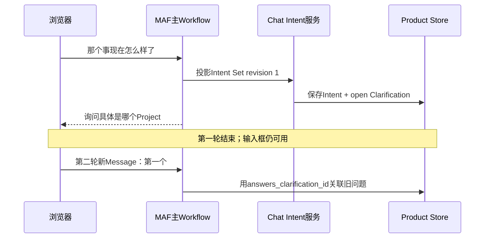

# SC03：歧义请求与跨回合澄清

<!-- debug-scenario: id=SC03; status=current; oracle=semantic -->

**归档日期**：2026-07-30  
**输入族**：目标或Project无法唯一判断，例如“继续昨天那个”“那个事怎么样了”  
**自动证据**：

- `test_continuous_workflow_invalid_intent_closes_failed_to_clarification`
- `test_clarification_answer_reuses_open_question_even_when_answer_has_no_keyword_overlap`

**教材成熟度**：第一轮澄清已有Workflow 1.8.0真实Run的L2证据；第二轮跨回合接回答案仍使用受控测试证据，属于L1+。

## 0. 本场景在公共主干哪里分叉

第一轮共用节点1–15，在节点16由Chat的`ScenarioRouterExecutor`选中`clarification`；第二轮不是原Run继续，
而是新User Message在节点1–2通过稳定`answers_clarification_id`接回旧开放问题。MAF负责运行两轮图，开放问题、
跨回合引用和answered状态是Chat产品事实。调试两轮时用两个Product Run ID和同一Product Session ID对账，
不能只看第二轮Call Stack。

## 1. 运行前预言机

第一轮：

| 观察项 | 预期 |
|---|---|
| 用户交互 | Assistant提出具体问题，并明确让用户在下方输入框回答 |
| 路由 | `scenario_router -> clarification` |
| 执行 | 不编译ExecutionDraft，不启动Response Agent/pi |
| 数据 | Intent/Clarification有稳定ID与`open`状态；TurnSummary记录开放问题 |
| 终态 | 第一轮Run成功结束，而不是卡在一个没有输入框的审批卡 |

第二轮输入可以只有`第一个`、`Chat那个`。预期新User Message通过`answers_clarification_id`关联上一开放问题，
旧Clarification变`answered`，不能只靠关键词重叠猜。

## 2. 第一轮节点账

| 节点 | 状态 | 关键数据/原因 |
|---|---|---|
| 1–5 | 经过 | 最近未回答Clarification会优先进入Context候选 |
| 6 `intent_agent` | 经过 | 可能得到`needs_clarification=true`；无效JSON也失败关闭到澄清 |
| 7 `intent_set_projection` | 经过 | 创建Intent Set与Clarification记录 |
| 8–15 | 经过 | 审核/接受当前理解；不能把“提供新信息”伪装成accept |
| 16 `scenario_router` | 经过 | 第2条Case选`clarification` |
| 17 | 未走 | 不是明确目录查询 |
| 18 `clarification` | 经过 | 直接形成Assistant问题和`awaiting_user_answer` |
| 19–37 | 未走 | 不规划、不执行、不做Work/Memory提交链 |
| 38 `turn_summary_persist` | 经过 | 保存open question和Clarification来源 |
| 39 `result_finalization` | 经过 | 提交用户可见问题，结束当前Interaction |

第二轮会重新从节点1开始，这是新的Interaction和Product Run，不是Resume同一个模型审批。

## 3. 数据结构和状态变化

第一轮候选形态：

```json
{
  "scenario": "clarify",
  "needs_clarification": true,
  "clarification_question": "你想继续哪个Project？",
  "confidence": 0.3
}
```

权威对象链：

```text
Intent Set revision
-> Clarification(id, status=open, question)
-> Assistant Message
-> TurnSummary(open_questions, awaiting_user_answer=true)
-> 第二轮User Message
-> Intent revision.answers_clarification_id
-> 原Clarification.status=answered + current_answer_id
```

模型生成问句只是候选；Clarification对象和跨回合状态由产品服务拥有。

## 4. 为什么不使用审批卡回答澄清

审批回答的是“接受/修改一个已有候选”；澄清是在索取系统不知道的新信息。若只提供`accept/revise/skip`，
用户无法回答“第一个”，Workflow也拿不到新User Message。当前方案结束第一轮并回到正常输入框，代价是多一个
Product Run，但换来清晰的消息证据、状态和跨进程恢复边界。

## 5. 亲手验证

1. 输入`继续昨天那个`。
2. 批准意图模型调用（若默认策略要求）。
3. 确认页面出现普通Assistant问题，聊天输入仍可用。
4. 记录第一轮Product Run ID和开放Clarification ID。
5. 输入`第一个`。
6. 在`IntakeExecutor.accept`看`pending_clarification`；在`IntentProjectionExecutor`看
   `answers_clarification_id`。

只读核对（表名以当前Intent模块模型为准，推荐优先用REST）：

```text
GET /api/harness/intents?run_id={Product Run ID}
GET /api/runs/{Product Run ID}/governance
```

自动复验：

```bash
.venv/bin/python -m pytest -q \
  backend/tests/test_continuous_chat.py::test_continuous_workflow_invalid_intent_closes_failed_to_clarification \
  backend/tests/test_continuous_chat.py::test_clarification_answer_reuses_open_question_even_when_answer_has_no_keyword_overlap
```

## 6. 允许变化与失败判定

- 允许变化：具体澄清措辞、候选Project标题和模型置信度。
- 必须固定：有可回答入口、开放问题有ID/状态、短回答能关联、第一轮不创建执行合同。
- 失败：问句出现在只含“接受”的审批卡；下一轮重复问同一问题；把含糊输入直接绑定错误Project。

## 7. 当前真实Run：第一轮到底存了什么

2026-07-29的当前版本真实运行可复核以下值；这里只展示产品结构和脱敏公开输出，不展示Provider Body：

| 对象 | 实际值 |
|---|---|
| Product Run | `d2495ac1-a36f-4e48-877d-e885de77034c` |
| Product Session | `ced61281-c402-4f11-a244-c711f5a38eb0` |
| Workflow | `continuous-collaboration 1.8.0` |
| 输入 | `那个事现在怎么样了` |
| Intent Set | `c52f480b-6cd7-4a0c-8990-6df40fff7100`，revision 1，`single` |
| Intent分支 | `clarify_which_project`，`needs_clarification=true` |
| 路由 | `scenario_router -> clarification` |
| Clarification | `efcf34bb-db21-4e30-9e7c-f35ae8d5df50`，`status=open`，row version 1 |
| Run终态 | `succeeded`，Trace最后sequence为71 |
| 不存在 | ExecutionDraft、RunSpec和执行分支 |



真实Run只证明上图第一轮；第二轮的`第一个`接回由自动测试精确固定，不能假装两轮都来自同一真实样本。

## 8. 断点导航与开发入口

| 断点 | 谁调来 | 看什么 | 下一跳/按键 |
|---|---|---|---|
| `IntakeExecutor.accept` | Worker恢复主图 | `pending_clarification`、新Message ID | Step Over到Context候选 |
| `IntentSetProjectionExecutor` | Intent Agent输出 | `answers_clarification_id`、Intent revision | Step Over写Store |
| `ScenarioRouterExecutor` | 协议解析完成 | 4个Case的actual/matched | Continue到Clarification |
| `ClarificationExecutor` | Switch第2分支 | question、Clarification ID/status | Step Over形成Assistant候选 |
| `TurnSummaryPersistExecutor` | 澄清响应之后 | `open_questions/awaiting_user_answer` | Continue到Finalization |

关键源码：[`continuous_chat.py`](../../../backend/app/workflows/continuous_chat.py)、
[`collaboration_intents/models.py`](../../../backend/app/collaboration_intents/models.py)、
[`collaboration_intents/service.py`](../../../backend/app/collaboration_intents/service.py)。

若要改变“什么时候必须澄清”，先改Intent/Router合同并补两轮测试；不要只改前端问句，也不要用关键词相似度代替
稳定Clarification ID。框架只负责运行和恢复，开放问题状态属于Chat。

## 掌握验收

1. 第一轮为什么可以`succeeded`，却没有完成用户原始目标？
2. `Clarification Request`与`Intent Binding Decision`的动作有何不同？
3. 第二轮为什么不能只靠关键词重叠关联第一轮？
