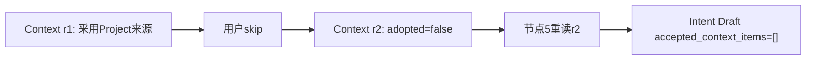

# SC05：修改Context与revision失效

<!-- debug-scenario: id=SC05; status=current; oracle=exact -->

**归档日期**：2026-07-30  
**目标**：在发送模型请求前排除或修改一个Context来源，证明系统创建新revision而不是原地改内存  
**自动证据**：`backend/tests/test_continuous_chat.py::test_context_skip_creates_excluded_revision_and_does_not_reappear_in_model_input`

**教材成熟度**：L1+；受控测试给出两个revision与Provider输入精确断言，尚缺同版本人工修改Context的真实Run。

## 0. 本场景在公共主干哪里分叉

公共链到节点3已经有ContextPackage revision 1；分叉发生在节点4的Context采用决定，用户修改后Chat创建revision 2，
节点5必须从Product Store重读最新版再进入节点6。MAF提供HITL暂停/恢复能力，但不可变revision、package hash、
来源采用记录和旧版失效是Chat产品规则。断点要同时记`package_id/revision/hash/previous_package_id`，不能只看正文。

## 1. 前置状态

使用已有TurnSummary或已绑定Project/Repository的Product Session，使Context卡片至少有1个可排除来源。
输入内容可以自由，但应与该来源相关，否则选择器可能本来就不采用它。

## 2. 运行前预言机

1. 节点3创建ContextPackage revision 1。
2. 节点4出现Context决定（人工或策略；要手工修改需当前Policy允许Review）。
3. 排除来源后创建revision 2，revision 1保留且变为`superseded`。
4. revision 2有不同`package_hash`，`previous_package_id`指向revision 1。
5. 被排除Item仍在采用记录中，但`adopted=false`且有Reason Code。
6. 节点5从Product Store重新投影revision 2；节点6的Provider请求不再包含被排除正文。

## 3. 节点与对象账

| 节点 | 输入 | 处理/依据 | 输出与Store |
|---|---|---|---|
| 2 `context_candidates` | Prompt、最多8条摘要 | 确定性关键词/开放澄清优先 | 最多4条候选；不写旧摘要 |
| 3 `harness_directory_context` | 候选、Project目录 | 统一成Context Item并预算化 | `context_packages` Header + adoption items |
| 4 `context_adoption` | package id/hash、采用项 | HITL Policy + 用户修改 | 新不可变Context revision与Decision |
| 5 `directory_context_revision` | 当前Run/stage | 重新查最新revision | `CollaborationState.context_items`新投影 |
| 6 `intent_agent` | 新投影 | 编译最小Provider上下文 | 新ModelCallDraft绑定新Context hash |

## 4. 数据样本

```text
revision 1: status=superseded, package_hash=AAA, previous_package_id=null
revision 2: status=current,    package_hash=BBB, previous_package_id=<revision 1 id>

item X on revision 2:
source_kind=turn_summary
source_id=<稳定来源ID>
source_revision=<来源版本>
adopted=false
reason=<用户排除/修改原因>
```

`CollaborationState.context_items`只是运行投影；权威内容和revision在Product Store。Checkpoint保存ID不是第二
Context事实源。

## 5. 为什么不原地改数组

原地修改最省代码，但会让旧Approval仍指向“同一个ID却不同内容”，无法审计用户当时看见什么，也无法在恢复时
判断采用哪一版。不可变revision让Hash失效、Decision、Provider请求和旧Trace可追溯；代价是多保存历史版本。

## 6. 亲手验证

在节点3、4、5、6依次断下，记录两个package id/hash。用只读SQL：

```sql
SELECT id, stage, revision, status, previous_package_id, substr(package_hash,1,12)
FROM context_packages WHERE run_id='<Product Run ID>' ORDER BY stage, revision;

SELECT ordinal, source_kind, source_id, adopted, reason
FROM context_adoption_records WHERE context_package_id='<revision 2 id>' ORDER BY ordinal;
```

再在模型审批可读视图确认被排除来源不出现。不要通过打印完整Provider Body验证。

## 7. 判定

- 通过：旧revision保留、新Hash、被排除来源不进入后续模型、旧授权失效。
- 失败：只改前端勾选；数据库仍只有一版；旧Hash继续可批准；来源在节点5后重新出现。

## 8. 受控Fixture的逐步实值

该测试先创建正式Project `贪吃蛇`，输入`继续推进贪吃蛇`，并强制`context_adoption=require_human`：

| 时点 | 实际断言 |
|---|---|
| revision 1 | 审批卡`subject.context_package_id=<old_package_id>`，存在Project目录匹配 |
| 用户动作 | `decision=skip` |
| revision 2 | `revision=2`、`previous_package_id=<old_package_id>`、`status=candidate` |
| Item | revision 2所有`adopted=false` |
| Intent Provider task | `accepted_context_items=[]` |
| Provider外发 | `transport.prepared=[]`，停在下一张模型审批卡前仍为0 |



这解释了“前端取消勾选”之后后端真正发生的事：不是改一个React数组，而是产生可追溯新revision。

## 9. 断点导航与修改影响

| 断点 | 谁调来 | 看什么 | 下一跳 |
|---|---|---|---|
| `HarnessDirectoryContextExecutor` | Context候选节点 | package id/revision/hash/items | `context_adoption` |
| `ProductDecisionExecutor` | MAF HITL恢复 | action=`skip`、subject hash | 修订服务 |
| `CollaborationContextService.revise_package` | Decision执行 | previous id、adopted records | 新revision入库 |
| `HarnessContextRevisionExecutor` | 修订后 | 从Store查到的current revision | Intent Agent |
| `GovernedSemanticAgentExecutor.prepare` | 新Context投影 | provider task的accepted items | 模型审批 |

源码入口：[`collaboration_contexts/service.py`](../../../backend/app/collaboration_contexts/service.py)、
[`continuous_chat.py`](../../../backend/app/workflows/continuous_chat.py)。若新增Context来源类型，必须同时定义稳定
`source_id/source_revision`、预算、脱敏、采用记录、新鲜度解析器和旧Approval失效测试。

## 掌握验收

1. 节点5为什么必须重新读Product Store？
2. `adopted=false`为什么仍要保留Item？
3. 哪些下游授权应该因Context hash变化失效？
