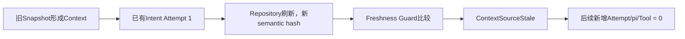

# SC06：Repository来源失效时零发送

<!-- debug-scenario: id=SC06; status=current; oracle=exact -->

**归档日期**：2026-07-30  
**目标**：批准旧模型请求后改变Repository事实，证明发送前新鲜度门阻断旧Context  
**自动证据**：`test_repository_source_change_invalidates_old_model_approval_before_attempt`、`test_repository_change_stops_pi_before_process_dispatch`

**教材成熟度**：L2失败链；当前1.8.0真实Run证明来源失效失败，受控测试进一步精确证明指定派发边界新增Attempt为0。

## 0. 本场景在公共主干哪里分叉

它不是固定某个MAF节点的路由分叉，而是Chat在**每次外发前**增加的新鲜度安全门：旧Context已经批准，但
Repository Snapshot/semantic hash变化后，Provider或pi dispatch必须失败关闭。MAF负责恢复节点运行，不负责
理解Repository是否过期。调试时从已批准Draft的Hash跳到`RepositorySourceFreshnessGuard`，预言机是Attempt、
pi进程和Tool Operation全部保持0。

## 1. 安全前置

只在测试Fixture或你明确允许修改的仓库中制造变化；不要为实验改正式Chat工作树。优先直接运行自动用例。
手动实验使用Repository绑定的安全刷新入口，不读取私有配置或秘密文件。

## 2. 运行前预言机

| 时点 | 预期 |
|---|---|
| Context装配 | 绑定Repository Snapshot ID、Semantic Hash与治理文档Hash |
| 用户审批 | Approval绑定当时的Context/Source revision |
| 来源变化 | HEAD、Binding代次、Semantic Hash或治理文档任一变化会使旧上下文过期 |
| Provider发送前 | `RepositorySourceFreshnessGuard`再次核对并抛`context_source_stale` |
| 外部副作用 | **当前待派发动作**新增Attempt=0；pi进程=0；Tool Operation=0。此前节点若已调用模型，其历史Attempt可以存在 |
| 产品结果 | Run可恢复失败；UI提供按最新仓库重新准备，而不是自动重放 |

## 3. 代码与数据链

```text
Repository Binding/Snapshot
-> detail Context Item(source_id + source_revision)
-> ContextPackage hash
-> ExecutionDraft/ModelCallDraft binding hash
-> 用户批准
-> Provider/pi dispatch前再次读取最新Snapshot
-> 不一致：失败关闭，旧Approval失效
```

关键符号：`RepositorySourceFreshnessGuard`、`GovernedSemanticAgentExecutor._require_fresh_context`、
`ExecutionDispatchService`的pi派发前Fence。

## 4. 为什么要检查3次

系统在Draft准备、用户审批和真实dispatch之间可能经过几分钟甚至进程恢复。只在装配Context时检查一次会产生
TOCTOU窗口：用户批准的是旧仓库，实际执行却针对新仓库。重复核验带来额外Git/数据库读取，但避免错误代码基线、
旧规则和未审核副作用。

## 5. 亲手验证

1. 使用已绑定Repository的Project发起需要读取仓库的问题。
2. 在模型审批卡停住，记录Snapshot ID和Context hash。
3. 在安全Fixture产生一个可识别的新提交或治理文档变化并刷新Snapshot。
4. 批准旧卡。
5. 观察Run以`context_source_stale`失败；记录过期门前后的Attempt计数，差值必须为0。
6. 点击“按最新仓库重新准备”，应创建新Run/新Context/新审批，不复用旧Hash。

只读核对：

```sql
SELECT status, failure_code FROM product_runs WHERE id='<Product Run ID>';
SELECT COUNT(*) FROM model_call_attempts WHERE run_id='<Product Run ID>';
SELECT external_dispatch_state FROM runtime_jobs WHERE product_run_id='<Product Run ID>';
```

## 6. 判定

- 通过：`context_source_stale`、过期门后0新增Attempt、0 pi/Tool副作用、用户能显式重新准备。
- 失败：先发Provider再发现过期；自动重试旧请求；只比较HEAD却忽略治理文档/Binding代次。

## 7. 当前真实失败Run与受控零发送的区别

当前Workflow 1.8.0数据库里有一条真实失败链：

| 字段 | 实际值 |
|---|---|
| Product Run | `d1132391-822a-4529-af57-98bf300677a4` |
| 输入族 | 给Chat产品制定功能计划 |
| 终态 | `failed` |
| failure code | `ContextSourceStale` |
| Trace最后sequence | 58 |
| 已存在ModelCall Attempt | 1（来源变化前的Intent调用） |
| 过期后新增Attempt | 0 |
| 后续节点 | 停在Project/Work绑定附近，未进入执行派发 |

因此“整个Run Attempt总数必须0”只适用于`test_repository_source_change...`那个在首次Provider发送前制造变化的Fixture；
通用安全不变量是**旧绑定之后不再外发**。这也是为什么调试要记门前基线，而不是只查最终COUNT。



## 8. 断点导航与安全修改

| 断点 | 进入前 | 看什么 | 失败下一跳 |
|---|---|---|---|
| `RepositorySourceFreshnessGuard` | Context已绑定旧source revision | binding、expected/current semantic hash | 抛stale错误 |
| `GovernedSemanticAgentExecutor._require_fresh_context` | Draft待外发 | Attempt基线、context annotations | Draft invalidated |
| `ExecutionDispatchService` | pi RunSpec已批准 | repository fence、process state | 不启动pi |
| Product Run失败边界 | 异常已脱敏 | failure code、可恢复动作 | UI错误卡 |

源码：[`project_resources/context.py`](../../../backend/app/project_resources/context.py)、
[`execution_dispatch/service.py`](../../../backend/app/execution_dispatch/service.py)、
[`continuous_chat.py`](../../../backend/app/workflows/continuous_chat.py)。若优化Snapshot算法，必须证明哪些变化影响
semantic hash，并保留TOCTOU派发前复检，不能只比较Git HEAD。

## 掌握验收

1. 为什么Approval存在仍不能直接发送？
2. Semantic Hash相同的新Snapshot是否一定要阻断？回到代码/设计查依据。
3. 为什么“重新准备”应创建新绑定而不是Resume旧Provider Attempt？
