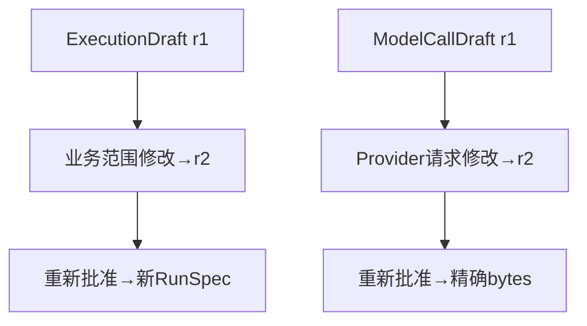

# SC07：编辑模型请求与重新审批

<!-- debug-scenario: id=SC07; status=current; oracle=exact -->

**归档日期**：2026-07-30  
**目标**：修改可读视图或Provider JSON中的实际请求字段，证明旧版本/Hash/Approval失效  
**自动证据**：`test_agui_revision_requires_second_approval_and_sends_exact_edited_bytes`、`test_execution_draft_full_edit_creates_new_revision_and_requires_reapproval`

**教材成熟度**：L1+；两个受控测试精确比较发送字节与revision，但当前版本尚未归档一条人工编辑请求的真实Run。

## 0. 本场景在公共主干哪里分叉

分叉发生在`GovernedSemanticAgentExecutor`等待模型审批时：修改请求不会原地改revision 1，而由Chat治理服务生成
revision 2并让旧Hash/Decision失效；MAF的Resume只负责把用户决定送回等待节点。调试顺序是`prepare -> _advance
-> interrupt -> resolve -> 新_advance或dispatch -> _deliver`，每跳都记录revision、binding hash和Attempt数量。

## 1. 可修改范围

在模型审批卡修改允许的Instructions、消息文本、模型参数或Provider/模型选择。不要添加未注册Tool；不要把
`store=true`、Continuation或Provider不支持参数当作可发送组合。

## 2. 运行前预言机

1. 初始ModelCallDraft revision 1有`body_sha256`和`binding_hash`。
2. 任一进入Provider Body或路由的字段变化，保存后创建revision 2。
3. revision 1/旧Approval变`superseded`，不能发送。
4. 可读视图、Provider JSON、Hash和Transport bytes由同一规范请求投影。
5. 必须第二次审批revision 2；只创建1个Provider Attempt且绑定revision 2。
6. Provider捕获字节与revision 2批准字节逐字节一致。

## 3. 对象链

```text
ModelCallDraft logical call
├─ revision 1 -> Approval 1 -> superseded -> 0 Attempt
└─ revision 2 -> Approval 2 -> Grant consumed -> Attempt 1 -> Provider bytes
```

若修改的是ExecutionDraft而非单次模型请求，链路类似但对象不同：ExecutionDraft新revision使旧RunSpec/Grant
失效，再编译新的RunSpec，之后才产生ModelCallDraft。两种revision不能混用。

## 4. 关键源码与变量

| 符号 | 观察 |
|---|---|
| `ModelCallDraft.review_card` | 可读投影与`provider_request`来自同一Draft |
| 保存/修订服务 | `previous_draft_id`、version、两个Hash |
| `ModelCallApprovalExecutor` | 只接受当前approval/hash |
| Provider Transport | 发送已批准`body`，不二次装配 |
| Governance记录 | Grant一次性消费，Attempt绑定revision |

## 5. 为什么不能只改最后一段Prompt

Instructions、历史、Tool定义、模型和参数都改变模型行为。若用户只能改最后Prompt，或Transport在审批后再转协议，
“看见并批准的内容”等于“实际发送内容”就无法证明。全Body revision增加UI与校验复杂度，但建立了真正可审计的
发送合同。

## 6. 亲手验证

1. 在第一张审批卡记录version/hash，不批准。
2. 修改一个普通文本字段并保存。
3. 确认卡片显示version 2/新Hash，并要求再次审批。
4. 批准后在治理视图确认Attempt只绑定version 2。

```sql
SELECT d.workflow_node_id, r.revision, r.status, r.previous_revision_id,
       substr(r.binding_hash,1,12), substr(r.provider_body_sha256,1,12)
FROM model_call_drafts d
JOIN model_call_draft_revisions r ON r.model_call_draft_id=d.id
WHERE d.run_id='<Product Run ID>'
ORDER BY d.call_ordinal, r.revision;
```

自动复验：

```bash
.venv/bin/python -m pytest -q \
  backend/tests/test_model_call_review.py::test_agui_revision_requires_second_approval_and_sends_exact_edited_bytes \
  backend/tests/test_continuous_chat.py::test_execution_draft_full_edit_creates_new_revision_and_requires_reapproval
```

## 7. 判定

- 通过：两revision、旧授权失效、1个Attempt、发送字节等于新批准字节。
- 失败：修改后仍可点旧批准；两视图显示不同内容；Transport再改写Body；Attempt绑定旧revision。

## 8. 两类修订不要混在一起

| 受控输入 | revision 1 | 用户修改 | revision 2 | 最终外发 |
|---|---|---|---|---|
| ModelCallDraft | 旧Provider Body/Hash | 编辑允许字段 | 新Body/Hash，旧批准失效 | 捕获字节逐字等于r2 |
| ExecutionDraft | 旧scope/brief/Hash | 增加“必须给例子” | 新业务草稿/Hash | 先重新批准，再编译新RunSpec |

ExecutionDraft测试里的具体变化是：`scope.included`从只回答当前请求增加
`include one worked example`，`execution_brief`追加“必须给出一个例子”，revision由1变2；用旧revision再PUT会被
CAS拒绝。ModelCall测试则证明只产生1个Attempt并绑定新ModelCallDraft revision。



## 9. 断点导航与修改入口

| 断点 | 看什么 | 正常下一跳 |
|---|---|---|
| `ModelCallDraft.revise` | previous revision、Body hash、binding hash | 新审批卡 |
| `ModelCallApprovalExecutor.resolve` | approval绑定的revision/hash | Provider transport |
| `ExecutionGovernanceService.revise_execution_draft` | expected revision/hash/row version | Draft r2 |
| `RunSpecCompilerExecutor` | 当前获准Draft revision | 新RunSpec |
| Transport发送边界 | bytes sha256、Attempt revision id | Provider |

源码：[`model_call_review.py`](../../../backend/app/model_call_review.py)、
[`model_call_workflow.py`](../../../backend/app/model_call_workflow.py)、
[`governance/service.py`](../../../backend/app/governance/service.py)。新增可编辑字段时，必须同时更新能力校验、规范化、
Hash、UI编辑器、Provider协议转换和字节一致性测试。

## 掌握验收

1. `body_sha256`与`binding_hash`分别保护什么？
2. ExecutionDraft revision和ModelCallDraft revision的生命周期有何不同？
3. Provider协议切换为什么也必须重新审批？
