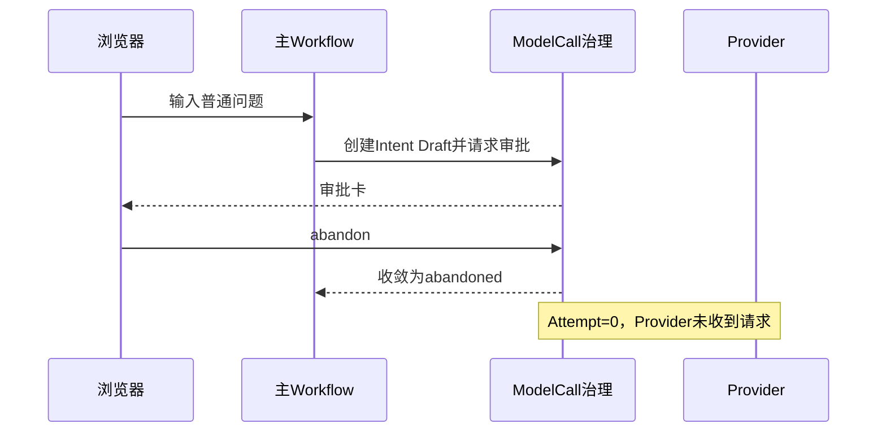

# SC08：放弃首次模型调用时零Provider发送

<!-- debug-scenario: id=SC08; status=current; oracle=exact -->

**归档日期**：2026-07-30  
**输入族**：任意会进入首次Intent模型审批的非确定性请求  
**自动证据**：`test_continuous_workflow_abandon_before_intent_dispatch_sends_nothing`、`test_abandon_creates_zero_provider_attempts_and_preserves_origin_prompt`

**教材成熟度**：L2；有当前Workflow 1.8.0真实abandoned Run，并由受控测试精确固定0 Attempt和0可见Message。

## 0. 本场景在公共主干哪里分叉

公共链到节点6创建首次可审核ModelCallDraft并暂停；用户选择abandon后，Chat把Product Run收敛为`abandoned`，
不会继续节点7–39。MAF提供等待/恢复事件，Chat决定放弃语义、撤回正常对话投影和保留审计事实。这里最关键的
不是某个函数“返回了”，而是同一Run下Attempt=0、Assistant Product Message=0且前端退出running。

## 1. 运行前预言机

| 项 | 预期 |
|---|---|
| 已有事实 | 接纳门曾保存User Message/Interaction/Run审计事实 |
| Workflow | 到`intent_agent`生成reviewable Draft并等待审批 |
| 用户动作 | 选择“放弃本次模型调用并返回输入框” |
| Provider | Attempt=0，dispatch/receive/decode均`skipped` |
| Product Run | `abandoned`，不生成假Assistant成功 |
| 可见历史 | 该输入从正常对话投影撤回，但审计/Trace仍能解释发生过什么 |
| 输入框 | 原Prompt恢复，可修改后创建新Run；不会Resume旧发送 |

## 2. 节点账

节点1–5经过；节点6进入Draft/审批等待。放弃后当前Workflow在此收敛，节点7–39均不应继续作为业务路径运行。
终态AG-UI事件仍要返回，使前端退出running状态；这不表示节点39提交过Assistant结果。

## 3. 数据结构

```text
Product Run: abandoned
ModelCallDraft revision: reviewable/abandoned（保留审计）
Approval/Decision: abandon
ModelCallAttempt rows: 0
Assistant Product Message: 0
Trace:
  approval.wait = abandoned
  provider.dispatch/receive/decode = skipped
  product.commit = skipped
  agui.terminal = completed
```

## 4. 为什么保留审计事实但隐藏消息

完全删除接纳记录会破坏“输入先于执行持久化”和事件对账；继续把撤回输入显示成普通历史又违背用户对“放弃”的
理解。当前区分权威审计事实与可见消息投影，自动标题若来自该消息也要回滚。

## 5. 亲手验证

1. 输入自己的普通问题。
2. 第一张模型审批卡直接放弃。
3. 确认输入回到编辑框，页面没有Assistant成功答复。
4. 用同一Product Run ID查Attempt数和Trace阶段。

```sql
SELECT status, failure_code FROM product_runs WHERE id='<Product Run ID>';
SELECT COUNT(*) FROM model_call_attempts WHERE run_id='<Product Run ID>';
SELECT role, status FROM product_messages WHERE run_id='<Product Run ID>';
```

不同迁移版本的消息可见性字段名以当前Schema为准；核心断言是Attempt=0、无可见Assistant成功。

## 6. 判定

- 通过：0发送、Run abandoned、输入可恢复、新提交创建新Run。
- 失败：放弃后仍产生HTTP Attempt；页面显示成功；再次发送复用旧Approval/Attempt。

## 7. 当前真实Run的对象账

| 对象 | 实际值 |
|---|---|
| Product Run | `a7262b15-0d0c-48bc-9e31-9e575d6f1fc6` |
| Product Session | `4aad10e4-6a5c-4430-8534-04508d7c9114` |
| Workflow | `continuous-collaboration 1.8.0` |
| 输入 | `用一句话解释什么是闭包` |
| 停止位置 | `intent_agent`首次ModelCall审批 |
| Product Run终态 | `abandoned` |
| ModelCallDraft | 1个，保留审计 |
| ModelCall Attempt | 0 |
| Trace最后sequence | 30 |
| 下游节点 | `intent_set_projection`到`result_finalization`均未进入业务路径 |



## 8. 断点导航与开发入口

| 断点 | 进入前事实 | 观察 | 下一跳 |
|---|---|---|---|
| `GovernedSemanticAgentExecutor`审批等待 | Draft已创建、Attempt=0 | approval id/revision | 用户动作 |
| `ModelCallDraft.abandon` | 当前审批仍pending | status、origin prompt | 不进入transport |
| `ProductSessionService.abandon_active_run` | 精确active run | Run状态、消息可见投影 | terminal AG-UI事件 |
| 前端审批动作 | 卡片可见 | abandon payload | 输入框恢复 |

源码：[`model_call_review.py`](../../../backend/app/model_call_review.py)、
[`product_sessions/service.py`](../../../backend/app/product_sessions/service.py)、
[`continuous_chat.py`](../../../backend/app/workflows/continuous_chat.py)。若改撤回UI，必须仍保留审计事实并验证自动标题、
Session列表、消息投影与Trace不会出现假成功。

## 掌握验收

1. 为什么`agui.terminal=completed`不等于Product Run succeeded？
2. 放弃与发送前取消有何相同和不同？
3. 为什么新输入必须创建新Run而不是继续旧Run？
