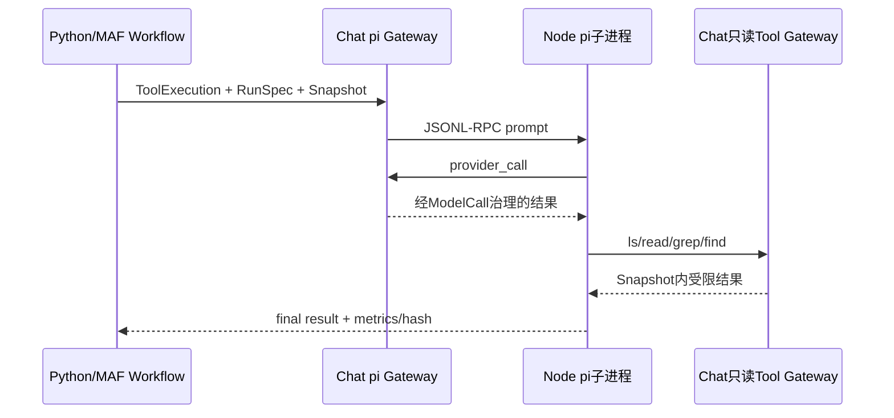

# SC09：受治理pi只读检查

<!-- debug-scenario: id=SC09; status=current; oracle=semantic -->

**归档日期**：2026-07-30  
**输入族**：需要实际查看已绑定Repository内容，但明确禁止修改  
**自动证据**：`backend/tests/test_continuous_pi_readonly.py::test_continuous_workflow_runs_pi_readonly_in_one_product_run`

**教材成熟度**：L2；有当前Workflow 1.8.0、真实pi子进程和真实只读Tool的同一Run证据，并有受控恢复合同。

## 0. 本场景在公共主干哪里分叉

共用理解、Plan和授权链到节点24，Chat只依据已批准RunSpec选择`pi_readonly`，再走节点30–31。此后跨到Node
pi子进程，所以Python Call Stack不会包含pi内部栈；用同一Product Run下的ToolExecution ID、pi Session ID和
JSONL-RPC request ID接回。pi负责Agent/Tool循环，MAF负责节点调度，Chat负责Provider/Tool Gateway、Snapshot
围栏、最小权限和结果提交。

## 1. 示例输入和前置状态

`请用工具实际读取README第一行并告诉我标题；只读，不要修改文件。`

前置：Project已绑定可用Repository Snapshot；pi Tool Profile可用；请求最终RunSpec声明`pi_readonly`。
没有Repository绑定时，正确反应应是说明缺前置或澄清，不能假装读过文件。

## 2. 运行前预言机

| 项 | 预期 |
|---|---|
| 路由 | `execution_route.kind=pi_readonly`，只依据已批准RunSpec |
| Product Run | pi不是子Product Run；同一Product Run下建立ToolExecution |
| pi | 新建本轮隔离`chat-*` pi Session，不加载旧Session上下文 |
| 模型 | pi每次Provider边界仍进入Chat ModelCallDraft/Approval/Attempt |
| Tool | 只允许RunSpec与Tool Profile交集中的`read/grep/find/ls` |
| 文件系统 | 0写入、0 Workspace edit Operation、Repository前后指纹一致 |
| 结果 | 必须引用实际Tool结果/Repository Snapshot；自然语言允许变化 |

## 3. 主Workflow节点账

| 节点 | 状态/数据 |
|---|---|
| 1–16 | 经过：Context绑定Repository、Intent/Plan/授权与场景路由 |
| 17–18 | 未走：不是目录查询或澄清 |
| 19–20 | 通常经过：Planner形成读取与验证步骤 |
| 21–24 | 经过：ExecutionDraft→Grant→RunSpec→`pi_readonly` |
| 25–29 | 未走：没有写Workspace和Completion Claim |
| 30 `pi_readonly_dispatch` | 经过：创建ToolExecution、启动pi JSONL-RPC、治理模型/只读Tool |
| 31 `pi_readonly_result_assembly` | 经过：校验终态、结果Hash、调用统计和Snapshot引用 |
| 32 | 未走：pi结果直接成为本轮响应候选，不再调用Response Agent |
| 33–39 | 经过：摘要、Result/Work/Memory决定、候选提交、终态 |

## 4. 跨进程数据链

```text
RunSpec(pi_readonly + repository fence + tool allowlist)
-> ToolExecution(product_run_id/run_attempt_id/runtime_job_id/step_input_id)
-> PiRuntimeManager.start
-> Node pi --mode rpc
-> prompt JSONL
-> pi Provider request -> Chat Provider Gateway -> ModelCall治理
-> pi Tool call -> Chat只读Tool Gateway -> 路径/Snapshot/权限重验
-> tool result JSONL -> pi final result
-> pi_readonly_result_assembly -> Product提交
```

在Chat侧断点看`tool_execution_id`、Snapshot ID、Tool name/安全相对path、状态和Hash；不要展开短期Gateway
凭据或完整Provider请求。

## 5. 为什么Chat不直接让pi使用内置Tool

pi内置Tool只知道文件操作，不拥有Chat的Project Scope、Repository Snapshot、RunSpec、Approval、Ledger和
产品完成语义。Chat-owned Gateway每次重验，代价是RPC往返与更多记录；收益是最小权限、可撤销、可对账，
并避免pi祖先规则/全局配置绕过受治理Context。

## 6. 亲手验证

推荐普通`Chat Full Stack`；要进入pi源码再用双窗口模式。关键断点：

```text
ExecutionRouteExecutor
PiReadonlyDispatchExecutor
PiRuntimeManager.start
PiExecution.accept_provider_call
ReadonlyToolService
PiReadonlyResultAssemblyExecutor
```

运行前后比较Repository HEAD/status指纹；在工作台确认ToolExecution、模型/Tool次数、Snapshot引用。

自动复验：

```bash
.venv/bin/python -m pytest -q \
  backend/tests/test_continuous_pi_readonly.py::test_continuous_workflow_runs_pi_readonly_in_one_product_run
```

## 7. 判定

- 通过：同一Product Run、受限Tool、真实读取证据、0文件写入、每次模型边界独立治理。
- 失败：pi继承全局Session/认证；允许RunSpec外Tool；只凭模型声称“已读取”；读取后改变仓库。

## 8. 当前真实Run的跨进程实值

2026-07-29当前版本运行不是Fake pi Fixture：

| 对象 | 实际值 |
|---|---|
| Product Run | `4818dd72-af27-45a1-88bc-c3ff6dff5c3b`，`succeeded` |
| 输入 | 实际读取Chat仓库`backend`目录，不允许按文档猜 |
| Workflow | `continuous-collaboration 1.8.0`，路由`pi_readonly` |
| ToolExecution | `1fc8a011-8ac0-4f02-8af9-9409516c9cbf` |
| mode/process | `readonly` / `finished` |
| Repository Snapshot | `8601c70a-d2e8-4f1b-a589-ed18ee010bdc` |
| pi内部 | 4次模型调用、3次内部Tool调用，耗时54806ms |
| 整个Product Run | 7个ModelCallDraft、173条Trace Event |
| Hash前缀 | input `f5459fe8ff92`、capability `fe804808c7f5`、result `b0249d15e47a` |

这些计数是observe级实测，不是下次运行必须相同的合同；固定不变量是同一Run、只读Profile、Snapshot绑定、
每次模型边界治理和0写操作。



## 9. 断点导航与安全修改

| 断点 | 进程 | 进入前 | 看什么 | 下一跳 |
|---|---|---|---|---|
| `ExecutionRouteExecutor` | Python Worker | RunSpec已批准 | 3路Case actual | pi readonly dispatch |
| `PiReadonlyDispatchExecutor` | Python Worker | ToolExecution将创建 | run/job/spec/snapshot id | PiRuntimeManager |
| `PiRuntimeManager.start` | Python | 安全会话已准备 | argv、RPC id；不看凭据 | Node pi |
| `PiExecution.accept_provider_call` | Python Gateway | pi请求模型 | call ordinal/capability | ModelCall审批 |
| `ReadonlyToolService` | Python Gateway | pi请求Tool | name/path/snapshot | 返回受限结果 |
| `PiReadonlyResultAssemblyExecutor` | Python Worker | pi终态 | result hash/counts | Summary |

源码：[`execution_dispatch/workflow.py`](../../../backend/app/execution_dispatch/workflow.py)、
[`pi_gateway.py`](../../../backend/app/pi_gateway.py)、[`readonly_tools/service.py`](../../../backend/app/readonly_tools/service.py)。
新增只读Tool时必须先定义路径规范化、结果上限、敏感文件拒绝、Snapshot新鲜度和Operation/Trace投影，不要只把名字
加进allowlist。

## 掌握验收

1. pi Session、ToolExecution、Product Run分别保存什么？
2. 为什么只读Tool也要绑定Snapshot？
3. pi内部模型调用为什么不能一次性放行整轮？
