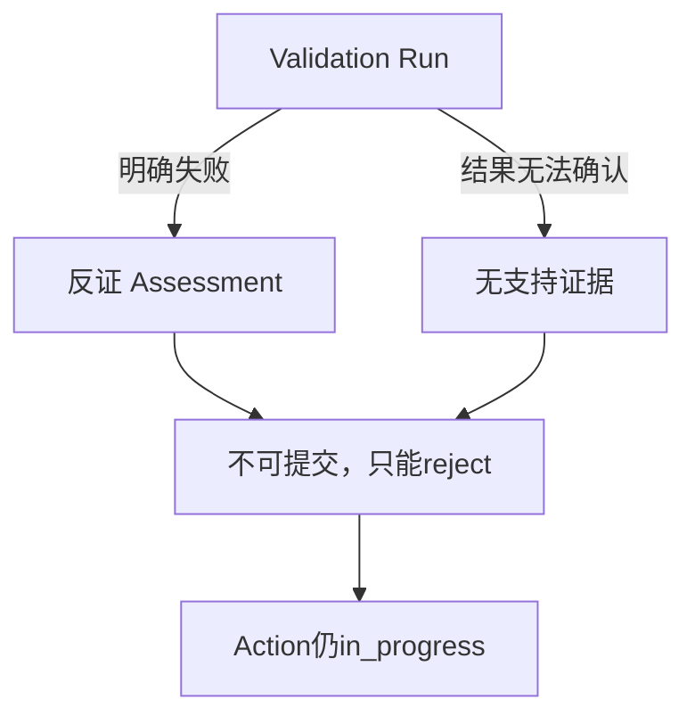

# SC11：Validation失败与结果未知

<!-- debug-scenario: id=SC11; status=current; oracle=exact -->

**归档日期**：2026-07-30  
**方式**：自动故障注入为主；不要为了制造“结果未知”对真实付费Provider或正式仓库做破坏实验  
**自动证据**：`test_failed_validation_only_allows_reject_and_never_completes`、`test_unknown_validation_outcome_produces_no_supports_or_completion`

**教材成熟度**：L1+；两个故障注入Fixture有精确Store断言，尚无安全的同版本人工故障Run。

## 0. 本场景在公共主干哪里分叉

共用编辑链可以走到节点28，真正分叉是Chat怎样解释Validation进程事实：明确非0是`failed`，已启动但无法可信
确认是`outcome_unknown`。MAF不会替产品推导Evidence语义；Chat必须让节点29的allowed actions、Assessment和
Result Commit随证据变化。调试时从ValidationRun ID追到Claim/Assessment，不要看到进程结束就猜“失败”。

## 1. 两个必须分开的失败族

| 场景 | 已知事实 | 正确反应 |
|---|---|---|
| `failed` | Validation进程明确返回非0/规则失败 | 产生`refutes` Assessment，只允许reject，不完成Action |
| `outcome_unknown` | 进程已启动但结果无法可信判定 | 不产生Observation/supports/Adoption，不自动重跑，不完成 |

`error`（外发前确定性错误）与`timeout/cancelled`也各有状态，不能全部折成“失败”。

## 2. 运行前预言机

失败分支：Claim可以存在；决策卡`allowed_actions=[reject]`；ResultCommit为rejected；Action仍in_progress；
Artifact rejected；0 Adoption。

结果未知分支：ValidationRun=`outcome_unknown`；0 validation_result Observation；0 supports；0 Adoption；
0 ResultCommit accepted；不允许自动重做可能已有副作用的验证。

## 3. 节点和数据

主Workflow仍可经过节点25–28建立Workspace、Artifact、Contract与Claim。差异发生在节点28的确定性验证结果和
节点29的允许动作：

```text
passed  -> supports -> committable=true  -> accept/reject
failed  -> refutes  -> committable=false -> reject only
unknown -> no proof -> committable=false -> 人工处置/失败关闭
```

节点29的用户reject可以让Product Run以“诚实报告未采纳结果”成功结束；这不表示Action完成。

## 4. 为什么结果未知不能当失败后重试

明确失败可以安全讨论修复；结果未知意味着进程可能已经产生外部效果或部分结果。盲目重试可能重复副作用。
当前保守保留未知状态并等待对账/人工处置，代价是不能自动收敛所有故障；收益是不制造双执行和假证据。

## 5. 验证

```bash
.venv/bin/python -m pytest -q \
  backend/tests/test_result_pipeline.py::test_failed_validation_only_allows_reject_and_never_completes \
  backend/tests/test_result_pipeline.py::test_unknown_validation_outcome_produces_no_supports_or_completion
```

重点SQL：

```sql
SELECT status, exit_code FROM validation_runs;
SELECT verdict FROM evidence_assessments;
SELECT COUNT(*) FROM claim_evidence_adoptions;
SELECT status FROM action_items WHERE id='<Action ID>';
```

## 6. 判定

- 通过：failed只可reject；unknown无支持证据；两者都不完成Action。
- 失败：把进程退出等同Work完成；unknown自动重试；为了让UI有内容伪造Observation。

## 7. 两个受控数据快照

| 观察 | 明确failed Fixture | outcome_unknown Fixture |
|---|---|---|
| Validation Run | `failed`，有确定非0/规则失败 | `outcome_unknown`，无法可信判定 |
| Assessment | 对要求`refutes/contradicts` | 不生成`supports` |
| Claim卡 | `committable=false`、只允许`reject` | `committable=false`，进入人工处置/失败关闭 |
| Evidence Adoption | 0 | 0 |
| Result Commit accepted | 0 | 0 |
| Action | 保持`in_progress` | 保持`in_progress` |



## 8. 断点导航与修改入口

| 断点 | 看什么 | 别误判 | 下一跳 |
|---|---|---|---|
| `ValidationProcessRunner` | 是否已dispatch、exit/timeout事实 | 进程结束不等于验证通过 | 归一化ValidationRun |
| `ResultPipelineCoordinator.prepare` | requirement→assessment映射 | unknown不能造Observation | Claim可提交性 |
| Result Claim Decision | allowed actions | Product Run成功不等Action完成 | reject/人工处置 |
| `ResultCommitCoordinator.commit` | 当前有效supports/adoptions | 不能凭Claim文本提交 | 无commit或rejected |

源码：[`evidence/validation_runtime.py`](../../../backend/app/evidence/validation_runtime.py)、
[`evidence/result_pipeline.py`](../../../backend/app/evidence/result_pipeline.py)、
[`evidence/result_commit.py`](../../../backend/app/evidence/result_commit.py)。新增Validation能力时要定义超时后是否可能已有
副作用、如何对账、哪些结果能重试；不能把所有异常统一映射failed。

## 掌握验收

1. `failed`与`outcome_unknown`为什么需要不同恢复语义？
2. Product Run succeeded时Action为何仍可in_progress？
3. 哪几张表必须在unknown场景保持0行？
