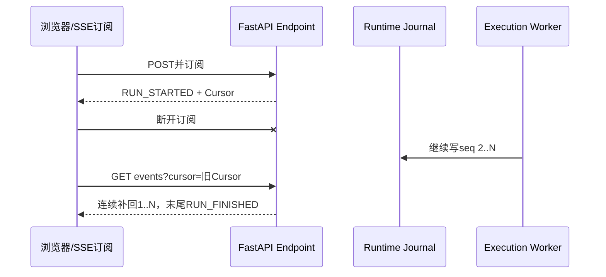

# SC12：断线后Worker继续与Cursor接回

<!-- debug-scenario: id=SC12; status=current; oracle=exact -->

**归档日期**：2026-07-30  
**目标**：在收到`RUN_STARTED`后关闭SSE订阅，证明这只断开浏览器，不取消Product Run  
**自动证据**：`backend/tests/test_runtime_execution.py::test_http_disconnect_does_not_cancel_worker_and_cursor_replays_rest`

**教材成熟度**：L1+；真实Runtime组件与临时数据库的断线合同已跑通，尚缺浏览器DevTools人工断网的同版本录像/Run样本。

## 0. 本场景在公共主干哪里分叉

它不改变39节点业务路径，而是把公共主干拆成两条并行生命周期：FastAPI的SSE订阅可以结束，Worker的
`_execute_claim`仍持有Runtime Job继续写Journal。Uvicorn/FastAPI只提供连接和流式响应；持久Job、Lease、
Sequence、签名Cursor和不隐式取消是Chat增加的保证。两段Call Stack靠Runtime Job ID与sequence接回。

## 1. 运行前预言机

1. HTTP响应头给出Runtime Job ID和签名Cursor。
2. 浏览器/客户端关闭SSE后，不新增cancel Control Command。
3. Execution Worker继续同一Runtime Job/Run Attempt。
4. Provider/Tool不会因重连自动创建第二个Attempt。
5. Job最终成功后，`GET /api/runtime/jobs/{jobId}/events?cursor=...`返回连续Sequence。
6. 回放最后一条是唯一terminal `RUN_FINISHED`；Product Message可从REST恢复。

## 2. 数据链

```text
AG-UI POST接纳
-> Runtime Job queued
-> Worker claim(lease_owner/epoch)
-> Runtime Event先写Journal
-> SSE订阅读取Event
-> 订阅断开
-> Worker继续追加Event
-> Product终态
-> Cursor Replay补齐缺口
```

`RuntimeJobRecord`拥有`last_event_sequence/earliest_retained_sequence/external_dispatch_state`；
`RuntimeEventRecord`按`runtime_job_id + sequence`唯一，且每Job只允许1条terminal事件。

## 3. 为什么执行不能依赖SSE连接

移动网络、刷新和浏览器后台都会断开连接。如果HTTP连接拥有执行生命周期，用户一切换页面就可能取消模型/Tool，
或重连造成重复执行。持久Job/Worker解耦增加Journal、Cursor和Reconciler复杂度，但建立活动Run恢复和多端投影基础。

## 4. 亲手验证

1. 在浏览器发起一条会运行数秒的请求。
2. 记录Product Run/Runtime Job/当前Cursor。
3. 在`RUN_STARTED`后切断网络或关闭页面，不点“停止”。
4. 等待后端Job终态，再恢复网络/重开Session。
5. 核对同一Job、Sequence连续、Attempt没有增加。

断点：`durable_agent_endpoint`的SSE生成器、`ExecutionWorker._execute_claim`、
`RuntimeExecutionService.append_event`、前端`use-runtime-reconnect.reconnect`。

自动复验：

```bash
.venv/bin/python -m pytest -q \
  backend/tests/test_runtime_execution.py::test_http_disconnect_does_not_cancel_worker_and_cursor_replays_rest
```

## 5. 判定

- 通过：断线后同一Job完成，Cursor补齐1..N且唯一terminal，0隐式取消。
- 失败：断线即cancel；重连创建新Run/Attempt；事件缺口被前端静默忽略。

## 6. 受控实验的具体时序

测试不是只调用一个纯函数：它用真实FastAPI流式响应、RuntimeExecutionService、ExecutionWorker和临时SQLite。

| 时点 | 实际断言 |
|---|---|
| 第一次订阅 | 收到首个SSE事件`RUN_STARTED`，响应头取得Job ID与initial Cursor |
| 主动离开响应上下文 | 只关闭subscriber；没有cancel命令 |
| 后台轮询 | 同一个Job最终`status=succeeded` |
| Cursor Replay | 返回sequence精确等于`1..last_event_sequence` |
| 最后一条 | `event_type=RUN_FINISHED`且`is_terminal=true` |
| 产品恢复 | REST消息最后一条role为`assistant` |



## 7. 双调用栈断点导航

| 栈 | 断点 | 看什么 | 下一跳 |
|---|---|---|---|
| HTTP订阅栈 | `add_durable_agui_endpoint`内SSE生成器 | client disconnect、job id/cursor | 生成器结束 |
| Worker栈 | `ExecutionWorker._execute_claim` | lease owner/epoch、same job id | Runner继续 |
| Journal栈 | `RuntimeExecutionService.append_event` | expected sequence/terminal | DB commit |
| 浏览器栈 | `useRuntimeReconnect` | last cursor、online、backoff | Replay API |
| 前端重放 | `replayRuntimeEvents` | gap/conflict检查 | React消息投影 |

源码：[`runtime_execution/endpoint.py`](../../../backend/app/runtime_execution/endpoint.py)、
[`runtime_execution/worker.py`](../../../backend/app/runtime_execution/worker.py)、
[`runtime_execution/service.py`](../../../backend/app/runtime_execution/service.py)、
[`runtime-event-replay.ts`](../../../frontend/src/runtime-event-replay.ts)。修改保留策略时必须同时定义最早可用sequence、
Cursor过期错误和REST全量恢复，不能让前端静默跳过缺口。

## 掌握验收

1. Product Run、Runtime Job和SSE订阅哪个拥有执行生命周期？
2. Cursor为什么要签名并带Sequence？
3. 410/Cursor过期时前端应该怎样降级？
