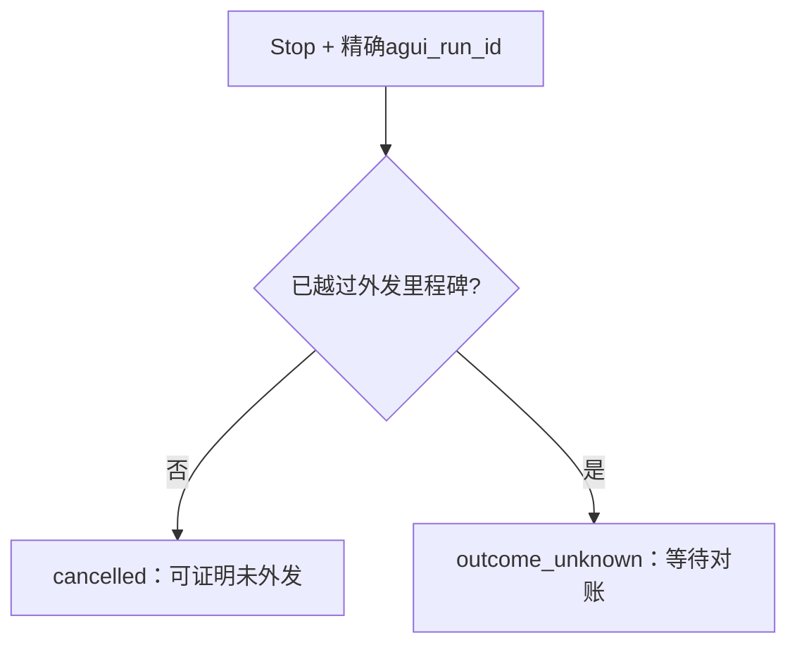

# SC13：取消在外发前后收敛成不同终态

<!-- debug-scenario: id=SC13; status=current; oracle=exact -->

**归档日期**：2026-07-30  
**目标**：证明“停止”绑定精确AG-UI runId，且外发前/后不能使用同一取消语义  
**自动证据**：`backend/tests/test_product_sessions.py::test_cancel_is_exactly_bound_and_distinguishes_before_and_after_dispatch`

**教材成熟度**：L1+；Product Store状态机有精确受控数据，尚缺真实Provider外发后人工取消的安全Run。

## 0. 本场景在公共主干哪里分叉

停止按钮走产品控制链，不是随便取消当前HTTP请求：前端带精确AG-UI runId，Chat映射到Product Run并读取
Provider/Tool是否已外发，再写`cancelled`或`outcome_unknown`及Runtime Control Command。AG-UI提供运行关联，
但外发前后两种终态、幂等绑定和对账规则是Chat定义。调试时必须同时看控制请求栈和Worker栈。

## 1. 两个场景预言机

| 时点 | Product Run终态 | failure_code | 为什么 |
|---|---|---|---|
| Provider/Tool外发前 | `cancelled` | `user_cancelled_before_dispatch` | 已知没有外部结果 |
| 已外发后 | `outcome_unknown` | `user_cancelled_after_dispatch` | 无法证明外部请求没有完成 |

旧AG-UI runId再次发取消，只能幂等读取旧终态，绝不能取消同Session里的新Run。

## 2. 数据与步骤

```text
前端Stop(agui_run_id)
-> ProductSessionService.cancel_protocol_run
-> 校验protocol mapping属于哪个Product Run
-> 读取当前dispatch/attempt状态
-> cancelled 或 outcome_unknown
-> Runtime Control Command/terminal投影
-> 清除session.active_run_id
```

外发后即使Provider稍后返回，也不能未经对账自动补成Assistant成功；用户看到“结果未知”，可选择人工处理或新Run。

## 3. 为什么不能统一叫cancelled

统一`cancelled`会暗示“动作一定没发生”。对于已发送Provider/Tool，这个结论没有证据，后续Retry可能产生重复费用或
副作用。保守的`outcome_unknown`降低自动化程度，但保住事实诚实性。

## 4. 亲手验证

1. 第一轮停在模型审批卡，点停止：预期cancelled、Attempt=0。
2. 第二轮批准发送后立刻停止：预期outcome_unknown、最多1个Attempt、不自动重试。
3. 用第一轮旧runId再请求取消：第二轮必须仍保持自己的状态。

```sql
SELECT initial_agui_run_id, status, failure_code FROM product_runs WHERE session_id='<Session ID>';
SELECT product_run_id, status FROM run_attempts WHERE product_run_id IN (...);
```

自动复验：

```bash
.venv/bin/python -m pytest -q \
  backend/tests/test_product_sessions.py::test_cancel_is_exactly_bound_and_distinguishes_before_and_after_dispatch
```

## 5. 判定

- 通过：前=cancelled，后=outcome_unknown，旧ID不误伤新Run，0自动重试。
- 失败：都显示成功取消；未知结果被丢弃；旧runId取消当前Run。

## 6. 受控Fixture的两条Run

| 项 | Run 1 | Run 2 |
|---|---|---|
| AG-UI runId | `cancel-before-dispatch` | `cancel-after-dispatch` |
| 输入 | `发送前取消` | `发送后取消` |
| 取消前状态 | `waiting_approval` | `running` |
| 终态 | `cancelled` | `outcome_unknown` |
| failure code | `user_cancelled_before_dispatch` | `user_cancelled_after_dispatch` |
| Attempt状态 | `cancelled` | `outcome_unknown` |

测试还用旧`cancel-before-dispatch`再次取消：返回旧Run的cancelled结果，活动Run 2保持不变；Run 2重复取消仍幂等返回
outcome_unknown。



## 7. 双栈断点与修改入口

| 断点 | 栈 | 观察 | 下一跳 |
|---|---|---|---|
| 前端Stop handler | 浏览器 | 精确run id，不是selected session猜测 | Cancel API |
| `ProductSessionService.cancel_protocol_run` | API | protocol mapping、active run | 读取dispatch里程碑 |
| Runtime Control Command创建 | API/Store | target job/run、idempotency | Worker观察控制 |
| Provider/Tool派发记录 | Worker | external dispatch state | cancelled或unknown |
| Reconciler | 后台 | 晚到结果/外部状态 | 人工或确定性收敛 |

源码：[`product_sessions/service.py`](../../../backend/app/product_sessions/service.py)、
[`runtime_execution/service.py`](../../../backend/app/runtime_execution/service.py)、
[`runtime_execution/worker.py`](../../../backend/app/runtime_execution/worker.py)。要加“强制停止子进程”时，也不能改变已经
外发请求的事实语义；杀进程不等于外部动作没发生。

## 掌握验收

1. “用户点了停止”为什么不足以证明外部动作没完成？
2. Cancel、Abandon、Retry分别作用于什么对象？
3. 何时可以安全发起新Run，何时还需要对账？
