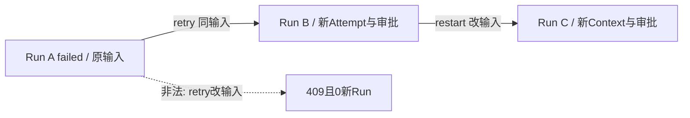

# SC14：Retry与Restart血缘

<!-- debug-scenario: id=SC14; status=current; oracle=exact -->

**归档日期**：2026-07-30  
**目标**：明确失败后“原样重试”和“修改后重新开始”是两个命令，都创建新Product Run  
**自动证据**：`test_failed_run_retry_and_edited_restart_keep_explicit_lineage`、`test_retry_rejects_modified_prompt_without_creating_run`

**教材成熟度**：L1+；受控Product Store链有逐Run实值，尚无同版本前端手工Retry/Restart完整Run样本。

## 0. 本场景在公共主干哪里分叉

分叉从`App.submit`附加`forwardedProps.control`开始；`prepare_agui_run`验证来源Run和输入后创建**新Product Run**，
并写`retry_of_run_id/retry_mode`。这不是MAF Checkpoint Resume，也不复用旧Attempt。AG-UI只运输控制字段，
Retry/Restart合同、祖先输入去重和重新授权由Chat负责；调试时至少并排记录旧Run、新Run、输入Hash和Attempt。

## 1. 运行前预言机

| 动作 | 输入约束 | 新Run字段 | 旧Run |
|---|---|---|---|
| Retry | Prompt必须与来源Run一致 | `retry_of_run_id=<source>`、`retry_mode=retry` | 不改写 |
| Restart | Prompt允许修改 | `retry_of_run_id=<source>`、`retry_mode=restart` | 不改写 |

两者都重新进入Context新鲜度、ExecutionDraft/Approval和Provider治理；都不是Workflow Checkpoint Resume。

## 2. 数据链

```text
Run A failed
-> Retry -> Run B(retry_of=A, input same)
-> Run B failed
-> Restart edited -> Run C(retry_of=B, input changed)
```

Provider上下文会排除重试祖先输入链的重复副本，避免模型看到同一Prompt多次；Product历史仍保留失败输入作为证据。

## 3. 为什么不复用旧Run/Attempt

改写旧终态会破坏计费、错误、Trace和用户决策证据；把修改后的输入叫Retry又会伪造“同一请求”。新Run血缘增加
记录数量，但能精确回答每次尝试使用什么输入、为何重来、是否重新授权。

## 4. 亲手验证

1. 选择一个明确失败且允许重做的Run。
2. 原样Retry，确认新Run和新审批。
3. 再修改Prompt；若仍选择Retry，服务端应拒绝且不创建Run。
4. 改用Restart，确认新Run绑定修改后的输入。

```sql
SELECT r.id, substr(m.content_hash,1,12) AS input_hash12,
       r.status, r.retry_of_run_id, r.retry_mode
FROM product_runs r
JOIN product_messages m ON m.id=r.current_user_message_id
WHERE r.session_id='<Session ID>' ORDER BY r.started_at;
```

自动复验：

```bash
.venv/bin/python -m pytest -q \
  backend/tests/test_product_sessions.py::test_failed_run_retry_and_edited_restart_keep_explicit_lineage \
  backend/tests/test_product_sessions.py::test_retry_rejects_modified_prompt_without_creating_run
```

## 5. 判定

- 通过：旧Run不变、新Run有血缘、Retry拒绝改Prompt、Restart重新审批。
- 失败：复用旧Attempt；修改输入仍标Retry；把Restart称为Checkpoint Resume。

## 6. 受控Fixture的3条Run

```json
[
  {"run": "A", "input": "请重新执行", "status": "failed", "retry_of": null},
  {"run": "B", "input": "请重新执行", "status": "failed", "retry_of": "A", "retry_mode": "retry", "attempt_numbers": [1]},
  {"run": "C", "input": "修改后重新执行", "retry_of": "B", "retry_mode": "restart"}
]
```

另一个Fixture以`原始输入`创建来源Run，再用`被修改的输入`声明retry。服务抛`ProductSessionConflict`，错误明确提示
使用restart；最终仍只有1条Run和1条Message，证明失败请求没有留下半写事实。



## 7. 断点导航与安全修改

| 断点 | 看什么 | 正常下一跳 |
|---|---|---|
| 前端`App.submit`控制分支 | kind/sourceRunId/current prompt | AG-UI forwardedProps |
| `ProductSessionService.prepare_agui_run` | 来源Run、input hash、active run | 新Interaction/Run |
| Retry输入校验 | 新旧Prompt是否完全相同 | retry或conflict |
| Message历史过滤 | ancestor run ids | 只把当前输入送入请求 |
| Run创建事务 | retry_of/mode/request hash | 新Run Attempt 1 |

源码：[`App.tsx`](../../../frontend/src/App.tsx)、
[`product_sessions/service.py`](../../../backend/app/product_sessions/service.py)。若未来实现“同Run内Attempt重试”，必须另写
安全条件和外发幂等合同，不能把它悄悄复用到本场景的Product Run Retry。

## 掌握验收

1. Retry与Run Attempt重试是同一对象吗？
2. 为什么Provider历史要排除重试祖先输入，而Product历史不能删除它？
3. 哪个动作才会从MAF Checkpoint安全点继续？
