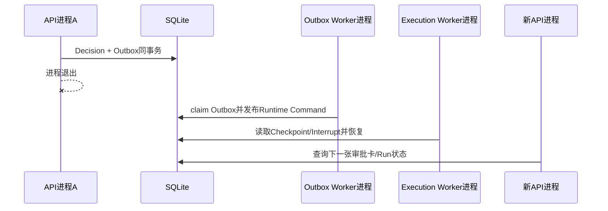

# SC15：HITL决定跨API和Worker进程恢复

<!-- debug-scenario: id=SC15; status=current; oracle=exact -->

**归档日期**：2026-07-30  
**方式**：自动多进程测试为主  
**自动证据**：`test_continuous_workflow_restores_each_hitl_checkpoint_in_a_new_process`、`test_outbox_worker_resumes_recorded_decision_after_api_process_restart`

**教材成熟度**：L1+；真实SQLite、4个独立App实例和独立Worker进程的受控证据完整，尚非真实Provider人工长时间恢复Run。

## 0. 本场景在公共主干哪里分叉

MAF Executor发出HITL请求后，调用栈可以随进程退出而消失；Chat把Decision Request、Interrupt Link、Checkpoint
引用和Governance Outbox持久化，再由Outbox Worker与Execution Worker接力恢复。MAF提供Checkpoint和请求恢复
机制，Chat负责同事务Decision/Outbox、Lease、图签名校验和一次性Grant。这里必须用ID/Store/Trace调试，不能
期待一个VS Code Call Stack跨越3个进程。

## 1. 当前保证边界

只对`continuous-collaboration v1.8.0`已建立合同的审批安全点成立。它不自动保证活动pi进程、任意Tool副作用、
嵌套Workflow或所有MAF Workflow跨进程恢复。

## 2. 运行前预言机

1. 暂停时Product Run/Attempt、Decision Request、Interrupt Link和MAF Checkpoint均持久化。
2. 用户Decision与Governance Outbox同事务提交。
3. API进程退出后，独立Outbox Worker竞争领取并写Runtime Control Command。
4. 新Worker从同版本Workflow Definition/图签名/Checkpoint恢复，不重跑已完成前置Executor。
5. 已批准Provider请求不重复发送；一次性Grant不重复消费。
6. Checkpoint损坏或Workflow版本/图签名不匹配时失败关闭。

## 3. 对象链

```text
Human Decision Request
-> Decision Record + Governance Outbox（同事务）
-> Outbox Worker lease/claim
-> Runtime Control Command(checkpoint_id)
-> Execution Worker
-> Product Run/Attempt + Interrupt Link校验
-> MAF Checkpoint restore
-> 下一个安全节点
```

Checkpoint只拥有MAF运行恢复点；Product Run、Approval和权限事实仍在Product Store。

## 4. 为什么要Outbox而不是API直接Resume

若API事务提交Decision后立刻调用Runtime，进程可能在两者之间崩溃，留下“用户已批准但执行没继续”；反过来先调用
Runtime再提交Decision会越过持久授权。Outbox把本地事实与待执行意图原子提交，Worker可幂等重投。代价是异步延迟、
lease、退避和死信管理。

## 5. 自动验证

```bash
.venv/bin/python -m pytest -q \
  backend/tests/test_continuous_chat.py::test_continuous_workflow_restores_each_hitl_checkpoint_in_a_new_process \
  backend/tests/test_continuous_chat.py::test_outbox_worker_resumes_recorded_decision_after_api_process_restart
```

观察不同PID、Checkpoint ID、恢复后下一个节点、Provider Attempt数量和Outbox终态。故障扩展：

```bash
.venv/bin/python -m pytest -q \
  backend/tests/test_continuous_chat.py::test_checkpoint_corruption_fails_closed_without_provider_replay
```

## 6. 判定

- 通过：新进程恢复、前置节点不重跑、Provider不重复、坏Checkpoint失败关闭。
- 失败：用Product Trace冒充Checkpoint；Decision已提交却没有可重投Outbox；图版本变化仍强行恢复。

## 7. 受控多进程实验的具体值

第一条测试用同一个SQLite文件和同一个Product Session，依次创建4个全新的FastAPI App实例：

| App实例 | 恢复位置 | 本实例只发送 |
|---:|---|---|
| 1 | 首次进入Intent审批 | 0 Provider请求 |
| 2 | 批准Intent后 | 1次Intent请求；得到Response审批 |
| 3 | 批准Response后 | 1次Response请求；得到Summary审批 |
| 4 | 批准Summary后 | 1次Summary请求；Product Run succeeded |

最终同一Run的`maf_workflow_checkpoints >= 3`，`runtime_interrupt_links(status=resumed) = 3`，Assistant Message只有最终
幂等解释。坏Checkpoint Fixture把`graph_signature_hash`改为64个0，恢复结果是`RUN_ERROR`、Provider发送0、Run
`interrupted`、Interrupt=`recovery_required`、Checkpoint=`incompatible`。

Outbox测试进一步分开API记录Decision、Outbox Worker和Execution Worker；恢复后首条Outbox为`published`，旧Interrupt
为`resumed`，下一审批Interrupt为`pending`。



## 8. 三段调用栈导航

| 进程 | 断点 | 关联ID | 下一跳 |
|---|---|---|---|
| API | `ExecutionGovernanceService.resolve_human_request` | request/decision id | Decision＋Outbox commit |
| Outbox Worker | `GovernanceOutboxWorker` claim/dispatch | outbox/aggregate id | Runtime Control Command |
| Execution Worker | `RuntimeResumeOutboxHandler`/Worker claim | job/checkpoint/interrupt id | MAF restore |
| MAF Storage Adapter | `ProductWorkflowCheckpointStorage` | workflow version/graph hash | 下一个安全节点或fail closed |

源码：[`governance/outbox.py`](../../../backend/app/governance/outbox.py)、
[`workflows/resume_worker.py`](../../../backend/app/workflows/resume_worker.py)、
[`workflows/checkpoints.py`](../../../backend/app/workflows/checkpoints.py)、
[`runtime_execution/worker.py`](../../../backend/app/runtime_execution/worker.py)。新增可恢复Decision Point时，必须验证其Subject
可重建、Grant可一次性消费、前置节点幂等和图版本兼容；“能序列化对象”还不等于安全恢复。

## 掌握验收

1. Product Run、Interrupt Link、Outbox、Runtime Command、MAF Checkpoint各拥有什么事实？
2. 为什么Trace能复盘但不能恢复执行？
3. 活动pi进程为何不在本场景保证内？
