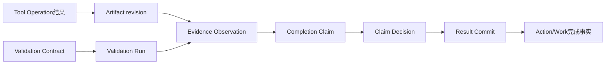

# Artifact、Evidence、Validation、Claim与Result Commit怎样证明完成

**归档日期**：2026-07-30  
**分类**：运行执行与证据  
**关联源码**：`backend/app/evidence/models.py`、`backend/app/evidence/service.py`、`backend/app/evidence/result_pipeline.py`、`backend/app/evidence/result_commit.py`、`backend/app/evidence/validation_runtime.py`

## 问题

工具返回“成功”、模型说“已经完成”、文件确实存在，这3件事哪一个能让Action变成completed？Artifact、Evidence、
Validation、Completion Claim、Provenance与Result Commit为什么需要独立？

## 1. 一个具体场景

在隔离Workspace创建`hello.txt`，要求内容逐字等于`hello chat`。执行进程退出码为0只是一个Observation；系统还要
按Validation Contract检查文件内容，形成Evidence Assessment，用户/策略接受Completion Claim后，Result Commit
才原子更新Action：



## 2. 要解决的问题

退出码0可能只是命令启动成功；文件存在不代表内容正确；模型自然语言不能证明文件系统事实。若任一信号直接更新
Work，就会产生假完成。证据链必须表达“观察了什么、验证了哪个要求、来源是否仍有效、谁接受了结论”。

## 3. 一句人话定义

- **Artifact revision**：交付物某一不可变版本及其Blob引用；不是聊天附件列表。
- **Evidence Observation**：对外部/运行事实的一次可定位观察；不是结论。
- **Validation Contract/Run**：验证要求与一次实际验证执行；不是Plan里的模糊“测试一下”。
- **Completion Claim**：候选完成声明；不是完成事实。
- **Evidence Assessment**：证据对某项要求支持、反对或未知的评估。
- **Provenance Edge**：对象来源关系；不是把全部内容复制一份。
- **Result Commit**：通过门后一次性提交产品结果的事务；不是最后一条Assistant Message。

## 4. 一个具体对象样本

```json
{
  "requirement": {"key": "hello-content", "predicate": "file equals 'hello chat'"},
  "artifact_revision": {"logical_path": "hello.txt", "content_sha256": "..."},
  "validation_run": {"status": "succeeded", "observed_value": "redacted/hash"},
  "assessment": {"requirement_key": "hello-content", "disposition": "supports"},
  "claim": {"status": "accepted", "claimed_outcome": "exact edit completed"},
  "result_commit": {"status": "committed", "action_transition": "pending→completed"}
}
```

测试失败时`disposition=contradicts`；验证结果拿不到时为`unknown`，两者都不能伪造supports。

## 5. 生命周期

| 对象 | 创建/存储 | 可变方式 | 消费/结束 |
|---|---|---|---|
| Artifact/Revision | Artifact Coordinator＋Store | 新revision，不覆盖Blob | UI、Evidence |
| Observation | 执行/验证适配器 | 不可变 | Assessment |
| Validation Contract | Planner/用户批准 | 版本化 | Validation Runner |
| Validation Run | Validation Runtime | 状态机 | Evidence Assessment |
| Completion Claim | Result Pipeline | 接受/拒绝/待定 | Result Commit门 |
| Provenance Edge | Evidence Repository | 追加/失效标记 | 追溯与新鲜度 |
| Result Commit | Coordinator | 幂等单次提交 | Work/Action/Message更新 |

Artifact Blob可以在物理Store，元数据与来源关系仍在Product DB；二者失败时需要对账，不得假装原子文件系统事务。

## 6. 为什么这样设计

替代方案是`if process.returncode == 0: action.status='completed'`。它无法证明内容、来源或验证范围。当前多对象设计
让失败、反证和未知有不同语义，并能在来源失效后撤销支持关系；代价是需要Validation和对账流程，但这是产品
“不产生假成功”的核心成本。

## 7. 代码链

| 顺序 | 源码符号 | 输入 | 输出/门 |
|---:|---|---|---|
| 1 | `ArtifactCoordinator` | Workspace产物/Blob | Artifact revision |
| 2 | `ValidationContractPlanner` | ExecutionDraft验证要求 | 可运行Contract |
| 3 | `ValidationProcessRunner` | Contract＋隔离路径 | Validation Run/Observation |
| 4 | [`ResultPipelineCoordinator`](../../backend/app/evidence/result_pipeline.py) | Operation/Artifact/Validation | Claim、Assessment、Decision请求 |
| 5 | [`EvidenceRepository`](../../backend/app/evidence/service.py) | 证据命令 | Evidence/Provenance权威行 |
| 6 | [`ResultCommitCoordinator`](../../backend/app/evidence/result_commit.py) | 已绑定有效Decision | 原子产品提交 |
| 7 | `result_claim_prepare/decision` | MAF节点 | 把治理接入主Workflow |

## 8. 亲手验证

```bash
.venv/bin/python -m pytest -q \
  backend/tests/test_result_pipeline.py::test_result_commit_gate_completes_action_after_accepted_validation \
  backend/tests/test_result_pipeline.py::test_failed_validation_only_allows_reject_and_never_completes \
  backend/tests/test_result_pipeline.py::test_unknown_validation_outcome_produces_no_supports_or_completion
```

在ResultPipeline和ResultCommit事务入口断下，观察同一`completion_claim_id`的requirements、assessments和Decision。
分别运行通过、失败、未知3个Fixture，确认只有第一种产生Result Commit与Action completed。查询时输出状态、Hash、ID，
不要打印私密Artifact正文。

## 9. 掌握验收

1. Tool返回成功为什么不等于Action完成？
2. Observation与Assessment的区别是什么？
3. Validation失败和结果未知为何都不能supports，但语义又不同？
4. Provenance来源失效后，应影响哪些下游结论？
5. Result Commit为什么必须拥有自己的事务门和幂等键？

## 关键文件

| 文件 | 职责 |
|---|---|
| `backend/app/evidence/models.py` | Artifact、Evidence、Claim、Validation、Provenance、Commit模型 |
| `backend/app/evidence/result_pipeline.py` | 从运行结果协调到Claim/Decision |
| `backend/app/evidence/result_commit.py` | 唯一完成提交门 |
| `backend/app/evidence/service.py` | Evidence Repository与不变量 |
| `backend/app/evidence/validation_runtime.py` | 验证进程适配与结果归一化 |

## 补充记录

- 2026-07-30：补齐M17/M18的证据、来源与完成提交专题。

