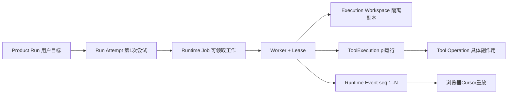

# Run、Worker、Cursor、Tool与Workspace怎样恢复

**归档日期**：2026-07-30  
**分类**：运行执行与证据  
**关联源码**：`backend/app/runtime_execution/`、`backend/app/execution_dispatch/`、`backend/app/execution_workspaces/`、`backend/app/tool_execution/`、`backend/app/readonly_tools/`

## 问题

用户点发送后关闭浏览器，后端为什么还能继续？Product Run、Run Attempt、Runtime Job、Worker Lease、Cursor、
ToolExecution、Tool Operation和Execution Workspace怎样串起来，又为什么不能合成一个“任务状态”？

## 1. 一个具体场景

用户批准“在隔离Workspace创建hello.txt”。浏览器SSE断开，但Worker继续；重连后从Cursor 81接收82开始的事件，
最终只在验证通过后提交结果。



## 2. 要解决的问题

HTTP连接可能几秒就断，执行却持续几分钟。若连接、执行和产品结果共用一个状态，断线会误取消；Worker崩溃会
不知道能否重试；Tool可能已产生副作用却被标成failed。不同对象分别回答用户目标、尝试、调度、进程所有权、
外部副作用和事件恢复。

## 3. 一句人话定义

- **Product Run**：用户一次目标处理的产品记录；不是OS进程。
- **Run Attempt**：该Run的一次运行尝试；Retry会产生新Run或新尝试，必须看当前合同。
- **Runtime Job**：Worker可领取的持久工作项；不是Product Work Item。
- **Worker Lease**：Worker在有限时间内拥有Job的租约；不是永久锁。
- **Cursor**：客户端已确认的Runtime Event序号；不是数据库行号。
- **ToolExecution**：一次受治理pi/工具执行容器；不是单个Tool Call。
- **Tool Operation**：具体读写/命令副作用及其Attempt/对账；不是MAF节点。
- **Execution Workspace**：写操作的隔离副本；不是正式Repository。

## 4. 一个具体对象样本

```json
{
  "product_run": {"id": "run-A", "status": "running"},
  "attempt": {"attempt_number": 1, "runtime_kind": "continuous-collaboration"},
  "job": {"status": "leased", "external_dispatch_state": "not_dispatched"},
  "worker": {"worker_id": "worker-1", "lease_epoch": 3},
  "workspace": {"status": "prepared", "base_snapshot_semantic_hash": "..."},
  "tool_execution": {"mode": "workspace", "status": "running"},
  "operation": {"kind": "exact_edit", "status": "succeeded"},
  "event": {"sequence": 82, "type": "workflow.node"},
  "client_cursor_before_reconnect": 81
}
```

## 5. 生命周期

| 对象 | 创建/所有者 | 状态重点 | 结束/恢复 |
|---|---|---|---|
| Product Run | Product Session Service | 用户可见终态 | retry/restart显式血缘 |
| Run Attempt | 运行协调 | 一次尝试 | 成功/失败/未知 |
| Runtime Job | RuntimeExecutionService | queued/leased/terminal | Lease接管或人工恢复 |
| Worker | ExecutionWorker | heartbeat/lease | 进程退出可换Worker |
| Runtime Event | Runtime服务 | 单调sequence | Cursor重放 |
| Workspace | WorkspaceService | prepared/changed/closed | 提交/废弃/对账 |
| Tool Operation | ToolOperationService | dispatch里程碑 | succeeded/failed/outcome_unknown |

浏览器不拥有Job；Worker不拥有Product完成事实；Tool成功也不能直接把Action标成completed。

## 6. 为什么这样设计

替代方案是一个后台协程直接把SSE写给浏览器。它简单，但API进程重启、浏览器断线或多实例接管时无法恢复。
持久Job＋Lease＋事件日志增加数据库写入，却将网络连接与执行解耦。Tool Operation再单独记外发里程碑，是因为
“没收到响应”不等于“外部没有执行”。

## 7. 代码链

| 顺序 | 源码符号 | 输入 | 输出/下一跳 |
|---:|---|---|---|
| 1 | `add_durable_agui_endpoint`（[`endpoint.py`](../../backend/app/runtime_execution/endpoint.py)） | AG-UI请求 | Product Run＋Runtime Job＋SSE |
| 2 | `RuntimeExecutionService.enqueue/claim`（[`service.py`](../../backend/app/runtime_execution/service.py)） | Run/attempt | Job、Lease、Event |
| 3 | `ExecutionWorker.run_once`（[`worker.py`](../../backend/app/runtime_execution/worker.py)） | Claimed Job | 调用注册Runtime Runner |
| 4 | `ExecutionRouteExecutor` | 已批准RunSpec | answer/pi_readonly/pi_workspace |
| 5 | `ExecutionWorkspaceService` | Repository fence | 隔离Workspace |
| 6 | `PiReadonlyDispatchExecutor`/`PiWorkspaceDispatchExecutor` | ToolExecution合同 | pi JSONL-RPC |
| 7 | `ReadonlyToolService`/`ToolOperationService` | 每次Tool请求 | 权限重验、Operation账本 |
| 8 | `runtime-event-replay.ts` | `after_sequence`事件 | 浏览器投影接回 |

## 8. 亲手验证

先跑无需真实Provider的断线合同：

```bash
.venv/bin/python -m pytest -q \
  backend/tests/test_runtime_execution.py::test_http_disconnect_does_not_cancel_worker_and_cursor_replays_rest \
  backend/tests/test_product_sessions.py::test_cancel_is_exactly_bound_and_distinguishes_before_and_after_dispatch
```

断点放在Endpoint enqueue、Worker claim、Runner调用和Runtime Event append。记录同一`run_id/job_id/worker_id`，
模拟客户端停止读取后确认Job没有因HTTP断开被取消。重连时故意使用过旧/越界Cursor，应得到明确gap/conflict，
不能静默漏事件。执行SC10时再观察Workspace与Operation，严禁在正式仓库制造实验写入。

## 9. 掌握验收

1. Product Run、Run Attempt和Runtime Job分别回答什么？
2. 浏览器断线为什么不取消Worker？用户显式取消又如何传递？
3. Lease过期且已外发时为何可能是`outcome_unknown`？
4. ToolExecution与Tool Operation为何不能合并？
5. Workspace成功修改后为什么还不能直接写回正式Repository或完成Action？

## 关键文件

| 文件 | 职责 |
|---|---|
| `backend/app/runtime_execution/models.py` | Job、Event、Control Command、Worker |
| `backend/app/runtime_execution/service.py` | 队列、Lease、Cursor和恢复状态机 |
| `backend/app/runtime_execution/worker.py` | 领取并运行持久Job |
| `backend/app/execution_workspaces/service.py` | 隔离Workspace生命周期 |
| `backend/app/tool_execution/service.py` | Tool副作用、Attempt与对账 |

## 补充记录

- 2026-07-30：补齐M13/M14/M16通用运行与恢复专题；pi进程细节见执行层目录。

